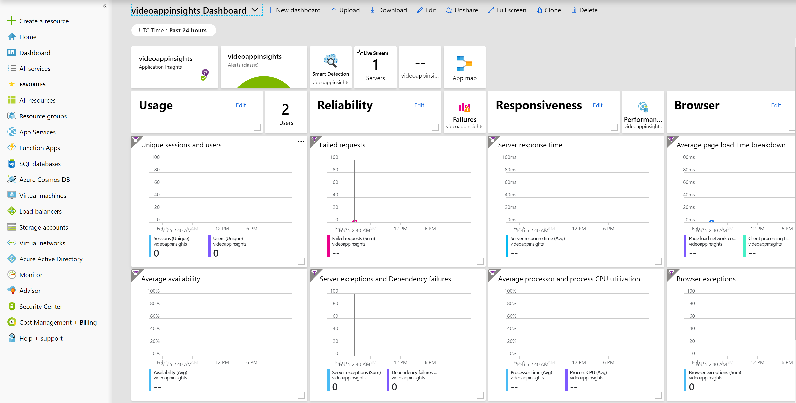
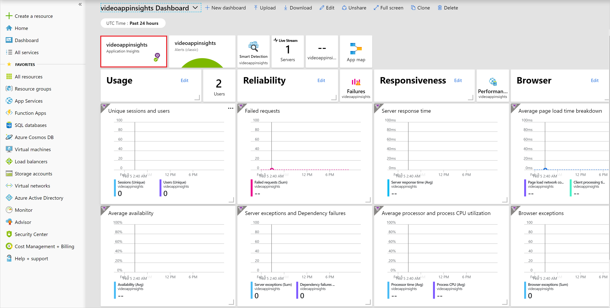
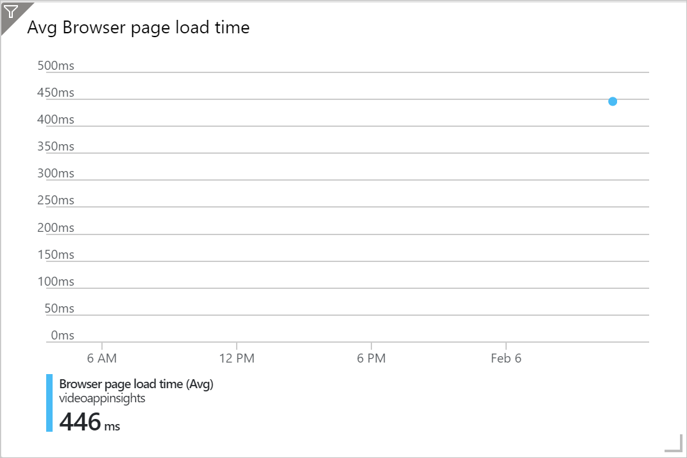

Now that Application Insights has been enabled for your web app, you'll analyze the telemetry data that it generates. In this exercise, you'll use a custom chart to examine how long a page in your app takes to load, from the user's perspective.

> [!NOTE]
> If you're using an ad blocker in your browser, you should disable it for this exercise. It will interfere with the client-side JavaScript used to capture Application Insights data.

## Generate and view usage data

To generate some data to view in Application Insights, we'll simulate some user activity. We'll do this manually:

1. In the Azure portal, in the left pane, select **All resources** and then, in the list of resources, select the web app you created in the previous exercise.
1. In the upper-left corner of the **Overview** page, select **Browse**. The web app opens in a new browser tab.
1. Reload the web page ten times.
1. Switch back to the browser tab that displays the Azure portal. Refresh the web app **Overview** page. The charts on this page should show some requests and responses.
1. On the **Overview** page, select **Application Insights** and then select **View Application Insights data**. The portal displays the Application Insights resource.
1. Examine the data displayed on the **Overview** page. You might need to refresh the page to see data that relates to your page requests.
1. To see the default dashboard for the Application Insights resource, in the upper-left corner of the **Overview** page, select **Application Dashboard**. Examine the data that appears in the default dashboard.

    

## Customize a chart in the Azure portal

Now you'll examine page load times for the previous thirty minutes in a scatter chart to see how your web app's behavior varies over time. Take the following steps:

1. In the Application Insights dashboard, select **Application Insights**.

    
1. On the **Application Insights** blade, under **Monitoring**, select **Metrics**.
1. At the top of the **Metrics** page, select **Last 24 hours (Automatic)**.
1. Select **Last 30 minutes** and then select **Apply**.
1. In the **METRIC NAMESPACE** list, select **Standard metrics (preview)**.
1. In the **METRIC** list, select **Browser page load time**.
1. Select **Line chart** and then select **Scatter chart**.

## Create more data and view the custom chart

Let's simulate more user activity and view the results in the custom chart:

1. Switch back to the browser tab that displays the video web app.
1. Reload the web page ten times.
1. Switch to the browser tab that displays the Azure portal.
1. To refresh the page, select F5.
1. To see the custom chart, scroll to the right of the dashboard. You should see a data point in the chart that relates to your recent requests.

    
