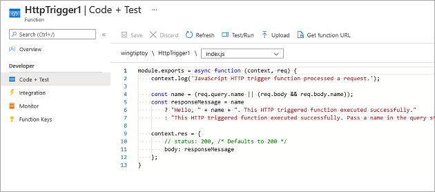
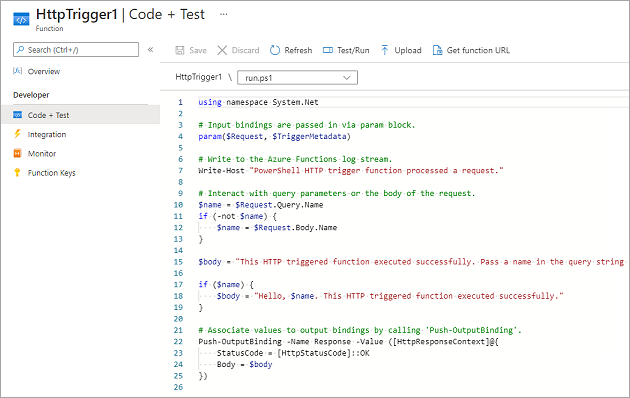
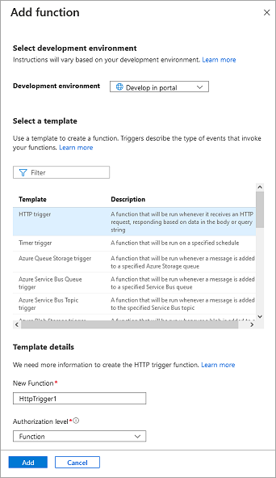
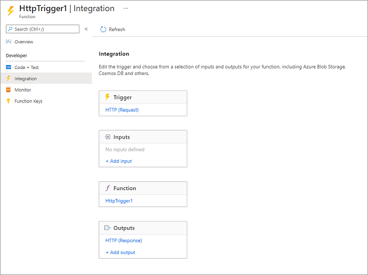
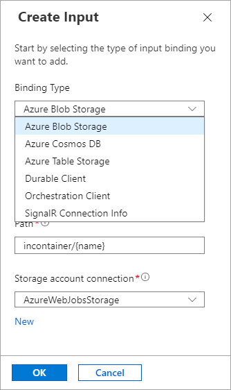
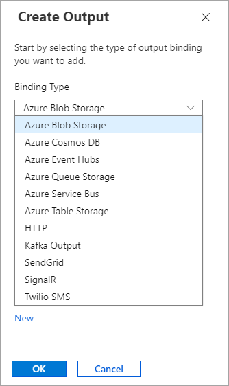
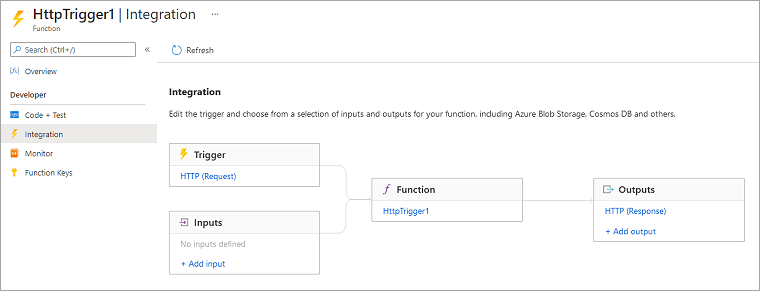

In this exercise, we'll create a function that will start when it receives an HTTP request, and will respond to each request by sending back a message. The parameters `req` and `res` are the *trigger binding* and *output binding*, respectively. (It might help to think of those parameters as abbreviations for "request" and "response.")

See the following high-level illustration of what we're going to build.

::: zone pivot="javascript"

[](../media/3-default-http-trigger-implementation-javascript.png#lightbox) <!-- no-loc -->

::: zone-end

::: zone pivot="powershell"

[](../media/3-default-http-trigger-implementation-powershell.png#lightbox) <!-- no-loc -->

::: zone-end

## Create a function app

Let's create a function app that we'll use throughout this module. A function app lets you group functions as a logical unit for easier management, deployment, and sharing of resources.

::: zone pivot="javascript"

1. Sign in to the [Azure portal](https://portal.azure.com/learn.docs.microsoft.com?azure-portal=true) using the same account that you used to activate the sandbox.

1. On the Azure portal menu or from the **Home** page, under **Azure services**, select **Create a resource**. The **Create a resource** pane appears.

1. In the left menu pane, select **Compute**, and then search for and select **Function App** in the search box. The **Function App** pane appears.

1. Select **Create**. The **Create Function App** pane appears.

1. On the **Basics** tab, enter the following values for each section.

    | Setting | Value | Description |
    |---|---|---|
    | **Project Details** |
    | Subscription | Concierge Subscription | The Azure subscription that you want to use for this Azure Cosmos DB account. |
    | Resource Group | From the dropdown list, select <rgn>[sandbox resource group name]</rgn> | This setting is pre-populated with the resource group from your sandbox. |
    | **Instance Details** |
    | Function App name | Enter a *globally unique name* | Enter a name that identifies your new function app. Valid characters are `a-z`, `0-9`, and `-`. |
    | Publish | Code | Option to publish code files or a Docker container. |
    | Runtime stack | From the dropdown list, select *Node.js* | The sample code in this module is written in JavaScript. |
    | Version | Accept *default* | The default value is sufficient for this exercise. |
    | Region | From the dropdown list, select a *location* | Select the region nearest to you. |

1. Select **Review + create**, and then select **Create** to provision and deploy the function app.

1. Deployment can take some time. In the top task bar, select the **Notifications** icon, and watch for a **Deployment succeeded** message.

1. After your function deployment is complete, select **Go to resource**. The **Overview** pane for your function app appears.

::: zone-end

::: zone pivot="powershell"

1. Sign in to the [Azure portal](https://portal.azure.com/learn.docs.microsoft.com?azure-portal=true) using the same account that you used to activate the sandbox.

1. On the Azure portal menu or from the **Home** page, under **Azure services**, select **Create a resource**. The **Create a resource** pane appears.

1. In the left menu pane, select **Compute**, and then search for and select **Function App** in the search box. The **Function App** pane appears.

1. On the **Basics** tab, enter the following values for each section.

    | Setting | Value | Description |
    |---|---|---|
    | **Project Details** |
    | Subscription | Concierge Subscription | The Azure subscription that you want to use for this Azure Cosmos DB account. |
    | Resource Group | From the dropdown list, select <rgn>[sandbox resource group name]</rgn> | This setting is pre-populated with the resource group from your sandbox. |
    | **Instance Details** |
    | Function App name | Enter a *globally unique name* | Enter a name that identifies your new function app. Valid characters are `a-z`, `0-9`, and `-`. |
    | Publish | Code | Option to publish code files or a Docker container. |
    | Runtime stack | From the dropdown list, select *PowerShell Core* | The sample code in this module is written in PowerShell. |
    | Version | Accept *default* | The default value is sufficient for this exercise. |
    | Region | From the dropdown list, select a *location* | Select the region nearest to you. |

1. Select **Review + create**, and then select **Create** to provision and deploy the function app.

1. Deployment can take some time. In the top task bar, select the **Notifications** icon, and watch for a **Deployment succeeded** message.

1. After your function deployment is complete, select **Go to resource**. The **Overview** pane for your function app appears.

::: zone-end

> [!TIP]
> If you are having trouble finding your function apps in the portal, find out how to [add function apps to your favorites in the portal](/azure/azure-functions/functions-how-to-use-azure-function-app-settings).

## Create a function

::: zone pivot="javascript"

Now that we have a function app, it's time to create a function. A function is activated through a trigger. In this module, we'll use an HTTP trigger.

1. In the left menu pane, under **Functions**, select **Functions**. The **Functions** pane for your function app appears. This opens the function creation process.

1. In the top menu bar, select **Create**. The **Create function** pane appears.

1. In the **Select a template** section, select **HTTP trigger**.

1. In the **Template details** section, enter the following information.

    - In the **New Function** text box, leave the default name of *HttpTrigger1*.

    - Accept the **Authorization level** dropdown selection as *Function*.

        The authorization level option determines what kind of key is used to securely access your function. Choosing *Function* requires callers of your function to provide a function-specific key with their requests.

        [](../media/3-add-function.png#lightbox)

1. Select **Create**. Your new **Function** pane for *HttpTrigger1* appears.

1. In the top menu bar, select **Get Function Url**. The **Get Function Url** dialog box appears.

1. Select **default (function key)** from the dropdown list, then select the *Copy to clipboard* icon at the end of the URL.

1. Paste the function URL you copied into the address bar of a new tab in your browser.

1. Add the query string value `&name=Azure` to the end of the URL. Your resulting URL should resemble the following example:

    'https://example.azurewebsites.net/api/HttpTrigger1?code=AbCdEfGhIjKlMnOpQrStUvWxYz==&name=Azure'  

1. Press <kbd>Enter</kbd> to execute the request in your browser. You should see a response similar to the following example returned by your function.

    The response may take a couple of minutes to come back as the function app warms up for the first time. If you receive a timeout error, refresh to resend the request. After the function is able to respond, you should see a response similar to the following response returned by the function displayed in your browser.

    ```output
    Hello, Azure. This HTTP triggered function executed successfully.
    ```

    As you can see from this exercise so far, you have to select a trigger type when you create a function. Every function has a single trigger. In this example, we're using an HTTP trigger, which means that our function starts when it receives an HTTP request. The default implementation, shown in the following screenshot in JavaScript, responds with the value of the parameter *name* it received in the query string or body of the request. If no string was provided, the function responds with a message that asks whomever is calling to supply a name value.

1. Return to the portal, and in the left menu pane, under **Developer**, select **Code + Test** to view the code.

    The **Code + Test** pane for your function appears, which should display the contents of your **index.js** file.

    [](../media/3-default-http-trigger-implementation-javascript.png#lightbox) <!-- no-loc -->

    The default JavaScript code for your function should resemble the following example.

    ```javascript
    module.exports = async function (context, req) {
        context.log('JavaScript HTTP trigger function processed a request.');
   
        const name = (req.query.name || (req.body && req.body.name));
        const responseMessage = name
            ? "Hello, " + name + ". This HTTP triggered function executed successfully."
            : "This HTTP triggered function executed successfully. Pass a name in the query string or in the request body for a personalized response.";

        context.res = {
            // status: 200, /* Defaults to 200 */
            body: responseMessage
        };
    }
    ```

    Let's look briefly at the function's other file - the **function.json** config file. Access this file by selecting **function.json** from the dropdown list for the filepath. The configuration data is shown in the following JSON listing.

    ```json
    {
        "bindings": [
        {
            "authLevel": "function",
            "type": "httpTrigger",
            "direction": "in",
            "name": "req",
            "methods": [
            "get",
            "post"
            ]
        },
        {
            "type": "http",
            "direction": "out",
            "name": "res"
        }
      ]
    }
    ```

    As you can see, this function has a trigger binding named **req** of type `httpTrigger`, and an output binding named **res** of type `http`. In the preceding code for our function, we saw how we accessed the payload of the incoming HTTP request through our **req** parameter. Similarly, we sent an HTTP response simply by setting our **res** parameter. Bindings really do take care of some of the burdensome work for us.

::: zone-end

::: zone pivot="powershell"

Now that we have a function app, it's time to create a function. A function is activated through a trigger. In this module, we'll use an HTTP trigger.

1. In the left menu pane, under **Functions**, select **Functions**. The **Functions** pane for your function app appears. This opens the function creation process.

1. From the top menu bar, select **Create**. The **Create function** pane appears.

1. In the **Select a template** section, select **HTTP trigger**.

1. In the **Template details** section, enter the following information.

    - In the **New Function** text box, leave the default name of *HttpTrigger1*.

    - Leave the **Authorization level** dropdown selection as *Function*.

        The authorization level option determines what kind of key is used to securely access your function. Choosing *Function* requires callers of your function to provide a function-specific key with their requests.

        [](../media/3-add-function.png#lightbox)

1. Select **Create**. Your new **Function** pane for *HttpTrigger1* appears.

1. In the top menu bar, select **Get Function Url**. The **Get Function Url** dialog box appears.

1. Select **default (function key)** from the dropdown list, then select the *Copy to clipboard* icon at the end of the URL.

1. Paste the function URL you copied into the address bar of a new tab in your browser.

1. Add the query string value `&name=Azure` to the end of the URL. Your resulting URL should resemble the following example:

    'https://example.azurewebsites.net/api/HttpTrigger1?code=AbCdEfGhIjKlMnOpQrStUvWxYz==&name=Azure'

1. Press <kbd>Enter</kbd> to execute the request in your browser.

    The response may take a couple of minutes to come back as the function app warms up for the first time. If you receive a timeout error, refresh to resend the request. After the function is able to respond, you should see a response similar to the following response returned by the function displayed in your browser.

    ```output
    Hello, Azure. This HTTP triggered function executed successfully.
    ```

    As you can see from this exercise so far, you have to select a trigger type when you create a function. Every function has a single trigger. In this example, we're using an HTTP trigger, which means that our function starts when it receives an HTTP request. The default implementation, shown in the following image in PowerShell, uses the `Push-OutputBinding` cmdlet to respond with the value of the parameter *name* it received in the query string or body of the request. If no string was provided, the function responds with a message that prompts whomever is calling to supply a name value.

1. Return to the portal, and in the left menu pane, under **Developer**, select **Code + Test** to view the code.

    The **Code + Test** pane for your function appears, which should display the contents of your **run.ps1** file.

    [](../media/3-default-http-trigger-implementation-powershell.png#lightbox) <!-- no-loc -->

    The default PowerShell code for your function should resemble the following example.

    ```powershell
    using namespace System.Net
    
    # Input bindings are passed in via param block.
    param($Request, $TriggerMetadata)
    
    # Write to the Azure Functions log stream.
    Write-Host "PowerShell HTTP trigger function processed a request."
    
    # Interact with query parameters or the body of the request.
    $name = $Request.Query.Name
    if (-not $name) {
        $name = $Request.Body.Name
    }
    
    $body = "This HTTP triggered function executed successfully. Pass a name in the query string or in the request body for a personalized response."
    
    if ($name) {
        $body = "Hello, $name. This HTTP triggered function executed successfully."
    }
    
    # Associate values to output bindings by calling 'Push-OutputBinding'.
    Push-OutputBinding -Name Response -Value ([HttpResponseContext]@{
        StatusCode = [HttpStatusCode]::OK
        Body = $body
    })
    ```

    Let's look briefly at the function's other file, the **function.json** config file. Access this file by selecting **function.json** from the filepath's dropdown list. The configuration data is shown in the following JSON listing.

    ```json
    {
      "bindings": [
        {
          "authLevel": "function",
          "type": "httpTrigger",
          "direction": "in",
          "name": "Request",
          "methods": [
            "get",
            "post"
          ]
        },
        {
          "type": "http",
          "direction": "out",
          "name": "Response"
        }
      ]
    }
    ```

    As you can see, this function has a trigger binding named **Request** of type `httpTrigger`, and an output binding named **Response**  of type `http`. In the preceding code for our function, we saw how we accessed the payload of the incoming HTTP request through our **Request** parameter. Similarly, we sent an HTTP response simply by setting our **Response** parameter. Bindings really do take care of some of the burdensome work for us.

::: zone-end

### Explore binding types

::: zone pivot="javascript"

1. In the left menu pane, under **Developer**, select **Integration**. The **Integration** pane for your function appears.

    Notice that we have already defined a trigger and an output binding, as shown in the following image.

    [](../media/3-function-integration-vertical.png#lightbox)

    You can see that we can't add more than _one_ trigger. In fact, to change the trigger for our function, we would have to first delete the trigger, and create a new one. However, the **Inputs** and **Outputs** sections of this pane display a plus sign (+) to add more bindings so we can accept more than one input value, and emit more than one output value.

1. Select **Add input** in the **Inputs** box. The **Create Input** pane appears showing a list of all possible input **Binding Types** in a dropdown menu.

    

    Take a moment to consider each of these input bindings, and how you might use them in a solution. There are many selections to choose from.

    We'll get back to adding input bindings later in this module but for now, select **Cancel** to dismiss this pane.

1. Select **Add output** in the **Outputs** box. The **Create Output** pane appears showing a list of all possible output **Binding Types** in a dropdown menu.

    

    As you can see, there are several output binding types. We'll get back to adding output bindings later in this module but, for now, select **Cancel** to dismiss this pane.

::: zone-end

::: zone pivot="powershell"

1. In the left menu pane, under **Developer**, select **Integration**. The **Integration** pane for your function appears.

    Notice that we have already defined a trigger and an output binding, as shown in the following image.

    [](../media/3-function-integration-horizontal.png#lightbox)

    You can see that we can't add more than _one_ trigger. In fact, to change the trigger for our function, we would have to first delete the trigger, and create a new one. However, the **Inputs** and **Outputs** sections of this pane display a plus sign (+) to add more bindings so we can accept more than one input value, and emit more than one output value.

1. Select **Add input** in the **Inputs** box. The **Create Input** pane appears showing a list of all possible input **Binding Types** in a dropdown menu.

    

    Take a moment to consider each of these input bindings, and how you might use them in a solution. There are many selections to choose from.

    We'll get back to adding input bindings later in this module but for now, select **Cancel** to dismiss this pane.

1. Select **Add output** in the **Outputs** box. The **Create Output** pane appears showing a list of all possible output **Binding Types** in a dropdown menu.

    

    As you can see, there are several output binding types. We'll get back to adding output bindings later in this module but, for now, select **Cancel** to dismiss this pane.

::: zone-end

So far, we've learned how to create a function app and add a function to it. We've seen a simple function in action - one that runs when an HTTP request is made to it. We've also explored the Azure portal and types of input and output bindings that are available to our functions. In the next unit, we'll use an input binding to read text from a database.
