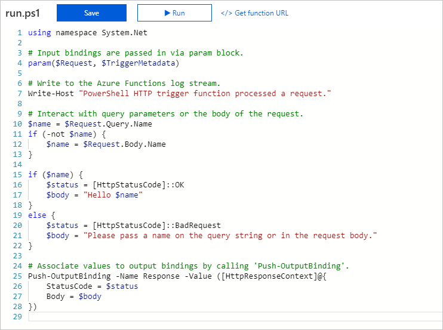
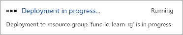
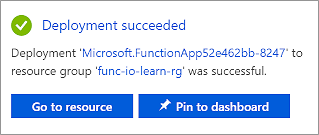

The following is a high-level illustration of what we're going to build in this exercise.

::: zone pivot="javascript"

:::image type="content" source="../media/3-default-http-trigger-implementation-small.PNG" alt-text="Illustration of default HTTP trigger, showing HTTP request and response as well as respective req and res binding parameters." loc-scope="other"::: <!-- no-loc -->

::: zone-end

::: zone pivot="powershell"



::: zone-end

We'll create a function that will start when it receives an HTTP request and will respond to each request by sending back a message. The parameters `req` and `res` are the trigger binding and output binding, respectively.

## Create a function app

Let's create a function app that we'll use throughout this entire module. A function app lets you group functions as a logical unit for easier management, deployment, and sharing of resources.

::: zone pivot="javascript"

1. Sign into the [Azure portal](https://portal.azure.com/learn.docs.microsoft.com?azure-portal=true) using the same account you activated the sandbox with.

1. On the Azure portal menu or from the **Home** page, select **Create a resource**.

1. Select **Compute** > **Function App**.

1. Set the function app properties as follows:

    | Property | Suggested value | Description |
    |---|---|---|
    | **Subscription** | _Concierge Subscription_ | The Azure subscription that you want to use for this Azure Cosmos DB account. |
    | **Resource Group**| _<rgn>[sandbox resource group name]</rgn>_ | This field is pre-populated with the resource group from your sandbox. |
    | **Function App name** | Globally unique name | Name that identifies your new function app. Valid characters are `a-z`, `0-9`, and `-`. |
    | **Publish** | _Code_ | Option to publish code files or a Docker container. |
    | **Runtime Stack** | _Node.js_ | The sample code in this module is written in JavaScript. |
    | **Version** | Default |
    | **Region** | _Central US_ | Choose the region nearest you. |

1. Select **Review + create** and then **Create** to provision and deploy the function app.

1. Select the Notification icon in the upper-right corner of the portal, and watch for a **Deployment in progress** message similar to the following message.

    

1. Deployment can take some time. So, stay in the notification hub and  watch for a **Deployment succeeded** message similar to the following message.

    

1. After the function app is deployed, go to **Home > All resources** in the portal. The function app will be listed with type **Function App** and has the name you gave it. Select the function app from the list to open it.

    >[!TIP]
    >If you are having trouble finding your function apps in the portal, find out how to [add function apps to your favorites in the portal](https://docs.microsoft.com/azure/azure-functions/functions-how-to-use-azure-function-app-settings).

::: zone-end

::: zone pivot="powershell"

1. Sign into the [Azure portal](https://portal.azure.com/learn.docs.microsoft.com?azure-portal=true) using the same account you activated the sandbox with.

1. On the Azure portal menu or from the **Home** page, select **Create a resource**.

1. Select **Compute** > **Function App**.

1. Set the function app properties as follows:

    | Property | Suggested value | Description |
    |---|---|---|
    | **Subscription** | _Concierge Subscription_ | The Azure subscription that you want to use for this Azure Cosmos DB account. |
    | **Resource Group**| _<rgn>[sandbox resource group name]</rgn>_ | This field is pre-populated with the resource group from your sandbox. |
    | **Function App name** | Globally unique name | Name that identifies your new function app. Valid characters are `a-z`, `0-9`, and `-`. |
    | **Publish** | _Code_ | Option to publish code files or a Docker container. |
    | **Runtime Stack** | _Node.js_ | The sample code in this module is written in JavaScript. |
    | **Version** | Default |
    | **Region** | _Central US_ | Choose the region nearest you. |

1. Select **Review + create** and then **Create** to provision and deploy the function app.

1. Select the Notification icon in the upper-right corner of the portal and watch for a **Deployment in progress** message similar to the following message.

    

1. Deployment can take some time. So, stay in the notification hub and  watch for a **Deployment succeeded** message similar to the following message.

    

1. After the function app is deployed, go to **Home > All resources** in the portal. The function app will be listed with type **Function App** and has the name you gave it. Select the function app from the list to open it.

    >[!TIP]
    >If you are having trouble finding your function apps in the portal, find out how to [add function apps to your favorites in the portal](https://docs.microsoft.com/azure/azure-functions/functions-how-to-use-azure-function-app-settings).

::: zone-end

## Create a function

::: zone pivot="javascript"

Now that we have a function app, it's time to create a function. A function is activated through a trigger. In this module, we'll use an HTTP trigger.

1. Select the **Functions** icon on the left hand menu. This opens the function creation process.

1. From the top menu bar, select **+ Add**. The **Add function** panel appears.

1. In the **Select a template** section, select **HTTP trigger**.

1. In the **Template details** section, in the **New Function** text box, you can change the name if you want. Leave the **Authorization level** dropdown as _Function_, and then select **Add**. The Authorization level option determines what kind of key is used to securely access your function. Choosing _Function_ requires callers of your function to provide a function-specific key with their requests.

1. In your new function, in the top menu bar, select **</> Get Function Url**.

1. In the **Get Function Url** dialog, select **default (Function key)**, and then select the *Copy to clipboard* icon at the end of the URL.

1. Paste the function URL you copied into the address bar of a new tab in your browser.

1. Add the query string value `&name=Azure` to the end of this URL, and then press **Enter** on your keyboard to execute the request. You should see a response similar to the following response returned by the function displayed in your browser.

    ```output
    Hello, Azure. This HTTP triggered function executed successfully.
    ```

As you can see from this exercise so far, you have to select a trigger type when you create a function. Every function has a single trigger. In this example, we're using an HTTP trigger, which means that our function starts when it receives an HTTP request. The default implementation, shown in the following screenshot in JavaScript, responds with the value of the parameter *name* it received in the query string or body of the request. If no string was provided, the function responds with a message that asks whomever is calling to supply a name value.

>[!TIP]
>You can view the code by selecting **Code + Test** from the left nav bar.


Let's look briefly at the function's other file, the **function.json** config file. Access this file by selecting **function.json** from the filepath dropdown. The configuration data is shown in the following JSON listing.

>[!TIP]
> You can view the additional code by selecting the dropdown in the middle of the **Code + Test** screen.

```json
{
    "bindings": [
    {
        "authLevel": "function",
        "type": "httpTrigger",
        "direction": "in",
        "name": "req",
        "methods": [
        "get",
        "post"
        ]
    },
    {
        "type": "http",
        "direction": "out",
        "name": "res"
    }
    ],
    "disabled": false
}
```

As you can see, this function has a trigger binding named **req** of type `httpTrigger`, and an output binding named **res** of type `HTTP`. In the preceding code for our function, we saw how we accessed the payload of the incoming HTTP request through our **req** parameter. Similarly, we sent an HTTP response simply by setting our **res** parameter. Bindings really do take care of some of the burdensome work for us.

::: zone-end

::: zone pivot="powershell"

Now that we have a function app, it's time to create a function. A function is activated through a trigger. In this module, we'll use an HTTP trigger.

1. Select the **Functions** icon on the left hand menu. This opens the function creation process.

1. From the top menu bar, select **+ Add**. The **Add function** panel appears.

1. In the **Select a template** section, select **HTTP trigger**.

1. In the **Template details** section, in the **New Function** text box, you can change the name if you want. Leave the **Authorization level** dropdown as _Function_, and then select **Add**. The Authorization level option determines what kind of key is used to securely access your function. Choosing _Function_ requires callers of your function to provide a function-specific key with their requests.

1. In your new function, in the top menu bar, select **</> Get Function Url**.

1. In the **Get Function Url** dialog, select **default (Function key)**, and then select the *Copy to clipboard* icon at the end of the URL.

1. Paste the function URL you copied into the address bar of a new tab in your browser.

1. Add the query string value `&name=Azure` to the end of this URL, and then press **Enter** on your keyboard to execute the request. You should see a response similar to the following response returned by the function displayed in your browser.

    The response may take a couple of minutes to come back as the function app warms up for the first time. If you receive a timeout error, refresh to resend the request. After the function is able to respond, you should see a response similar to the following response returned by the function displayed in your browser.

    ```output
    Hello, Azure. This HTTP triggered function executed successfully.
    ```

As you can see from this exercise so far, you have to select a trigger type when you create a function. Every function has a single trigger. In this example, we're using an HTTP trigger, which means that our function starts when it receives an HTTP request. The default implementation, shown in the following image in PowerShell, uses the `Push-OutputBinding` cmdlet to respond with the value of the parameter *name* it received in the query string or body of the request. If no string was provided, the function responds with a message that prompts whomever is calling to supply a name value.


All of this code is in the **Functions > Code + Test** file, from the left nav bar.

>[!TIP]
>You can see the **run.ps1** and **function.json** files by selecting the dropdown.

Let's look briefly at the function's other file, the **function.json** config file. Access this file by selecting **function.json** from the filepath dropdown. The configuration data is shown in the following JSON listing.

```json
{
  "bindings": [
    {
      "authLevel": "function",
      "type": "httpTrigger",
      "direction": "in",
      "name": "Request",
      "methods": [
        "get",
        "post"
      ]
    },
    {
      "type": "http",
      "direction": "out",
      "name": "Response"
    }
  ],
  "disabled": false
}
```

As you can see, this function has a trigger binding named **Request** of type `httpTrigger`, and an output binding named **Response**  of type `http`. In the preceding code for our function, we saw how we accessed the payload of the incoming HTTP request through our **Request** parameter. Similarly, we sent an HTTP response simply by setting our **Response** parameter. Bindings really do take care of some of the heavy lifting for us.

::: zone-end

### Explore binding types

1. Notice under the function entry there is a set of menu items as shown in the following screenshot.

    :::image type="content" source="../media/3-func-menu-small.png" alt-text="Screen shot of the Overview Menu.  Code + Test, Integration, Monitor, and Function Keys.":::

1. Select the **Integration** menu item to open the integration tab for our function. If you've been following along with this unit, the integrate tab should look very similar to the following screenshot.

    :::image type="content" source="../media/3-func-integrate-tab-small.png" alt-text="Screen shot of the integration screen. Trigger and Inputs lead to Function and on to Output.":::

    > [!NOTE]
    > We have already defined a trigger and an output binding, as shown in the image. You can see that we can't add more than _one_ trigger. In fact, to change the trigger for our function, we would have to first delete the trigger, and create a new one. However, the **Inputs** and **Outputs** sections of this page display a plus sign (+) to add more bindings so we can accept more than one input value, and emit more than one output value.

1. Select **+ Add input** under the **Inputs** column. The **Create Input** panel appears showing a list of all possible input **Binding Types** when selecting the dropdown.

    :::image type="content" source="../media/3-func-input-bindings-selector-small.png" alt-text="Screen shot of the Add input options.":::

    Take a moment to consider each of these input bindings by selecting the dropdown and how you might use them in a solution. There are many selections to choose from.

1. We'll get back to adding input bindings later in the module but, for now, select **Cancel** to dismiss this list.

1. Select **+Add Output** under the **Outputs**. The **Create Output** panel appears showing a list of all possible output **Binding Types** when selecting the dropdown.

    As you can see, there are several output binding types. We'll get back to adding output bindings later in the module but, for now, select **Cancel** to dismiss this list.

So far, we've learned how to create a function app and add a function to it. We've seen a simple function in action, one that runs when an HTTP request is made to it. We've also explored the Azure portal UI and types of input and output binding that are available to our functions. In the next unit, we'll use an input binding to read text from a database.
