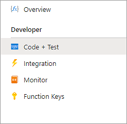
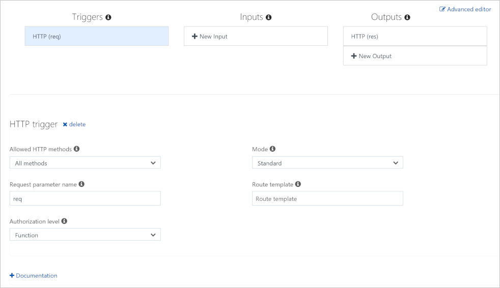
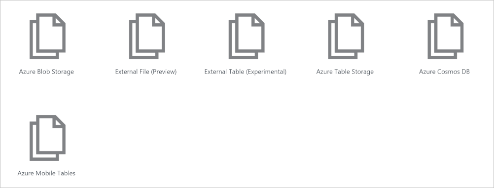
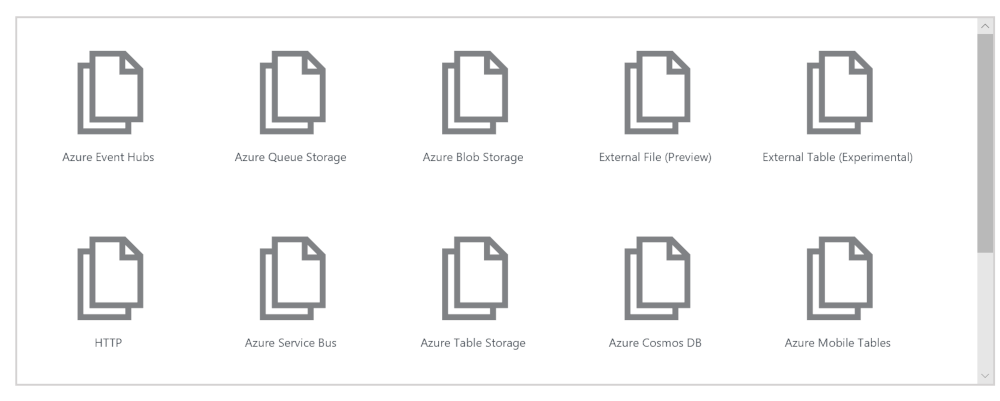

The following is a high-level illustration of what we're going to build in this exercise.


We'll create a function that will start when it receives an HTTP request and will respond to each request by sending back a message. The parameters `req` and `res` are the trigger binding and output binding, respectively.

[!include[](../../../includes/azure-sandbox-activate.md)]

## Create a function app

Let's create a function app that we'll use throughout this entire module. A function app lets you group functions as a logical unit for easier management, deployment, and sharing of resources.

1. Sign into the [Azure portal](https://portal.azure.com/learn.docs.microsoft.com?azure-portal=true) using the same account you activated the sandbox with.

1. Select the **Create a resource** button found on the upper left-hand corner of the Azure portal, then select **Compute** > **Function App**.

1. Set the function app properties as follows:

    | Property     | Suggested value  | Description  |
    |--------------|------------------|--------------|
    | **App name** | Globally unique name | Name that identifies your new function app. Valid characters are `a-z`, `0-9`, and `-`.  |
    | **Subscription** | Your subscription | The subscription under which this new function app is created. |
    | **Resource Group**|  Select **Use existing** and choose _<rgn>[sandbox resource group name]</rgn>_ | Name of the resource group in which to create your function app. |
    | **OS** | Windows | The operating system that hosts the function app.  |
    | **Hosting Plan** |   Consumption plan | Hosting plan that defines how resources are allocated to your function app. In the default **Consumption Plan**, resources are added dynamically as required by your functions. In this serverless hosting model, you only pay for the time your functions run.   |
    | **Location** | Select from the list | Choose the nearest one to you that is also one of the allowed *Sandbox regions* listed below. |
    | **Runtime Stack** | JavaScript | The sample code in this module is written in JavaScript.  |
    | **Storage** |  Globally unique name |  Name of the new storage account used by your function app. Storage account names must be between 3 and 24 characters in length and may contain numbers and lowercase letters only. This dialog populates the field with a unique name that is derived from the name you gave the app. However, feel free to use a different name or even an existing account. |

    ### Sandbox regions
    [!include[](../../../includes/azure-sandbox-regions-first-mention-note-friendly.md)]

1. Select **Create** to provision and deploy the function app.

1. Select the Notification icon in the upper-right corner of the portal and watch for a **Deployment in progress** message similar to the following message.

    

1. Deployment can take some time. So, stay in the notification hub and  watch for a **Deployment succeeded** message similar to the following message.

    

 1. Once the function app is deployed, go to **All resources** in the portal. The function app will be listed with type **App Service** and has the name you gave it. Select the function app from the list to open it.

    >[!TIP]
    >If you are having trouble finding your function apps in the portal, find out how to [add function apps to your favorites in the portal](https://docs.microsoft.com/azure/azure-functions/functions-how-to-use-azure-function-app-settings#favorite).

## Create a function

Now that we have a function app, it's time to create a function. A function is activated through a trigger. In this module, we'll use an HTTP trigger.

1. Select the Add (**+**) button next to **Functions**. This action starts the function creation process.

1. On the **Azure Functions for JavaScript - getting started** page, select **In-portal** and then select **continue**.

1. In the **Create a function** step, select **More templates...** and then select **Finish and view templates**.

1. In the list of all templates available to this function app, select **HTTP Trigger** .

1. On the **New Function** screen, change the name if you want, leave the **Authorization level** as _Function_, and click **Create**.

1. In your new function, click the **</> Get function URL** link at the top right, select **default (Function key)**, and then select **Copy**.

1. Paste the function URL you copied into the address bar of a new tab in your browser.

1. Add the query string value `&name=Azure` to the end of this URL, and then press Enter on your keyboard to execute the request. You should see a response similar to the following response returned by the function displayed in your browser.

    ```output
    <string xmlns="http://schemas.microsoft.com/2003/10/Serialization/">Hello Azure</string>
    ```

As you can see from this exercise so far, you have to select a trigger type when you create a function. Every function has one and only one trigger. In this example, we're using an HTTP trigger, which means that our function starts when it receives an HTTP request. The default implementation, shown in the following screenshot in JavaScript, responds with the value of the parameter *name* it received in the query string or body of the request. If no string was provided, the function responds with a message that asks whomever is calling to supply a name value.


All of this code is in the **index.js** file in this function's folder. Let's look briefly at the function's other file, the **function.json** config file. This configuration data is shown in the following JSON listing.

```json
{
    "bindings": [
    {
        "authLevel": "function",
        "type": "httpTrigger",
        "direction": "in",
        "name": "req",
        "methods": [
        "get",
        "post"
        ]
    },
    {
        "type": "http",
        "direction": "out",
        "name": "res"
    }
    ],
    "disabled": false
}
```

As you can see, this function has a trigger binding named **req** of type `httpTrigger` and an output binding named **res**  of type `HTTP`. In the preceding code for our function, we saw how we accessed the payload of the incoming HTTP request through our **req** parameter. Similarly, we sent an HTTP response simply by setting our **res** parameter. Bindings really do take care of some of the heavy lifting for us.

>[!TIP]
>You can see the **index.js** and **function.json** files by expanding the **View Files** menu that you'll see on the right hand side of the screen when you have your function selected. You might have to scroll to the right to see this menu.

### Explore binding types

1. Notice under the function entry there is a set of menu items as shown in the following screenshot.

    

1. Select the **Integrate** menu item to open the integration tab for our function. If you've been following along with this unit, the integrate tab should look very similar to the following screenshot.

    

    > [!NOTE]
    > We have already defined a trigger and an output binding, as shown in the screenshot. You can see that we can't add more than _one_ trigger. In fact, to change the trigger for our function we would have to first delete the trigger and create a new one. However, the **Inputs** and **Outputs** sections of this UI display a plus sign (+) to add more bindings so we can accept more than one input value and emit more than one output value.

1. Select **+ New Input** under the **Inputs** column. A list of all possible input binding types is displayed as shown in the following screenshot.

    

   Take a moment to consider each of these input bindings and how you might use them in a solution. There are a lot to choose from. This list might even have changed by the time you read this module, as we continue to support more data sources.

1. We'll get back to adding input bindings later in the module but, for now, select **Cancel** to dismiss this list.

1. Select **+ New Output** under the **Outputs** column. A list of all possible output binding types is displayed as shown in the following screenshot.\

    

   As you can see, there are several output binding types at your disposal. We'll get back to adding output bindings later in the module but, for now, select **Cancel** to dismiss this list.

So far, we've learned how to create a function app and add a function to it. We've seen a simple function in action, one that runs when an HTTP request is made to it. We've also explored the Azure portal UI and types of input and output binding that are available to our functions. In the next unit, we'll use an input binding to read text from a database.