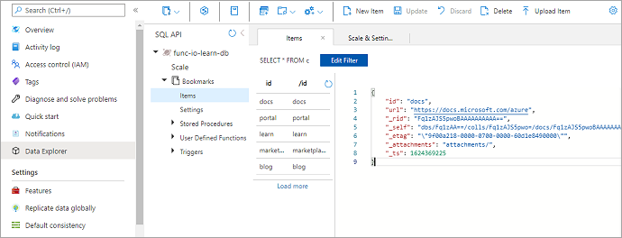

Imagine that you want to create a simple bookmark lookup service. Your service is read-only initially. If users want to find an entry, they send a request with the ID of the entry, and you return the URL. The following flowchart illustrates the flow.


When users send you a request with some text, you try to find an entry in your back-end database that contains this text as a key or ID. You return a result that indicates whether you found the entry.

When the Azure function receives a request with the bookmark ID, it first checks whether the request is valid; if not, an error response is generated. For valid requests, the function checks if the bookmark ID is present in the Azure Cosmos DB database. If it isn't present, an error response is generated. If the bookmark ID is found, a success response is generated.

You need to store the data somewhere. In the previous flowchart, the data store is an Azure Cosmos DB instance. But how do you connect to a database from a function and read data? In the world of functions, you configure an *input binding* for that job. Configuring a binding through the Azure portal is straightforward. As you'll see shortly, you don't have to write code for such tasks, like opening a storage connection. The Azure Functions runtime and bindings take care of those tasks for you.

## Create an Azure Cosmos DB account

> [!NOTE]
> This exercise is not intended to be a tutorial on Azure Cosmos DB. After finishing this module, if you're interested in learning more, there is a complete learning path about Azure Cosmos DB.

### Create a database account

A database account is a container for managing one or more databases. Before we can create a database, we need to create a database account.

1. Sign in to the [Azure portal](https://portal.azure.com/learn.docs.microsoft.com?azure-portal=true) using the same account that you used to activate the sandbox.

1. On the Azure portal menu, or from the **Home** page, under **Azure services**, select **Create a resource**. The **Create a resource** pane appears.

1. In the left menu pane, select **Databases**, and in the *Search services and marketplace* search box, search for and select **Azure Cosmos DB**. The **Select API option** pane appears.

    Azure Cosmos DB provides five APIs to suit the needs of your application:

    - Core SQL (document database)
    - MongoDB (document database)
    - Cassandra
    - Azure Table
    - Gremlin (graph database)

    Each of these database options currently require a separate account. At this time, the Azure Cosmos DB trigger, input bindings, and output bindings only work with Core SQL API and Graph API accounts.

1. In the **Core (SQL) - Recommended** box option, select **Create**. The **Create Azure Cosmos DB Account - Core (SQL)** pane appears.

1. On the **Basics** tab, enter the following values for each setting.

    | Setting | Value | Description |
    |---|---|---|
    | **Project Details** |
    | Subscription | Concierge Subscription | The Azure subscription that you want to use for this Azure Cosmos DB account. |
    | Resource Group | From the dropdown list, select <rgn>[sandbox resource group name]</rgn> | This setting is pre-populated with the resource group from your sandbox. |
    | **Instance Details** |
    | Account Name | Enter a *globally unique name* | Enter a unique name to identify this Azure Cosmos DB account. Because `documents.azure.com` is appended to the name that you provide to create your URI, use a unique but identifiable name.<br><br>The account name can contain only lowercase letters, numbers, and the hyphen (-) character, and it must contain 3 to 50 characters. |
    | Location | *region* | Select the region nearest to you. |

1. Accept the default values for all of the other settings in this new account pane.

1. Select **Review + create** to review and validate the configuration. A *Validation Success* notification appears.

1. Select **Create** to provision and deploy the database account.

1. Deployment can take some time, so wait for a **Deployment succeeded** message in the Notifications hub before proceeding.

    

1. Select **Go to resource** to go to the database account in the portal. The **Quick start** pane for your Azure Cosmos DB account appears.

Next, we'll add a container to the database.

### Add a container

In Azure Cosmos DB, a *container* holds arbitrary user-generated entities. Inside a container, we store documents.

Let's use the Data Explorer tool in the Azure portal to create a database and container.

1. In the left menu pane, select **Data Explorer**. The **Data Explorer** pane appears.

1. Select the **New Container** box. The **New Container** pane appears. To see it, you may need to scroll to the right.

1. Enter the following values for each setting.

    | Setting | Value | Description |
    |---|---|---|
    | Database id | Select **Create new**, and enter *func-io-learn-db* in its field | Database names must contain from 1 through 255 characters, and they cannot contain /, \\, #, ?, or a trailing space.<br><br>You're free to enter whatever you want here, but we suggest _func-io-learn-db_ as the name for the new database, and that's what we'll refer to in this unit. |
    | Database Max RU/s | 4000 |Leave the throughput to 4000 request units per second (RU/s). If you want to reduce latency, you can scale up the performance later. |
    | Container id | Bookmarks | Container IDs have the same character requirements as database names. |
    | Partition key | /id  | The partition key specifies how the documents in Azure Cosmos DB collections are distributed across logical data partitions. You'll use the *Partition key* setting as a convenience because you're not concerned with database performance in this module. If you would like to learn more about Azure Cosmos DB partition key strategies, explore the Microsoft Learn Azure Cosmos DB modules. |

1. Select **OK**. The Data Explorer displays the new database and container under the **SQL API** section. Inside the database, you've defined a container. Next, you'll add some data, also known as items.

### Add test data

You've defined a container in our database called **Bookmarks**. You want to store a URL and ID in each item, like a list of web page bookmarks.

You'll add data to the new container using Data Explorer.

1. In the **Data Explorer** pane, the new database, *func-io-learn-db*, appears under the **SQL API** section. Expand the **func-io-learn-db** database, then expand the **Bookmarks** container, and select **Items**. The **Items** tab appears.

1. In the top menu bar of the **Data Explorer** pane, select **New Item**.

1. Replace the default code of the new item with the following JSON, and in the top menu bar, select **Save**.

     ```json
     {
         "id": "docs",
         "url": "https://docs.microsoft.com/azure"
     }
     ```

    Notice that there are more properties than the ones we added. They all begin with an underline (_rid, _self, _etag, _attachments, _ts). These are properties generated by the system to help manage the document.

    | Property | Description |
    |---|---|
    | `_rid` | Resource ID is a unique identifier that is also hierarchical per the resource stack on the resource model. It is used internally for placement and navigation of the item resource. |
    | `_self` | Unique addressable URI for the resource. |
    | `_etag` | Required for optimistic concurrency control. |
    | `_attachments` | Addressable path for the attachments resource. |
    | `_ts` | Timestamp of the last update of this resource. |

1. To add a few more items into the container, in the top menu bar, select **New Item**. Create four more items with the following content. Do this by selecting **New Item**, and then selecting **Save** after copying and pasting each new item.

    ```json
    {
        "id": "portal",
        "url": "https://portal.azure.com"
    }
    ```

    ```json
    {
        "id": "learn",
        "url": "https://docs.microsoft.com/learn"
    }
    ```

    ```json
    {
        "id": "marketplace",
        "url": "https://azuremarketplace.microsoft.com/marketplace/apps"
    }
    ```

    ```json
    {
        "id": "blog",
        "url": "https://azure.microsoft.com/blog"
    }
    ```

1. When you've finished entering the bookmark data, your container should look like the following image.

    [](../media/5-db-bookmark-collection.png#lightbox)

You now have a few entries in your **Bookmarks** container. Your scenario will work as follows. If a request arrives with, for example, "id=docs", you'll look up that ID in your Bookmarks container, and return the URL `https://docs.microsoft.com/azure`. Let's make an Azure function that looks up values in this container.

## Create your function

1. Go to the function app that you created in the preceding unit. In the top left corner of the portal, select **Home**, and in the **Recent resources** section, you should see your app with **Function App** identified in the **Type** column. Select your app, and the **Function App** pane appears.

1. In the left menu pane, under **Functions**, select **Functions**. The **Functions** pane appears.

1. To start the function creation process, from the top menu bar, select **Create**. The **Create function** pane appears showing the complete set of supported triggers.

1. In the **Select a template** section, select **HTTP trigger**.

1. Accept every setting with the defaults, and select **Create** to create your function.

    The **HttpTrigger2** pane for your function appears displaying a default implementation of your HTTP-triggered function.

### Verify the function

You can verify what we have done so far by testing our new function using the following steps.

1. In your new function, in the top menu bar, select **Get Function Url**. The **Get Function Url** dialog box appears.

1. Select **default (function key)** from the dropdown list, then select the *Copy to clipboard* icon at the end of the URL, and select **OK**.

1. Paste the function URL you copied into your browser's address bar. Add the query string value `&name=<your function name>` (where `<your function name>` is the name of your function), to the end of the URL, and press <kbd>Enter</kbd>. You should get a response from the Azure Function in the browser.

Now that we have our skeletal function working, let's turn our attention to reading data from Azure Cosmos DB, or in our scenario, your **Bookmarks** container.

## Add an Azure Cosmos DB input binding

To read data from the database, you need to define an input binding. As you'll see, you can configure a binding that can talk to your database in just a few steps.

1. Return to the portal, and in the left menu pane of your *HttpTrigger2* function, under **Developer**, select **Integration**. The **Integration** pane for your *Function* appears.

    The template you used created an HTTP trigger and an HTTP output binding. Now, add your new Azure Cosmos DB input binding.

1. In the **Inputs** box, select **Add input**. The **Create Input** pane appears showing a list of all possible input binding types.

1. From the **Binding Type** dropdown list, select **Azure Cosmos DB**.

1. In the **Azure Cosmos DB details** section, under the **Cosmos DB account connection** setting, select the **New** link. The **New Cosmos DB connection** dialog box appears.

    Next, you'll set up a connection to your database.

    > [!NOTE]
    >
    > If the following message appears in the **Azure Cosmos DB input** configuration user interface prompting you to install an extension, select **Install**. It can take a while to install an extension, so you will need to wait for the installation to complete before proceeding to the next step.
    >
    > 
    >

1. To create your connection, select **OK**.

    A new connection to the database is configured and appears in the **Cosmos DB account connection** dropdown list in the **Create Input** pane.

    We want to look up a bookmark with a specific ID, so let's tie an ID that we receive in the query string to the binding.

1. Enter the following values for each setting in this pane. To learn more about the purpose of each setting, you can select the information icon to its right.

    | Setting | Value | Description |
    |---|---|---|
    | **Document parameter name** | `bookmark` | The name used to identify this binding in your code. |
    | **Database name** | `func-io-learn-db` | The database to work with. This value is the database name we set earlier in this lesson. |
    | **Collection Name** | `Bookmarks` | The collection from which we'll read data. This setting was defined earlier in the lesson. |
    | **Document ID** | `id` | Add the Document ID that we defined when we created the _Bookmarks_ Azure Cosmos DB container earlier. |
    | **Partition key** | `/id` | Add the partition key that you defined when you created the _Bookmarks_ Azure Cosmos DB collection earlier. The key entered here (specified in input binding format `<key>`) must match the one in the collection. |
    | **SQL Query (optional)** | _Leave blank_ | You are only retrieving one document at a time based on the ID. So, filtering with the Document ID setting is a better than using a SQL Query in this instance. You could craft a SQL Query to return one entry (`SELECT * from b where b.ID = id`). That query would indeed return a document, but it would return it in a document collection. Your code would have to manipulate a collection unnecessarily. Use the SQL Query approach when you want to get multiple documents. |

    The following explanation should clarify the values that we are using: we want to look up a bookmark with a specific ID, so we tied the **Document ID** that our function receives in the query string to the binding. This syntax is known as a *binding expression*. The function is triggered by an HTTP request that uses a query string to specify the ID to look up. Because IDs are unique in our collection, the binding will return either 0 (not found) or 1 (found) documents.

1. To save all changes to this binding configuration, from the select **OK**.

Now that you have your binding defined, it's time to use it in your function.

## Update the function implementation

There are two changes that you need to make to implement the binding that you just created:

- Your function's language-specific implementation code needs to be modified to determine if a document was found in the database that matches the ID that is passed to the function.

- Your function's JSON implementation code needs to be modified to accept a parameter that is passed through the query string.

::: zone pivot="javascript"

### Modify your function's JavaScript implementation code

1. On the **Integration** pane of your *HttpTrigger2* function, in the left menu pane, under **Developer**, select **Code + Test**. The **Code + Test** pane appears for your *HttpTrigger2* function.

1. Replace all code in the *index.js* file with the code from the following snippet, and in the top menu bar, select **Save**. The **Logs** pane appears showing your connection.

    ```javascript
 	module.exports = function (context, req) {
    
    	var bookmark = context.bindings.bookmark
    
    	if(bookmark){
            context.res = {
            body: { "url": bookmark.url },
            headers: {
            'Content-Type': 'application/json'
            	}
        	};
    	}
    	else {
        
        context.res = {
            status: 404,
            body : "No bookmarks found",
            headers: {
            'Content-Type': 'application/json'
            }
        };
    	}

    	context.done();
	};
    ```

::: zone-end

::: zone pivot="powershell"

### Modify your function's PowerShell implementation code

1. On the **Integration** pane of your *HttpTrigger2* function, in the left menu pane, under **Developer**, select **Code + Test**. The **Code + Test** pane appears for your *HttpTrigger2* function.

1. Replace all code in the run.ps1 file with the code from the following snippet, and in the top menu bar, select **Save**. The **Logs** pane appears showing your connection.

    ```powershell
    using namespace System.Net

    param($Request, $bookmark, $TriggerMetadata)

    if ($bookmark) {
        $status = [HttpStatusCode]::OK
        $body = @{ url = $bookmark.url }
	ContentType = "application/json"
    }
    else {
        $status = [HttpStatusCode]::NotFound
        $body = "No bookmarks found"
	ContentType = "text/plain"
    }

    Push-OutputBinding -Name Response -Value ([HttpResponseContext]@{
        StatusCode = $status
        Body = $body
    })
    ```

::: zone-end

Let's examine what this code is doing.

- An incoming HTTP request triggers the function, and an `id` query parameter is passed to the Azure Cosmos DB input binding.

- If the database finds a document that matches this ID, the `bookmark` parameter will be set to the located document.

    In this example, the code constructs a response that contains the URL value that is found in the corresponding document of the database.

- If no document is found matching this key, you would respond with a payload and status code that tells the user the bad news.

### Modify your function's JSON implementation code

1. Select **function.json** from your HttpTrigger2 function's dropdown list.

1. Modify the values for `id` and `partitionKey` so that they accept a parameter of `{id}`. Your **function.json** code should resemble the following example.

    ```json
    {
      "bindings": [
        {
          "authLevel": "function",
          "type": "httpTrigger",
          "direction": "in",
          "name": "req",
          "methods": [
            "get",
            "post"
          ]
        },
        {
          "type": "http",
          "direction": "out",
          "name": "res"
        },
        {
          "name": "bookmark",
          "direction": "in",
          "type": "cosmosDB",
          "connectionStringSetting": "your-database_DOCUMENTDB",
          "databaseName": "func-io-learn-db",
          "collectionName": "Bookmarks",
          "id": "{id}",
          "partitionKey": "{id}"
        }
      ]
    }
    ```

    Where `your-database_DOCUMENTDB` will contain the appropriate name for your Cosmos DB database.

1. In the top menu bar, select **Save**.

## Try it out

1. In the left menu pane, under **Developer**, select **Code + Test**. The **Code + Test** pane appears for your *HttpTrigger2* function.

1. In the top menu bar, select **Get function URL**. The **Get function URL** dialog box appears.

1. From the **Key** dropdown list, select **default** under **Function key**, and then select the *Copy to clipboard* icon at the end of the URL.

1. Paste the function URL you copied into the address bar of a new tab in your browser.

1. Add the query string value `&id=docs` to the end of the URL. Your resulting URL should resemble the following example:

    'https://example.azurewebsites.net/api/HttpTrigger2?code=AbCdEfGhIjKlMnOpQrStUvWxYz==&id=docs'

1. Press <kbd>Enter</kbd> to execute the request in your browser. You should see a response similar to the following example returned by your function.

    ```json
    {
      "url": "https://docs.microsoft.com/azure"
    }
    ```

1. Replace `&id=docs` with `&id=missing`, press <kbd>Enter</kbd>, and observe the response.

In this unit, you created your first input binding manually to read from an Azure Cosmos DB database. The amount of code you wrote to search our database and read data was minimal, thanks to bindings. You did most of your work configuring the binding declaratively, and the platform took care of the rest.

In the next unit, you'll add more data to our bookmarks collection through an Azure Cosmos DB output binding.
