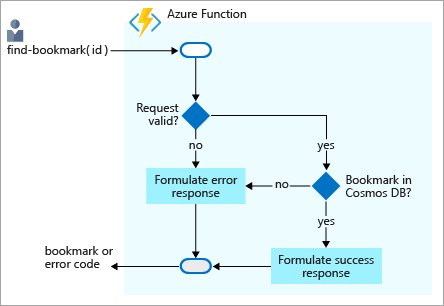
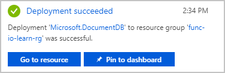
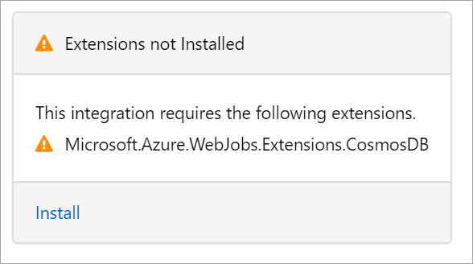

Imagine that you want to create a simple bookmark lookup service. Your service is read-only initially. If users want to find an entry, they send a request with the ID of the entry, and you return the URL. The following flowchart illustrates the flow.



When users send you a request with some text, you try to find an entry in your back-end database that contains this text as a key or ID. You return a result that indicates whether you found the entry.

When the Azure function receives a request with the bookmark ID, it first checks whether the request is valid. If not, an error response is generated. For valid requests, the function checks if the bookmark ID is present in the Azure Cosmos DB database. If it isn't present, an error response is generated. If the bookmark ID is found, a success response is generated.

You need to store the data somewhere. In this flowchart, the data store is an Azure Cosmos DB instance. But how do you connect to a database from a function and read data? In the world of functions, you configure an *input binding* for that job. Configuring a binding through the Azure portal is straightforward. As you'll see shortly, you don't have to write code for such tasks, like opening a storage connection. The Azure Functions runtime and bindings take care of those tasks for you.

## Create an Azure Cosmos DB account

> [!NOTE]
> This unit is not intended to be a tutorial on Azure Cosmos DB. After finishing this module, if you're interested in learning more, there is a complete learning path about Azure Cosmos DB.

### Create a database account

A database account is a container for managing one or more databases. Before we can create a database, we need to create a database account.

1. Make sure you are signed into the [Azure portal](https://portal.azure.com/learn.docs.microsoft.com?azure-portal=true) using the same account you activated the sandbox with.

1. On the Azure portal menu, or from the **Home** page, select **Create a resource**.

1. Select **Databases** > **Azure Cosmos DB**. You may need to search for it using the Search field.

1. In the **Create Azure Cosmos DB Account** page, enter the settings for the new Azure Cosmos DB account.

    | Property | Suggested value | Description |
    |---|---|---|
    | **Subscription** | _Concierge Subscription_ | The Azure subscription that you want to use for this Azure Cosmos DB account. |
    | **Resource Group**| _<rgn>[sandbox resource group name]</rgn>_ | This field is pre-populated with the resource group from your sandbox. |
    | **Account Name** | Globally unique name | Enter a unique name to identify this Azure Cosmos DB account. Because `documents.azure.com` is appended to the name that you provide to create your URI, use a unique but identifiable name.<br><br>The account name can contain only lowercase letters, numbers, and the hyphen (-) character, and it must contain 3 to 50 characters. |
    | **API** | _Core (SQL)_ | The API determines the type of account to create. Azure Cosmos DB provides five APIs to suit the needs of your application: SQL (document database), Gremlin (graph database), MongoDB (document database), Azure Table, and Cassandra, each of which currently require a separate account. <br><br>Select **Core (SQL)**. At this time, the Azure Cosmos DB trigger, input bindings, and output bindings only work with SQL API and Graph API accounts. |
    | **Location** | _Central US_ | Select the region nearest you. |

     Leave the default values for all of the other fields in this new account page.

1. Select **Review + create** to review and validate the configuration. A *Validation Success* appears.

1. Select **Create** to provision and deploy the database account.

1. Deployment can take some time. So, wait for a **Deployment succeeded** message in the Notification Hub before proceeding.

    

1. Select **Go to resource** to navigate to the database account in the portal. Next, we'll add a collection to the database.

### Add a container

In Azure Cosmos DB, a *container* holds arbitrary user-generated entities. Inside a container, we store documents.

Let's use the Data Explorer tool in the Azure portal to create a database and collection.

1. From the left-hand side menu, select **Data Explorer**, and then select **New Container**.

    >[!TIP]
    >The **Add Container** pane appears on the far right. To see it, you may need to scroll right.

    | Property | Suggested value | Description |
    |---|---|---|
    | **Database id** | _func-io-learn-db_ | Database names must contain from 1 through 255 characters, and they cannot contain /, \\, #, ?, or a trailing space.<br><br>You are free to enter whatever you want here, but we suggest _func-io-learn-db_ as the name for the new database, and that's what we'll refer to in this unit. |
    | **Throughput** | _1000 RU_ |Change the throughput to 1000 request units per second (RU/s). If you want to reduce latency, you can scale up the performance later. |
    | **Container id** | _Bookmarks_ | Enter _Bookmarks_ as the name for our new collection. Container IDs have the same character requirements as database names. |
    | **Partition key** | _/id_ | The partition key specifies how the documents in Azure Cosmos DB collections are distributed across logical data partitions. You'll use the `id` field as a convenience, because you're not concerned with database performance in this module. If you would like to learn more about Azure Cosmos DB partition key strategies, explore the Microsoft Learn Azure Cosmos DB modules. |

1. Select **OK**. The Data Explorer displays the new database and container. Inside the database, you've defined a container. Next, you'll add some data, also known as items.

### Add test data

You've defined a container in our database called **Bookmarks**. You want to store a URL and ID in each item, like a list of web page bookmarks.

You'll add data to the new container using Data Explorer.

1. In Data Explorer, the new database appears in the SQL API nav column. Expand the **func-io-learn-db** database, expand the **Bookmarks** collection, select **Items**, and from the menu bar, select **New Item**.

1. Replace the default content of the new item with the following JSON.

     ```json
     {
         "id": "docs",
         "url": "https://docs.microsoft.com/azure"
     }
     ```

1. After you've added the JSON to the **Items** tab, select **Save**.

    Notice that there are more properties than the ones we added. They all begin with an underline (_rid, _self, _etag, _attachments, _ts). These are properties generated by the system to help manage the document.

    | Property | Description |
    |---|---|
    | `_rid` | The resource ID is a unique identifier that is also hierarchical per the resource stack on the resource model. It is used internally for placement and navigation of the item resource. |
    | `_self` | The unique addressable URI for the resource. |
    | `_etag` | Required for optimistic concurrency control. |
    | `_attachments` | The addressable path for the attachments resource. |
    | `_ts` | The timestamp of the last update of this resource. |

1. To add a few more items into the container, at the top, select **New Item**. Create four more items with the following content. Remember to save your work.

    ```json
    {
        "id": "portal",
        "url": "https://portal.azure.com"
    }
    ```

    ```json
    {
        "id": "learn",
        "url": "https://docs.microsoft.com/learn"
    }
    ```

    ```json
    {
        "id": "marketplace",
        "url": "https://azuremarketplace.microsoft.com/marketplace/apps"
    }
    ```

    ```json
    {
        "id": "blog",
        "url": "https://azure.microsoft.com/blog"
    }
    ```

1. When you've finished, your container should look like the following.

    :::image type="content" source="../media/5-db-bookmark-coll.PNG" alt-text="Screenshot of the SQL API UI in the portal, showing the list of entries you added to your bookmarks container.":::

You now have a few entries in your **Bookmarks** container. Your scenario will work as follows. If a request arrives with, for example, "id=docs", you'll look up that ID in your bookmarks container, and return the URL `https://docs.microsoft.com/azure`. Let's make an Azure function that looks up values in this container.

## Create your function

::: zone pivot="javascript"

1. Navigate to the function app that you created in the preceding unit. Select **Home > (in recent) <name>Function App**.

1. On the left-hand side menu, select **Functions**.

1. To start the function creation process, from the top menu bar, select **Add** (**+**). The **Add function** panel appears showing the complete set of supported triggers.

1. In the **Select a template** section, select **HTTP trigger**.

1. To create your function, select **Add**. This action opens the *index.js* file in the code editor, and displays a default implementation of the HTTP-triggered function.

::: zone-end

::: zone pivot="powershell"

1. Navigate to the function app that you created in the preceding unit. Select **Home > (in recent) <name>Function App**.
	
1. On the left-hand side menu, select **Functions**.

1. To start the function creation process, at the top menu bar, select **Add** (**+**). The **Add function** panel appears showing the complete set of supported triggers.

1. Select **HTTP trigger**.

1. To create your function, select **Create**. This action opens the *run.ps1* file in the code editor, and displays a default implementation of the HTTP-triggered function.

::: zone-end

### Verify the function

You can verify what we have done so far by testing our new function as follows:

1. In your new function, at the top right, select **Get Function Url**, select **default (function key)**, and then select the *Copy to clipboard* icon at the end of the URL.

1. Paste the function URL you copied into your browser's address bar. Add the query string value `&name=<your function name>` to the end of the URL, and to execute the request, press <kbd>Enter</kbd>. You should get a response from the Azure Function in the browser.

Now that we have our skeletal function working, let's turn our attention to reading data from our Azure Cosmos DB, or in our scenario, our **Bookmarks** container.

## Add an Azure Cosmos DB input binding

To read data from the database, you need to define an input binding. As you'll see, you can configure a binding that can talk to your database in just a few steps.

1. To open the **Integration** page, in the left pane, select **Integration**. The template you used created an HTTP trigger and an HTTP output binding. Now add your new Azure Cosmos DB input binding.

1. In the **Inputs** box, select **+ Add Input**. The **Create Input** panel appears showing a list of all possible input binding types.

1. From the **Binding Type** dropdown, select **Azure Cosmos DB**. In the **Azure Cosmos DB details** section, under the **Cosmos DB account connection** dropdown, select **New**. The **New Cosmos DB connection** dialog appears. Next, you'll set up a connection to your database.

    > [!NOTE]
    > If the following message appears in the **Azure Cosmos DB input** configuration user interface prompting you to install an extension, select **Install**. It can take a while to install an extension, so before proceeding to the next step, wait for the installation to complete.

    

1. To create your connection, select **OK**.

    A new connection to the database is configured and is shown in the **Cosmos DB account connection** dropdown in the **Create Input** panel.

    > [!NOTE]
    > If you're curious about the connection endpoint, to reveal the connection string, select *show value*.

    You want to look up a bookmark with a specific ID, so let's tie an ID that we receive in the query string to the binding.

1. In the **Document ID (optional)** field, enter `{id}`.

    This syntax is known as a *binding expression*. The function is triggered by an HTTP request that uses a query string to specify the ID to look up. Because IDs are unique in our collection, the binding will return either 0 (not found) or 1 (found) documents.

1. Complete the remaining fields on this page using the values in the following table. At any time, to learn more about the purpose of each field, you can select the information icon to the right of each field name.

    | Property | Suggested value | Description |
    |---|---|---|
    | **Document parameter name** | _bookmark_ | The name used to identify this binding in your code. |
    | **Database name** | _func-io-learn-db_ | The database to work with. This value is the database name we set earlier in this lesson. |
    | **Collection Name** | _Bookmarks_ | The collection from which we'll read data. This setting was defined earlier in the lesson. |
    | **Partition key (optional)** | _{id}_ | Add the partition key that you defined when you created the _Bookmarks_ Azure Cosmos DB collection earlier. The key entered here (specified in input binding format `{<key>}`) must match the one in the collection. |
    | **SQL Query (optional)** | Leave blank | You are only retrieving one document at a time based on the ID. So, filtering with the Document ID field is a better than using a SQL Query in this instance. You could craft a SQL Query to return one entry (`SELECT * from b where b.ID = {id}`). That query would indeed return a document, but it would return it in a document collection. Your code would have to manipulate a collection unnecessarily. Use the SQL Query approach when you want to get multiple documents. |

1. To save all changes to this binding configuration, select **OK**.

Now that you have your binding defined, it's time to use it in your function.

## Update function implementation

::: zone pivot="javascript"

1. From the **Integration** page, in the **Function** box, you should see your **HTTPTrigger**. Select it. At the left hand select **Code+Test**.

1. Replace all code in the index.js with the code from the following snippet, and then select **Save**.

     ```java
    using namespace System.Net

    param($Request, $bookmark, $TriggerMetadata)

    if ($bookmark) {
        $status = [HttpStatusCode]::OK
        $body = @{ url = $bookmark.url }
	ContentType = "application/json"
    }
    else {
        $status = [HttpStatusCode]::NotFound
        $body = "No bookmarks found"
	ContentType = "text/plain"
    }

    Push-OutputBinding -Name Response -Value ([HttpResponseContext]@{
        StatusCode = $status
        Body = $body
    })
    ```

::: zone-end

::: zone pivot="powershell"

1. To select your function, select **Integration**. Under **Function**, you should see your **HTTPTrigger**. At the left hand select **Code+Test**.

1. Replace all code in the index.js with the code from the following snippet, and then select **Save**.

    ```powershell
    using namespace System.Net

    param($Request, $bookmark, $TriggerMetadata)

    if ($bookmark) {
        $status = [HttpStatusCode]::OK
        $body = @{ url = $bookmark.url }
	ContentType = "application/json"
    }
    else {
        $status = [HttpStatusCode]::NotFound
        $body = "No bookmarks found"
	ContentType = "text/plain"
    }

    Push-OutputBinding -Name Response -Value ([HttpResponseContext]@{
        StatusCode = $status
        Body = $body
    })
    ```

::: zone-end

An incoming HTTP request triggers the function, and an `id` query parameter is passed to the Azure Cosmos DB input binding. If the database finds a document that matches this ID, the `bookmark` parameter will be set to the located document. In that case, you construct a response that contains the URL value found in the bookmarked document. If no document is found matching this key, you would respond with a payload and status code that tells the user the bad news.

## Try it out

1. At the left hand select **Code + test**, select **Get function URL**, and then select **default (Function key)**. To copy the function's URL, select the *Copy to clipboard* icon.

2. Paste the function URL you copied into your browser's address bar. Add the query string value `&id=docs` to the end of this URL, and to execute the request, press <kbd>Enter</kbd>. You should see a response that includes a URL to that resource.

3. Replace `&id=docs` with `&id=missing`, and observe the response.

    >[!TIP]
    >You can also test the function using the **Test** tab in the function portal UI. You can add a query parameter or supply a request body to get the same results as described in the preceding steps.

In this unit, you created your first input binding manually to read from an Azure Cosmos DB database. The amount of code you wrote to search our database and read data was minimal, thanks to bindings. You did most of our work configuring the binding declaratively, and the platform took care of the rest.

In the next unit, you'll add more data to our bookmarks collection through an Azure Cosmos DB output binding.
