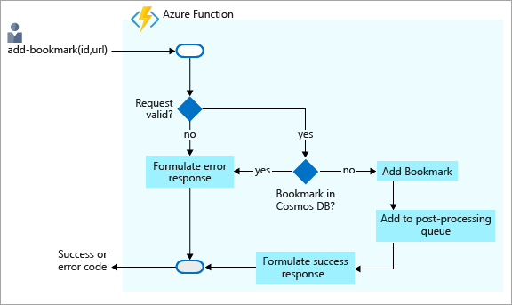
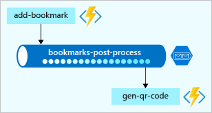
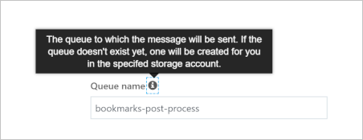
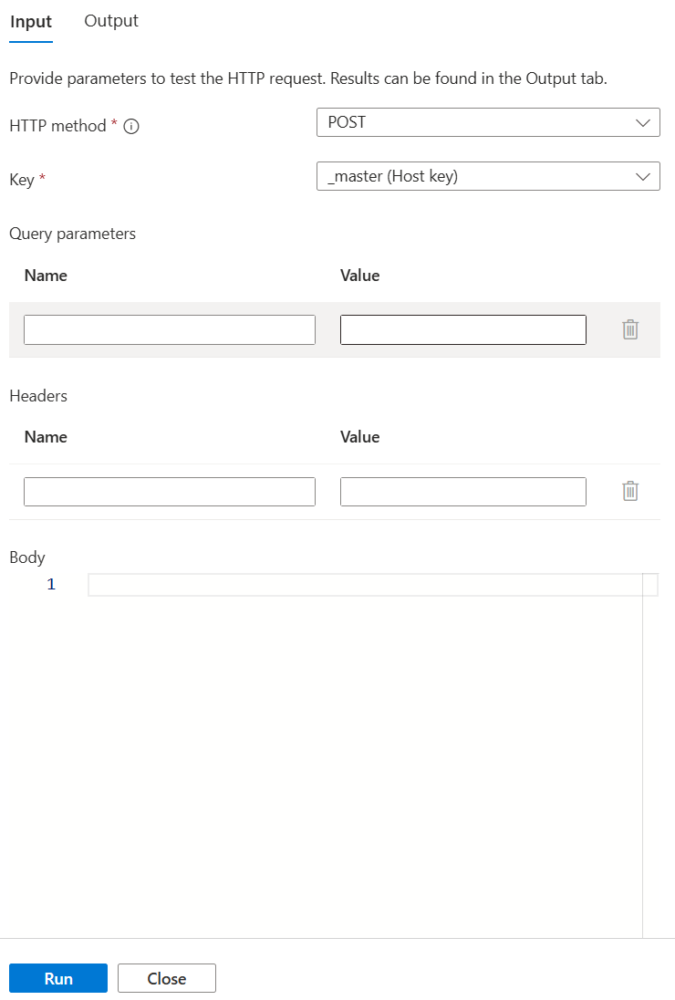
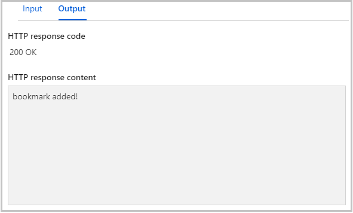
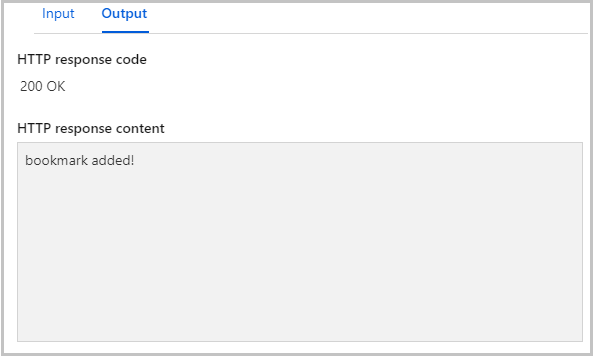
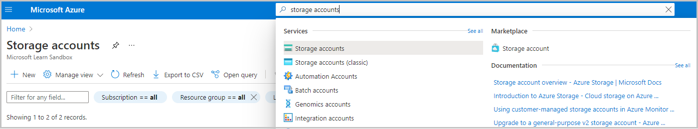
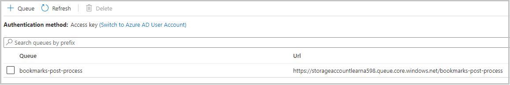

In our last exercise, we implemented a scenario to look up bookmarks in an Azure Cosmos DB database. We configured an input binding to read data from our bookmarks collection. But, we can do more. Let's expand the scenario to include writing. Consider the following flowchart:



In this scenario, we'll receive requests to add bookmarks to our collection. The requests pass in the desired key, or ID, along with the bookmark URL. As you can see in the flowchart, we'll respond with an error if the key already exists in our back end.

If the key that was passed to us is *not* found, we'll add the new bookmark to our database. We could stop there, but let's do a little more.

Notice another step in the flowchart? So far we haven't done much with the data that we receive in terms of processing. We move what we receive into a database. However, in a real solution, it is possible that we'd probably process the data in some fashion. We can decide to do all processing in the same function, but in this lab we'll show a pattern that offloads further processing to another component or piece of business logic.

What might be a good example of this offloading of work in our bookmarks scenario? Well, what if we send the new bookmark to a QR code generation service? That service would, in turn, generate a QR code for the URL, store the image in blob storage, and add the address of the QR image back into the entry in our bookmarks collection. Calling a service to generate a QR image is time consuming so, rather than wait for the result, we hand it off to a function and let it take care of this asynchronously.

Just as Azure Functions supports input bindings for various integration sources, it also has a set of output bindings templates to make it easy for you to write data to data sources. Output bindings are also configured in the *function.json* file. As you'll see in this exercise, we can configure our function to work with multiple data sources and services.

> [!IMPORTANT]
> This exercise builds on the previous one. It uses the same Azure Cosmos DB database and input binding. If you haven't worked through that unit, we recommend doing so before you proceed with this one.

## Create an HTTP-triggered function

::: zone pivot="javascript"

1. Make sure you are signed into the [Azure portal](https://portal.azure.com/learn.docs.microsoft.com?azure-portal=true) using the same account as your activated sandbox.

1. In the portal, navigate to the function app that you created in this module.

1. From the left nav bar, under the **Functions** category, select **Functions**. In the top menu bar, select **+ Add**. The **Add function** panel appears.

1. The page shows us the current set of supported triggers. Select **HTTP trigger**, and then select **Add**. This action opens the **index.js** file in the code editor and displays a default implementation of the HTTP-triggered function.

::: zone-end

::: zone pivot="powershell"

1. Make sure you are signed into the [Azure portal](https://portal.azure.com/learn.docs.microsoft.com?azure-portal=true) using the same account as your activated sandbox.

1. In the portal, navigate to the function app that you created in this module.

1. From the left nav bar, under the **Functions** category, select **Functions**. In the top menu bar, select **+ Add**. The **Add function** panel appears.

1. The page shows us the current set of supported triggers. Select **HTTP trigger**, and then select **Add**. This action opens the **index.js** file in the code editor and displays a default implementation of the HTTP-triggered function.

::: zone-end

## Add an Azure Cosmos DB input binding

Let's repeat what we did in the preceding unit to add an Azure Cosmos DB input binding.

1. In the Functions list, ensure our new function, **HttpTrigger**, is selected.

1. To open the **Integration** tab, in the left pane, select **Integrate**.

1. To display the list of all possible input binding types, in the **Inputs** column, select **Add input**.

1. In the list, select **Azure Cosmos DB**.

1. If a message appears prompting you to install the Microsoft.Azure.WebJobs.Extensions.CosmosDB extension, select **install**, and wait for it to complete.

1. The **Azure Cosmos DB account connection** field should be pre-populated with the connection you created in the previous exercise. If you do not see your connection listed,  follow these steps to create a new connection.

    1. To open the **Connection** window, where you will enter the settings for the new connection, select **new**.

You want to look up a bookmark with a specific ID, so let's tie an ID that we receive in the query string to the binding.

1. In the **Document ID** field, enter `{id}`.

    This syntax is known as a *binding expression*. The function is triggered by an HTTP request that uses a query string to specify the ID to look up. Because IDs are unique in our collection, the binding will return either 0 (not found) or 1 (found) documents.

1. Complete the remaining fields on this page using the values in the following table. At any time, you can select the information icon to the right of each field name to learn more about the purpose of each field.

    | Setting | Value | Description |
    |---|---|---|
    | **Document parameter name** | bookmark | The name used to identify this binding in your code. |
    | **Database name** | func-io-learn-db | The database to work with. This value is the database name we set earlier in this lesson. |
    | **Collection Name** | Bookmarks | The container from which we'll read data. We defined this setting was earlier in the lesson. |
    | **SQL Query (optional)** | Leave blank | We are only retrieving one item at a time based on the ID. So, filtering with the Document ID field is better than using a SQL Query in this instance. We could craft a SQL Query to return one entry (`SELECT * from b where b.ID = {id}`). That query would indeed return an item, but it would return it in a items collection. Our code would have to manipulate a collection unnecessarily. Use the SQL Query approach when you want to get multiple documents. |
    |**Document ID**| `{id}` | Add the Document id that we defined when we created the _Bookmarks_ Azure Cosmos DB container earlier.|
    | **Partition key** | `/id` | Add the partition key that we defined when we created the _Bookmarks_ Azure Cosmos DB container earlier. The key entered here (specified in input binding format `<key>`) must match the one in the container. |

1. To save all changes to this binding configuration, select **Save**.

We now have an Azure Cosmos DB input binding. It's time to add an output binding so we can write new entries to our collection.

## Add an Azure Cosmos DB output binding

1. In the Functions list, ensure our function, **add-bookmark**, is selected.

1. To open the **Integration** tab, in the left pane, select **Integrate**.

1. To display the list of all possible output binding types, in the **Outputs** column, select **Add Output**.

1. In the list, select **Azure Cosmos DB**.

1. The **Azure Cosmos DB account connection** field should be pre-populated with the connection you created when you added the Azure Cosmos DB input binding.

1. Complete the remaining fields on this page using the values in the following table. At any time, you can select the information icon to the right of each field name to learn more about the purpose of each field.

    | Setting | Value | Description |
    |---|---|---|
    | **Document parameter name** | newbookmark | The name used to identify this binding in your code. This parameter is used to write a new bookmark entry. |
    | **Database name** | func-io-learn-db | The database to work with. This value is the database name we set earlier in this lesson. |
    | **Collection Name** | Bookmarks | The container from which we'll read data. We defined the container earlier in the lesson. |
    | **Partition key** | /id | Add the partition key that we defined when we created the _Bookmarks_ Azure Cosmos DB container earlier. The key entered here (specified in input binding format `<key>`) must match the one in the container. |
    | **Collection throughput** | Leave blank | We can accept the default here. |

1. To save all changes to this binding configuration, select **Save**.

Now we have a binding to read from our collection, and one to write to it.

## Add an Azure Queue Storage output binding

Azure Queue storage is a service for storing messages that can be accessed from anywhere in the world. The size of a single message can be as much as 64 KB, and a queue can contain millions of messages - up to the total capacity of the storage account in which it is defined. The following diagram shows, at a high level, how a queue is used in our scenario:



Here, you can see that the new function, **add-bookmark**, adds messages to a queue. Another function - for example, a fictitious function called *gen-qr-code* - will pop messages from the same queue and process the request. Because we write, or *push*, messages to the queue from **add-bookmark**, we'll add a new output binding to your solution. Let's create the binding through the portal UI this time.

1. Once again, to open the **Integration** tab, in the left pane, select **Integrate**.

1. Select **Add Output** in the **Outputs** column. A list of all possible output binding types appears.

1. In the list, select **Azure Queue Storage**.

    If a message appears prompting you to install the Microsoft.Azure.WebJobs.Extensions.Storage extension, select **install** and wait for it to finish.

Next, we'll set up a storage account connection. This is where our queue will be hosted.

1. Under **Storage account connection** field, select **new**. The **Storage Account** selection pane opens.

1. When we started this module and you created your function app, a storage account was also created at that time. It's listed in this pane. You must select this storage account. The **Storage account connection** field is populated with the name of a connection.

1. Although we could keep the default values in all the other fields, let's change the following to lend more meaning to the properties:

    | Property | Old value | New value | Description |
    |---|---|---|---|
    | **Message parameter name** | outputQueueItem | newmessage | The binding property we'll use in code. |
    | **Queue name** | outqueue | bookmarks-post-process | The name of the queue where we're placing bookmarks so that they can be processed further by another function. |

1. To save your changes, select **Save**.

## Update function implementation

We now have all our bindings set up for the **add-bookmark** function. It's time to use them in our function.

::: zone pivot="javascript"

1. To open the **index.js** file in the code editor, select your function, **HttpTrigger**, and then select **Test/Run**.

1. Replace all the code in the *index.js* file with the code from the following snippet, and then select **Save**.

   [!code-javascript[](../code/add-bookmark.js)]

Let's break down what this code does:

* Because this function changes our data, we expect the HTTP request to be a POST, and the bookmark data to be part of the request body.
* Our Azure Cosmos DB input binding attempts to retrieve a document, or bookmark, by using the `id` that we receive. If it finds an entry, the `bookmark` object will be set. The `if(bookmark)` condition checks to see whether an entry was found.
* Adding to the database is as simple as setting the `context.bindings.newbookmark` binding parameter to the new bookmark entry, which we have created as a JSON string.
* Posting a message to our queue is as simple as setting the `context.bindings.newmessage` parameter.

> [!NOTE]
> The only task you performed was to create a queue binding. You never created the queue explicitly. You are witnessing the power of bindings! As the following notification declares, the queue is automatically created for you if it doesn't exist.



So, that's it. Let's see our work in action in the next section.

::: zone-end

::: zone pivot="powershell"

1. To open the **run.ps1** file in the code editor, select your function, **HttpTrigger**.

1. Replace all the code in the *run.ps1* file with the code from the following snippet, and then select **Save**.

    ```powershell
    using namespace System.Net

    param($Request, $bookmark, $TriggerMetadata)

    if ($bookmark) {
        $status = 422
        $body = "Bookmark already exists."
    }
    else {
        $newBookmark = @{ id = $Request.Body.id; url = $Request.Body.url }

        Push-OutputBinding -Name newbookmark -Value $newBookmark

        Push-OutputBinding -Name newmessage -Value $newBookmark

        $status = [HttpStatusCode]::OK
        $body = "bookmark added!"
    }

    Push-OutputBinding -Name Response -Value ([HttpResponseContext]@{
        StatusCode = $status
        Body = $body
        ContentType = "application/json"
    })
    ```

Let's break down what this code does:

* Because this function changes our data, we expect the HTTP request to be a POST, and the bookmark data to be part of the request body.
* Our Azure Cosmos DB input binding attempts to retrieve a document, or bookmark, by using the `id` that we receive. If it finds an entry, the `bookmark` object will be set. The `if ($bookmark)` condition checks to see whether an entry was found.
* Adding to the database is as simple as calling `Push-OutputBinding` with the name of the Cosmos DB output binding (`newbookmark`) and the value of the `$newBookmark` object.
* Posting a message to our queue is as simple as calling `Push-OutputBinding` with the name of the queue output binding (`newmessage`) and the value of the `$newBookmark` object.

> [!NOTE]
> The only task you performed was to create a queue binding. You never created the queue explicitly. You are witnessing the power of bindings! As the following notification declares, the queue is automatically created for you if it doesn't exist.


So, that's it. Let's see our work in action in the next section.

::: zone-end

## Try it out

Now that we have multiple output bindings, testing becomes a little trickier. In previous units, we were content to test by sending an HTTP request and a query string, but we'll want to perform an HTTP post this time. We also need to check to see whether messages are making it into a queue.

1. With our function, **add-bookmark**, selected in the Function Apps portal, select the **Test** menu item at the far right to expand it.

1. Select the **Test/Run** menu item, and verify that you have the test pane open. The following image shows what it should look like:

    

    > [!IMPORTANT]
    > Ensure that **POST** is selected in the HTTP method dropdown.

1. Replace the content of the request body with the following JSON payload:

    ```json
    {
        "id": "docs",
        "url": "https://docs.microsoft.com/azure"
    }
    ```

1. At the bottom of the test pane, select **Run**.

1. Verify that the **Output** window displays the "Bookmark already exists" message, as shown in the following image.

    

1. Replace the request body with the following payload:

    ```json
    {
        "id": "github",
        "url": "https://www.github.com"
    }
    ```

1. At the bottom of the test pane, select **Run**.

1. Verify the that *Output* box displays the "bookmark added" message as shown in the following image.

    

Congratulations! The **add-bookmark** works as designed, but what about that queue operation we had in the code? Well, let's go see whether something was written to a queue.

### Verify that a message is written to the queue

Azure Queue Storage queues are hosted in a storage account. You already selected the storage account in this exercise when you created the output binding.

1. In the main search box in the Azure portal, enter **storage accounts**, and in the results list, under **Services**, select **Storage accounts**.

    

1. In the list of storage accounts that are returned, select the storage account that you used to create the **newmessage** output binding. The storage account settings appear in the main window of the portal.

1. In the **Services** list in the middle of the page, select the **Queues** item. A list of queues hosted by this storage account appears. Verify that the **bookmarks-post-process** queue exists, as shown in the following image.

    

1. To open the queue, select **bookmarks-post-process**. The messages that are in the queue appear in a list. If all went according to plan, the queue includes the message that you posted when you added a bookmark to the database. It should look like the following.

    

    In this example, you can see that the message was given a unique ID, and the **MESSAGE TEXT** field displays your bookmark in JSON string format.

1. You can test the function further by changing the request body in the test pane with new id/url sets and running the function. Watch this queue to see more messages arrive. You can also look at the database to verify that new entries have been added.

In this exercise, we expanded your knowledge of bindings to output bindings, writing data to your Azure Cosmos DB. We went further and added another output binding to post messages to an Azure queue. This demonstrates the true power of bindings to help you shape and move data from incoming sources to a variety of destinations. We haven't written any database code or had to manage connection strings ourselves. Instead, we configured bindings declaratively and let the platform take care of securing connections, scaling our function, and scaling our connections.
