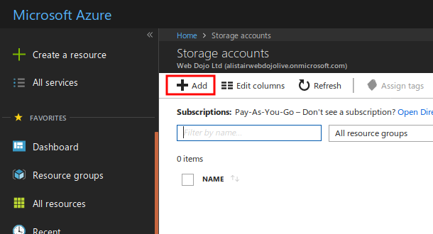
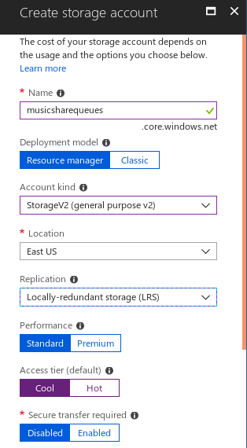
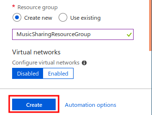
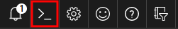

## Exercise: Install Azure PowerShell

In this exercise, you will create a new Storage Account in your Azure subscription. You will then use the Azure Cloud Shell to create a new queue, add a message to it, and then read that message and remove it from the queue.

These are the same actions taken by components in a distributed application. For example, a mobile app may add a message to a queue, where it waits for a web service to retrieve it and process it.

## Create a Storage Account

Since Storage queues are part of Azure general purpose Storage accounts. You must start by creating a Storage account:

1. In a browser, navigate to the [Azure Portal](http://portal.azure.com) and log on with your normal credentials.
1. In the top left, click **All services**.
1. Scroll down to the **Storage** section, and then click **Storage accounts**.
1. At the top left of the **Storage accounts** blade, click **Add**.

    

1. In the **Name** text box, type a unique name for the storage account.
1. Under **Deployment model**, ensure that **Resource manager** is selected.
1. In the **Account kind** drop-down list, select **Storage (general purpose v2)**.
1. In the **Location** drop-down list, select a region near you.
1. In the **Replication** drop-down list, select **Locally-redundant storage (LRS)**.
1. Under **Performance**, select **Standard**.
1. Under **Access tier**, select **Cool**.
1. Under **Secure transfer required** select, **Disabled**.
1. Under **Subscription**, select your subscription.

    

1. Under **Resource group** select **Create new**, and then in the textbox type **MusicSharingResourceGroup**.
1. Under **Virtual networks** select **Disabled** and then click **Create**.

    

Azure creates the new storage account and the new resource group.

## Create a Queue

Now that the Storage Account has been created, you can add a new queue to it. You must create the queue by using PowerShell commands:

1. In the top right of the portal, click the **Cloud Shell** link.

    

1. In the **Welcome to Azure Cloud Shell** screen, click **PowerShell (Linux)**.
1. If the **You have no storage mounted** screen appears, click **Create storage**.
1. When the `PS Azure` prompt appears, to obtain the storage account, type the following command, substituting `<storageaccountname>` with the unique name of your storage account, and then press Enter:

    ```powershell
    $storageaccount = Get-AzureRmStorageAccount -Name <storageaccountname> -ResourceGroup  MusicSharingResourceGroup
    ```

1. To obtain the context of the storage account, type the following command and then press Enter:

    ```powershell
    $context = $storageaccount.Context
    ```

1. To create a new queue, type the following command and then press Enter:

    ```powershell
    $messageQueue = New-AzureStorageQueue -Name musicsharingmessages -Context $context
    ```

## Add a Message to the Queue

Now that you have created a queue in the storage account, you can add a message to it.

1. To create a new message, type the following command and then press Enter:

    ```powershell
    $newSongMessage = New-Object -TypeName Microsoft.WindowsAzure.Storage.Queue.CloudQueueMessage -ArgumentList "A new song has been added."
    ```

1. To add the new message to the new queue, type the following command and then press Enter:

    ```powershell
    $messageQueue.CloudQueue.AddMessageAsync($newSongMessage)
    ```

1. In the Azure Portal, in the navigation on the left, click **All resources**.
1. In the list of resources, click the storage account you created earlier.
1. In the storage account blade, click **Storage Explorer (Preview)**.
1. In the Storage Explorer, under **QUEUES**, click **musicsharingmessages**. The Storage Explorer displays the message you just added.

## Retrieve and Remove the Message

A destination component for a message in a Storage queue, must retrieve the message at the front of the queue, process it, and then delete it from the queue so that other components do not retrieve it:

1. In the Azure Cloud Shell, to get the message at the front of the queue, type the following command and then press Enter:

    ```powershell
    $retrievedMessage = $messageQueue.CloudQueue.GetMessageAsync().Result
    ```

1. To display the message, type the following command and then press Enter:

    ```powershell
    $retrievedMessage.AsString
    ```

1. To display all the properties of the message, type the following command and then press Enter:

    ```powershell
    $retrievedMessage
    ```

1. To remove the message from the queue, type the following command and then press Enter:

    ```powershell
    $messageQueue.CloudQueue.DeleteMessageAsync($retrievedMessage)
    ```

1. In the Azure Portal, to refresh the queue display, in the Storage Account blade, click **Overview** and then click **Storage Explorer**.
1. Under **QUEUES**, click **musicsharingmessages**. The Storage Explorer shows that the queue is empty because you removed the only message.

## Summary

Here, you created a Storage Account in your Azure subscription and created a new queue in it. You also used PowerShell to simulate the actions of distributed application components by adding a message to the queue and then retrieving and removing it.

Azure Storage Account queues are a good solution when you want to pass messages between the components of a distributed application. Do not choose Storage queues when you want to publish events.