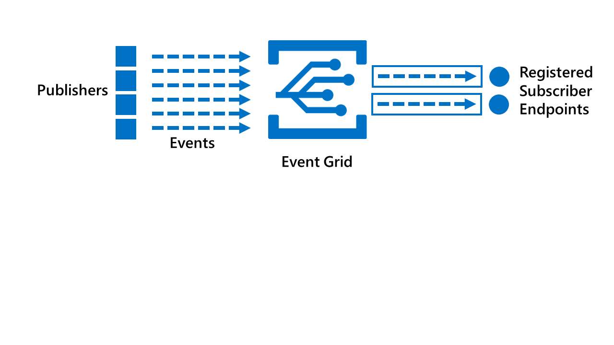
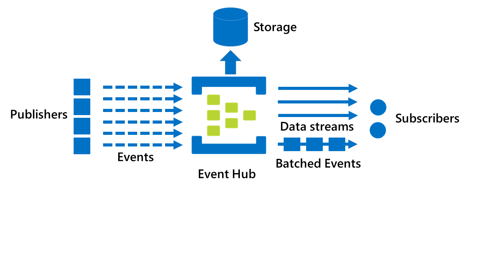

## Azure Event Hubs

Azure Event Hubs provide you with powerful tools for reliably processing and storing potentially millions of events and messages per second. Event Hubs connect publisher and subscriber applications, and provide those applications with a durable messaging system that allows for queueing, interruptions, replaying, and starting/stopping without any data loss.

In this unit, you'll look at the key features in Azure Event Hubs, and compare Event Hubs with Event Grids.

## Learning objectives

By the end of this unit, you will be able to:

* List the main features of Azure Event Hubs.
* Compare Event Grids and Event Hubs.
* Describe scalability in Event Hubs.
* Describe "At least once delivery" in Event Grids and Event Hubs.

## Key features of Azure Event Hubs

If you have devices and applications that generate large data streams, you do not want the producers of the data to be throttled if the receivers or consumers of that data cannot process the data quickly enough; in other words, the entities that produce the data need to be decoupled in some way from those entities that are consuming the events. Azure Event Hubs connect event publishers and event consumers, but not so tightly that the production of an event stream is directly coupled to the event's consumption.

The key features of an Event Hub are:

* **Event producers**. Producers send data to an event hub.
* **Partitions**. Partitions enable message streams to be split into separate storage objects, so that consuming services can read specific subsets. The number of partitions is fixed when you create an Event Hub.
* **Consumer groups**. Consumer groups enable multiple consumer applications to process an event stream independently, and without affecting other applications.
* **Throughput units**. A throughput unit is the a unit of capacity for an Event Hub.
* **Event receivers**. Receivers read event data from an event hub, as soon as the data becomes available.

Azure Event Hubs provide similar functions to Azure Event Grids, but they are not the same.

**Event Grids** are all about event-driven, reactive scenarios. In the publish-subscribe model used by Event Grids, a device or application publishes events, and a receiving application (or subscriber) ingests some or all of those events; subscribers do not have to process all the published events. By using Event Grids, events are automatically sent to registered **subscriber endpoints**. A key feature of Event Grids is that the event does not include extensive data; rather, it is a message indicating that something has changed, and a trigger for a service or application to react to such changes (which could include retrieving the actual data). Event grids provide an easy to configure serverless solutions for event handling, where it is the _reaction_ to an event that is the priority.
    

By contrast, **Event Hubs** do support data pipelines and event stream data, particularly in telemetry scenarios; and potentially deliver the actual data object that was updated. Event Hubs are capable of capturing, retaining, and replaying such data, which can come from multiple concurrent sources, and making it available to stream-processing and analytics applications, as either data streams or bundled event batches. Event Hubs can receive and process millions of events per second, and with low latency, and data can be optionally captured and saved to Azure Blob Storage or Azure Data Lake stores. Event Hubs are more scalable than Event Grids, and because hubs support data streams, are better suited to big data applications.
    

## Real-time event processing and scalability

Partitioning is what enables Event Hubs to process events in real time and at scale. Multiple consumers can each be allocated the task of reading data from one or more Event Hubs partitions. This approach removes potential contention bottlenecks and allows for independent parallel processing paths from publishers to consumers.

The basic unit of Event Hub capacity is the throughput unit. One throughput unit represents 1 MB per second of inbound data and 2 MB per second of outbound data. Standard event hubs can be configured with 1-20 throughput units. The number of throughput unit is fixed when you create an Event Hub. However, the **Auto-inflate** feature enables you to configure an Event Hub with the minimum required throughput units, and then scale automatically up to a maximum upper limit of throughput units that your consuming service is likely to need.

## At least once delivery

Event Grids and Event Hubs both support "at least once" transfers where the sender can be assured that the event or message has been stored and accepted. In Event Grids, events are immediately sent to each subscription's registered webhook. If a webhook does not acknowledge receipt of an event within 60 seconds of the first delivery attempt, the Event Grid retries delivery of the event.

For Event Hubs, using the EventProcessorHost method, send and receive tracking is enabled by using checkpoints. A checkpoint is a location, or offset, in a partition and consumer group, up to which point all messages have currently been processed. It is important to note that not every message is checkpointed; instead, the consuming application is responsible for periodic checkpointing, by writing partition-specific information (the offset) to a storage account using a JSON file. By using checkpoints, if a consumer must restart reading, it will not start at the beginning of the stream.

## Summary

You have now looked at Event Hubs, and by comparing Event Hubs to Event Grids, should now be able to determine which of these event processing solutions is appropriate in your own event scenarios.