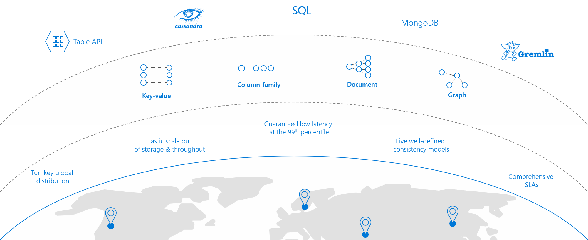

Azure Cosmos DB is a globally distributed and elastically scalable database. It has a guaranteed low latency that is backed by a comprehensive set of Service Level Agreements (SLAs). Consistency can sometimes be an issue when you are working with distributed systems, but Azure Cosmos DB alleviates this situation by offering you five different consistency levels: *strong*, *bounded staleness*, *session*, *consistent prefix*, and *eventual*.

All of the above is supported by a multi-model Azure Cosmos DB's approach, which provides you with the ability to use document, key-value, wide-column, or graph-based data.

The final choice you have is how to access and manipulate your data. Azure Cosmos DB was built to support multiple different models, and you can continue to use industry standard APIs if they are already part of your application or database design.

This flexibility means that Azure Cosmos DB can be used as the database in all of the components that are being designed for your project.

In this unit you'll discover, at a High Level, what each of the API choices are, and how they might be used. In the following units, you'll see scenarios where each of the API choices will be applicable.

## Core (SQL) API

:::row:::
  :::column span="3":::
Core (SQL) is the default API for Azure Cosmos DB, which provides you with a view of your data that resembles a traditional NoSQL document store. You can query the hierarchical JSON documents with a SQL-like language. Core (SQL) uses JavaScript's type system, expression evaluation, and function invocation.
  :::column-end:::
  :::column:::
:::image type="icon" border="false" source="../media/core-api.png":::
  :::column-end:::
:::row-end:::

For your company's e-commerce website, you could choose to use Core (SQL) to store your product catalog. For example, a sample data entry could look like this:

```json
{
    "id": "cc410485-e177-4cbf-95e1-708f7d5e9297",
    "productName": "Industrial Saw",
    "description": "Cuts through anything",
    "supplier": "Hammer & Nail Inc",
    "quantity": 261,
    "unitCost": "$10.47",
    "retailPrice": "$29.99",
    "categories" : [
        {"name": "hammers"},
        {"name": "hand tools"}
    ]
}
```

To retrieve a product's name, you could use this SQL command:

```sql
SELECT c.productName FROM Items c
```

For developers who have experience with the SQL query language, Core (SQL) provides several familiar SQL statements and clauses; for example:

- SELECT
- FROM
- WHERE
- BETWEEN
- COUNT
- SUM
- MIN
- MAX
- ORDER BY

## MongoDB API

:::row:::
  :::column span="3":::
Azure Cosmos DB's API for MongoDB supports the MongoDB wire protocol. This API allows existing MongoDB client SDKs, drivers, and tools to interact with the data transparently, as if they are running against an actual MongoDB database. The data is stored in document format, which is the same as using Core (SQL). Azure Cosmos DB's API for MongoDB is currently compatible with 3.2 version of the MongoDB wire protocol.
  :::column-end:::
  :::column:::
:::image type="icon" border="false" source="../media/mongo-api.png":::
  :::column-end:::
:::row-end:::

Using the same JSON document example from earlier, your MongoDB query could look like this:

```javascript
db.Items.find({},{productName:1,_id:0})
```

## Cassandra API

:::row:::
  :::column span="3":::
Azure Cosmos DB's support for the Cassandra API makes it possible to query data by using the Cassandra Query Language (CQL), and your data will appear to be a partitioned row store. Just like the MongoDB API, any clients or tools should be able to connect transparently to Azure Cosmos DB; only your connection settings should need to be updated. Cosmos DB's Cassandra API currently supports version 4 of the CQL wire protocol.
  :::column-end:::
  :::column:::
:::image type="icon" border="false" source="../media/../media/cassandra-api.png":::
  :::column-end:::
:::row-end:::

For developers who have experience with the CQL query language, Azure Cosmos DB provides several familiar CQL statements and clauses; for example:

- CREATE KEYSPACE
- CREATE TABLE
- ALTER TABLE
- USE
- INSERT
- SELECT
- UPDATE
- BATCH (Only unlogged commands are supported)
- DELETE

To create a table that would store the JSON information listed earlier, you might use the following syntax:

```sql
CREATE TABLE Catalog.Items(id text, productName text, description text, supplier text, quantity int, unitCost float, retailPrice float, categories map<text,text>, primary key (id));
```

To retrieve a product's name, you could use this CQL command:

```sql
SELECT id, productName FROM catalog.items
```

## Azure Table API

:::row:::
  :::column span="3":::
Azure Cosmos DB's Azure Table API provides support for applications that are written for Azure Table Storage that need premium capabilities like global distribution, high availability, scalable throughput. The original Table API only allows for indexing on the Partition and Row keys; there are no secondary indexes. Storing table data in Cosmos DB automatically indexes all the properties, and requires no index management.
  :::column-end:::
  :::column:::
:::image type="icon" border="false" source="../media/../media/table-api.png":::
  :::column-end:::
:::row-end:::

Querying is accomplished by using OData and LINQ queries in code, and the original REST API for GET operations.

To retrieve a product's name, you could use this SQL command within a stored procedure or user-defined function:

```sql
SELECT i.productName FROM Items i
```

## Gremlin (graph) API

:::row:::
  :::column span="3":::
Choosing Gremlin as the API provides a graph-based view over the data. Remember that at the lowest level, all data in any Azure Cosmos DB is stored in an ARS format. A graph-based view on the database means data is either a vertex (which is an individual item in the database), or an edge (which is a relationship between items in the database).
  :::column-end:::
  :::column:::
:::image type="icon" border="false" source="../media/../media/graph-api.png":::
  :::column-end:::
:::row-end:::

You typically use a traversal language to query a graph database, and Azure Cosmos DB supports Apache Tinkerpop's Gremlin language. For example, you could use the following commands to add three vertices for product and two edges for related-purchases to a graph:

```
g.addV('product').property('productName', 'Industrial Saw').property('description', 'Cuts through anything').property('quantity', 261)
g.addV('product').property('productName', 'Belt Sander').property('description', 'Smoothes rough edges').property('quantity', 312)
g.addV('product').property('productName', 'Cordless Drill').property('description', 'Bores holes').property('quantity', 647)

g.V().hasLabel('product').has('productName', 'Industrial Saw').addE('boughtWith').to(g.V().hasLabel('product').has('productName', 'Belt Sander'))
g.V().hasLabel('product').has('productName', 'Industrial Saw').addE('boughtWith').to(g.V().hasLabel('product').has('productName', 'Cordless Drill'))
```

Once your data has been stored in your graph, you can query based on vertices or edges. For example, the following query will display the additional products that were purchased along with the industrial saw:

```
g.V().hasLabel('product').has('productName', 'Industrial Saw').outE('boughtWith')
```

Results will be returned in GraphSON format, which looks like this:

```json
[
  {
    "id": "6c69fba7-2f76-421f-a24e-92d4b8295d67",
    "label": "boughtWith",
    "type": "edge",
    "inVLabel": "product",
    "outVLabel": "product",
    "inV": "faaf0997-f5d8-4d01-a527-ae29534ac234",
    "outV": "a9b13b8f-258f-4148-99c0-f71b30918146"
  },
  {
    "id": "946e81a9-8cfa-4303-a999-9be3d67176d5",
    "label": "boughtWith",
    "type": "edge",
    "inVLabel": "product",
    "outVLabel": "product",
    "inV": "82e1556e-f038-4d7a-a02a-f780a2b7215c",
    "outV": "a9b13b8f-258f-4148-99c0-f71b30918146"
  }
]
```
This kind of graph might be useful when you are creating a product recommendation application for an e-commerce website, or you could return detailed information for each of the related purchases by using the following query:

```
g.V().hasLabel('product').has('productName', 'Industrial Saw').outE('boughtWith').inV().hasLabel('product')
```
