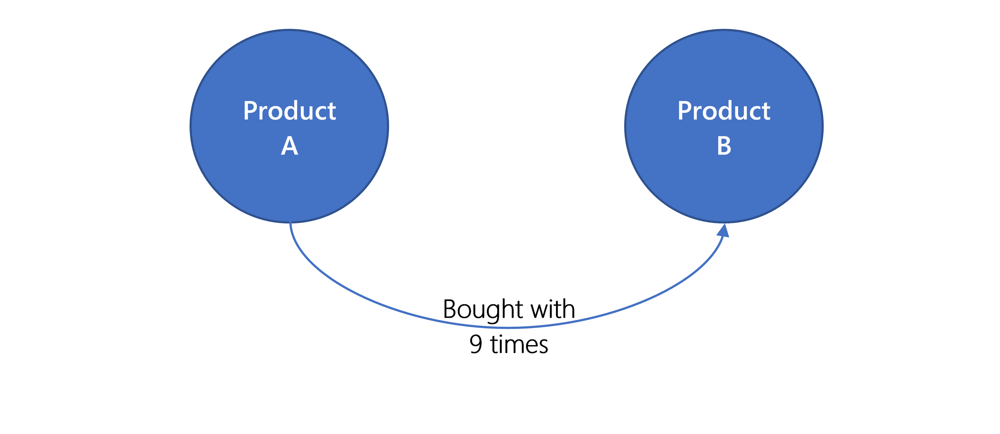

The marketing team wants to be able to offer additional product recommendations while customers are browsing products on your e-commerce site. For example, the team would like to provide suggestions like, "people who bought this product also bought that product", and "people who viewed this product also are viewing that product." The products that are recommended first should be your most popular products, therefore a method needs to be provided that will enable ranking the relationships between products.

## Problem analysis

The data store needs to be able to assign weight values to the relationships between products. For example, you might store a count of the number of times that a relationship occurs. With that in mind, each time that a person buys "Product A" and "Product B", the relationship link between these two products needs to be incremented. This relationship counter is meta-data that needs to be stored in a database.

## Recommended API: Gremlin

A graph database is the perfect fit to model this kind of data. Gremlin, the graph query language, will support the marketing department's requirements.

## Why not any of the other APIs?

Using the decision matrix from earlier in this learning module, you can see why the other APIs are not a good solution for this scenario:

| API | Description |
|---|---|
| **Core (SQL)** | It would be possible to model the relationship data in a SQL database; however, the lack of native queries that can answer the question, "How is this item related to that item?" means that this API isn't the best choice. |
| **MongoDB** | This API would not be a good choice; Graph API is the best choice due to the nature of this scenario. |
| **Cassandra** | This API would not be a good choice; Graph API is the best choice due to the nature of this scenario. |
| **Azure Table** | This API would not be a good choice; Graph API is the best choice due to the nature of this scenario. |
