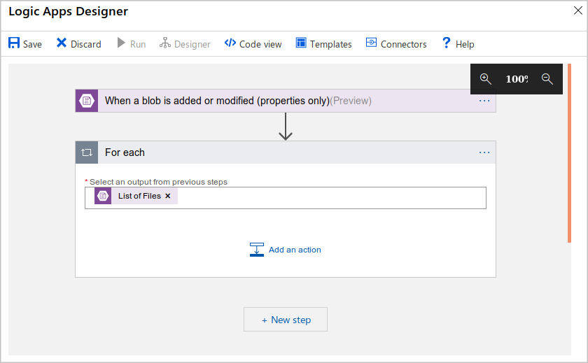
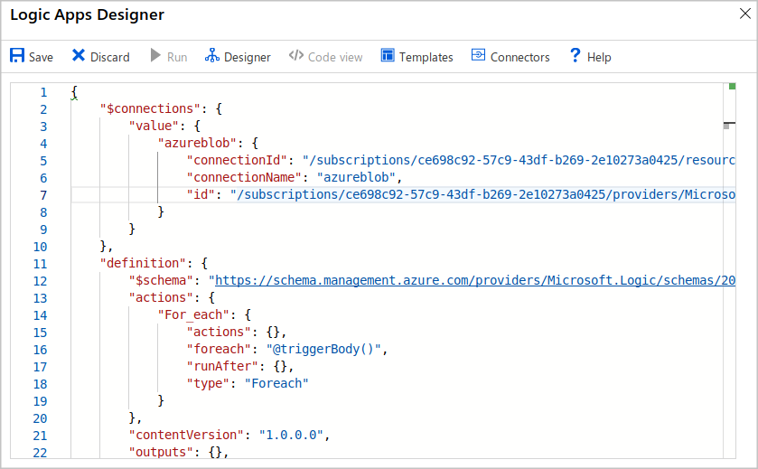
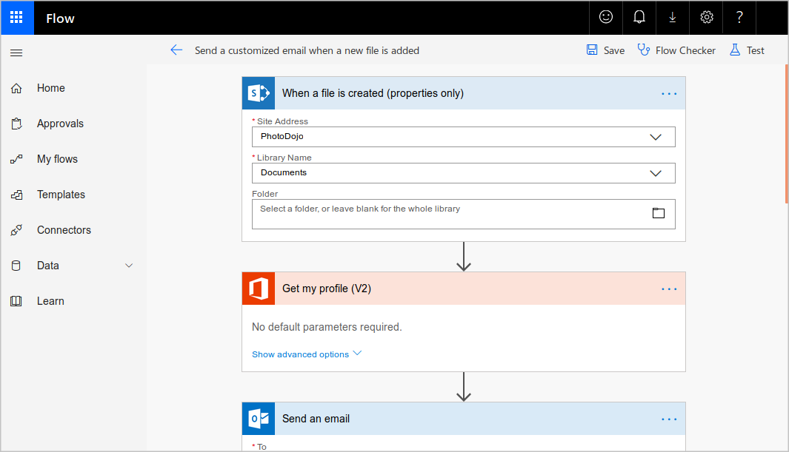

You don't have much time to get business processes properly integrated between your existing bike rental system and the system in use in the second campus. You'd like to make the most of your existing Azure expertise and you've read that Azure includes several different technologies that you can use to solve problems like this.

In this unit, we'll explore the Azure technology options that are available to automate and integrate your business processes.

## Common business issues

In business, one way to guarantee high-quality products and service to customers is to design and implement strict business processes. Such processes may involve multiple steps, people, and software packages. Each process may run in a simple line of activities that workers perform one after the other or they may branch or loop. Each process may also run quickly or take days or weeks to complete.

A business frequently runs into issues when it merges with a second business or integrates with a partner organization. How can administrators integrate the separate processes used in the two organizations, which may have been implemented using different software?

Business processes modeled in software are often called *workflows*. Azure includes four different technologies that you can use to build and implement workflows that integrate multiple systems:

- Logic Apps
- Microsoft Power Automate
- WebJobs
- Azure Functions

These four technologies have some similarities. For example:

- They can all accept **inputs**. An input is a piece of data or a file that is supplied to the workflow.
- They can all run **actions**. An action is a simple operation that the workflow runs and may often modify data or cause another action to be performed.
- They can all include **conditions**. A condition is a test, often run against an input, that may decide which action to run next.
- They can all produce **outputs**. An output is a piece of data or a file that is created by the workflow.

In addition, workflows created with these technologies can either start based on a schedule or they can be triggered by some external event.

## Design-first technologies

When business analysts discuss and plan a business process, they may draw a flow diagram on paper. With Logic Apps and Microsoft Power Automate, you can take a similar approach to designing a workflow. They both include user interfaces where you can draw out the workflow. We call this approach a *design-first* approach.

### Logic Apps

:::image type="icon" border="false" source="../media/2-logic-apps-logo.png":::

[Logic Apps](https://azure.microsoft.com/services/logic-apps/) is a service within Azure to automate, orchestrate, and integrate disparate components of a distributed application. By using the design-first approach in Logic Apps, you can draw out complex workflows that model complex business processes. The following screenshot shows the Logic Apps Designer and design canvas that you use to define your workflow.

Alternatively, if you prefer to work in code, you can create or edit a workflow in JSON notation by using the code view, as illustrated in the following screenshot.

One reason why Logic Apps is so good at integration is that [over 200 connectors are included](/connectors/connector-reference/). A *connector* is a Logic Apps component that provides an interface to an external service. For example, the [X connector](/connectors/twitter/) allows you to send and retrieve short posts, while the [Office 365 Outlook connector](/connectors/office365/) lets you manage your email, calendar, and contacts. Logic Apps provides hundreds of pre-built connectors that you can use to create your apps. If you have an unusual or unique system that you want to call from Logic Apps, you can [create your own connector](/connectors/custom-connectors/) if your system exposes a REST API.

### Microsoft Power Automate

:::image type="icon" border="false" source="../media/2-microsoft-flow-logo.png":::

Microsoft [Power Automate](https://flow.microsoft.com/) is a service to create workflows even when you have no development or IT Pro experience. You can create workflows that integrate and orchestrate many different components by using the website or the Microsoft [Power Automate mobile app](/power-automate/mobile/overview-mobile).

There are four different types of flow that you can create:

- **Automated**: Starts by a trigger from some event. For example, the event could be the arrival of a new short post or a new file being uploaded.
- **Button**: Runs a repetitive task with a single click from your mobile device.
- **Scheduled**: Runs regularly. For example, once a week, on a specific date, or after 10 hours.
- **Business process**: Models a business process such as the stock ordering process or the complaints procedure. The flow process can have: notifications to required people; with their approval recorded; calendar dates for steps; and recorded time of flow steps.

Microsoft Power Automate provides an easy-to-use design surface to create these types of flows. As the following screenshot illustrates, the flow designer makes it easy to design and lay out your process.

Under the hood, Microsoft Power Automate is built on Logic Apps. This fact means that Power Automate [supports the same range of connectors and actions](https://flow.microsoft.com/connectors/) as Logic Apps. You can also use [custom connectors](/power-automate/get-started-flow-dev) in Microsoft Power Automate.

### Design-first technologies compared

As you can see from the following table, Microsoft Power Automate is more appropriate for use by non-technical staff. If your workflow designers are IT professionals, developers, or DevOps practitioners, Logic Apps is usually a better fit:

| | Microsoft Power Automate| Logic Apps |
| -- | -- | -- |
| **Intended users** | Office workers and business analysts | Developers and IT pros |
| **Intended scenarios** | Self-service workflow creation | Advanced integration projects |
| **Design tools** | GUI only. Browser and mobile app | Browser and Visual Studio designer. Code editing is possible |
| **Application Lifecycle Management** | Power Automate includes testing and production environments | Logic Apps source code can be included in Azure DevOps and source code management systems |

## Code-first technologies

The developers on your team will likely prefer to write code when they want to orchestrate and integrate different business applications into a single workflow. This is the case when you need more control over the performance of your workflow or need to write custom code as part of the business process. For such people, Azure includes WebJobs and Functions.

### WebJobs and the WebJobs SDK

:::image type="icon" border="false" source="../media/2-azure-webjobs-logo.png":::

The [Azure App Service](https://azure.microsoft.com/services/app-service/) is a cloud-based hosting service for web applications, mobile back-ends, and RESTful APIs. These applications often need to perform some kind of background task. For example, in your bike rental system, when a user uploads a photo of a bike, you may need to generate a smaller thumbnail photograph.

[WebJobs](/azure/app-service/webjobs-create) are a part of the Azure App Service that you can use to run a program or script automatically. There are two kinds of WebJob:

- **Continuous.** Starts immediately when the WebJob is created and runs in a continuous loop. For example, you could use a continuous WebJob to check a shared folder for a new photo.
- **Triggered.** Starts based on a binding event, on a schedule, or when you trigger it manually (on demand).

To determine what actions your WebJob takes, you can write code in several different languages. For example, you can script the WebJob by writing code in a Shell Script (Windows, PowerShell, Bash). Alternatively, you can write a program in PHP, Python, Java, or JavaScript.

You can also program a WebJob by using .NET and a .NET language such as C# or VB.NET. In this case, you can also use the WebJobs SDK to make the task easier. The SDK includes a range of classes, such as `JobHostConfiguration` and `HostBuilder`, which reduce the amount of code required to interact with the Azure App Service.

The WebJobs SDK only supports C# and the NuGet package manager.

### Azure Functions

:::image type="icon" border="false" source="../media/2-azure-functions-logo.png":::

An [Azure Function](https://azure.microsoft.com/services/functions/) is a simple way for you to run small pieces of code in the cloud, without having to worry about the infrastructure required to host that code. You can write the Function in C#, Java, JavaScript, PowerShell, Python, or any of the languages that are listed in the [Supported languages in Azure Functions](/azure/azure-functions/supported-languages) article. In addition, with the consumption plan option, you only pay for the time when the code runs. Azure automatically scales your function in response to the demand from users.

When you create an Azure Function, you can start by writing the code for it in the portal. Alternatively, if you need source code management, you can use GitHub or Azure DevOps Services.

To create an Azure Function, choose from the range of templates. The following list is a sample of some of the templates available to you:

- **HTTP trigger**. When you want the code to execute in response to a request sent through the HTTP protocol.
- **Timer trigger**. When you want the code to execute according to a schedule.
- **Blob storage trigger**. When you want the code to execute when a new blob is added to an Azure Storage account.
- **Cosmos DB trigger**. When you want the code to execute in response to new or updated documents in a NoSQL database.

Azure Functions can integrate with many different services both within Azure and from third parties. These services can trigger your function, or send data input to your function, or receive data output from your function.

### Code-first technologies compared

In most cases, the simple administration and more flexible coding model provided by Azure Functions may lead you to choose them in preference to WebJobs. However, you might choose WebJobs for the following reasons:

- You want the code to be a part of an existing App Service application and to be managed as part of that application, for example in the same Azure DevOps environment.
- You need close control over the object that listens for events that trigger the code. This object in question is the `JobHost` class, and you have more flexibility to modify its behavior in WebJobs.

| | Azure WebJobs | Azure Functions |
| -- | --| -- |
| **Supported languages** | C# if you're using the WebJobs SDK | C#, Java, JavaScript, PowerShell, and more |
| **Automatic scaling** | No | Yes |
| **Development and testing in a browser** | No | Yes |
| **Pay-per-use pricing** | No | Yes |
| **Integration with Logic Apps** | No | Yes |
| **Package managers** | NuGet if you're using the WebJobs SDK | NuGet and NPM |
| **Can be part of an App Service application** | Yes | Yes (hosted under App Service plan) |
| **Provides close control of `JobHost`** | Yes | No |

Now that you know what design-first and code-first technologies are available to you, how do you narrow your choices? We'll look at this question in the next unit.
