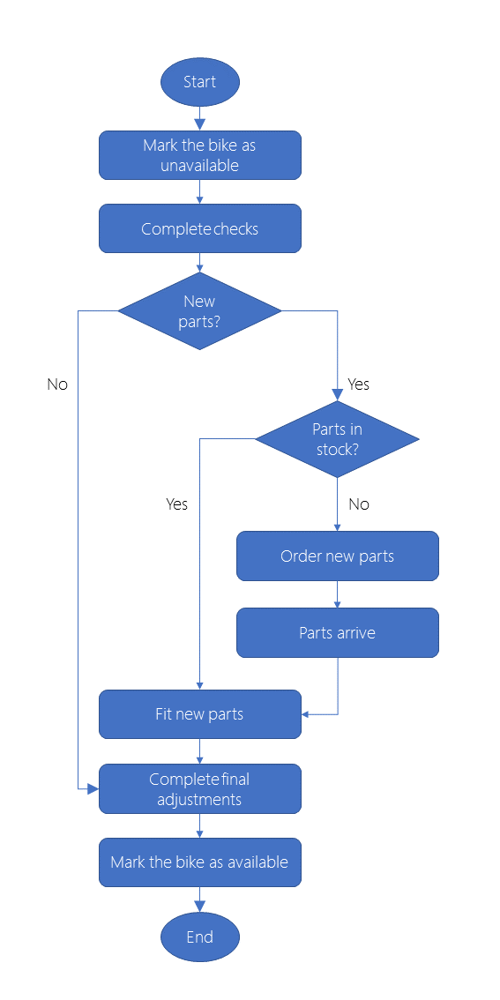

Now let's look at another process from our bike rental business and decide what technology best fits our needs. We'll consider the technical aspects of the process as well as audience and how our process needs to evolve.

## Scenario

Your bike technicians currently use a spreadsheet to record the actions they took to repair and maintain each bike. Difficulties have arisen when spare parts are needed, because the staff have no way of knowing when a bike is waiting for repairs or parts. This problem has resulted in bikes being rented to customers with worn brake pads, flat tires, and other faults that may damage the companies brand as a high-quality bike rental company.

You want to build a system that governs the maintenance and repair process and allows everyone to find answers to the following questions.

- What jobs have been completed on a bike?
- What jobs remain to be completed before the bike can be rented out again?
- Which bikes are currently available to rent?
- Which bikes are currently unavailable to rent?
- For each bike that is unavailable:
  - Why can't we rent them out?
  - Are we waiting for any parts, and what are those parts?
  - When is the bike likely to be available again for rent?

You'd like to integrate this system with the bike booking and rental process from the last unit. In doing so, when shop staff search for available bikes, they find only those bicycles that are currently available to rent. Your manager has asked you to be the developer on this project.

## Business Process

You want to ensure that bike technicians on both campuses stick to the following workflow when they maintain a bike following a rental:

The details are as follows:

1. A customer returns a bike to any location. The bike maintenance process starts.
1. A technician marks the bike as unavailable.
1. A technician completes a full list of checks including the tires, brakes, drive chain, and lights.
1. Are new parts required?
    1. New parts are required, but we don't have the parts in stock.
        1. The technician orders new parts
        1. Parts arrive
    1. Fit new parts
1. A technician completes final changes.
1. A technician marks the bike as available for rent.

## Choose a technology

To implement the business process and integrate with the bike location database, let's consider the following set of technologies.

- Microsoft Power Automate
- Azure Logic Apps
- Azure Functions
- Azure Service Apps WebJobs

As in the previous scenario, any of these technologies could be used to build the workflow. However, there are two issues that determine the optimal choice.

### Design-first or code-first?

To implement this workflow using just Logic Apps or Power Automate would be difficult. While we haven't heard too many low-level details, it's clear that this process needs to access an inventory system, place orders with a third-party parts company. This is new business logic and there is no requirement that we consider a design-first approach. We can wrap our solution in a custom connector to integrate with other workflows created with Logic Apps or Power Automate.  As a developer, you have most flexibility by approaching this scenario from a code-first approach, so let's do that!

### Azure Functions or Azure Apps Service WebJobs?

We have to make a decision between the following two technologies.

- Azure Functions
- Azure App Service WebJobs

The following factors will influence your choice:

- Cost: With Web Jobs, you pay for the entire VM or App Service Plan that hosts the job. Azure Function can run on a consumption plan, so you only pay when the function runs. Since this process only kicks off when a bike is returned, we might stand to save by selecting Azure Functions.
- Integrations: You want to integrate the maintenance workflow with the Logic App that you build for the bike booking and rental process in the previous unit. Although it is possible to call a WebJob from a Logic App, the integration between Logic Apps and Functions is closer. For example, you can more easily control your call to a Function from the Logic Apps designer.

For these reasons, we'll select Azure Function to manage your bike maintenance business process.
