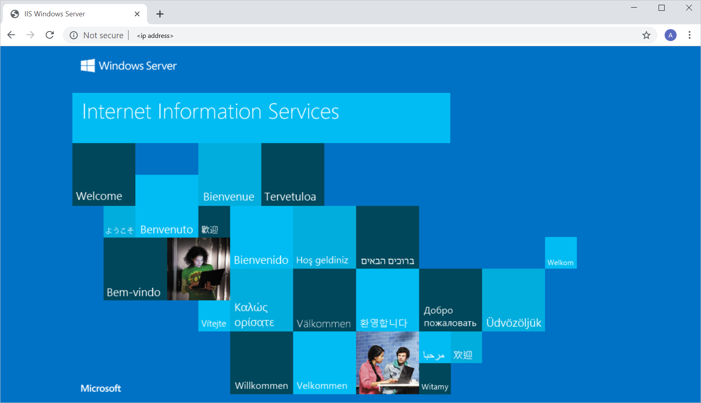

Your organization grows, and demand rises in Europe and Asia. Your organization is based in the USA. Most of your infrastructure is cloud-based. Your European users are reporting a slow website. To provide better service to the customers in Europe, your company has asked you to create a new and improved web server for Europe. The machine must be configured as an IIS web server when it's provisioned.

You have been asked to choose appropriate provisioning tools. Your tools should also be easy to use and easily customizable.

In this exercise, you'll provision a web server to meet the requirements.

[!include[](../../../includes/azure-sandbox-activate.md)]

### Provision a web server

You'll use multiple tools together. Azure Resource Manager templates will enable you to create a template outlining the environment for your web server. Your Azure Resource Manager template can also help you define a state that you apply to your web server at the point of provisioning. You can apply your desired state by putting a DSC extension handler inside of your Azure Resource Manager template. The DSC handler helps you enforce a state that you define in a DSC configuration.

In the following exercise, you'll use an Azure Resource Manager template to provision a virtual machine. The DSC extension handler that will be included in the template will enforce your state on the virtual machine.

1. First, create your state configuration. You'll configure an IIS web server on your machine. Copy the following code to an empty file.

    ```powershell
        Configuration Webserver
        {
          param ($MachineName)

          Node $MachineName
          {
            #Install the IIS Role
            WindowsFeature IIS
            {
              Ensure = "Present"
              Name = "Web-Server"
            }

            #Install ASP.NET 4.5
            WindowsFeature ASP
            {
              Ensure = "Present"
              Name = "Web-Asp-Net45"
            }

             WindowsFeature WebServerManagementConsole
            {
                Name = "Web-Mgmt-Console"
                Ensure = "Present"
            }
          }
        }
    ```

1. Save the file as Webserver.ps1

1. Compress your Webserver.ps1 file into a *.zip* folder named Webserver.

1. Now you create an Azure Resource Manager template. Below is a skeleton template, which you can use as a baseline. Save it as *template.json*.
    ```json
    {
        "$schema": "https://schema.management.azure.com/schemas/2015-01-01/deploymentTemplate.json#",
        "contentVersion": "1.0.0.0",
        "parameters": {  },
        "variables": {  },
        "resources": [  ]
    }
    ```

1. You use the parameters section to define which values you can input when you are deploying your template. In the parameters section, add parameters as shown below. Remove any comments.

    ```json
    "parameters": {  
                "diskType": {
                "type": "string",
                "defaultValue": "Standard_LRS",
                "allowedValues": [
                    "Standard_LRS",
                    "Premium_LRS"
                ],
                "metadata": {
                    "description": "Type of Storage for disks"
                }
            },
            "vmName": {
                "type": "string",
                "metadata": {
                    "description": "Name of the VM"
                }
            },
            "vmSize": {
                "type": "string",
                "defaultValue": "Standard_A2",
                "metadata": {
                    "description": "Size of the VM"
                }
            },
            "imageSKU": {
                "type": "string",
                "defaultValue": "2012-R2-Datacenter",
                "allowedValues": [
                    "2008-R2-SP1",
                    "2012-Datacenter",
                    "2012-R2-Datacenter"
                ],
                "metadata": {
                    "description": "Image SKU"
                }
            },
            "adminUsername": {
                "type": "string",
                "metadata": {
                    "description": "Admin username"
                }
            },
            "adminPassword": {
                "type": "securestring",
                "metadata": {
                    "description": "Admin password"
                }
            },
    /* Location of your DSC configuration */
            "modulesUrl": {
                "type": "string",
                "metadata": {
                    "description": "URL for the DSC configuration module. NOTE: Can be a Github url(raw) to the zip file"
                }
            },
    /* The function to run in your DSC configuration */
            "configurationFunction": {
                "type": "string",
                "defaultValue": "Webserver.ps1\\Webserver",
                "metadata": {
                    "description": "DSC configuration function to call"
                }
            },
            "location": {
                "type": "string",
                "defaultValue": "[resourceGroup().location]",
                "metadata": {
                    "description": "Location for all resources."
                }
            }
    }
    ```

1. The variables section allows you to define variables you can reuse in your template. Use variables for your template as shown below.

    ```json
    "variables": {
        "virtualNetworkName": "dscVNET",
        "vnetID": "[resourceId('Microsoft.Network/virtualNetworks', variables('virtualNetworkName'))]",
        "vnetAddressPrefix": "10.0.0.0/16",
        "subnet1Name": "dscSubnet-1",
        "subnet1Prefix": "10.0.0.0/24",
        "subnet1Ref": "[concat(variables('vnetID'),'/subnets/', variables('subnet1Name'))]",
        "publicIPAddressType": "Dynamic",
        "publicIPAddressName": "dscPubIP",
        "nicName": "dscNIC",
        "imagePublisher": "MicrosoftWindowsServer",
        "imageOffer": "WindowsServer",
        "vmExtensionName": "dscExtension"
    }
    ```

1. The resources section holds all of the resources you want to provision. Because you will be provisioning a virtual machine, you will have to include a virtual network, a public IP address, a network interface, along with the DSC extension handler for your desired state configuration. You use individual resources to add all of those components. Add resources as shown below. Remember to remove any comments.

    ```json
    "resources": [
        {   /* Your IP address resource*/
            "apiVersion": "2015-05-01-preview",
            "type": "Microsoft.Network/publicIPAddresses",
            "name": "[variables('publicIPAddressName')]",
            "location": "[parameters('location')]",
            "properties": {
                "publicIPAllocationMethod": "[variables('publicIPAddressType')]"
            }
        },
        {    /* Your virtual network resource */
            "apiVersion": "2015-05-01-preview",
            "type": "Microsoft.Network/virtualNetworks",
            "name": "[variables('virtualNetworkName')]",
            "location": "[parameters('location')]",
            "properties": {
                "addressSpace": {
                    "addressPrefixes": [
                        "[variables('vnetAddressPrefix')]"
                    ]
                },
                "subnets": [
                    {
                        "name": "[variables('subnet1Name')]",
                        "properties": {
                            "addressPrefix": "[variables('subnet1Prefix')]"
                        }
                    }
                ]
            }
        },
        {    /* Your network interface resource */
            "apiVersion": "2015-05-01-preview",
            "type": "Microsoft.Network/networkInterfaces",
            "name": "[variables('nicName')]",
            "location": "[parameters('location')]",
            "dependsOn": [
                "[concat('Microsoft.Network/publicIPAddresses/', variables('publicIPAddressName'))]",
                "[concat('Microsoft.Network/virtualNetworks/', variables('virtualNetworkName'))]"
            ],
            "properties": {
                "ipConfigurations": [
                    {
                        "name": "ipconfig1",
                        "properties": {
                            "privateIPAllocationMethod": "Dynamic",
                            "publicIPAddress": {
                                "id": "[resourceId('Microsoft.Network/publicIPAddresses', variables('publicIPAddressName'))]"
                            },
                            "subnet": {
                                "id": "[variables('subnet1Ref')]"
                            }
                        }
                    }
                ]
            }
        },
        {    /* Your virtual machine resource*/
            "apiVersion": "2017-03-30",
            "type": "Microsoft.Compute/virtualMachines",
            "name": "[parameters('vmName')]",
            "location": "[parameters('location')]",
            "dependsOn": [
                "[concat('Microsoft.Network/networkInterfaces/', variables('nicName'))]"
            ],
            "properties": {
                "hardwareProfile": {
                    "vmSize": "[parameters('vmSize')]"
                },
                "osProfile": {
                    "computerName": "[parameters('vmName')]",
                    "adminUsername": "[parameters('adminUsername')]",
                    "adminPassword": "[parameters('adminPassword')]"
                },
                "storageProfile": {
                    "imageReference": {
                        "publisher": "[variables('imagePublisher')]",
                        "offer": "[variables('imageOffer')]",
                        "sku": "[parameters('imageSKU')]",
                        "version": "latest"
                    },
                    "osDisk": {
                        "name": "[concat(parameters('vmName'), '_OSDisk')]",
                        "caching": "ReadWrite",
                        "createOption": "FromImage",
                        "managedDisk": {
                            "storageAccountType": "[parameters('diskType')]"
                        }
                    }
                },
                "networkProfile": {
                    "networkInterfaces": [
                        {
                            "id": "[resourceId('Microsoft.Network/networkInterfaces', variables('nicName'))]"
                        }
                    ]
                }
            }
        },
        { /* Your DSC extension */
            "type": "Microsoft.Compute/virtualMachines/extensions",
            "name": "[concat(parameters('vmName'),'/', variables('vmExtensionName'))]",
            "apiVersion": "2015-05-01-preview",
            "location": "[parameters('location')]",
            "dependsOn": [
                "[concat('Microsoft.Compute/virtualMachines/', parameters('vmName'))]"
            ],
            "properties": {
                "publisher": "Microsoft.Powershell",
                "type": "DSC",
                "typeHandlerVersion": "2.19",
                "autoUpgradeMinorVersion": true,
                "settings": {
                    /*Location of your state configuration. Points to a parameter which you can set when you deploy your template.*/
                    "ModulesUrl": "[parameters('modulesUrl')]",
                    /*The function to call in your configuration.*/
                    "ConfigurationFunction": "[parameters('configurationFunction')]",
                    "Properties": {
                        "MachineName": "[parameters('vmName')]"
                    }
                },
                "protectedSettings": null
            }
        }
    ]
    ```

1. Enter the following command in your Azure Cloud Shell. Be sure to include the "." when you enter the command. You'll get access to a browser-based editor with this command.

    ```bash
    code .
    ```

    

1. Copy and paste the template code into the editor, then save it by selecting the three dots at the top right of the editor. Save the file as *template.json*.

1. Validate and test your deployment before you attempt a real deployment. Run the below command to test whether your deployment would be successful.

    ```bash
    az group deployment validate  --resource-group <rgn>[sandbox resource group name]</rgn>  --template-file template.json
    ```

1. Follow the prompts. Use a strong username and password combination when you are asked for **adminUsername** and **adminPassword**.

1. When you're prompted for a **modulesUrl**, input the location of your configuration file. For this exercise, we've chosen to upload it to a GitHub repository. If you want to use GitHub, you need to go to GitHub.com and create a new account if you don't already have one.

1. If you want to use GitHub to host your configuration file, you'll need to create a new repo on GitHub.

    

1. You'll then upload the configuration's *.zip* file to your repo by selecting **Upload files**. Then select **Commit changes** once you've selected your file to upload.

    

1. You can get the URL of the file on GitHub. Select the file once you've uploaded it, then copy the location of the raw file. You right-click and copy the link address from the **View raw** link.

    

1. Paste this address into the **modulesUrl** prompt. After this prompt, Azure will attempt to validate your template.

1. If your deployment is validated, you'll see information about your deployment. Pay special attention to the error property, it should be null.

    

1. If there are no errors, your template has been validated and can be deployed. Run the below command to deploy the template.

    ```bash
    az group deployment create --resource-group <rgn>[sandbox resource group name]</rgn> --template-file template.json
    ```

1. Follow the prompts to complete your deployment. It may take a few minutes for deployment to finish.

1. Once everything has been set up, your virtual machine will be created and configured as an IIS webserver. List all of the resources in the resource group to confirm everything has been set up. Run the below command.

    ```bash
    az resource list --resource-group <rgn>[sandbox resource group name]</rgn>
    ```

1. You'll see all of your resources listed. This means deployment was successful.

1. Test if your IIS server is running. Run the following command in the shell.

    ```bash
    az vm show -d -g <rgn>[sandbox resource group name]</rgn> -n <your-vm-name> --query publicIps -o tsv
    ```

1. Copy the IP address that is returned, and paste it into a new tab or window. You should see your IIS server running.

    

You've provisioned a web server using Azure Resource Manager templates and enforced a desired state configuration on your machine through a DSC extension handler.
