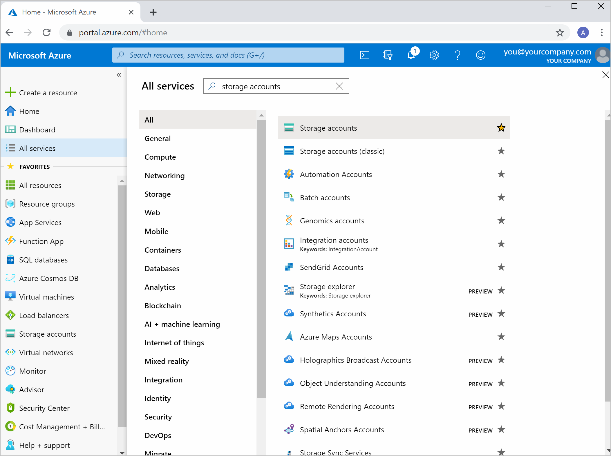
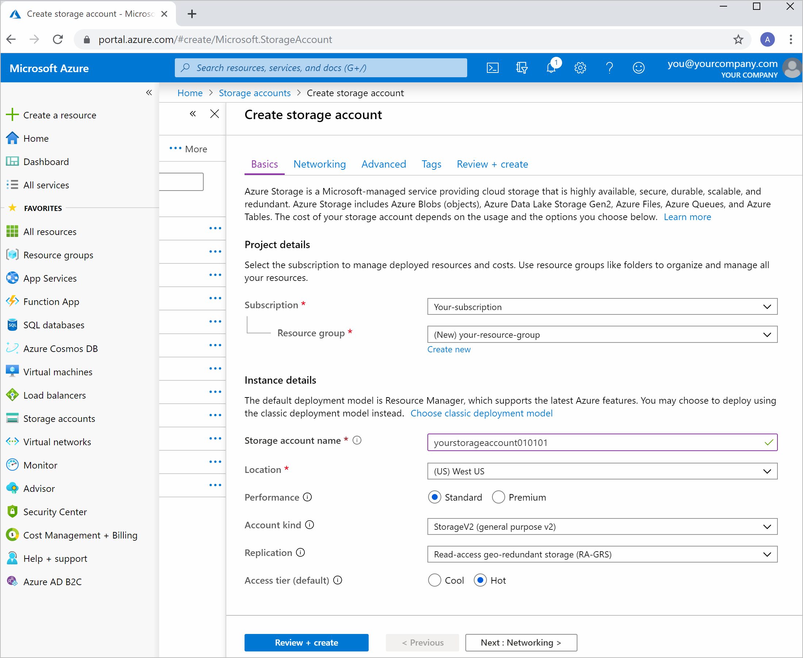
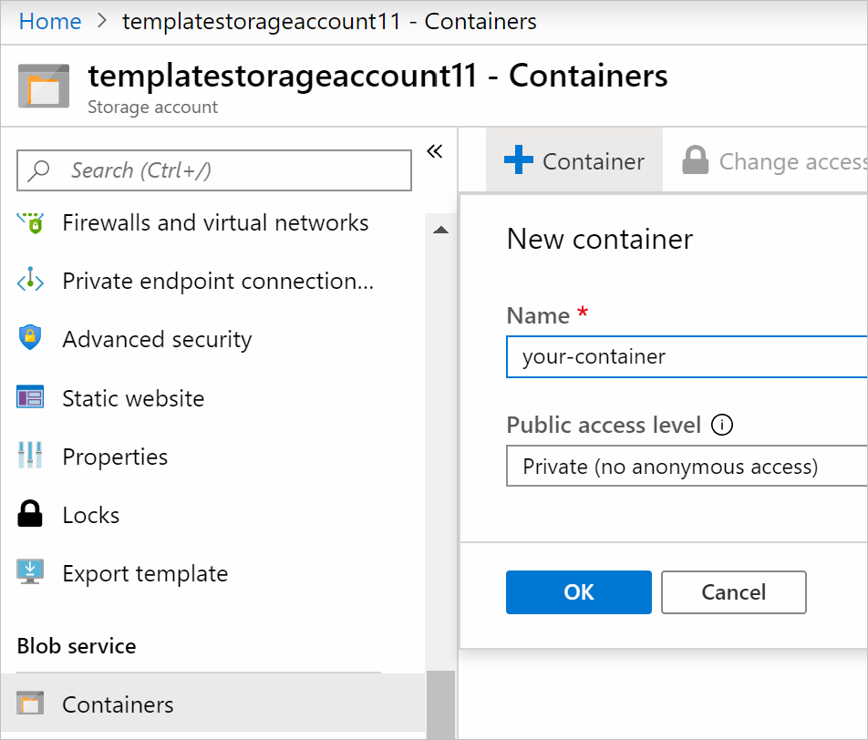
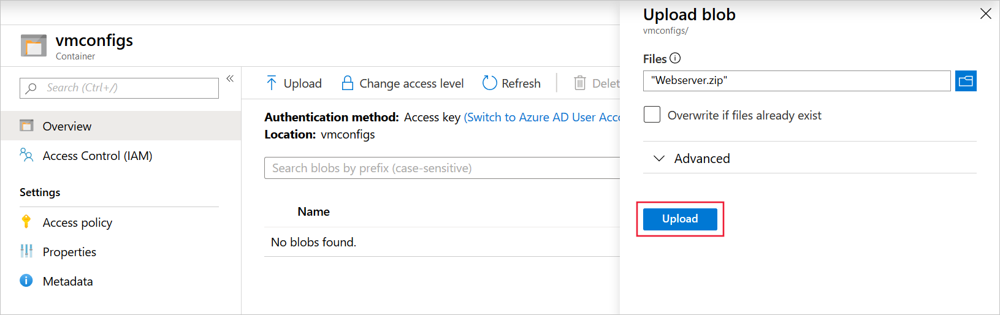
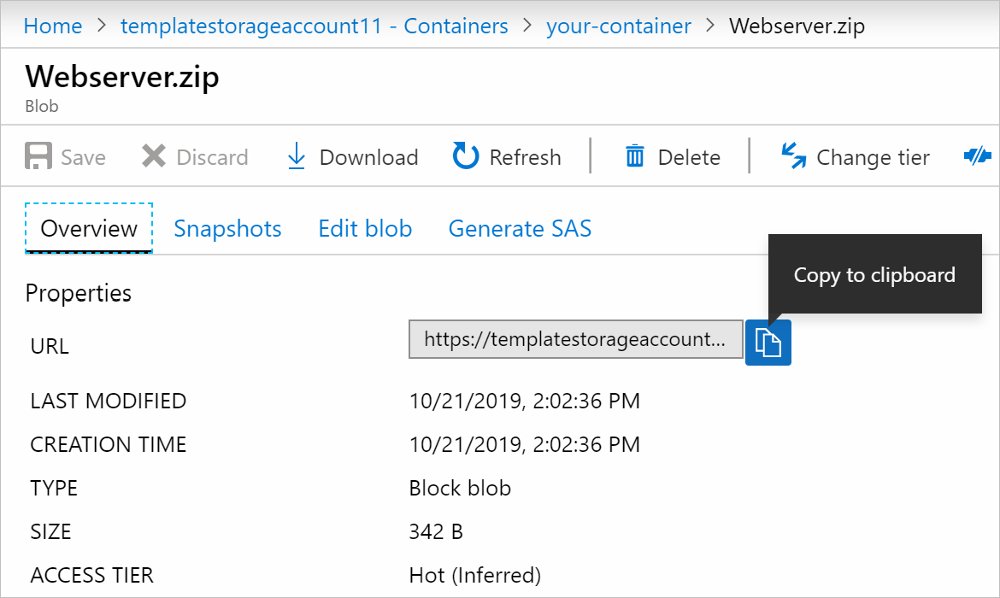

Your organization grows, and demand rises in Europe and Asia. Your organization is based in the USA. Most of your infrastructure is cloud-based. Your European users are reporting a slow website. To provide better service to the customers in Europe, your company has asked you to create a new and improved web server for Europe. The machine must be configured as an IIS web server when it's provisioned.

You have been asked to choose appropriate provisioning tools. Your tools should also be easy to use and easily customizable.

In this exercise, you'll provision a web server to meet the requirements.

## Provision a web server

You'll use a couple of tools together. Azure Resource Manager templates will enable you to create a template outlining the environment for your web server. Your Azure Resource Manager template can also help you define a state that you apply to your web server at the point of provisioning. You can apply your desired state by putting a DSC extension handler inside of your Azure Resource Manager template. The DSC handler helps you enforce a state that you define in a DSC configuration.

In the following exercise, you'll use an Azure Resource Manager template to provision a virtual machine. The DSC extension handler that will be included in the template will enforce your state on the virtual machine. You'll use an Azure storage account to host your DSC configuration file.

## Clone the configuration and template

Let's start by obtaining a configuration file and Azure Resource Manager (ARM) template from GitHub.

1. Start a command prompt on your local computer.
1. To clone the GitHub repository, run these commands:

    ```MS-DOS
    md ~\trainingrepos
    cd ~\trainingrepos
    git clone https://github.com/MicrosoftDocs/mslearn-choose-compute-provisioning.git
    ```

## Examine and compress the state configuration file

Let's start by with the state configuration, which includes the IIS web server on your virtual machine. The following steps open that file with Visual Studio Code, but you can also use any other text editor, such as Notepad if you don't have Code:

1. To open the file, run these commands:

    ```MS-DOS
    cd mslearn-choose-compute-provisioning
    code Webserver.ps1
    ```

1. The configuration file include the following code. Notice that installs IIS, ASP.NET, and the IIS Management console:

    ```powershell
    Configuration Webserver
    {
        param ($MachineName)

        Node $MachineName
        {
            #Install the IIS Role
            WindowsFeature IIS
            {
                Ensure = "Present"
                Name = "Web-Server"
            }

            #Install ASP.NET 4.5
            WindowsFeature ASP
            {
                Ensure = "Present"
                Name = "Web-Asp-Net45"
            }

            WindowsFeature WebServerManagementConsole
            {
                Name = "Web-Mgmt-Console"
                Ensure = "Present"
            }
        }
    }
    ```

1. Open Windows Explorer and browse to the **mslearn-choose-compute-provisioning** folder.
1. Right-click the **Webserver.ps1** file, point to **Send to**, and then select **Compressed (zipped) folder**.
1. Accept the default name, **Webserver.zip**.

## Create a storage account

The zipped configuration file must be hosted somewhere that is available to Azure. Let's use an Azure Storage account for that purpose:

[!include[](../../../includes/azure-sandbox-regions-first-mention-note-friendly.md)]

1. Sign into the [Azure portal](<https://portal.azure.com/learn.docs.microsoft.com?azure-portal=true>).
1. In the left menu, select **All Services**, search for *Storage Accounts*, and then select **Storage accounts** in the list of results.

    

1. Select **Add** at the top of the **Storage Accounts** pane.
1. In the **Create storage account** page, enter these values, and then click **Review + create**:

    | Property | Value |
    | --- | --- |
    | Subscription | Concierge Subscription |
    | Resource group | <rgn>[sandbox resource group name]</rgn> |
    | Storage account name | Use a unique account name such as **vmconfigs&lt;your initials&gt;** |
    | Location | Choose a location near you from the above list |
    | Performance | Standard |
    | Account kind | StorageV2 (general purpose v2) |
    | Replication | Locally redundant storage (LRS) |
    | Access tier (default) | Cool |
    |||

    

1. Select **Create**.

## Upload your configuration file

Now, let's add the configuration file to the storage account so that Azure can access it later, when it creates a virtual machine:

1. When the deployment is complete, in the Azure left menu, select **All resources** and then select your storage account.
1. Select **Containers** under **Blob service** on the left, then select **+ Container**.
1. In the **Name** textbox, type **vmconfigs**.
1. From the Public access level dropdown, select **Container (anonymous read access for containers and blobs)**.
1. Select **OK**.

    

1. Select your container, select **Upload**, browse for your *Webserver.zip* file, then select **Upload** at the bottom of the form.

    

1. Select the file, then copy the file's URL. Open Notepad, or another text editor, and paste the URL into a new text file. You'll use this URL later in this exercise.

    

## Configure the template

The GitHub repository that you cloned also contains an ARM template. This template is complete, but you must add the location of the configuration file to it:

1. In the command prompt, use this command to open the template:

    ```MS-DOS
    code template.json
    ```

1. In the **template.json** code file, locate this code:

    ```json
    "modulesUrl": {
        "type": "string",
        "metadata": {
            "description": "URL for the DSC configuration module."
        }
    },
    ```

1. Replace that code with this code. Replace `<Your Webserver.zip URL>` with the URL that you pasted into a text file in the last section:

    ```json
    "modulesUrl": {
        "type": "string",
        "defaultValue": "<Your Webserver.zip URL>",
        "metadata": {
            "description": "URL for the DSC configuration module."
        }
    },
    ```

1. To save the template, press <kbd>CTRL + S</kbd>.

## Validate your template

Now that you have an ARM template and a configuration file in a storage account, you can use the Azure CLI to perform a deployment. Before you deploy, you can validate your files to see if the deployment would be successful:

1. To sign into your Azure account, and select the right subscription, run these commands:

    ```ms-dos
    az login
    az account set --subscription "Concierge Subscription"
    ```

1. To validate your deployment, run this command:

    ```ms-dos
    az group deployment validate \
      --resource-group <rgn>[sandbox resource group name]</rgn> \
      --template-file template.json
    ```

1. You'll be prompted to enter a **vmName**.  This name will be given to the virtual machine. Type **hostVM1** and then press <kbd>Enter</kdb>.
1. When you are asked for **adminUsername** and **adminPassword**, use a username that has at least one uppercase letter, a symbol, and a number. Remember that the password you use must be between 8-123 characters long and must satisfy at least 3 of these requirements:

    - Contains an uppercase character
    - Contains a lowercase character
    - Contains a numeric digit
    - Contains a special character
    - Control characters are not allowed

1. If your deployment is validated, you'll see information about your deployment. Pay special attention to the `error` property, which can be found by scrolling back through the output text. It should be null.

    

1. If there are no errors, your template has been validated and can be deployed.

## Deploy your template

Now that we know the template is valid, we can perform the deployment:

1. To deploy the template, run this command:

    ```ms-dos
    az group deployment create \
      --resource-group <rgn>[sandbox resource group name]</rgn> \
      --template-file template.json
    ```

1. Follow the prompts to complete your deployment. If you are running on a sandbox, this deployment will take around 10 minutes.  As long as you see the response "Running.." the deployment is still busy.
1. Once everything has been set up, you will have a virtual machine configured as an IIS web server. To list all of the resources in the resource group and confirm that everything has been set up, run this command:

    ```ms-dos
    az resource list \
      --resource-group <rgn>[sandbox resource group name]</rgn>
    ```

1. You'll see all of your resources listed, which means your deployment was successful.
1. To test if your IIS server is running, run this command in the shell:

    ```ms-dos
    az vm show -d \
      -g <rgn>[sandbox resource group name]</rgn> \
      -n <your-vm-name> --query publicIps -o tsv
    ```

1. Copy the IP address that is returned, and paste it into a new browser window. You should see your IIS server running:

    

You've provisioned a web server using Azure Resource Manager templates and enforced a desired state configuration on your machine through a DSC extension handler.
