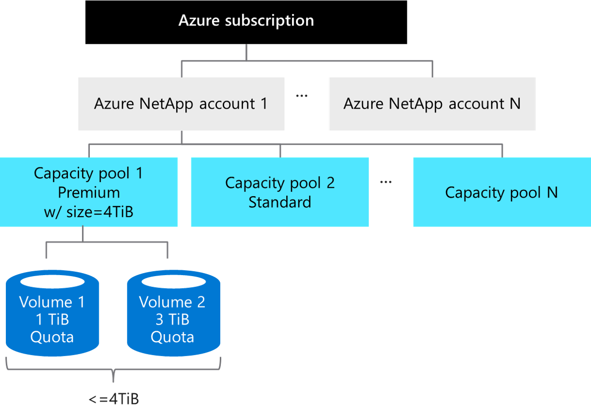
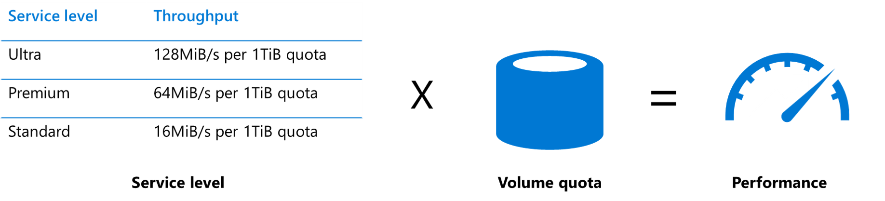

Now let's examine the key factors that determine Azure NetApp Files performance. Including, how to calculate the required bandwidth of your applications.

## Storage hierarchy

The following diagram of the Azure NetApp Files storage hierarchy shows the relationship between subscriptions, accounts, capacity pools, and volumes.

### Azure NetApp Files account

The Azure NetApp Files account is primarily an administrative concept and is in regional scope.

### Capacity pool

A single Azure NetApp Files account can have up to 25 capacity pools. The provisioned size of each pool can then be assigned to volumes within it.

In the preceding example, we provisioned 4 TiB to capacity pool 1. This pool is also assigned a Premium service level, which we discuss in the next section.

Azure NetApp Files is charged based on the provisioned size of capacity pools. The size of pools can vary from 4 TiB to 500 TiB each.

### Volumes

Volumes are the actual constructs that are mounted from your VMs and consumed. Volume quota can be assigned in a range from 100 GB to 100 TB. The total volume capacity can't exceed the size of the capacity pool.

In the preceding example, two volumes are within capacity pool 1 and the total quota limit can't exceed 4 TiB. All volumes in a pool have the same service level. In this example, the service level is Premium.

## Service levels

The first important concept in determining performance with Azure NetApp Files is the service level. Service levels define the maximum throughput allowed on a normalized basis relative to volume quota. For example, with the Premium service level, you can achieve up to 64 MiBs per second of throughput for every TB of quota in the volume.

Azure NetApp Files offers three service levels suited to different workload types: Standard, Premium, and Ultra.

## Performance sizing

Performance for Azure NetApp Files is simple to design and easy to configure. Two key factors are involved. The service level, which we just introduced, establishes the baseline level of performance. The second factor is the volume quota.

The gross performance limit of the volume is the product of these two factors.

Let's walk through an example:

- If I choose the Premium service level, I get 64 MiB per second for every 1 TB of quota within the volume.
- If I provision a volume with a 2-TB quota, that volume can deliver up to 128 MiB per second of throughput.

Consider that:

- The limit of maximum throughput of an Azure NetApp Files volume is 4,500 MiB per second.
- The quota of the volume sets the gross throughput, not the actual capacity consumed in the volume.
- You can resize the volume quota anytime, even if it's mounted. Changes to quality of service take effect in near real time. You don't need to reboot your VM or remount the volume.

Keep in mind that a wide range of factors affect the storage performance. Such as, the read/write mix, block size mix, and access patterns like random or sequential access.

## Calculate required bandwidth

How do you know the needed bandwidth of throughput? If you know both the IOPS and the transfer size of your workload, you can calculate the bandwidth required by multiplying them together.

For example, if your workloads need 100,000 IOPS and have an average transfer size of 16 KB, then the bandwidth required is 1.53 GB per second.

- 100,000 IOPS * 16 KB = 1,600,000 KB/s = 1.53 GB/s
