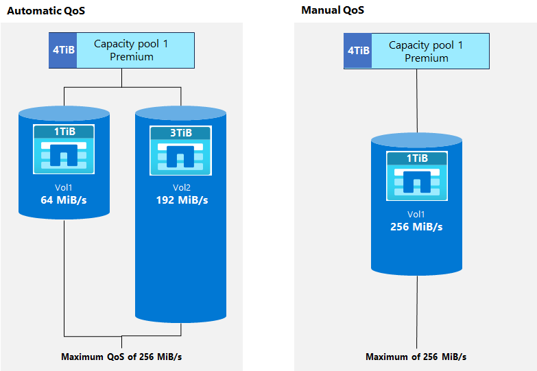
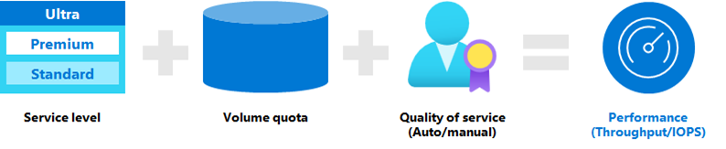

Choosing an Azure NetApp Files service level involves understanding the application and calculating the required bandwidth of your applications. Azure NetApp Files offers a [performance calculator](https://aka.ms/anfcalc) to aid in decision making.

## Storage hierarchy

The following diagram of the Azure NetApp Files storage hierarchy shows the relationship between subscriptions, accounts, capacity pools, and volumes.

### Azure NetApp Files account

The NetApp account is primarily an administrative concept and is regionally scoped. A NetApp account enables you to set up a capacity pool, which in turn allows you to create a volume.

### Capacity pools

Capacity pools are containers for Azure NetApp Files volumes. Capacity pools are a logical (not physical) construct that provides capacity and performance budgets and are the units for billing. Azure NetApp Files is charged based on the provisioned size of capacity pools. A capacity pool can be a minimum of 1 TiB when using Standard network features and a minimum of 4 TiB with Basic network features. A capacity pool can have a maximum provisioned size of 1,000 TiB.

A single NetApp account can have up to 25 capacity pools. The provisioned size of each pool can then be assigned to volumes within it. If a capacity pool is provisioned with 4 TiB for example, a maximum of 4-TiB volume capacity can be assigned across all volumes in the capacity pool.

### Volumes and volume quotas

Volumes are unique file systems that are mounted over a network from your virtual machines (VMs) to serve data. Volume quotas are rules that allow you to control performance usage. Azure NetApp Files supports two sizing conventions for volumes: regular and large volumes.

* Regular volumes can be assigned quota values from 100 GiB to 500 TiB.
* Large volumes can be assigned quota values from 50 TiB to 500 TiB.

The total volume capacity can’t exceed the size of the capacity pool. Volume quotas can affect volume performance depending on the type of volume (large or regular), service level selected, as well as the QoS type used.

Azure NetApp Files also offers large volumes that enable HPC workloads to perform at a higher level than regular volumes by providing greater capacity, increased throughput, parallel compute and even distribution of files and folders across multiple storage resources at low latency in Azure cloud deployments. Large volumes also provide the opportunity to lower costs in high metadata workloads by allowing workloads that require lower throughput with higher IOPS to leverage lower service levels. For instance, if your workload doesn’t require 10 GiB/s performance but does need parallel processing of write metadata operations, a large volume at Premium service level might do the job that would normally require Ultra service levels on regular volumes.

## Service levels

The first important concept in determining performance with Azure NetApp Files is the service level. Service levels are assigned to capacity pools to define the maximum throughput allowed on a normalized basis relative to volume quota or based on the QoS setting. For example, with the Premium service level, you can achieve up to 64 MiBs per second of throughput for every TiB of quota in the volume, up to a maximum level determined by the volume type and QoS policy type. By default, service levels use automatic [QoS policies](#quality-of-service-qos).

Azure NetApp Files offers three service levels suited to different workload types: Standard, Premium, and Ultra.

| Service level | Performance* | Recommended workloads |
| - | - | - | 
| Standard | Good <ul><li>Up to 1,000 IOPS/TiB quota</li><li>Up to 16 MiB/s per TiB quota</li></ul> | <ul><li>Static web content</li><li>File shares/home directories</li><li>Database backups</li></ul> |
| Premium | Better (SSD class) <ul><li>Up to 4,000 IPS/TiB quota</li>Up to 64 MiB/s per TiB quota</li></ul> | <ul><li>Databases</li><li>Enterprise applications</li><li>Analytics</li><li>Message queues</li></ul> |
| Ultra |  Best (high performance flash) <ul><li>Up to 8,000 IOPS/TiB quota</li><li>Up to 128 MiB/s per TiB quota</li></ul> | <ul><li>Performance/throughput intensive applications</li><li>HPC/EDA</li></ul> |

\* Performance SLA indexed against volume quota

## Quality of Service (QoS)

QoS is used by Azure NetApp Files to control performance for capacity pools and volumes based on the service level defined and the volume quota assigned. Automatic QoS is used to manage performance automatically when capacity is defined. For instance, if 1 TiB of space is allocated to a volume in a capacity pool with a Premium service level, then 64 MiB/s are allowed for a volume in the capacity pool.

If more performance for the volume is needed than the desired volume quota allows, a manual QoS policy is the better option. A manual QoS policy can be used to increase allowed performance for the volume to a level up to what is allowed by the capacity pool. In this case, if the capacity pool is 4 TiB, then up to 256 MiB/s would be allowed with a Premium service level to a single 1-TiB volume when using manual QoS.

## Performance sizing

Performance for Azure NetApp Files is simple to design and easy to configure. Three key factors are involved:

- **Service level:** Service level controls the maximum allowed throughput for a capacity pool and the cost of the deployment.
- **Volume quota:** Volume quota (size) controls how much of the maximum performance for the service level is allowed for the volume when automatic QoS is used.
- **Quality of Service (QoS):** QoS controls the total amount of performance allowed. Automatic QoS sets the performance based on the volume quota (size). Manual QoS sets performance based on the capacity pool size and allows custom performance configuration at the volume level.

With large volumes, throughput levels are able to exceed the maximums allowed by regular volumes. 

Let's walk through an example:

- If I choose the Premium service level, I get 64 MiB per second for every 1 TiB of quota within the volume.
- If I provision a volume with a 2-TiB quota, that volume can deliver up to 128 MiB per second of throughput.

Consider:

- The limit of maximum throughput of an Azure NetApp Files regular volume is 4,500 MiB/second for reads and ~1,500 MiB/second for writes.
- The limit of maximum throughput of an Azure NetApp Files large volume is 10,240 MiB per second for reads and writes.
- The quota of the volume sets the gross throughput, not the actual capacity consumed in the volume.
- You can resize the volume quota anytime, even if it's mounted. Changes to quality of service take effect in near real time. You don't need to reboot your VM or remount the volume.

Remember that a wide range of factors affect the storage performance including the read/write mix, block size mix, and access patterns like random or sequential access.

## Calculate required bandwidth

You might not know the required throughput for a workload. You might have other information, such as the operations per second (IOPS) and the transfer size of the workload.

How do you know the needed bandwidth of throughput? If you know both the IOPS and the transfer size of your workload, you can calculate the bandwidth required by multiplying them together.

For example, if your workload needs 100,000 IOPS and has an average transfer size of 16 KB, then the bandwidth required is 1.53 GB per second.

- 100,000 IOPS * 16 KB = 1,600,000 KB/s = 1.53 GB/s
