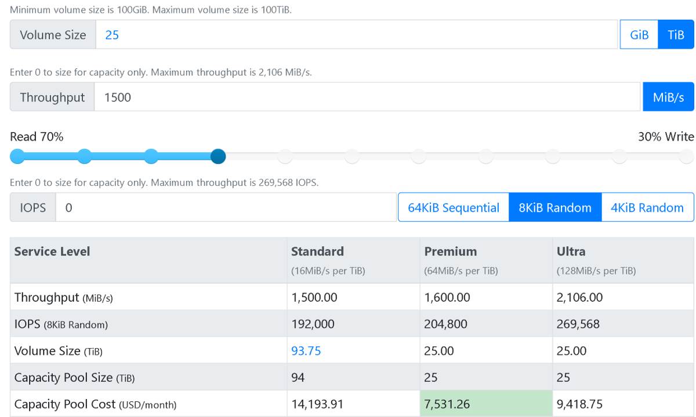
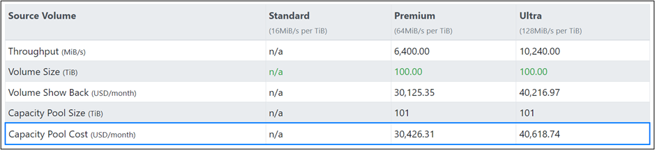
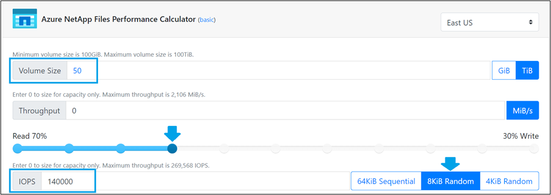
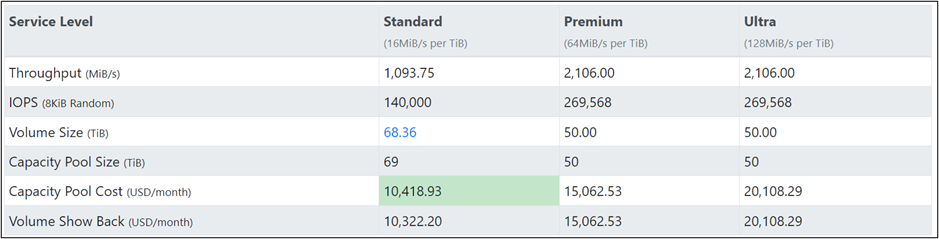

Recall that in the electronic design automation (EDA) simulation scenario, after we identify the throughput or input/output operations per second (IOPS) requirements of the application, we can then decide the most optimal and cost-effective Azure NetApp Files service level. In this unit, we use the [Azure NetApp Files Performance Calculator](https://aka.ms/anfcalc) to achieve this goal.

## Performance considerations

As you learned in the previous unit, a combination of the service level, QoS policy, and the volume quota determines the throughput limit for a volume.

Recall that the limit of maximum throughput of a regular Azure NetApp Files volume is 4,500 MiB per second. At the Premium service level (64 MiB/s per 1 TiB), a volume quota of at least 70.31 TiB is needed to be a throughput limit that's high enough to achieve this level of performance:

- 64MiB/s * 70.31 = 4,500 MiB/s

If we assign more than 70.31 TiB, the extra quota is only assigned for storing more data and doesn't result in a further increase in actual throughput for a regular volume.

A large volume can be used to provision between 50 TiB and up to 500 TiB of capacity with up to 10,240 MiB/s of throughput. For workloads that require more capacity and/or performance, consider using Azure NetApp Files large volumes.

Most importantly, we also need to consider the cost structure of different service levels  to avoid paying for more capacity or performance than is required for a workload.

### Azure NetApp Files Performance Calculator

Use the [Azure NetApp Files Performance Calculator](https://aka.ms/anfcalc) to assess your throughput or IOPS requirements, and help you choose the most cost-effective service level.

## Throughput requirement example

A high-performance computing (HPC) application needs at least 50 TiB of volume storage and needs to ensure 5,000 MiB per second in throughput. An Azure NetApp Files regular volume has a maximum throughput of 4,500 MiB per second using the Ultra service level, which doesn't fulfill your requirements, but an Azure NetApp Files large volume can. The question is, what service level do you need?

The Azure NetApp Files Performance Calculator allows you to use volume size and throughput to find the best blend of performance and cost for your volumes. Navigate to the tool and enter your volume size and throughput requirements as in the following example:

The calculator displays your options for this specific configuration and the associated cost. In this case, if we provision a large volume, we can achieve the desired performance using the Premium service level at a lower cost than if we used Ultra, giving us the performance needed (with room to grow) at a more desirable price point.

In this example, the Premium service level is the best choice because it achieves throughput requirements with the lowest capacity pool cost.

## IOPS requirement example

In some cases, throughput might not be as critical as raw IOPS for a workload. These scenarios include situations where there's a mix of small reads and writes across many compute clients. The Azure NetApp Files Performance Calculator can assist with calculating your performance needs.

Consider another HPC application that needs at least a 50-TiB size of volume storage and requires at least 140,000 IOPS on 8 KiB random with 70/30 read/write. How do we choose the best blend of performance and cost? In the previous example, a large volume using the Premium service level made the most sense for a high throughput workload. However, a workload with smaller IOPS isn't likely to achieve those throughput numbers, or need to. To define more specific parameters for your use case, use the calculator in advanced mode. Set the mode by selecting **advanced** at the top of the page next to the **Azure NetApp Files Performance Calculator** name.

>[!NOTE]
>Advanced mode does not currently support Azure NetApp Files large volumes, but large volumes are often an excellent choice for high file count/high metadata workloads. Contact your Azure NetApp Files specialist or CSA for more details about large volumes and if they are a fit for your workload. 

Enter your volume size and then adjust the slider to your read/write blend. Then, select the workload size.

The calculator displays service level options. In this case, we can achieve the needed performance with just the Standard service level.

If you later find you need more than the 1,093 MiB/s throughput offered by the Standard service level option (for burst workloads or otherwise), Azure NetApp Files allows you to adjust the service level up and down nondisruptively to fit your needs.