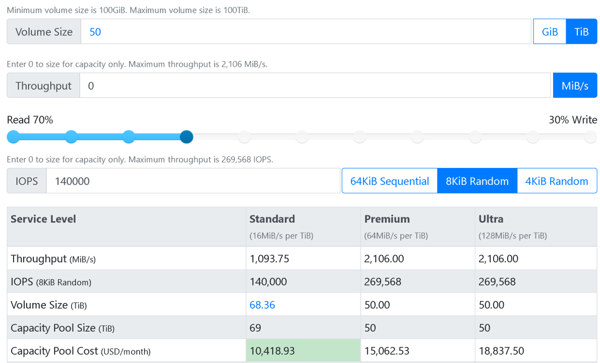

Recall that in the EDA simulation scenario, after we identify the throughput or IOPS requirements of the application, we can then decide the most optimal and cost-effective Azure NetApp Files service level. We'll use the Azure NetApp Files Performance Calculator to achieve this goal.

## Performance considerations

As you learned in the previous unit, the throughput limit for a volume is determined by a combination of the service level and the volume quota.

Recall that the limit of maximum throughput of an Azure NetApp Files volume is 4,500 MiB per second. At the Premium service level, a volume quota of 70.31 TiB will provision a throughput limit that's high enough to achieve this level of performance:

- 64MiB/s * 70.31 = 4,500 MiB/s

If we assign more than 70.31 TiB, the extra quota will only be assigned for storing more data but won't result in a further increase in actual throughput.

Most importantly, we'll also need to consider the cost structure of different service levels.

### Azure NetApp Files Performance Calculator

Use the [Azure NetApp Files Performance Calculator](https://cloud.netapp.com/azure-netapp-files/tco?hs_preview=tIKQbfoF-41214739590) to specify your throughput or IOPS requirements to help you choose the most cost-effective service level.

## Throughput requirement example

An HPC application needs at least a 25-TiB size of volume storage and needs to ensure 1,500 MiB per second in throughput on 8 KiB random with 70/30 read/write.

The output of the Performance Calculator will be like this example:

In this example, the Premium service level is the best choice because it achieves throughput requirements with the lowest capacity pool cost.

## IOPS requirement example

Another HPC application needs at least a 50-TiB size of volume storage and requires at least 140,000 IOPS on 8 KiB random with 70/30 read/write.

The output of the Performance Calculator will be like this example:

In this case, the Standard service level is the best choice because it achieves the specific IOPS requirement and it's also the most cost effective.
