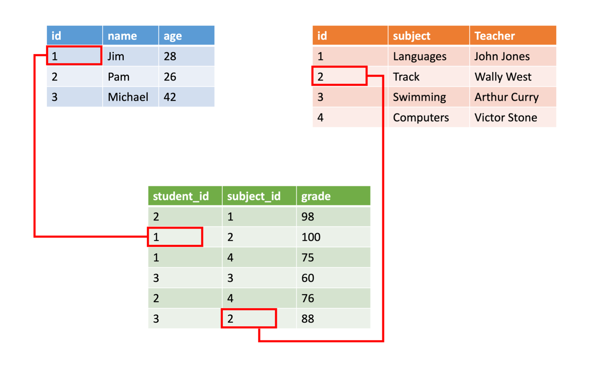

An online retail business has different types of data. Each type of data may benefit from a different storage solution. 

Application data can be classified in one of three ways: structured, semi-structured, and unstructured. Here, you'll learn how to classify your data so that you can choose the appropriate storage solution.

#### Approaches to storing data in the cloud

> [!VIDEO https://www.microsoft.com/videoplayer/embed/RE2yEuY]

## Structured data

Structured data, sometimes referred to as _relational data_, is data that adheres to a strict schema, so all of the data has the same fields or properties. The shared schema allows this type of data to be easily searched with query languages such as SQL (Structured Query Language). This capability makes this data style perfect for applications such as CRM systems, reservations, and inventory management.

Structured data is often stored in database tables with rows and columns with key columns to indicate how one row in a table relates to data in another row of another table. The below image shows data about students and classes with a relationship to grades that ties them together.



Structured data is straightforward in that it's easy to enter, query, and analyze. All of the data follows the same format. However, forcing a consistent structure also means evolution of the data is more difficult as each record has to be updated to conform to the new structure.

## Semi-structured data

Semi-structured data is less organized than structured data, and is not stored in a relational format, as the fields do not neatly fit into tables, rows, and columns. Semi-structured data contains tags that make the organization and hierarchy of the data apparent - for example, key/value pairs. Semi-structured data is also referred to as non-relational or _NoSQL data_. The expression and structure of the data in this style is defined by a *serialization language*.

For software developers, data serialization languages are important because they can be used to write data stored in memory to a file, sent to another system, parsed and read. The sender and receiver don’t need to know details about the other system, as long as the same serialization language is used, the data can be understood by both systems.

> [!VIDEO https://www.microsoft.com/en-us/videoplayer/embed/RE4LBu6]

### Common formats

Today, there are three common serialization languages you're likely to encounter:

**XML**, or *extensible markup language*, was one of the first data languages to receive widespread support. It's text-based, which makes it easily human and machine-readable. In addition, parsers for it can be found for almost all popular development platforms. XML allows you to express relationships and has standards for schema, transformation, and even displaying on the web. 

Here's an example of a person with hobbies expressed in XML.

```xml
<Person Age="23">
    <FirstName>John</FirstName>
    <LastName>Smith</LastName>
    <Hobbies>
        <Hobby Type="Sports">Golf</Hobby>
        <Hobby Type="Leisure">Reading</Hobby>
        <Hobby Type="Leisure">Guitar</Hobby>
   </Hobbies>
</Person>
```

XML expresses the shape of the data using _tags_. These tags come in two forms: _elements_ such as `<FirstName>` and _attributes that can be expressed in text like `Age="23"`. Elements can  have child elements to express relationships - such as the `<Hobbies>` tag above which is expressing a collection of `Hobby` elements.

XML is flexible and can express complex data easily. However it tends to be more verbose making it larger to store, process, or pass over a network. As a result, other formats have become more popular.

**JSON** – or *JavaScript Object Notation*, has a lightweight specification and relies on curly braces to indicate data structure. Compared to XML, it is less verbose and easier to read by humans. JSON is frequently used by web services to return data.

Here's the same person expressed in JSON.

```json
{
    "firstName": "John",
    "lastName": "Doe",
    "age": "23",
    "hobbies": [
        { "type": "Sports", "value": "Golf" },
        { "type": "Leisure", "value": "Reading" },
        { "type": "Leisure", "value": "Guitar" }
    ]
}
```

Notice that this format isn't as formal as XML. It's closer to a key/value pair model than a formal data expression. As you might guess from the name, JavaScript has built-in support for this format - making it very popular for web development. Like XML, other languages have parsers you can use to work with this data format. The downside to JSON is that it tends to be more programmer-oriented making it harder for non-technical people to read and modify.

**YAML** – or *YAML Ain’t Markup Language*, is a relatively new data language that’s growing quickly in popularity in part due to its human-friendliness. The data structure is defined by line separation and indentation, and reduces the dependency on structural characters like parentheses, commas and brackets.

Here's the same person data expressed in YAML.

```yaml
firstName: John
lastName: Doe
age: 23
hobbies:
    - type: Sports
      value: Golf
    - type: Leisure
      value: Reading
    - type: Leisure
      value: Guitar
```

This format is more readable than JSON and is often used for configuration files that need to be written by people but parsed by programs. However, YAML is the newest of these data formats and doesn't have as much support in programming languages as JSON and XML.

#### What is NoSQL / semi-structured data?

> [!VIDEO https://www.microsoft.com/videoplayer/embed/RE2yEvd]

## Unstructured data

The organization of unstructured data is ambiguous. Unstructured data is often delivered in files, such as photos or videos. The video file itself may have an overall structure and come with semi-structured metadata, but the data that comprises the video itself is unstructured. Therefore, photos, videos, and other similar files are classified as unstructured data.

Examples of unstructured data include:

- Media files, such as photos, videos, and audio files
- Office files, such as Word documents
- Text files
- Log files

Now that you know the differences between each kind of data, let's look at the data sets used in an online retail business, and classify them.

## Product catalog data

Product catalog data for an online retail business is fairly structured in nature, as each product has a product SKU, a description, a quantity, a price, size options, color options, a photo, and possibly a video. So, this data appears relational to start with, as it all has the same structure. However, as you introduce new products or different kinds of products, you may want to add different fields as time goes on. For example, new tennis shoes you're carrying are Bluetooth-enabled, to relay sensor data from the shoe to a fitness app on the user’s phone. This appears to be a growing trend, and you want to enable customers to filter on "Bluetooth-enabled" shoes in the future. You don't want to go back and update all your existing shoe data with a Bluetooth-enabled property, you simply want to add it to new shoes.

With the addition of the Bluetooth-enabled property, your shoe data is no longer homogenous, as you've introduced differences in the schema. If this is the only exception you expect to encounter, you can go back and normalize the existing data so that all products included a "Bluetooth-enabled" field to maintain a structured, relational organization. However, if this is just one of many specialty fields that you envision supporting in the future, then the classification of the data is semi-structured. The data is organized by tags, but each product in the catalog can contain unique fields.

Data classification: **Semi-structured**

## Photos and videos

The photos and videos displayed on product pages are unstructured data. Although the media file may contain metadata, the body of the media file is unstructured.

Data classification: **Unstructured**

## Business data

Business analysts want to implement business intelligence to perform inventory pipeline evaluations and sales data reviews. In order to perform these operations, data from multiple months needs to be aggregated together, and then queried. Because of the need to aggregate similar data, this data must be structured, so that one month can be compared against the next.

Data classification: **Structured**

## Summary

Data may be classified in one of three ways: structured, semi-structured, and unstructured. Understanding the differences so that you can classify your own data will help you choose the correct storage solution. 

To recap, structured data is organized data that neatly fits into rows and columns in tables. Semi-structured data is still organized and has clear properties and values, but there's variety to the data. Unstructured data doesn't fit neatly into tables, nor does it have a schema.
