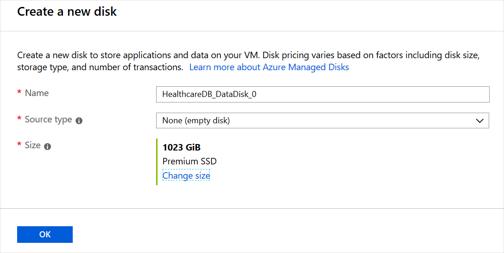
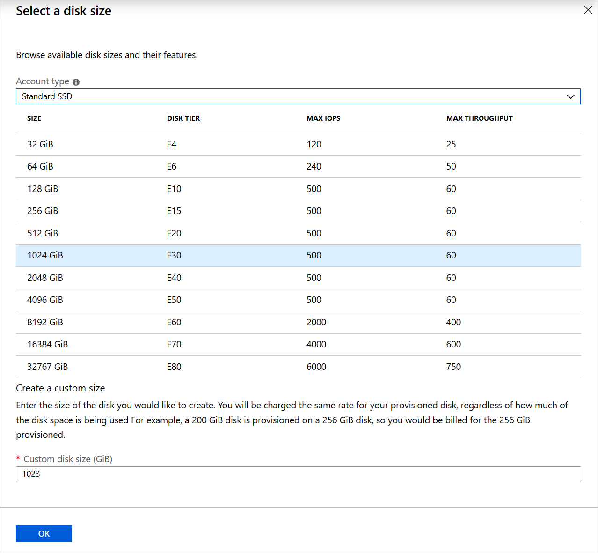

You need to pick the best disk type for your needs.

Here, you'll learn about the performance and behavior of each disk type so that you can make the right choice.

## Disk performance measures

To choose the right disk type, it's critical to understand a disk's performance. Performance is expressed in two key measures:

- **Input/output operations per second (IOPS)**: IOPS measure the rate at which the disk can complete a mix of read and write operations. Higher performance disks have higher IOPS values.
- **Throughput**: Throughput measures the rate at which data can be moved onto the disk from the host computer and off the disk to the host computer. Throughput is also called *data transfer rate* and is measured in megabytes per second (:::no-loc text="MBps":::). Higher performance disks have higher throughput.

For physical disks, solid-state disks (SSDs) usually realize higher IOPS and throughput than hard disk drives (HDDs). Virtual disks that you can choose for an Azure virtual machine are based on SSDs of several types or HDDs. Their performance varies widely based on the disk type that you choose. Let's examine the types that are available.

## Ultra Disks

Ultra Disks provide the highest disk performance available in Azure. Choose them when you need the fastest storage performance, which includes high throughput, high IOPS, and low latency.

The maximum performance of an Ultra disk depends on the size you select, as shown in the examples in this table:

| Disk size (GB) | IOPS | Throughput (MB/s) |
| --- | --- | --- |
| 4 | 1,200 | 300 |
| 8 | 2,400 | 600 |
| 16 | 4,800 | 1,200 |
| 32 | 9,600 | 2,400 |
| 64 | 19,200 | 4,000 |
| 128 | 38,400 | 4,000 |
| 256 | 76,800 | 2,000 |
| 512 | 153,600 | 4,000 |
| 1,024 - 65,536 (sizes in this range increase in 1 TiB increments) | 160,000 | 2,000 |

Ultra Disks can have capacities from 4 GB up to 64 TB. A unique feature of Ultra Disks is that you can adjust the IOPS and throughput values while they're running and without detaching them from the host virtual machine. Performance adjustments can take up to an hour to take effect.

Ultra Disks have some limitations. For a complete list, see [Ultra disk limitations](/azure/virtual-machines/disks-types#ultra-disk-limitations).

Some workloads place intensive loads on disk storage. For example, top-tier databases and SAP HANA are transaction heavy and need fast performance. If you have such a workload, and if Premium SSD managed disks have caused performance bottlenecks, consider using Ultra Disks.

## Premium SSD v2

Premium SSD managed disks are the next tier down from Ultra Disks in terms of performance, but they still provide extremely high throughput and IOPS with low latency. Like Ultra Disks, the performance (capacity, throughput, and IOPS) of Premium SSD v2 managed disks can be independently configured at any time, making it easier for more scenarios to be cost efficient while meeting performance needs.

The following table provides an example of disk capacities and performance maximums.

|Disk Size  |Maximum available IOPS  |Maximum available throughput (:::no-loc text="MBps":::)  |
|---------|---------|---------|
|1 GiB-64 TiBs    |3,000-80,000 (Increases by 500 IOPS per GiB)        |125-1,200 (increases by 0.25 :::no-loc text="MBps"::: per set IOPS)         |

Unlike Premium SSD managed disks, Premium SSD v2 managed disks don't have dedicated sizes. You can set a Premium SSD v2 disk to any supported size you prefer and make granular adjustments to the performance without downtime. Premium SSD v2 managed disks don't support host caching, but benefit significantly from lower latency which addresses some of the same core problems host caching addresses. The ability to adjust IOPS, throughput, and size at any time also means you can avoid the maintenance overhead of having to stripe disks to meet your needs.

Premium SSD v2 managed disks have some limitations. For a complete list, see [Premium SSD v2 limitations](/azure/virtual-machines/disks-types#premium-ssd-v2-limitations).

Premium SSD v2 managed disks are suited for a broad range of workloads such as SQL server, Oracle, MariaDB, SAP, Cassandra, Mongo DB, big data/analytics, and gaming, on virtual machines or stateful containers.

## Premium SSD

Premium SSD managed disks are the next tier down from Premium SSD v2 managed disks in terms of performance, but they still provide high throughput and IOPS with low latency. Premium SSD doesn't have the current limitations of either Ultra Disks or Premium SSD v2. For example, they're available in all regions and can be used with virtual machines that are outside of availability zones.

To adjust the performance of a disk you can change its performance tier (which can be done without detaching the disk from a virtual machine). Also, you can only use premium SSD managed disks with virtual machine sizes that are compatible with premium storage.

This table has examples that illustrate the high performance of premium SSD managed disks:

| Disk size name | Disk size | IOPS | Throughput (:::no-loc text="MBps":::) |
| --- | --- | --- | --- |
| P4 | 32 GiB | 120 | 25 |
| P15 | 256 GiB | 1,100 | 125 |
| P40 | 2 TiB | 7,500 | 250 |
| P80 | 32 TiB | 20,000 | 900 |

With Premium SSD, these performance figures are guaranteed. There's no such guarantee for standard tier disks, which can be impacted occasionally by high demand.

If you need higher performance than standard disks provide, or if you can't sustain occasional drops in performance, use Premium SSD. Also use Premium SSD managed disks when you want the highest performance but can't use Ultra Disks or Premium SSD v2 because of their current limitations. Premium SSD managed disks are a good fit for mission-critical workloads in medium and large organizations.

You can migrate a disk to a Premium SSD managed disk at any time, if you've found that its performance isn't good enough.

## Standard SSD

Standard SSDs in Azure are a cost-effective storage option for virtual machines that need consistent performance at lower speeds. Standard SSDs aren't as fast as Premium or Ultra Disks, but they still have latencies in the range of 1 millisecond to 10 milliseconds and up to 6,000 IOPS. They're available to attach to any virtual machine, no matter what size.

This table has examples that illustrate the performance characteristics of Standard SSDs in several sizes:

| Disk size name | Disk size (GB) | IOPS | Throughput (:::no-loc text="MBps":::) |
| --- | --- | --- | --- |
| E4 | 32 | 500 | 60 |
| E15 | 256 | 500 | 60 |
| E40 | 2,048 | 500 | 60 |
| E80 | 32,767 | 6,000 | 750 |
| | | |

These performance figures aren't guaranteed, but are achieved 99% of the time.

Use Standard SSDs when you have budgetary constraints and a workload that isn't disk intensive. For example, web servers, lightly used enterprise applications, and test servers can all run on standard SSDs.

## Standard HDD

If you choose to use Standard HDDs, data is stored on conventional magnetic disk drives with moving spindles. Disks are slower and speeds are more variable than for SSDs, but latencies are under 10 ms for write operations and 20 ms for reads. As with Standard SSDs, you can use Standard HDDs for any virtual machine.

This table illustrates the performance characteristics of standard HDDs in several sizes:

| Disk size name | Disk size (GB) | IOPS | Throughput (:::no-loc text="MBps":::) |
| --- | --- | --- | --- |
| S4 | 32 | 500 | 60 |
| S15 | 256 | 500 | 60 |
| S40 | 2,048 | 500 | 60 |
| S80 | 32,767 | 2,000 | 500 |
| | | |

Use Standard HDDs when you want to minimize costs for less critical workloads and development or test environments.
