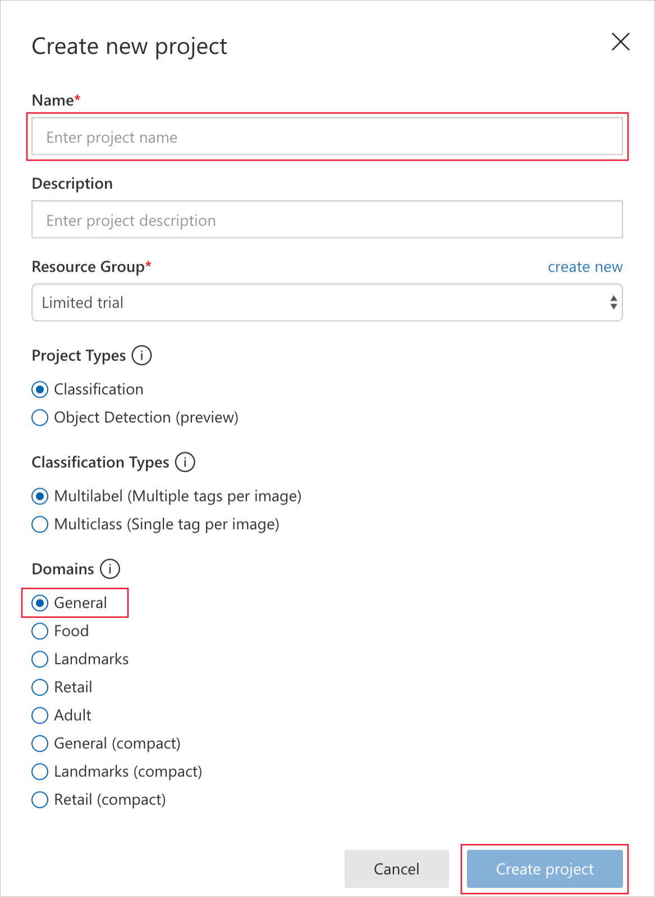

The first step in building an image-classification model with the Custom Vision Service is to create a project. In this unit, you will use the Custom Vision Service portal to create a Custom Vision Service project.

1. Open the [Custom Vision Service portal](https://www.customvision.ai/?azure-portal=true) in your browser. Then select **Sign In**.

1. If you are asked to sign in, do so using the credentials for your Microsoft account. If you are asked to let this app access your info, click **Yes**, and if prompted, agree to the terms of service.

1. Click **New Project** to create a new project.

    

1. In the **Create new project** dialog, name the project *Artworks*.
1. Select the **Resource Group** you want to use for this project. If you do not already have a resource group, select **create new** to create a new resource group.
1. After you select the resource group, the following sections display:
    - **Project Types**: Select Classification.
    -  **Classification Types**: Select **Multilabel** 
    -  **Domains**: Select **General**. 
       
        A domain optimizes a model for specific types of images. For example, if your goal is to classify food images by the types of food they contain or the ethnicity of the dishes, then it might be helpful to select the Food domain. For scenarios that don't match any of the offered domains, or if you are unsure of which domain to choose, select the General domain.

1. Select **Create project** to create our project.

   

The next step is to upload images to the project and assign tags to those images to classify them.