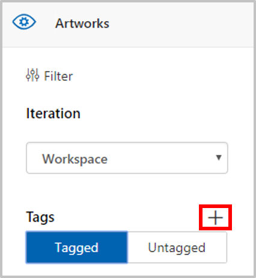
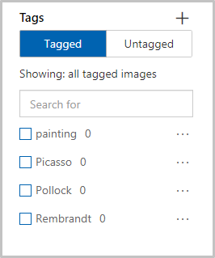
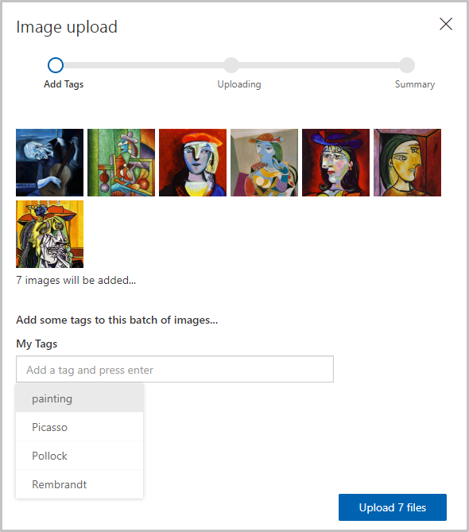
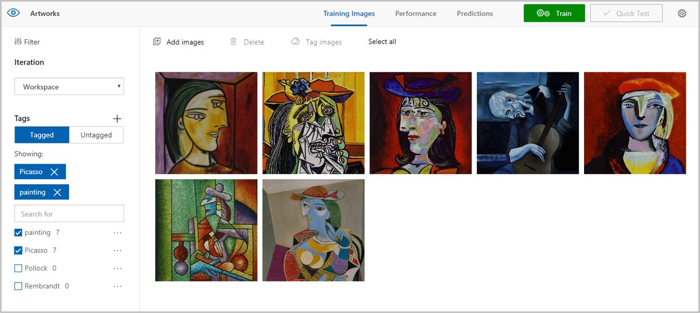
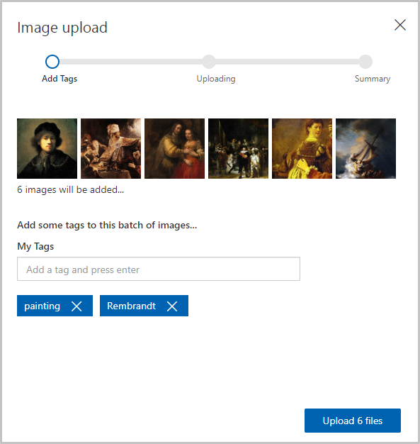

In this unit, you'll add images of famous paintings by Picasso, Pollock, and Rembrandt to the Artworks project. You'll tag the images so the Custom Vision Service can learn to differentiate one artist from another.

1. In the **Artworks** project that we created, select the plus sign (**+**) to the right of **Tags** in the side panel.

     

1. A dialog called **Name the tag** is displayed. Type *painting* into the tag name field and select **Save**. This operation creates the tag *painting* in the tag list. Let's add some more. 

1. Repeat step 2 to add tags with the values *Picasso*, *Pollock*, and *Rembrandt*. The tag list will look like the following when you are finished.

    

    As you can see, the number of images in our project that are tagged with each of these tags is zero. Let's add some images to our project and assign tags.

1. Download [cvs-resources.zip](https://github.com/MicrosoftDocs/mslearn-classify-images-with-the-custom-vision-service/raw/master/cvs-resources.zip) which contains image resources for this module and unzip it to your local machine. 

1. Back in the portal, select **Add images** to add images to the project.

    

1. In the **cvs-resources** folder that you downloaded locally in step 4, navigate to the "Artists\Picasso" folder.

1. Select all of the files in "Artists\Picasso", and then select **Open**.

    

1. The **Image upload** dialog appears and displays thumbnails of all the images we are uploading. Select the **My Tags** field, which opens a dropdown of the tags you can assign these images. 

    

1. Select the tags *painting* and *Picasso* and then select **Upload 7 files** to finish the upload. 

1. Confirm that the images you uploaded are now in the Artworks project, and that the tag list has been updated to show that we've tagged seven images with *Picasso* and *painting*.

    

1. With seven Picasso images, the Custom Vision Service can do a decent job of identifying paintings by Picasso. But if you trained the model right now, it would only understand what a Picasso looks like, and it wouldn't be able to identify paintings by other artists. The next step is to upload some paintings by another artist. 

1. Select **Add images** and select all of the images in the "Artists\Rembrandt" folder in the module resources. Tag them with the labels "painting" and "Rembrandt" (not "Picasso"), and select **Upload 6 files** to upload them to the project.

    

1. Confirm that the Rembrandt images appear alongside the Picasso images in the project, and that "Rembrandt" appears in the list of tags.

    

1. Now add paintings by the enigmatic artist Jackson Pollock to enable the Custom Vision Service to recognize Pollock paintings, too. Select all of the images in the "Artists\Pollock" folder in the module resources, tag them with the terms "painting" and "Pollock", and upload them to the project.

With the tagged images uploaded, the next step is to train the model with these images so it can distinguish between paintings by Picasso, Rembrandt, and Pollock, as well as determine whether a painting is a work by one of these famous artists.