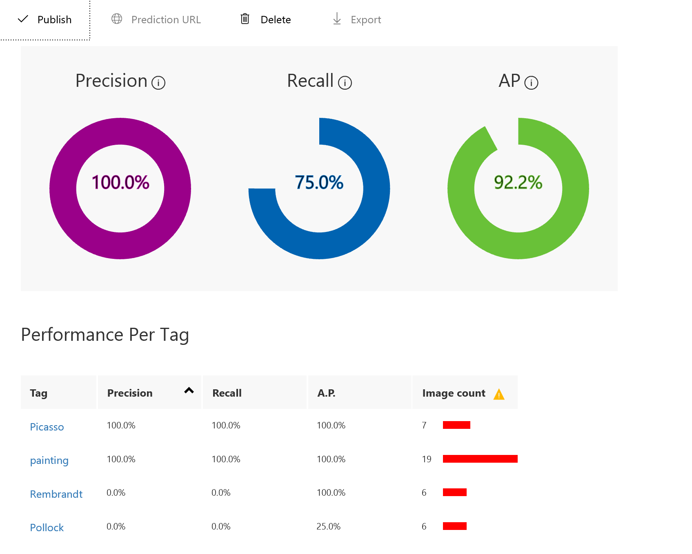

In this unit, you'll train the model using the images uploaded and tagged in the previous exercise. After you train a model, you can refine it by uploading additional tagged images and retraining it.

1. Select **Train** at the top of the page to train the model. Each time you train the model, a new iteration is created. The Custom Vision Service maintains several iterations, allowing you to compare your progress over time.

    :::image type="content" source="../media/2-portal-click-train.png" alt-text="Screenshot of the top bar of the Artworks project with the Train button highlighted." loc-scope="other"::: <!-- no-loc -->

1. Wait for the training process to finish. (It should take only a few seconds.) Then, review the training statistics presented to you for iteration 1. 

    The results show two measures of a model's accuracy, **Precision** and **Recall**. Suppose the model was presented with three Picasso images and three from Rembrandt. Let's say it correctly identified two of the Picasso samples as "Picasso" images, but incorrectly identified two of the Rembrandt samples as Picasso. In this case, the **Precision** would be 50%, because it identified two out of four images correctly. The **Recall** score would be 67% because it correctly identified two of the three Picasso images correctly.

    

In the next exercise, we'll test the model using the portal's Quick Test feature, which allows you to submit images to the model and see how it classifies them using the knowledge gained from the training images.

> [!TIP]
> In addition to training the model using the Custom Vision portal UI, you can also train it by calling the [TrainProject](https://southcentralus.dev.cognitive.microsoft.com/docs/services/d9a10a4a5f8549599f1ecafc435119fa/operations/58d5835bc8cb231380095bed) method in the [Custom Vision Training API](https://southcentralus.dev.cognitive.microsoft.com/docs/services/d9a10a4a5f8549599f1ecafc435119fa/operations/58d5835bc8cb231380095be3).