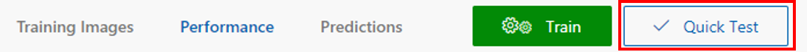
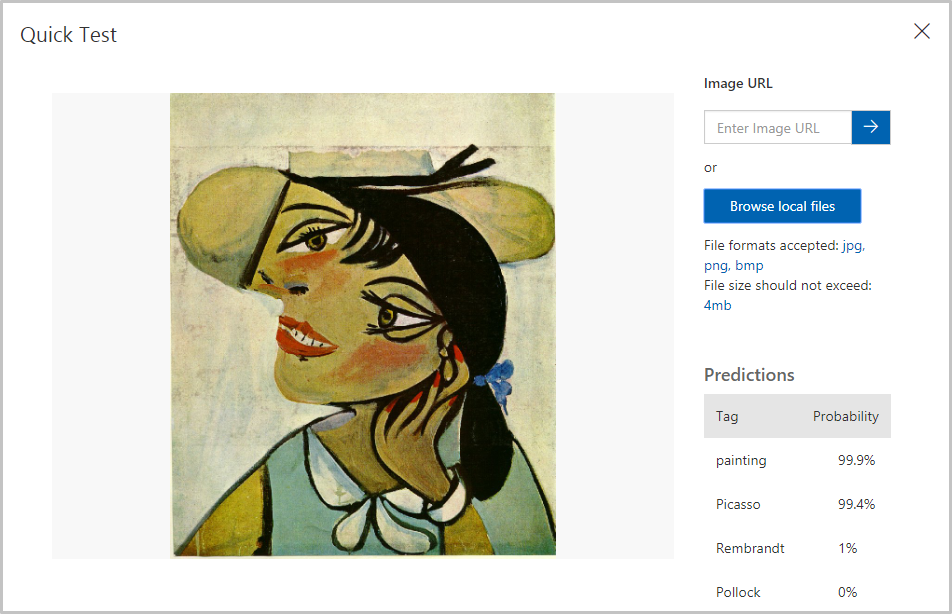
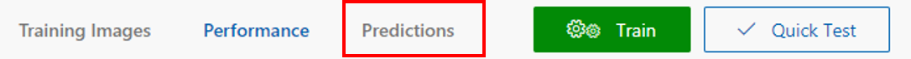

Now that we've trained our model, it's time to test it. We'll give the model new images and see how well it classifies it.

1. Click **Quick Test** at the top of the page.

    

1. Click **Browse local files**, and then browse to the "Quick Tests" folder in the module resources folder you download previously. Select **PicassoTest_01.jpg**, and click **Open**.

    

1. Examine the results of the test in the "Quick Test" dialog. What is the probability that the painting is a Picasso? What is the probability that it's a Rembrandt or Pollock?

    

1. Close the "Quick Test" dialog. Then click **Predictions** at the top of the page.

    

1. Click the test image that you uploaded to show a detail of it. Then tag the image as a "Picasso" by selecting **Picasso** from the drop-down list and clicking **Save and close**.

    > By tagging test images this way, you can refine the model without uploading additional training images.

    

1. Run another quick test, this time using the file named **FlowersTest.jpg** in the "Quick Test" folder. Confirm that this image is assigned a low probability of being a Picasso, a Rembrandt, or a Pollock.

The model is trained and ready to go and appears to be skilled at identifying paintings by certain artists. Let's call the prediction endpoint over HTTP and see what happens.