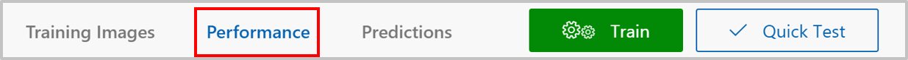
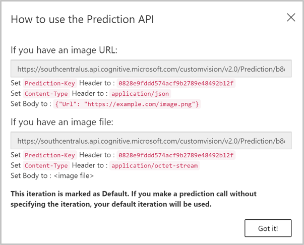
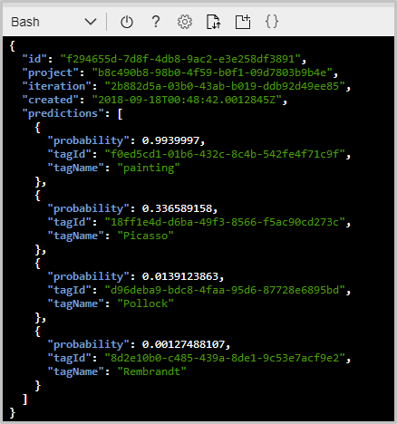

In the last exercise, we tested our trained model using the **Quick Test** feature of the Custom Vision Service portal. This is a great way to quickly check the accuracy of the model with some test images. Let's go a little further and make calls to the prediction endpoint of our model over HTTP.

[!include[](../../../includes/azure-sandbox-activate.md)]

1. Returning to your **Artworks**\* project in the Custom Vision Service portal, select the  **Performance** tab.

    

1. Select **Make default** to make sure the latest iteration of the model is the default iteration.

1. Select **Prediction URL**. This displays a dialog of the information we need to make our calls. 

    

    As the dialog shows, we can call the prediction endpoint and pass it an image URL. We can also pass a raw image to the endpoint in the body of the request.

    Take note of three pieces of information from this dialog.
     - **Prediction-Key**: This key has to be set as a header in all requests. That's what gives us access to the endpoint.
    - **Request URL**: The dialog shows two different URLs. If we're posting an image URL, then use the first URL, which ends in `/url`. If we want to post a raw image in the body of our request, we use the second URL, which ends in `/image`.
    - **Content-Type**: If we're posting a raw image, we set the body of the request to the binary representation of the image and the content type to `application/octet-stream`. If we're posting an image URL, we put that as JSON in the body and set the content type to `application/json`.
    

3. Copy and save the first URL and the `Prediction-Key` value from the **How to use the Prediction API** dialog. 

> [!TIP]
> **cURL** is a command line tool that can be used to send or receive files. It's included with Linux, macOS, and Windows 10, and can be downloaded for most other operating systems. cURL supports numerous protocols like HTTP, HTTPS, FTP, FTPS, SFTP, LDAP, TELNET, SMTP, POP3, etc. For more information, refer to the links below:
>
>- <https://en.wikipedia.org/wiki/CURL>
>- <https://curl.haxx.se/docs/> 
> 
> cURL is already installed in the Azure Cloud Shell in the sandbox. So, we'll cURL in this exercise to make HTTP calls to our endpoint.

2. Execute the following command in the Cloud Shell. Replace **[endpoint-URL]** with the URL you saved from the last step. Replace **[Prediction-Key]** with the value of `Prediction-Key` you saved from the last step. 

    ```azurecli
    curl [endpoint-URL] \
    -H "Prediction-Key: [Prediction-Key]" \
    -H "Content-Type: application/json" \
    -d "{'url' : 'https://raw.githubusercontent.com/MicrosoftDocs/mslearn-classify-images-with-the-custom-vision-service/master/test-images/VanGoghTest_02.jpg'}" \
    | jq '.'
    ```

    When the command completes, you'll see a JSON response similar to the following screenshot. The API returns a probability for every tag in the model. As you can see, with a probability close to 1 for the `"painting"` **tagName** value, this image is definitely a painting. However, it's not a painting by any of the artists with which we trained our model. 

     

3. Try more predictions by replacing the URL in the request body above, with the URLs in the following table. 

    |Image  | URL  |
    |---------|---------|
    |     | `https://raw.githubusercontent.com/MicrosoftDocs/mslearn-classify-images-with-the-custom-vision-service/master/test-images/PicassoTest_02.jpg`        |
    |     |  `https://raw.githubusercontent.com/MicrosoftDocs/mslearn-classify-images-with-the-custom-vision-service/master/test-images/RembrandtTest_01.jpg`       |
    |  |   `https://raw.githubusercontent.com/MicrosoftDocs/mslearn-classify-images-with-the-custom-vision-service/master/test-images/PollockTest_01.jpg`     |
   

Our prediction endpoint is working as expected. Calling the API is as simple as making a HTTP request to the endpoint with a Prediction-Key and an image URL.
