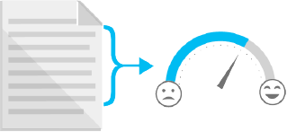

We all want to know what our customers think of our brand, our product, and our message. How does their opinion change over time? Looking for sentiment in what they write can unlock some clues. Sentiment analysis helps answer the question, *What do our customers really want?* It's used to analyze tweets and other social media content, customer reviews, and emails.

 A popular approach to sentiment analysis is to train machine learning models that detect sentiment. However, that process is complex. It involves having good-quality training data that is labeled, creating features from that data, training a classifier, and then using the classifier to predict sentiment of new pieces of text. Not every company has the money and expertise to invest in building AI solutions from scratch. Thankfully, Microsoft and other companies can, and do, invest in state-of-the-art research in these areas. As developers, we get to benefit from their findings through the APIs, SDKs, and platforms they ship. Microsoft Cognitive Services is one such offering.

## Azure Cognitive Services

Microsoft Cognitive Services consists of a set of APIs, SDKs and services. The goal is to help developers make their apps more intelligent, engaging, and discoverable.

Azure Cognitive Services offers intelligent algorithms in vision, speech, language, knowledge, and search. To see what's on offer, check out the [Cognitive Services Directory](https://azure.microsoft.com/services/cognitive-services/directory/). You can try each service for free. When you decide to integrate one or more of these services into your applications, you sign up for a paid subscription. The service we'll use throughout this module is the Text Analytics API, so let's hear more about it.

## Text Analytics API

Text Analytics API is a Cognitive Service designed to help you extract information from text. Through the service you can identify language, discover sentiment, extract key phrases, and detect well-known entities from text. 

In this lesson, we'll get to know the sentiment analysis part of this API. Under the covers, the service uses a machine learning classification algorithm to generate a sentiment score between 0 and 1. Scores closer to 1 indicate positive sentiment, while scores closer to 0 indicate negative sentiment. A score close to 0.5 indicates no sentiment or a neutral statement. You don't have to worry about the implementation details of the algorithm. You focus on using the service by making calls to it from your app. As we'll see shortly, you structure a **POST** request, send it to the `/sentiment` endpoint, and receive a JSON response that tells you a *sentiment score*.

We'll first experiment with the Text Analytics API using an online API testing console. Once we're comfortable with the API, we'll use it in a scenario to detect sentiment in messages so that we can sort them for further processing.