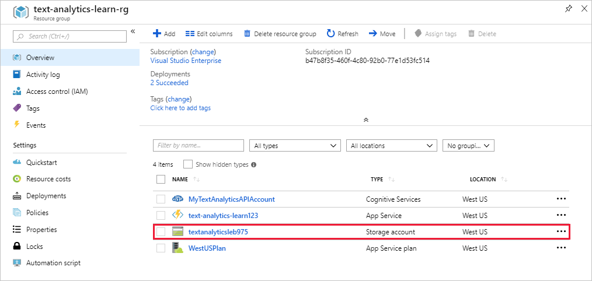
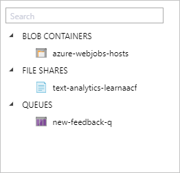
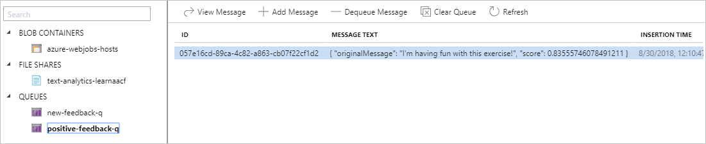
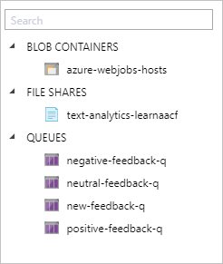

Let's look at our solution architecture again.

As you can see on the right side of this diagram, we want to send messages to three queues. So, we'll define those connections as output bindings in our function. We could create those bindings through the **Output binding** UI. However, to save time, we'll edit the config file directly.

## Add output bindings to function.json

1. Select our function, [!INCLUDE [func-name-discover](./func-name-discover.md)], in the Function Apps portal.

1. Under the **Developer** section, select **Code + Test**.

1. Select **function.json** from the dropdown to open the config file in the editor.

1. Replace the entire contents of **function.json** with the following JSON, and select **Save**.

[!code-json]

We've added three new bindings to the config.

- Each new binding is of type `queue`. These bindings are for the three queues that we'll populate with our feedback messages once we know the sentiment of the feedback.
- Each binding has a direction defined as `out`, since we'll post messages to these queues.
- Each binding uses the same connection to our storage account.
- Each binding has a unique `queueName` and `name`.

Posting a message to a queue is as easy as saying, for example,  `context.bindings.negativeFeedbackQueueItem = "<message>"`.

## Update the function implementation to sort feedback into queues based on sentiment score

The goal of our feedback sorter is to sort feedback into three buckets: positive, neutral, and negative. So far, we have our input queue, our code to call the Text Analytics API, and we've defined our output queues. In this section, we'll add the logic to move messages into those queues based on sentiment.

1. Navigate to our function, [!INCLUDE [func-name-discover](./func-name-discover.md)], and open `index.js` in the code editor again.

1. Replace the implementation with the following code, and select **Save**.

[!code-javascript]

We've added the highlighted code to our implementation. The code parses the response from the Text Analytics API cognitive service. Based on the sentiment score, the message is forwarded to one of our three output queues. The code to post the message is just setting the correct binding parameter.

## Try it out

To test the updated implementation, we'll head back to the Storage Explorer.

1. Navigate to your resource group in the **Resource groups** section of the portal.

1. Select <rgn>[sandbox resource group name]</rgn>, which is the resource group used in this lesson.

1. In the **Resource group** panel that opens, locate the Storage Account entry, and select it.
    

1. Select **Storage Explorer (preview)** from the left menu of the Storage Account main window. This action opens the Azure Storage Explorer inside the portal.

    

    We have one queue listed under the **Queues** collection. This queue is [!INCLUDE [input-q](./q-name-input.md)], which is the input queue we defined in the preceding test section of the module.

1. Select [!INCLUDE [input-q](./q-name-input.md)] in the left-hand menu to see the data explorer for this queue. As expected, the queue had no data. Let's add a message to the queue using the **Add Message** command at the top of the window.

1. In the **Add Message** panel, enter "I'm having fun with this exercise!" into the **Message text** field, and select **OK**.

1. The message appears in the data window for [!INCLUDE [input-q](./q-name-input.md)]. After a few seconds, select **Refresh** at the top of the data view to refresh the view of the queue. Observe that the message disappears after a while. So, where did it go?

1. Right-click the **QUEUES** collection in the left-hand menu. Observe that a *new* queue has appeared.

    

    The queue [!INCLUDE [positive-q](./q-name-positive.md)] was automatically created when a message was posted to it for the first time. With Azure Functions queue output bindings, you don't have to manually create the output queue before posting to it! Now that we see an incoming message has been sorted by our function into [!INCLUDE [positive-q](./q-name-positive.md)], let's see where the following messages land.

1. Using these same steps, add the following messages to [!INCLUDE [input-q](./q-name-input.md)].

    - "I hate broccoli!"
    - "Microsoft is a company"

1. Select **Refresh** until [!INCLUDE [input-q](./q-name-input.md)] is empty once again. This process might take a few moments and require several refreshes.

1. Right-click the **QUEUES** collection and observe two more queues appearing. The queues are named [!INCLUDE [neutral-q](./q-name-neutral.md)] and [!INCLUDE [negative-q](./q-name-negative.md)]. This might take a few seconds, so continue refreshing the **QUEUES** collection until new queues appear. When complete, your queue list should look like the following.

    

1. Select each queue in the list to see whether they have messages. If you added the suggested messages, you should see one in [!INCLUDE [positive-q](./q-name-positive.md)], [!INCLUDE [neutral-q](./q-name-neutral.md)], and [!INCLUDE [negative-q](./q-name-negative.md)].

Congratulations! We now have a working feedback sorter! As messages arrive in the input queue, our function uses the Text Analytics API service to get a sentiment score. Based on that score, the function forwards the messages to the appropriate queue. While it seems like the function processes only one queue item at a time, the Azure Functions runtime will actually read batches of queue items and spin up other instances of our function to process them in parallel.