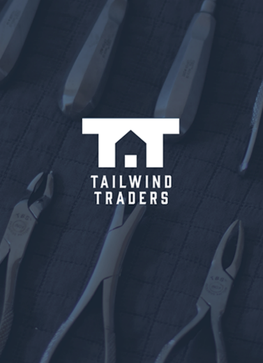
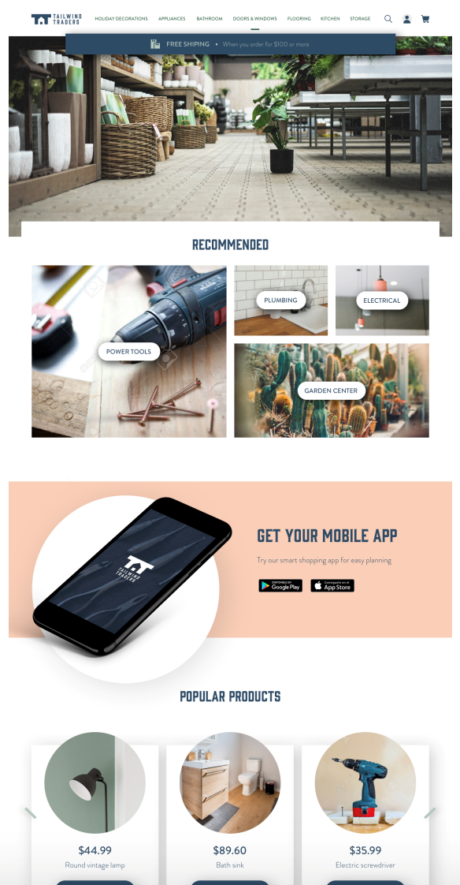
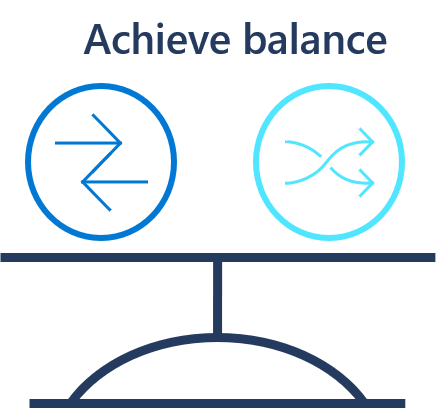

Tailwind traders, is a modern commerce company. For 30+ years, tailwind has been a popular retail destination growing to over 50 physical stores. Several years ago, their CEO saw changes coming in retail and bought a competing ecommerce start up that was growing aggressive in niche markets. Today, the company is seen as an innovative leader with customer-focused local store fronts.

## Retail innovation

Tailwind traders' retail innovation team uses technology to continually redefine tailwind's position as a leader in modern commerce.

The retail innovation team reports to the companies chief technology officer (CTO), who was the CEO of the acquired ecommerce start up. Those technology solutions are the primary hub for interactions with customers. Those solutions impact 60% of global revenue, and produces 30% of gross sales annually. A few examples of those innovations include:

- Boundless commerce: originally a simple ecommerce solution, this custom-built platform now provides online and offline experiences for customers. Purchases can be made from the platform. But the customer's viewing history is also used by the mobile app to customize the retail experience with in-store ads, shopping lists, and other interactions.
- Analytics, AI, and robotics innovation: the team is experimenting with drone delivery, autonomous warehousing, and other AI lead approaches to reduce cost, scale through automation, and improve customer experiences. These experiments are built on big data, analytics, and AI solutions.

## Information technology

Beyond new innovations, tailwind's central IT teams support all of the back-office and store technologies.

The retail innovation team is a division of tailwind traders' information technology team. That team is led by tailwind trader's CIO. When you think of tailwind traders, you probably first think of ecommerce and innovation. This is just the beginning of tailwind's technical capability and a small portion of the overall IT spend. Tailwind supports 3,500 employees less than 100 are dedicated to information technology. The innovation team consists of only 20 employees, mostly developers. Beyond core innovation, the IT team supports the following types of technologies:

- **Smart storefronts:** Environmental controls, doors, lighting, interactive shelves, in-store displays and advertisements, and over 500 point of sales systems
- **Corporate headquarters:** More than 900 employees are hosted in corporate headquarters with technology systems covering best of breed solutions to support processes across real estate, logistics, supply chain, pricing, human resources, employee schedules/tracking, payroll, etc...
- **End user workstations:** Mostly desktop-based with a growing percentage of employees opting for mobile, BYOD (bring you own device), in-store kiosks, and virtual desktop solutions.
- **Central operations:** The IT team provides ongoing technical operations for all IT and retail innovations assets.

## CIO transition (new strategy)

The CIO of tailwind traders has recently retired. The new CIO is focused on improving technical operations in a number of areas to fuel greater innovation throughout the company, while limiting disruptions to core business operations. The cloud will play an important role in this transition.

A cornerstone of this strategy will be a shift in the operating model, moving from a centralized command and control operating model, to a model that focuses on delegated responsibilities led by a cloud center of excellence team. This transition is expected to take several years. But the CIO will be looking for small incremental steps to transition in each of the coming projects.

## IT portfolio overview

Tailwind traders have three datacenters currently. One is located within the same office building that their employees work in; this building and datacenter is owned by tailwind traders. The two other datacenters are in separate locations and are leased from datacenter providers. Their datacenters are a mix of physical servers and virtual servers. The virtualisation platforms they use are a mix between Hyper-V and VMware as over the years they have had different people in charge of the IT department who have had different strategy ideas.

Primarily their servers run Windows Server, which is a mix of Windows Server 2008 R2, Windows Server 2012 and Windows 2016. They have a few Windows Server 2019, but that is the exception instead of the rule. Upgrading the operating systems to the latest or having a consistent strategy has never been a priority for the organization, despite various IT team members trying to push that message.

There are a few Linux and other open-source servers, but the IT operations team aren't familiar with them as the development team have introduced them with no real collaboration between the teams.

The leases for the two datacenters are due to run out in 18months and 2 years. The IT manager and finance director have been talking and they don't want to renew the leases instead looking at doing a project that will upgrade, consolidate and use the cloud as a replacement datacenter. The new CIO is using this project as an opportunity to rethink IT operations.

## Team

- **Chief information officer (CIO):** This is the first transformation effort to start since she accepted the new role. As such, she'll keep a close eye on the project and will be examining how IT operates in the cloud.
- **Chief technology officer (CTO):** The smaller of the two datacenters hosts a number of IT assets, including the experiments being development by the retail innovations team. That datacenter also hosts a number of mainstreamed innovations that are now considered production IT assets. The CTO wants to ensure they will be able to continue to innovate and that the existing innovations will be properly supported.
- **Project manager:** Part of the IT department and they help to keep projects on time, on budget and ensure all the right stakeholders are involved.
- **Central operations/infrastructure team:** The ops team are currently in charge of the datacenters, looking after the hardware maintenance, operating systems, patch management, networking, out of hours support, etc. Most of the team are very familiar with the current infrastructure, have very little coding experience and the majority hold Microsoft qualifications relating to Windows Server.
- **Developer:** The in-house development team make the website for the online store that tailwind traders host out of their own datacenters.
- **IT manager:** In charge of the ops, developer and project management teams. Is looking to make the IT department run better and replace old servers and look to the future to help make tailwind traders more competitive and also make things better for his ops team who have to juggle a lot of different systems.
- **Finance director:** Is looking to reduce costs where he can from the budget. The finance director is very familiar with the capex expenditure he has to deal with in terms of the IT department and equipment.
