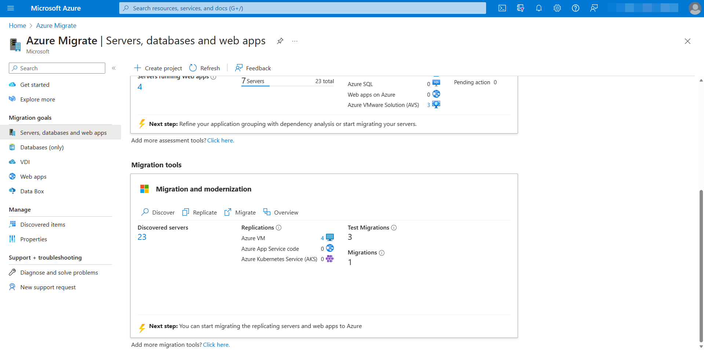
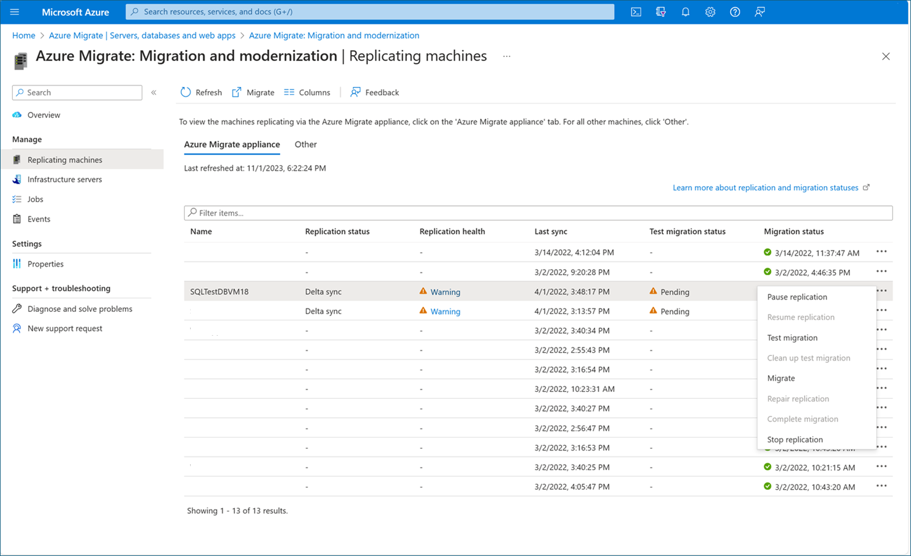

In this unit, you'll review Azure Migrate and how to use it to migrate Virtual Machines to Azure.

## Virtual machine replication

Add Azure Migrate: Server Migration to your Azure Migrate dashboard, which carries over machines and insights from the assessment completed during the CAF Plan module.

Prepare on-premises machines for migration to Azure by following the steps described here: [Verify required changes before migrating](https://docs.microsoft.com/en-us/azure/migrate/prepare-for-migration#verify-required-changes-before-migrating).

Once you had completed the previous step, you can begin your replication by clicking Replicate in the Server Migration tool window. Note: In the portal, you can select up to 10 VMs at once for migration. To migrate more machines, add them to groups in batches of 10.

> [!div class="mx-imgBorder"]
> 

Enable initial replication based on available bandwidth.Initial replication takes more bandwidth vs. on-going incremental replications.

Times for replication will vary based on number and size of virtual machines along with connection speeds between your data center and Azure. Hence, you must consider the network bandwidth available for the replication when planning your migration waves. 

Azure Migrate (agentless migration) replicates up to 300 VMs simultaneously. For best performance, we recommend creating multiple batches of VMs if you have more than 50.

For each server configured for replication, monitor initial and on-going replication progress closely.

## Pre-Migration activities

Before executing the actual migration of your workloads, you should ensure business and technical requirements have been fulfilled for each of the workloads including completing a business change plan.

**Business change plan:** Ensure that the following aspects of the business change plan are properly communicated to avoid business disruption:
- End-user training (if needed) is completed (or at least planned).
- Any outage windows have been communicated and approved.
- Production data has been synchronized and validated by end users.
- Validate promotion and adoption timing; ensure timelines and changes have been communicated to end users.

**Technical pre-requesites:** Technical requirements may vary depending on your workload and environment, but at least they should include:
- Verifying that you have access and administration permissions to the virtual machines.
- Verifying the health of the Workload and Virtual Machines.
- Adjusting Firewall and Network Security Groups rules to ensure proper connectivity to and from the Workload's virtual machines once they have been migrated to Azure.
- Defining a rollback plan.
- Running a migration test.
- Taking a backup of your Virtual Machines before the migration.

## Virtual Machine migration test

Once all your targeted virtual machines are replicated and into Azure, you can run a migration test before running a full migration to Azure.

The process runs a prerequisite check, prepares for the test, creates a new test virtual machine, and starts it. This process will take a few minutes.

It is highly recommend that you do this at least once for each machine, before you migrate it.

- Running a test migration checks that migration will work as expected, without impacting the on-premises machines, which remain operational, and continue replicating.
- Test migration simulates the migration by creating an Azure VM using replicated data (usually migrating to a non-production VNet in your Azure subscription).
- You can use the replicated test Azure VM to validate the migration, perform app testing, and address any issues before full migration.

## Migrating the virtual machines into production

Once you’re ready for the production migration, select **Migrate** from the replicating machines window. That process will prompt you to shut down the virtual machine to avoid any data loss and perform a final replication. It is recommended to do this during off peak business hours, because the virtual machine will be down for a few minutes.

> [!div class="mx-imgBorder"]
> 

Now it will run through the production migration process and you can check the status as it validates the pre-requisites, prepares for migration, creates the Azure VM and starts the Azure VM.

Install the Azure VM Linux agent on the migrated machines if the machine has Linux OS. Azure Migrate automatically installs the Azure VM agent for Windows VMs during migration.

## Release steps
After the migration has taken place, you can release production traffic to the migrated VMs (cutover) by updating the Workload's DNS Records and re-rerouting network traffic to Azure. Before doing so, you should evaluate the workloads to ensure everything is working fine and that the new environment can be promoted to Production.

**Additional Technical Readiness:** Complete **post-migration activities** required to adjust your workload configuration to the target environment. That tipically includes:** 
- Update any application configuration such as connection strings if required.
- Deploy and configure Azure Load Balancers if needed.
- Lock down and limit inbound network access using network security groups.
- Deploy the SQL IaaS Agent Extension to your Virtual Machines running SQL Server.
- Deploy Azure Disk Encryption to secure the disks from data theft and unauthorized access.
- Tag Azure resources.

**Technical validation** You would want to consider validation of the technical readiness for your workloads. The following are a few suggested tests to complete:
- **System testing:** Validate login with domain accounts. Validate IP address has been assigned to server in network settings (E.G. TCP/IP settings) for the OS. Validate DNS resolves and DNS servers are configured in network settings (E.G. TCP/IP settings) for the OS. Verify the Operating System and Applications running in each Virtual Machine are healthy.
- **Network connectivity testing:** Validate that all required connectivity is in place and fix any potential issues.
- **Dependency testing.** Ensure that all workload components have been migrated and all application dependencies are accessible from the migrated assets. Validate application URLs dependencies. Validate access to OS licensing endpoints (E.G. Azure KMS endpoints).
- **Network isolation testing.** Test and monitor network traffic to ensure proper isolation and no unexpected network vulnerabilities. Also validate that any network routing to be severed during cutover is not experiencing unexpected traffic.
- **End-user route testing.** Validate traffic patterns and routing for end-user traffic. Ensure that network performance aligns with expectations.
- **Validate Workload and Virtual Machine monitoring.** Enable monitoring with via Azure Monitor, or verify if using existing tool.
- **Validate Patch Management.** Enable Azure Automate Update Management, or verify if using existing tool.
- **Validate VM Antivirus/endpoint protection.**
- **Business continuity and disaster recovery (BCDR) testing.** Validate that any backup and recovery SLAs are established. At minimum, you will want to configure a backup using Azure Backup or an alternate solution. If possible, perform a full recovery of the assets from the BCDR solution.  For more advanced SLAs, you may also want to consider replication to a second region using Azure Site Recovery.
- **Final performance check:** Execute any automated performance testing. Ensure that performance testing has been completed and approved by end users. 

**Final business validation.** After the technical readiness have been validated, the following final steps can complete the business validation:
- **Perform UAT tests:** Ensure the workload is tested and validated by the end users.

**Communicate and execute cutover plan:** After the technical and business validations had been completed, communicate the cutover and execute accordingly.

Complete clean-up tasks for the remaining on-premises servers. Such tasks may include removing the servers from local backups and removing their raw disk files from storage-area network (SAN) storage to free up space. Update the CMDB and documentation related to the migrated servers to reflect their new IP addresses and locations in Azure.

Once the final step in the list above is completed, the VM and supported workload are considered released, completing the final phase or discipline of migration for that workload.