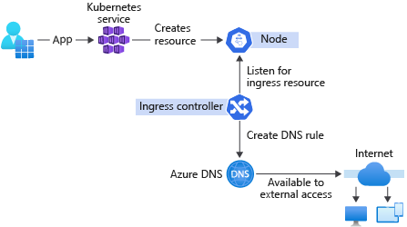

In the exercise, we deployed an express.js container image to AKS. To connect the image to the management web app, we can expose the API by an AKS add-on: **HTTP application routing**. This add-on makes it easy to access applications on the cluster.

## Connecting the pieces together

An AKS cluster blocks all inbound traffic to the cluster to assure network security. To expose applications hosted on AKS to the world, you need to open specific ports. For example, if you were to host a website using AKS, you'd need to manually create an exception that allows incoming connections to request the website files.

The Kubernetes API server receives network traffic and routes the traffic to the correct container. To open a port to AKS for the outside world to use, HTTP application routing makes it easy to access applications on the cluster using an **ingress controller**.

## Ingress controllers

Ingress controllers allow you to deploy and expose your applications to the world, without the need to configure network-related services.

Ingress controllers allow requests to be served from a single DNS output. When a new service is deployed, ingress controllers create a DNS record for you.

This functionality allows for easy access to the resource through the internet, without the need for additional configuration. Having ingress controllers automatically create DNS records for you is especially useful, as AKS can create multiple instances of the same container to meet demand and automatically link them to a load balancer as required.

## Reliable rolling deployments

Once you've set up your manifest files, Kubernetes provides a rich feature set for deployment options. Kubernetes offers a low-resistance path to deployment features, such as:

* Canary deployments
* Deploying services in parallel
* Taking only a specific amount of system capacity offline at a time
* Circuit Breakers if a deployment malfunctions

Many of these features are possible with other systems, but are much harder to implement and require very complicated codebases.

### Seamless horizontal scale-out

Significantly scaling up your app in a test environment to do some performance testing used to require a DevOps ticket that would take several days to resolve. Today, Kubernetes has built-in functionality to replicate pods and guarantee the availability of a specified number of identical pods. This replication can be done by a ReplicaSet manifest file, similar to the deployment manifest file you created in the last exercise.

## Connecting the smart fridge solution

In our scenario, we’ve hosted a Node container in AKS to process inventory messages from smart fridges. In order for a management web app to receive information from the Node container, we need to enable HTTP application routing and create an ingress manifest file.

If we develop and redeploy the express.js container, the ingress manifest file will allow AKS to automatically route requests to new containers. AKS also makes it easy to enable HTTP application routing, because it’s an option we can select in the Azure portal.

The ingress functionality means we only have to configure to the Node container once, and we don't have to reconfigure routing if we update our code or redeploy. This is particularly useful to decrease development overheads with CI/CD pipelines, a common feature of a Cloud Native Application.
