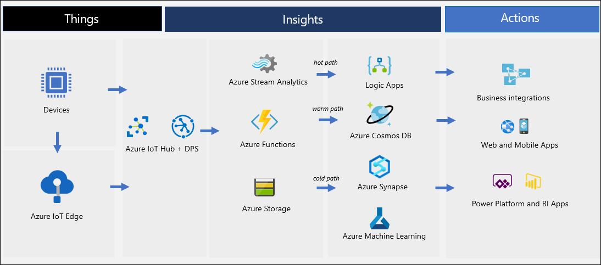

Adatum's management team wants to leverage IoT capabilities to extend the scope of services it delivers to its customers, including automated monitoring, alerting, and self-servicing of smart appliances. Your development team plans to provide the desired functionality by implementing a robust and feature-rich IoT pipeline in the manner that adheres to the foundational design principles of cloud-native applications. To accomplish this objective, you decided to explore the concepts of IoT services architecture.

## What is IoT services architecture?

The term Internet of Things (IoT) represents a network of interconnected devices involved in generating, processing, or storing sensor-generated telemetry. At a high level, an IoT solution consists of two primary groups of components:

- Device-side, comprising devices that serve primarily as sources of telemetry but might also perform some of its initial processing and analytics.
- Cloud-side, comprising of cloud-based services optimized for data collection, persistence, and analytics.

Another approach to the IoT services architecture divides it into Things, Insights, and Actions. Things represent IoT devices generating telemetry that, through Insights-based analysis, is turned into Actions, which deliver meaningful business benefits. As an example, consider a sensor of a smart fridge (thing), which sends temperature data. That data serves as the basis of evaluation whether the fridge is fully operational (the insight). The insight, in turn, can trigger an alert leading to an updated maintenance schedule (the action).

A more detailed look at Azure IoT architecture allows you to distinguish between its core and optional components.

Core components include:

- IoT devices with the ability to securely register with the cloud as well as the support for sending and receiving data.
- A cloud gateway service, serving the role of a hub that relays data from devices and provides device management capabilities.
- Stream processors that consume the device data, integrate with data processing components, and deliver data into storage.
- A range of data stores that provide data persistence and aggregation. Storage can be part of the hot or warm path, which consists of data required for near-real time reporting and visualization, and cold path, which consist of data stored longer term and used for batch processing.
- Analytics services that retrieve insights from raw telemetry data and integrate with business processes and systems, such as Customer Relationship Management (CRM).
- Programming and management interfaces that simplify administration of IoT solutions. 

Optional components include:

- IoT Edge devices serving as brokers for management and data flow for IoT devices, whenever direct communication with the cloud is restricted or not possible. They might, for example, play a role in device provisioning, data filtering, aggregation, and buffering, protocol translation, or event rules processing.
- Data transformation services performing such ingress tasks as protocol translation, data conversion, and data aggregation.
- User management subsystem implementing role-based access control, allowing for delegation of management tasks. 
- Machine learning analyzing telemetry data to detect trends and correlations, providing such functionality as predictive analytics.
- Bulk device provisioning services, accommodating scenarios involving large scale deployments.

## IoT services data pipeline

The flow of device-generated data typically consists of several stages, including:

- Storage - preserving data for short or longer term, relying on such technologies as in-memory caches, temporary queues, databases, and data lakes.
- Routing - delivering data to one or more storage endpoints, analysis processes, and actions. 
- Analysis - evaluating and processing data records based on customizable criteria.
- Action - responding to customizable rules in order to address a condition indicated by the state or value of collected data. 

## Azure IoT services and technologies

Microsoft offers a comprehensive portfolio of services that deliver various types of IoT functionality, including:

- Azure IoT Central. This service implements a wide range of IoT capabilities, including telemetry collection, processing, and analytics as well as secure device management. Azure IoT Central helps you minimize custom development efforts and administrative overhead, lets you leverage cloud agility and scalability, and supports built-in integration with a number of other Azure services. Azure IoT Central not only simplifies development and implementation of custom IoT solutions, but also supports ad-hoc testing with built-in mock devices. Its integration with Time Series Insights and the ability to define rules for generating alerts might help you eliminate the need for dedicated stream processing services, such as Stream Analytics. 
- Azure IoT Hub. This service is optimized for reliable and secure bidirectional communications between IoT devices and cloud services. Just as Azure IoT Central, it incorporates Device Provisioning Service (DPS) as a helper service for in-bulk, zero-touch, just-in-time provisioning of IoT devices.
- Azure Event Hub. This service offers auto-scalable ingestion of telemetry data at very high throughput rates. Event Hubs are suitable for supplementing Azure IoT Hub and Azure IoT Central services in scenarios that involve collection of non-device telemetry, originating from such sources as weather feeds or social media streams. Unlike specialized IoT solutions, Event Hubs don't offer per-device identity and device management capabilities. 
- Azure Logic Apps. This service is optimized for scenarios that involve automating and integrating business processes. It relies on a visual designer, included in the Azure portal, to build workflows that include connectors to a wide range of first-party and third-party systems, without the need for custom programming.
- Azure Functions. This service is highly versatile, but, in the context of IoT scenarios, its primary use cases include processing of telemetry egressing Azure IoT Hub and Azure IoT Central. For example, an Azure IoT hub could forward its telemetry to an Azure function in order to perform a simple format conversion and store the results in Azure Cosmos DB. Similarly to Azure Logic Apps, Azure Functions facilitate business integration scenarios.
- Azure Stream Analytics. This is a real-time analytics and complex event-processing engine optimized for high volumes of streaming data, originating from IoT devices, social media feeds, and applications. Azure Stream Analytics supports such operations as windowing, stream aggregations, and external data source joins. 
- Azure Time Series Insights. This is a highly-performant analytics, storage, and visualization service for time series data, providing such capabilities as filtering and aggregation. Its visualizations capabilities include support for overlays of different time series, dashboard comparisons, accessible tabular views, and heat maps. Azure Time Series also offers a JavaScript controls library that facilitates embedding time series charts into custom applications. It is optimized for scenarios that require aggregation over large sets of data.
- Azure Data Lake Storage. This is a distributed data store capable of persisting large amounts of data without requiring its transformation or schema definition. Its extensive processing capabilities, available through integration with Azure Data Lake Analytics, make it a suitable choice for big data analytics scenarios. 
- Azure SQL Database. This is a managed relational data store, optimized for scenarios that require transactional support, enforceable schema constraints, and involve complex queries. 
- Azure Cosmos DB. This is a cloud-native NoSQL database offering such features as multi-region writes, auto-scaling, support for multiple consistency models, schema-on-read, and latency guarantees for read and write operations. 
- Azure Databricks. This service offers managed, Spark-based processing of big data. In the context of IoT scenarios, you can leverage its support for advanced analytics, beyond the functionality built into Azure IoT Central applications.
- Azure Synapse. This is an managed analytics service optmized for massive parallel processing workloads. Azure Synapse typically hosts aggregated data and acts as the data source for business intelligence (BI) tools.
