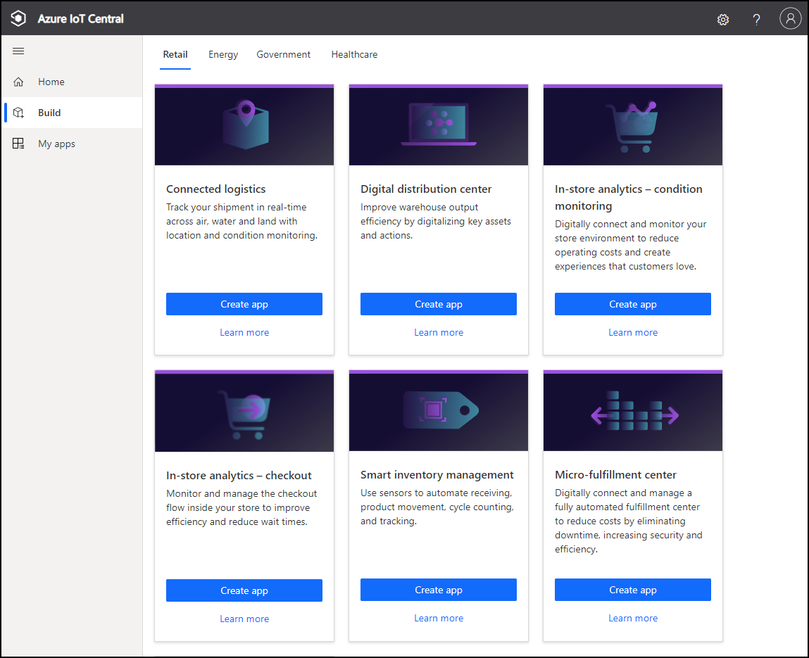
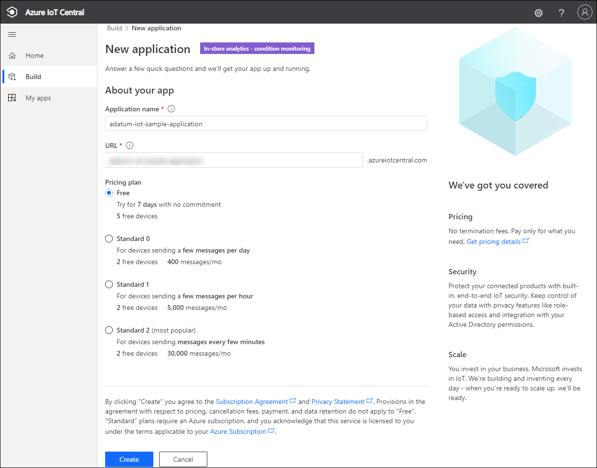
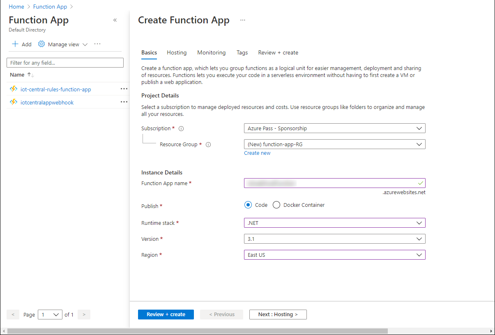
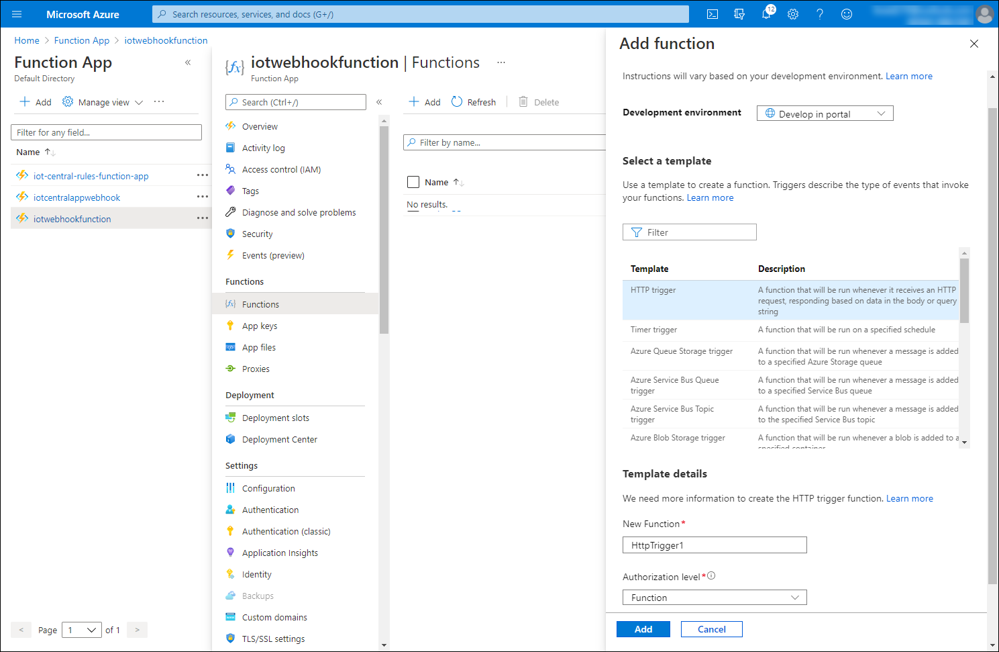
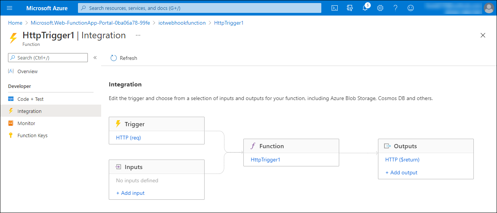
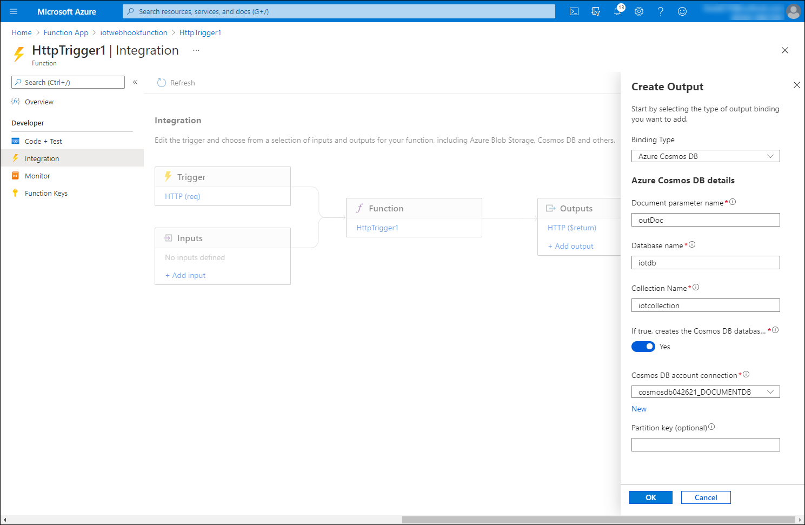
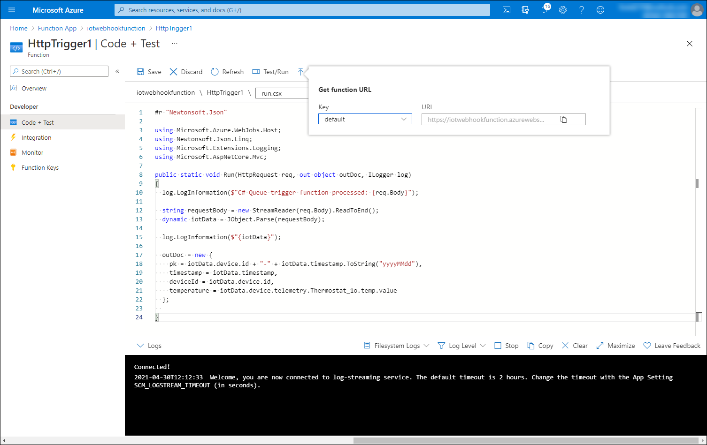
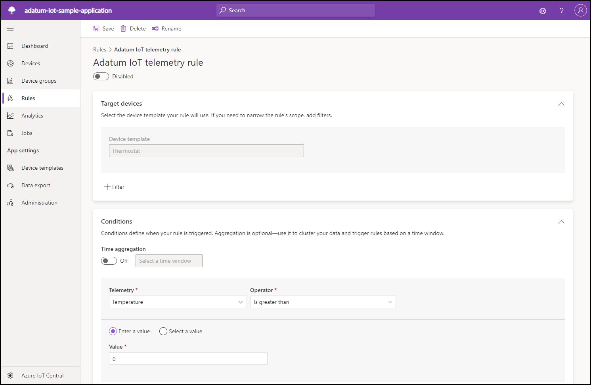
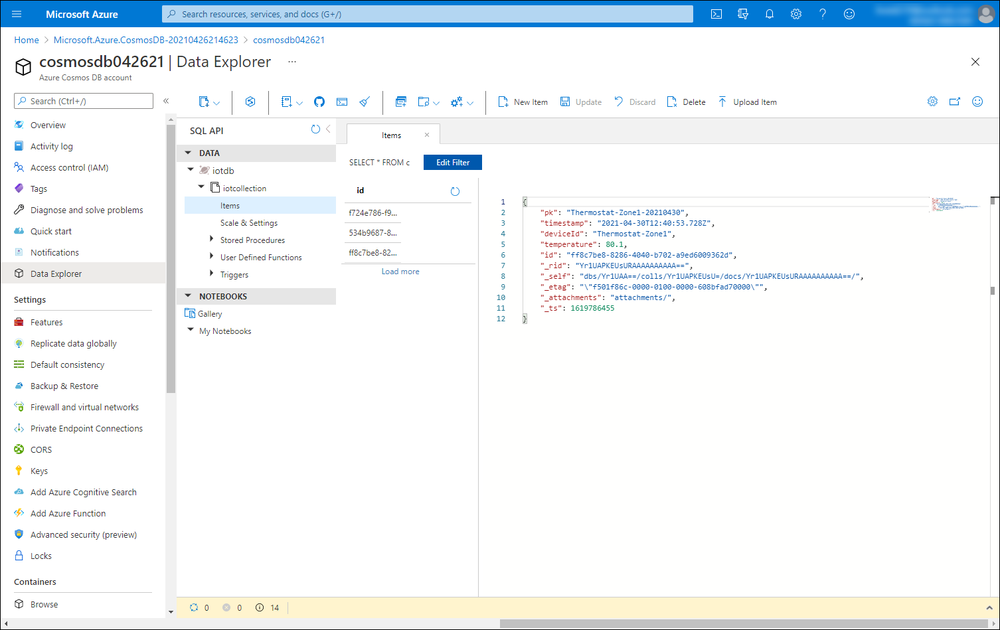

This exercise provides an overview of setting up collection, processing, and storage of IoT telemetry generated by using an Azure IoT Central application. For more in-depth knowledge and tutorials regarding these topics, refer to:

* [IoT Central solution builder guide](https://docs.microsoft.com/azure/iot-central/core/overview-iot-central-solution-builder)
* [Serverless database computing using Azure Cosmos DB and Azure Functions](https://docs.microsoft.com/en-us/azure/cosmos-db/serverless-computing-database)
* [Configure rules](https://docs.microsoft.com/azure/iot-central/core/howto-configure-rules)

In this exercise, you will:

* Create an Azure IoT Central application based on a pre-defined template
* Create an Azure function that uploads telemetry data to an Azure Cosmos DB collection
* Configure a telemetry rule of the Azure IoT Central application
* Validate the functionality of Azure IoT Central telemetry pipeline consisting of an Azure Function app and an Azure Cosmos DB collection

## Prerequisites

* An Azure subscription
* A Microsoft account or an Azure AD account with the Global Administrator role in the Azure AD tenant associated with the Azure subscription and with the Owner or Contributor role in the Azure subscription
* Completed the exercise unit #4 Set up Azure Cosmos DB

## Create an Azure IoT Central application

1. Start a web browser, navigate to the [Welcome to IoT Central page](https://apps.azureiotcentral.com/). 
1. On the **Welcome to IoT Central** page, in the upper right corner, select the avatar icon.
1. When prompted, sign in to access the Azure subscription you will be using in this module.
1. On the left side of the **Welcome to IoT Central** page, expand the vertical menu and select the **My apps** menu entry. 
1. On the **My apps** page, select **+ New application**. 
1. On the **Build your IoT application** page, ensure that the **Retail** tab is selected, review the available application templates and, in the **In-store analytics - condition monitoring** tile, select **Create app**.
1. On the **New application** page, configure the following settings and select **Create**.

   

   | Setting | Configuration |
   | --- | --- |
   | Application Name | Type **adatum-iot-sample-application**. |
   | Application URL | Type a unique name consisting of lower-case letters, digits and/or dashes, starting with a letter. |
   | Pricing plan | Select **Free**. |

   

   * This will display the **Dashboard** page
   * Now review telemetry and analytics of the sample Azure IoT Central application

1. On the **Dashboard** page of the IoT Central Application portal, in the vertical menu on the left side, select **Devices**.
1. On the **Devices** page, in the **Thermostat** section, select **Thermostat-Zone1**.
1. On the **Devices** page, on the **Thermostat-Zone1** pane, review the content of the **Dashboard** tab.

   

1. On the **Devices** page, on the **Thermostat-Zone1** pane, select the **Raw data** tab header and review the content of the **Raw data** tab.

   


## Create an Azure function that logs an HTTP request payload

* In this task, you will create an Azure Function app that implements the HTTP webhook functionality. You will leverage this functionality to forward the telemetry data from the Azure IoT Central application by creating an application rule.  

1. Start a web browser, navigate to the [Azure portal](https://portal.azure.com/) and sign in to access the Azure subscription you will be using in this module.
1. Use the **Search resources, services, and docs** text box at the top of the Azure portal page to search for **Function App**. 
1. On the **Function App** blade, select **+ Add**
1. On the **Basics** tab of the **Create Function App** blade, configure the following settings and select **Next: Hosting >**:

   | Setting | Configuration |
   | --- | --- |
   | Subscription | Select the name of the Azure subscription you will be using in this module. |
   | Resource Group | Create a new resource group named **function-app-RG**. |
   | Function App name | Type a unique name consisting of lower-case letters, digits and/or dashes, starting with a letter. |
   | Publish | Select **Code**. |
   | Runtime stack | Select **.NET**. |
   | Version | Select **3.1** |
   | Region | Select the Azure region closest to the location of your lab environment, preferably matching the location you chose for the Azure IoT Central deployment. |

   

1. On the **Hosting** tab of the **Create Function App** blade, accept the default settings and select **Next: Monitoring >**.
1. On the **Monitoring** tab of the **Create Function App** blade, accept the default settings and select **Review + create**.
1. On the **Review + create** tab of the **Create Function App** blade, select **Create**

   * Wait for the Azure Function app provisioning to complete. This might take about 2 minutes.

1. Within the browser window displaying the Azure portal with the Azure Function app provisioning status blade, select **Go to resource**.
1. On the Azure Function app blade, select **Functions** and then select **+ Add**.
1. On the **Add function** blade, specify the following settings and select **Add**.

   | Setting | Configuration |
   | --- | --- |
   | Development environment | **Develop in portal** |
   | Template | **HTTP trigger** |
   | New Function | **HttpTrigger1** |
   | Authorization level | **Function** |

   

1. On the **HttpTrigger1** blade, in the vertical menu bar on the left side, in the **Developer** section, select **Integration**.

   

1. On the **HttpTrigger1 \| Integration** blade, in the rectangle labeled **Outputs**, select **+ Add output**. 
1. On the **Create Output** blade, configure the following settings and select **OK**:

   | Setting | Configuration |
   | --- | --- |
   | Binding type | Select **Azure Cosmos DB**. |
   | Document parameter type | Accept the default value of **outDoc**. |
   | Database name | Type the name of the database you created in the previous exercise **iotdb**. |
   | Collection Name | Type **iotcol**. |
   | If true, creates the Cosmos DB database | Select **Yes**. |
   | Cosmos DB account connection | Select **New**, in the **New Cosmos DB connection** pop up window, ensure that the **Azure Cosmos DB Account** option is selected, in the *Cosmos DB account connection** drop-down list, select the entry representing the Cosmos DB account you created in the previous exercise and click **OK** twice.

   

   * Leave the **Partition key** entry blank. When choosing an optimal partition key, it is important to consider the usage patterns and the 20 GB logical partition size limit. In this case, you could, for example, create a synthetic partition key consisting of a combination of **deviceId** and **date**.

1. Back on the **HttpTrigger1 \| Integration ** blade, in the vertical menu bar on the left side, in the **Developer** section, select **Code + Test**.
1. On the **HttpTrigger1 \| Code + Test** blade, replace the existing code with the following content and select **Save** to save your changes:

   ```csharp
   #r "Newtonsoft.Json"

   using Microsoft.Azure.WebJobs.Host;
   using Newtonsoft.Json.Linq;
   using Microsoft.Extensions.Logging;
   using Microsoft.AspNetCore.Mvc;

   public static void Run(HttpRequest req, out object outDoc, ILogger log)
   {
     log.LogInformation($"C# Queue trigger function processed: {req.Body}");

     string requestBody = new StreamReader(req.Body).ReadToEnd();
     dynamic iotData = JObject.Parse(requestBody);

     log.LogInformation($"{iotData}");

     outDoc = new {
       pk = iotData.device.id + "-" + iotData.timestamp.ToString("yyyyMMdd"),
       timestamp = iotData.timestamp
       deviceId = iotData.device.id,
       temperature = iotData.device.telemetry.Thermostat_1o.temp.value
     };
   }
   ```

   

   * The function logs the JSON-based payload of the HTTP request and constructs individual JSON elements to be stored in an individual document of the target Cosmos DB collection corresponding to the function output you configured. The pk element, consisting of the concatenated deviceId property and date of the collected telemetry data point could be used as the partition key.

1. On the **HttpTrigger1 \| Code + Test** blade, select **Get function URL** and record its value.

   

## Configure and validate IoT telemetry rules of an Azure IoT Central application

1. Switch back to the web browser window displaying the **Devices** page of Azure IoT Central application you created earlier in this exercise.
1. On the **Devices** page of the IoT Central Application portal, in the vertical menu on the left side, select **Rules**.
1. On the **Rules** page, select **+ New** and configure the following settings: 

   | Setting | Configuration |
   | --- | --- |
   | Rule name | Type **Adatum IoT telemetry rule**. |
   | Device template | Select **Thermostat**. |
   | Time aggregation | Ensure that the settings is turned **Off**. |
   | Telemetry | Select **Temperature**. |
   | Operator | Select **is greater than** |
   | Enter a value | Type **0**. |
   | Action | Select **+ Webhook** |
   | Display name | Type **Azure function webhook** |
   | Callback URL | Paste the value of the Azure function URL you recorded in the previous task of this exercise |

   

   

   * The value of the temperature telemetry is intentionally artificially low in order to invoke the webhook functionality and trigger the function. In real-life scenarios, you would adjust it in order to correspond to the condition that warrants collection of data that you intend to store in the target Cosmos DB collection.

1. On the **Rules** page, select **Done** and then select **Save**.
1. Switch back to the web browser window displaying the **HttpTrigger1 \| Code + Test** blade in the Azure portal, in the vertical menu on the left side, in the **Developer** section, select the **Monitor** entry, and on the **HttpTrigger1 \| Code + Test** blade, select the **Logs** tab.
1. Verify that the logs pane displays the messages generated in response to the HTTP trigger originating from the Azure IoT Central application webhook you configured earlier in this task.

   

1. Switch to the web browser window displaying the **Data Explorer** blade of the Cosmos DB account you provisioned in the previous exercise.
1. On the **Data Explorer** blade of the Cosmos DB account, in the **SQL API** section, click the **Refresh** button in the form of a circular arrow, expand the **iotdb** node and its **iotcollection**, select the **Items** node, and then select the first document in the list of items. 
1. Verify that the details pane of the **Items** tab in the **Data Explorer** window displays the telemetry data generated by devices registered with the Azure Central IoT application and processed by the Azure function, including **pk**, **timestamp**, **deviceId**, and **temperature**.

   

Congratulations! You completed the second exercise of this module. In its exercise, you created an Azure IoT Central application. 

