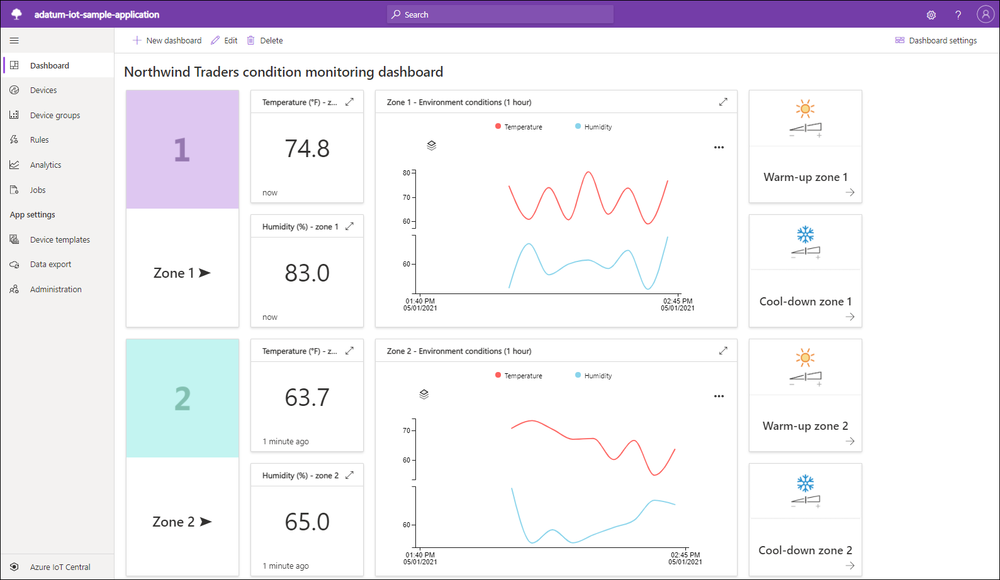
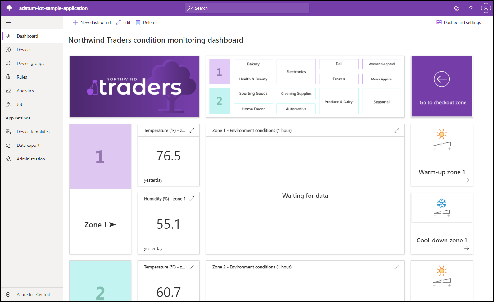

With the IoT pipeline components clearly identified, you now want to focus on the ability to extract data that will provide meaningful insights into the state of managed devices. You need to explore built-in Azure IoT Central analytics capabilities to determine whether they will be sufficient to address your requirements, but you also intend to evaluate other options, including Azure Time Series Insights and the export functionality available with Azure IoT Hub.

## What are the primary IoT analytics options?

The primary IoT analytics options correspond to the two data path types that are part of the Lambda architecture. Your approach to analytics and the corresponding technology choices for implementing that approach depend on whether you process telemetry that is part of the fast or slow data path. In particular, the fast data flow is subject to the latency constraint, so there is a limit on the extent of its analysis. This constraint does not apply to data flowing through the slow path, which allows for highly accurate and considerably more complex analytics.

## What are the analytics capabilities of Azure IoT Central?

Azure IoT Central offers built-in analytics functionality based on the built-in analytics service, which combines the hot and cold path capabilities. It allows you to not only monitor near-real time data points, but to also visualize historical trends, correlate distinct types of telemetry, and detect anomalies in collected data based on built-in and custom interactive dashboards. This capability leverages Azure Time Series Insights for telemetry processing.

As part of the hot path analytics, you have the option of configuring continuous data export from Azure IoT Central to Azure Event Hub, which integrates with Azure Databricks. Once you install the relevant libraries in the Azure Databricks workspace, you will be able to leverage its processing resources to further analyze the telemetry stream and generate more complex visualizations, such as box plots.

For cold data path, you have the option of exporting data in regular intervals to Azure Blob storage. Next, you can configure a data pipeline that combines an Azure function, an Azure Data Factory pipeline, an Azure SQL database, and a Power BI solution in order to process, transform, and visualize the data. Power BI enables the creation of models, Key Performance Indicators (KPIs), and their visualization through interactive dashboards. 

## What are the analytics capabilities of Azure Time Series Insights?

While Azure Time Series Insights is built into Azure IoT Central, it is also available as a separate service, which closely integrates with cloud gateways such as Azure IoT Hub and Azure Event Hub. It provides an analytics, storage, and visualization service for time series data, including support for SQL-like filtering and aggregation rules. Its visualizations capabilities include support for overlays of different time series, dashboard comparisons, tabular views, and heat maps, as well as a data explorer for interactive data queries. In addition, it exposes a JavaScript controls library that facilitates embedding time series charts into custom applications. 

Azure Time Series Insights is suitable for warm data path, since its typical latency for querying data is within the range of between 30 and 60 seconds. It is optimized for simultaneous queries over large data sets. 

## What are the analytics capabilities of Azure Stream Analytics?

Azure Stream Analytics is part of the hot data path, providing a real-time analytics and complex event-processing optimized for high volumes of streaming data, originating from IoT devices, social media feeds, and applications. Azure Stream Analytics supports such operations as windowing, stream aggregations, and external data source joins. 
