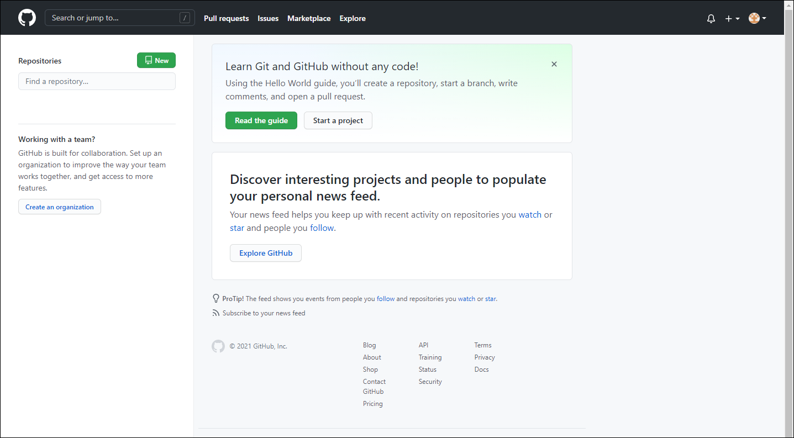
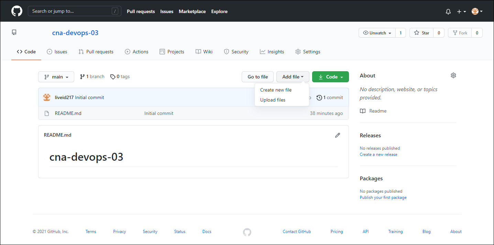
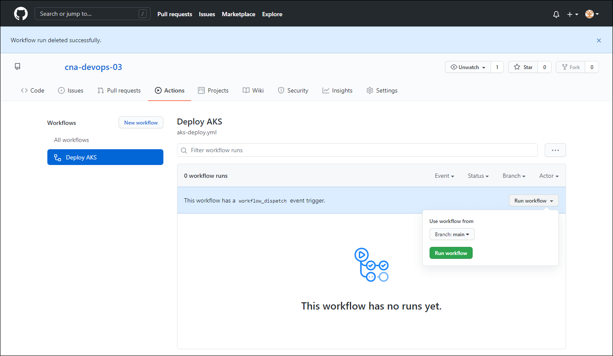
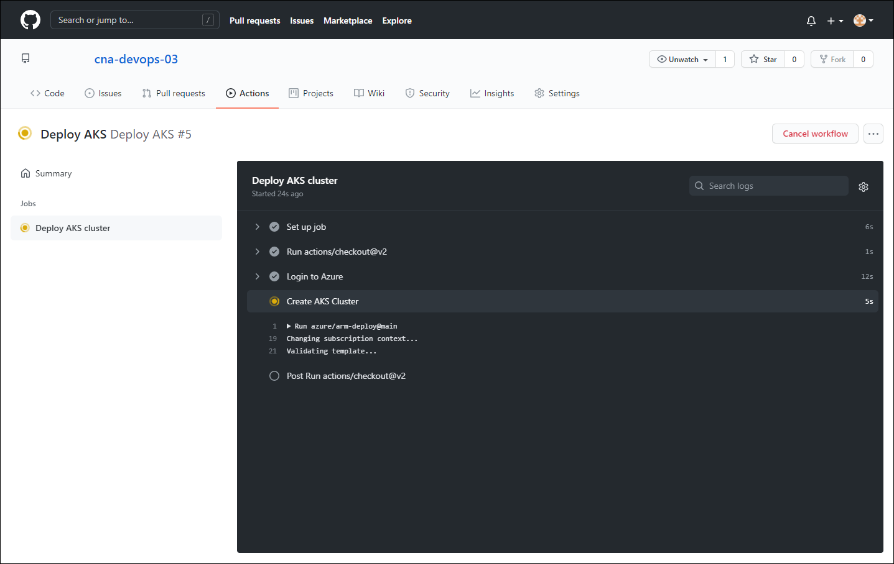
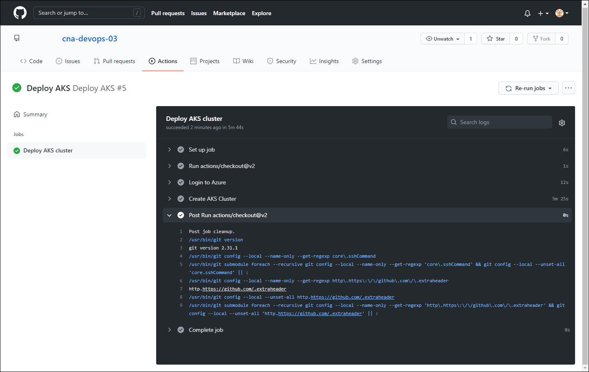
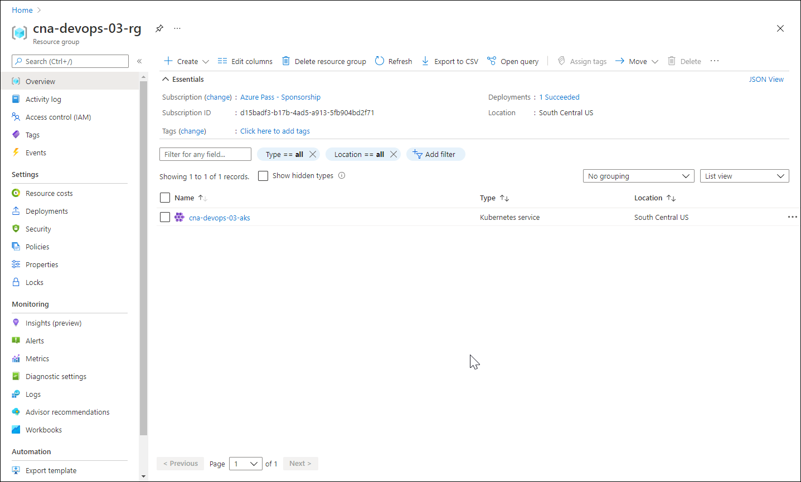

This exercise takes you through the process of deploying infrastructure as code (IaC) by using a GitHub workflow. To accomplish this, you will leverage a predefined Azure Resource Manager template to implement a GitHub workflow.

In this exercise, you will:

* Set up a GitHub repository
* Prepare for an AKS deployment
* Deploy an AKS cluster by using a GitHub workflow
* Delete deployed resources

## Prerequisites

* An Azure subscription
* A Microsoft account or an Azure AD account with the Global Administrator role in the Azure AD tenant associated with the Azure subscription and with the Owner or Contributor role in the Azure subscription
* A GitHub account associated with the Microsoft account or the Azure AD account referenced in the previous prerequisite. To create a GitHub account, follow the instructions available at [Signing up for a new GitHub account](https://docs.github.com/en/free-pro-team@latest/github/getting-started-with-github/signing-up-for-a-new-github-account).

## Set up a GitHub repository

You will start by creating a GitHub repository that will host artifacts used to deploy an AKS cluster.

1. Start a web browser, navigate to [GitHub](https://github.com/) and sign in to access your GitHub account.
1. On the GitHub home page, select the **Repositories** tab and select **New**.

    

1. On the **Create a new repository** page, set the **Repository name** to **cna-devops-03**, ensure that the **Private** option is selected, select the checkbox **Add a README file**, and then select **Create repository**.

## Prepare for an AKS deployment

To prepare for deployment of an AKS cluster, you will add to the repository a secret that will allow you to provide GitHub actions with access to your Azure subscription. You will also register the **Microsoft.AlertsManagement** Azure resource provider that is required to provision resources included in the deployment.

1. In the web browser, open another tab, navigate to the [Azure portal](https://portal.azure.com/), and sign in to access the Azure subscription you will be using in this module.
1. In the Azure portal, open the **Cloud Shell** by clicking its icon in the toolbar next to the search text box.
1. If prompted to select either **Bash** or **PowerShell**, select **Bash**. 

    > [!NOTE]
    > If this is the first time you are starting Azure Cloud Shell and you are presented with the **You have no storage mounted** message, select the subscription you are using in this lab, and then select **Create storage**. 

1. Within the Bash session in the Azure Cloud Shell pane, run the following command to identify the subscription ID of your Azure subscription:

    ```bash
    SUBSCRIPTION_ID=$(az account show --query id --output tsv)
    echo $SUBSCRIPTION_ID
    ```

    > [!NOTE]
    > Record the output of the command. You will need it later in this exercise.

1. Within the Bash session in the Azure Cloud Shell pane, run the following command to generate an Azure Active Directory service principal that will be used to provide the GitHub workflow to your Azure subscription:

    ```bash
    SERVICE_PRINCIPAL=$(az ad sp create-for-rbac --name "cna-sp03" --sdk-auth --role Contributor --scopes /subscriptions/$SUBSCRIPTION_ID)
    echo $SERVICE_PRINCIPAL
    ```

    > [!NOTE]
    > Record the output of the command, which contains JSON representation of the properties of the newly created service principal. You will need it shortly. 

1. Switch back to the web browser tab displaying the **cna-devops-03** GitHub repository and select the **Settings** tab header. 
1. On the **Settings** page, in the vertical menu, select **Secrets**.
1. On the **Action secrets** page, select **New repository secret**.
1. On the **Actions secrets / New secret** page, in the **Name** text box, type **AZURE_CREDENTIALS**, in the **Value** text box, paste the JSON representation of the service principal settings you recorded earlier, and then select **Add secret**.
1. Switch to the web browser tab displaying the Azure portal with the Bash session of the **Cloud Shell** open.
1. Within the Bash session in the Azure Cloud Shell pane, run the following command to create a resource group that will host the AKS cluster (replace the <location> placeholder with the name of the Azure region where you can provision Azure resources, such as `eastus` or 'southcentralus`):

    > [!NOTE]
    > To list the names of Azure regions, run `az account list-locations --output table`.

    ```bash
    LOCATION='southcentralus'
    az group create --location $LOCATION --name cna-devops-03-rg
    ```

## Deploy an AKS cluster by using a GitHub workflow

Now you are ready to proceed with deploying an AKS cluster by using a GitHub workflow.

1. In the web browser window displaying the **Settings** tab of your GitHub repo, select the **Code** tab header.
1. On the **Code** tab, select **Add file** and, in the drop-down menu, select **Create new file**.

    

1. In the **Name your file** text box, type **ArmTemplates/aks-template.json**.

    > [!NOTE]
    > This will automatically create a new folder named **ArmTemplates** and add the file named **aks-template.json** into it.

1. In the **Edit new file** text box, paste the following content:

    ```json
    {
        "$schema": "https://schema.management.azure.com/schemas/2015-01-01/deploymentTemplate.json#",
        "contentVersion": "1.0.0.0",
        "parameters": {
            "clusterName": {
                "type": "string"
            },
            "dnsPrefix": {
                "type": "string"
            },
            "clusterLocation": {
                "type": "string",
                "defaultValue": "[resourceGroup().location]"
            },
            "agentCount": {
                "defaultValue": 3,
                "type": "int"
            },
            "agentVMSize": {
                "defaultValue": "Standard_D2_v2",
                "type": "string"
            },
            "kubernetesVersion": {
                "type": "string"
            },
            "clusterTags": {
                "type": "object",
                "defaultValue": {}
            },
            "httpApplicationRoutingEnabled": {
                "type": "bool"
            }
        },
        "variables": {
            "clusterId": "[concat('Microsoft.ContainerService/managedClusters/',parameters('clusterName'))]"
        },
        "resources": [
            {
                "apiVersion": "2020-03-01",
                "type": "Microsoft.ContainerService/managedClusters",
                "location": "[parameters('clusterLocation')]",
                "name": "[parameters('clusterName')]",
                "tags": "[parameters('clusterTags')]",
                "dependsOn": [
                ],
                "properties": {
                    "dnsPrefix": "[parameters('dnsPrefix')]",
                    "kubernetesVersion": "[parameters('kubernetesVersion')]",
                    "addonProfiles": {
                        "httpApplicationRouting": {
                            "enabled": "[parameters('httpApplicationRoutingEnabled')]"
                        }
                    },
                    "agentPoolProfiles": [
                        {
                            "name": "agentpool",
                            "count": "[parameters('agentCount')]",
                            "vmSize": "[parameters('agentVMSize')]"
                        }
                    ]
                },
                "identity": {
                    "type": "SystemAssigned"
                }
            }
        ],
        "outputs": {
            "applicationRoutingZone": {
                "value": "[if(parameters('httpApplicationRoutingEnabled'), reference(variables('clusterId')).addonProfiles.httpApplicationRouting.config.HTTPApplicationRoutingZoneName, '')]",
                "type": "string"
            }
        }
    }
    ```

1. At the bottom of the **Code** tab, select **Commit new file**.
1. Within the GitHub repo, select the **Actions** tab header and, on the **Get started with GitHub Actions** page, select **Set up this workflow**.
1. In the file path, replace **blank.yml** with **aks-deploy.yml**.
1. In the **Edit new file** section, replace the existing template with the following content:

    > [!NOTE]
    > Ensure that you preserve the existing indentations.

    ```yaml
    name: Deploy AKS
    on: 
      workflow_dispatch:

    env:
      RESOURCEGROUPNAME: "cna-devops-03-rg"
      SUBSCRIPTIONID: "d15badf3-b17b-4ad5-a913-5fb904bd2f71"
      CLUSTERNAME: "cna-devops-03-aks"
      AGENTCOUNT: "3"
      AGENTVMSIZE: "Standard_DS2_v2"
      KUBERNETESVERSION: 1.18.17
      HTTPSAPPLICATIONROUTINGENABLED: false
      KUBERNETESAPI: "apps/v1"

    jobs:
      deploy:
        name: Deploy AKS cluster
        runs-on: ubuntu-latest
        steps:
        - uses: actions/checkout@v2

        - name: Login to Azure
          uses: azure/login@v1
          with:
            creds: ${{ secrets.AZURE_CREDENTIALS }}

        - name: Create AKS Cluster
          uses: azure/arm-deploy@main
          id: deploy
          with:
            scope: resourcegroup
            subscriptionId: ${{ env.SUBSCRIPTIONID }}
            resourceGroupName: ${{ env.RESOURCEGROUPNAME }}
            template: ./ArmTemplates/aks-template.json
            parameters: clusterName="${{ env.CLUSTERNAME }}" agentCount="${{ env.AGENTCOUNT }}" agentVMSize="${{ env.AGENTVMSIZE }}" kubernetesVersion="${{ env.KUBERNETESVERSION }}" httpApplicationRoutingEnabled="${{ env.HTTPSAPPLICATIONROUTINGENABLED }}"  dnsPrefix="${{ env.CLUSTERNAME }}"
    ```

    > [!NOTE]
    > The **workflow_dispatch** event will allow you to launch the workflow manually.

1. In the upper-right corner of the page, select **Start commit** and, in the **Commit changes** pop-up window, select **Commit changes**.
1. On the **Actions** tab, in the list of workflows, select the **Deploy AKS** entry, in the list of workflow runs, select **Run workflow** and, in the drop-down menu, select **Run workflow**.

    

1. On the **Actions** tab, select the newly started workflow run and monitor its progress until successful completion.

    

    > [!NOTE]
    > Disregard any warnings during the **Create AKS Cluster** job.

    > [!NOTE]
    > Wait for the deployment to complete. This might take about 5 minutes.

    

1. Switch back to the web browser window displaying the Azure portal, navigate to the **cna-devops-03-rg** resource group blade, and verify that it contains the AKS cluster **cna-devops-03-aks**.

    

## Delete deployed resources

Your initial testing of an IaC deployment by using a GitHub workflow is completed. To avoid unnecessary costs associated with the use of Azure resources, you'll now delete the resources you provisioned in this exercise.

1. In the web browser displaying the Azure portal, on the **cna-devops-03-rg** resource group blade, select the **Delete resource group** entry in the toolbar. 
1. In the **TYPE THE RESOURCE GROUP NAME** text box, enter the name of the resource group, and select **Delete**.

Congratulations! You completed the first exercise of this module. In its exercise, you tested the process of deploying IaC by using a GitHub workflow. To accomplish this, you leveraged a predefined Azure Resource Manager template to implement a GitHub workflow. Once you completed your testing, you deleted the Azure resources deployed in this exercise in order to avoid extra charges.