This exercise takes you through the process of implementing continuous integration and continuous deployment (CI/CD) of a sample IoT application to Azure IoT Edge. As in the previous exercise, you will leverage for this purpose Azure DevOps Starter, but you will rely on Azure DevOps to provide the code repository and implement the corresponding CI/CD pipelines.

> [!NOTE]
> This exercise illustrates the use of Azure DevOps Starter, which considerably simplifies implementation of CI/CD pipelines. For detailed information regarding authoring such pipelines in Azure DevOps and GitHub, refer to the references provided at the end of this module.

In this exercise, you will:

* Implement an IoT Edge CI/CD pipeline by using Azure DevOps Starter
* Validate the CI/CD functionality
* Delete deployed resources

## Prerequisites

* An Azure subscription
* A Microsoft account or an Azure AD account with the Global Administrator role in the Azure AD tenant associated with the Azure subscription and with the Owner or Contributor role in the Azure subscription.
* An Azure DevOps organization associated with the Microsoft account or the Azure AD account referenced in the previous prerequisite. To create an Azure DevOps organization, follow the instructions available at [Create an organization or project collection](https://docs.microsoft.com/en-us/azure/devops/organizations/accounts/create-organization?view=azure-devops).
* At least one concurrent pipeline in your Azure DevOps organization.

> [!NOTE]
> This requirement results from changes to the policy governing free grants of concurrent pipelines to Azure DevOps projects. For more information, refer to [Change in Azure Pipelines Grant for Public Projects](https://devblogs.microsoft.com/devops/change-in-azure-pipelines-grant-for-public-projects/). You will find there a link to the form that you can use to request the free grant of parallel jobs in Azure Pipelines. The response is expected within 2-3 business days.

## Implement an IoT Edge CI/CD pipeline by using Azure DevOps Starter

For the sake of simplicity, you will implement the Azure IoT Edge CI/CD pipeline by leveraging the functionality provided by Azure DevOps Starter.

1. If needed, start a web browser, navigate to the [Azure portal](https://portal.azure.com/) and sign in to access the Azure subscription you will be using in this module.
1. In the web browser displaying the Azure portal, use the **Search resources, services, and docs** text box at the top of the Azure portal page to search for **DevOps Starter** and, in the list of results, in the **Services** section, select **DevOps Starter**.
1. On the **DevOps Starter** blade, select **+ Create**.
1. On the **Start fresh with a new application** tab of the **DevOps Starter** blade, verify the presence of the **Setting up DevOps starter with Azure DevOps** label. In case the label states **Setting up DevOps starter with GitHub**, select the **here** link, on the **DevOps starter settings** blade, select **Azure DevOps** and select **Done**.
1. On the **Start fresh with a new application** page of the **DevOps Starter** blade, select the **Java** tile and then select **Next: Framework >**.

    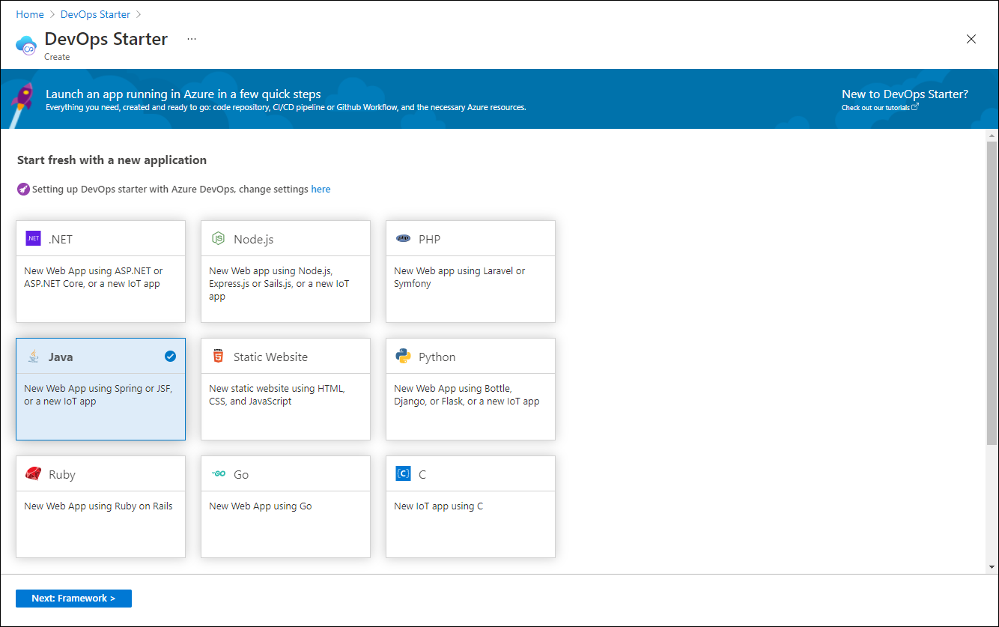

1. On the **Choose an application framework** page of the **DevOps Starter** blade, select the **Simple IoT** tile and then select **Next: Service >**.

    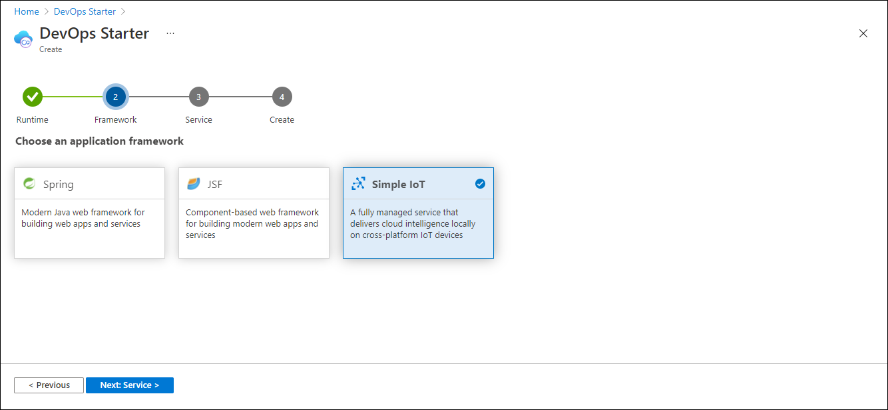

1. On the **Select an Azure service to deploy the application** page of the **DevOps Starter** blade, select the **IoT Edge** tile and then select **Next: Create >**.

    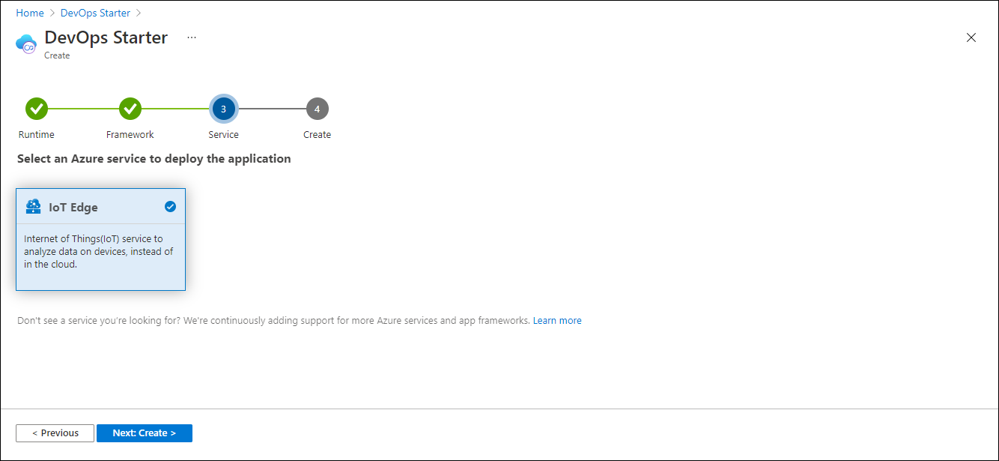

1. On the **Almost there!** page of the **DevOps Starter** blade, specify the following settings:

    | Setting | Value |
    | --- | --- |
    | Project name | **cna-devops-07** |
    | Azure DevOps Organization | The name of the Azure DevOps organization you will be using in this exercise. |
    | Subscription | The name of the Azure subscription you will be using in this exercise. |
    | IoT Hub name | **cna-devops-07-iothub** |
    | Location | The name of the Azure region where you provisioned the Azure VM in the previous task of this exercise. |

    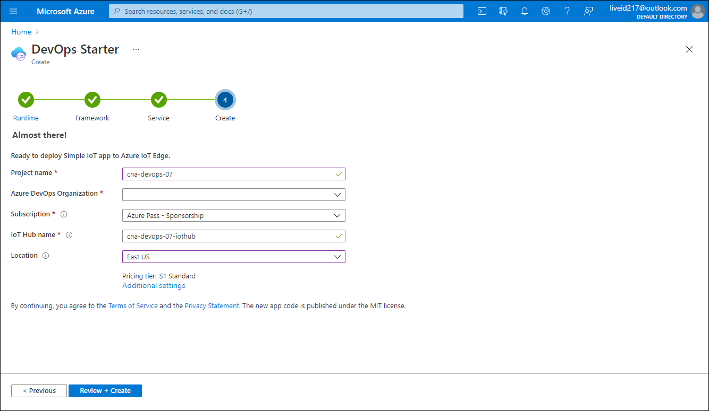

1. On the **Almost there!** page of the **DevOps Starter** blade, select **Additional settings**.
1. On the **Additional settings** blade, specify the following configuration (leave other settings with their default values):

    | Setting | Configuration |
    | --- | --- |
    | Container Registry name | Change the value to a globally unique name consisting of between 5 and 50 alphanumeric characters starting with a letter. |
    | Container Registry SKU | Select the **Basic** entry in the drop-down list. |
    | Container Registry Location | Select the name of the Azure region where you provisioned the Azure VM in the previous task of this exercise. |

    > [!NOTE]
    > The green checkmark next to the Container Registry name indicates its global uniqueness.

    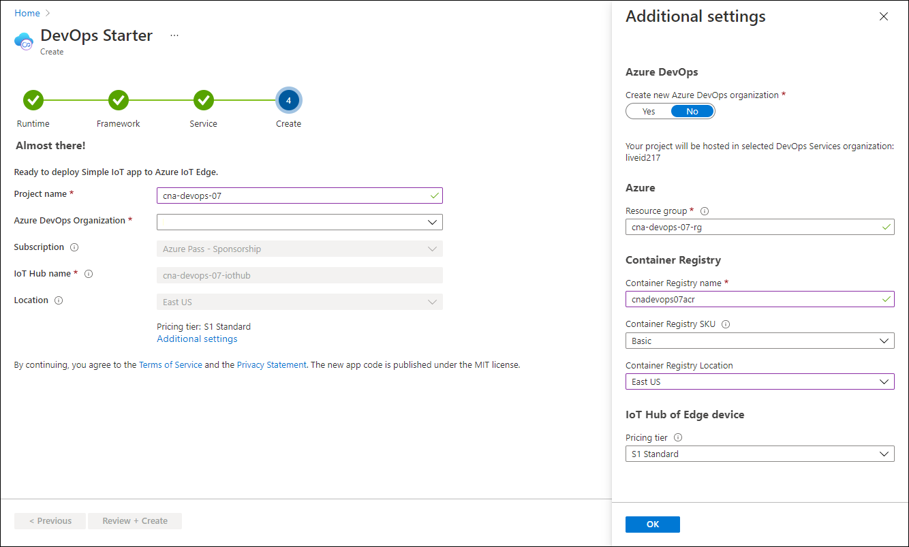

1. On the **Additional settings** blade, select **OK** and, back on the **Almost there!** page of the **DevOps Starter** blade, select **Review + Create**. 

    > [!NOTE]
    > Wait for the provisioning of the Azure DevOps Starter resource to complete. This might take about 1 minute.

1. On the deployment blade, select **Go to resource**. 
1. Switch back to the web browser tab displaying the Azure DevOps portal.
1. In the Azure DevOps portal, select **Azure DevOps** logo in the upper left corner of the page and, on the page displaying the list of projects, select the **cna-devops-07** entry.
1. On the **cna-devops-07** project pane, in the vertical menu on the left side, select **Pipelines** and, in the list of recent pipeline runs, select the **cna-devops-07-iothub - CI** entry.

    > [!NOTE]
    > The initial run will fail. This is expected.

    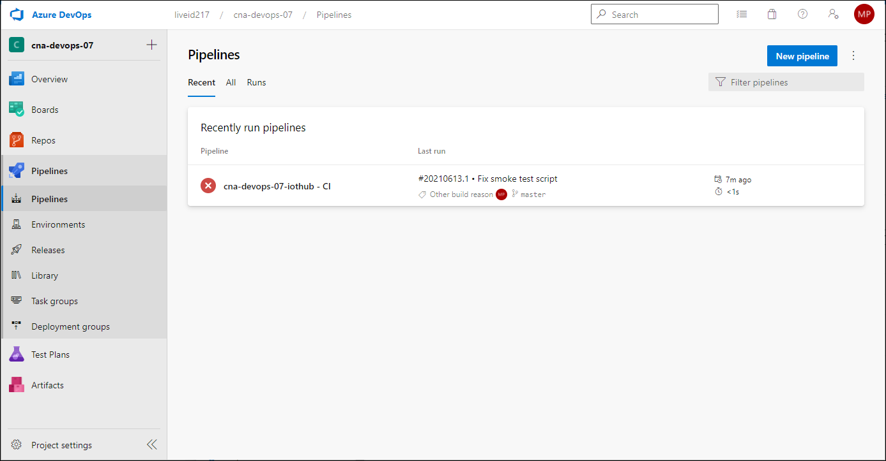

1. On the **cna-devops-07-iothub - CI** pane, select **Edit** to display the graphical pipeline editor pane.

    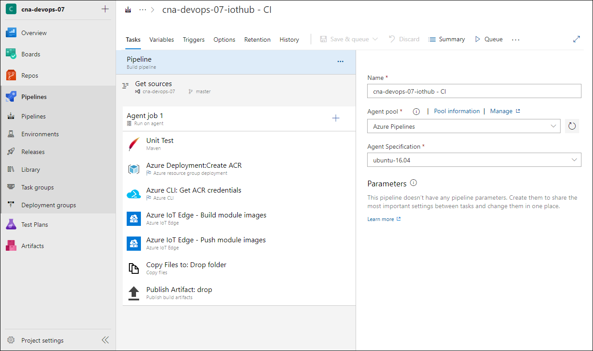

    > [!NOTE]
    > At the time of authoring this module, there is an issue associated with provisioning of the IoT resources from Azure DevOps pipelines. This requires modifying the Azure DevOps pipeline automatically generated by Azure Devops Starter.

1. On the **cna-devops-07-iothub - CI** pane, on the **Tasks** pane, in the list of tasks, select the **Azure CLI: Get AR credentials** entry and then select the **+** sign next to the **Agent job 1** entry.

    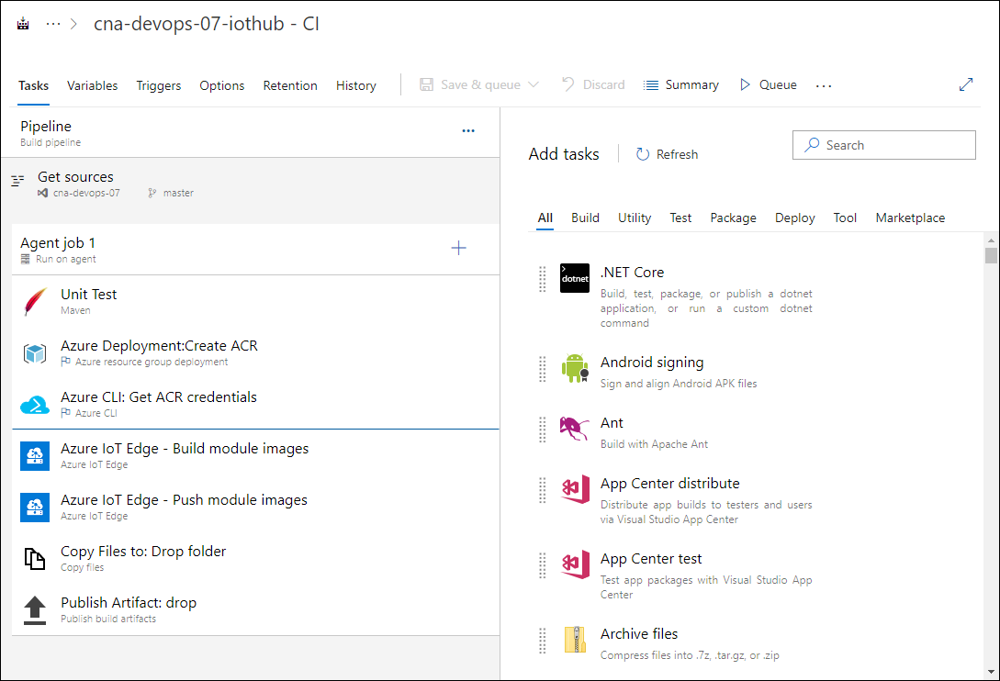

1. In the **Add tasks** pane, search for the **Use Python version** task, select it in the list of results, and select **Add**.

    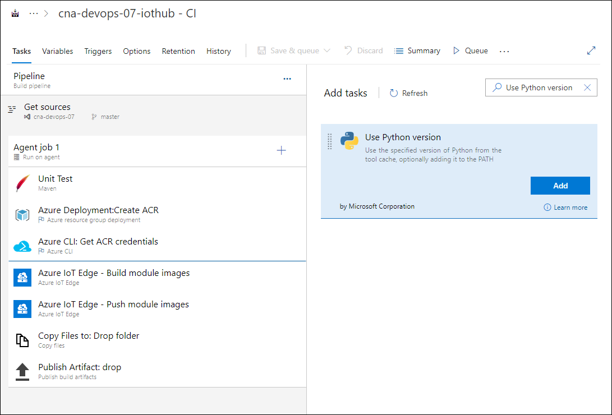

    > [!NOTE]
    > This will add the **Use Python 3.x** task to the pipeline.

1. In the list of tasks of the pipeline, select the newly added **Use Python 3.x** task, set its **Display name** to **Use Python 3.6** and its **Version spec** to **3.6**.

    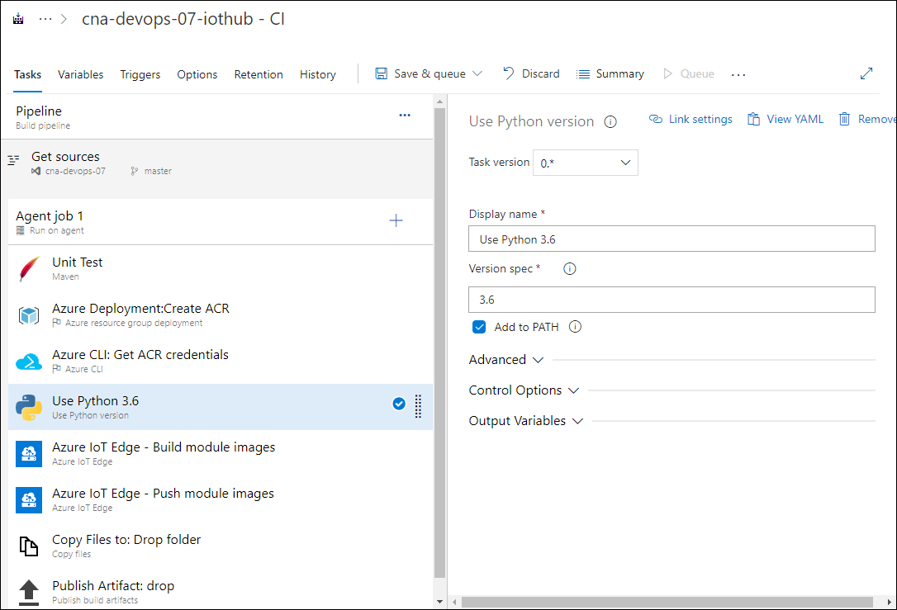

1. On the **cna-devops-07-iothub - CI** pane, on the **Tasks** pane, select the **+** sign next to the **Agent job 1** entry.
1. In the **Add tasks** pane, search for the **PowerShell** task, select it in the list of results, and select **Add**.

    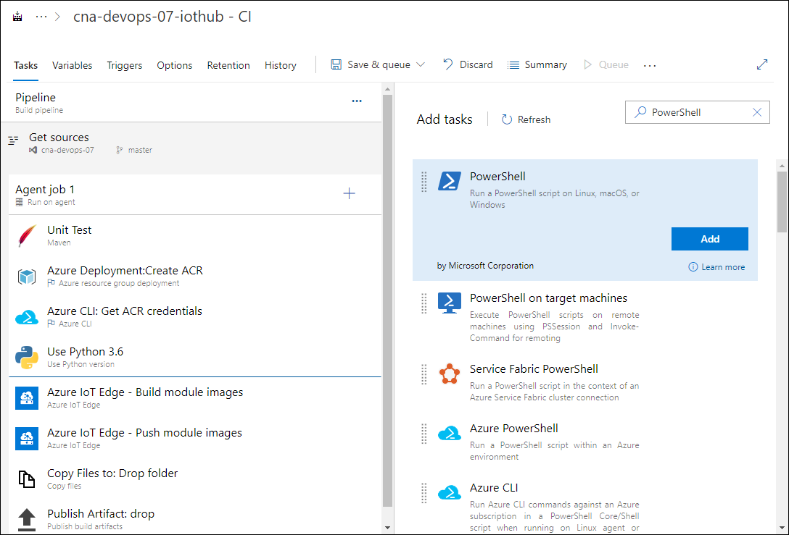

    > [!NOTE]
    > This will add the **PowerShell Script* task to the pipeline.

1. In the list of tasks of the pipeline, select the newly added **PowerShell Script** task, set its **Type** to **Inline** and its **Script** to **pip install -U iotedgedev**.

    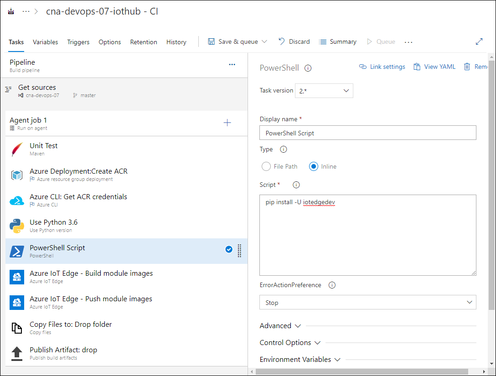

1. On the **cna-devops-07-iothub - CI** pane, on the **Tasks** pane, select **Save & queue**, in the drop-down menu, select **Save**, and, in the **Save build pipeline** pane, select *Save**.
1. In the vertical menu to the left of the **cna-devops-07-iothub - CI** pane, in the **Pipelines** section, select **Releases**, ensure that the **cna-devops-07 - CD** release pipeline is selected, and select **Edit**.

    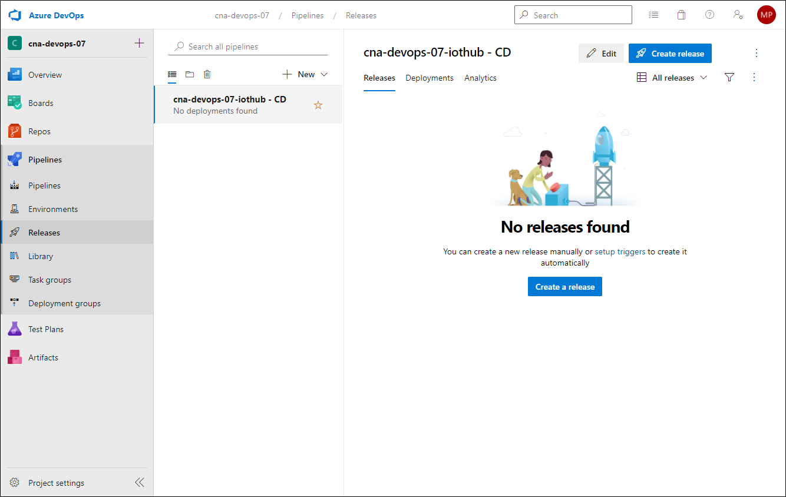

1. On the **Pipeline** tab of the **All pipelines > cna-devops-07-iothub - CD ** pane, on the left edge of the rectangle representing the **qa** stage, select the oval shape representing the pre-deployment conditions applicable to this stage.

    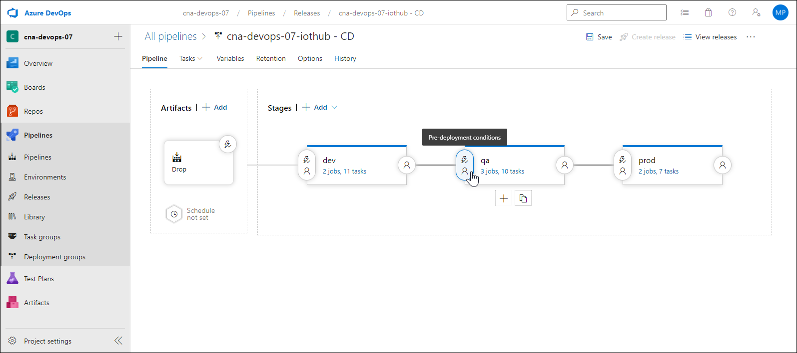

1. On the **Pre-deployment conditions** pane, select the **Manual only** option. 

    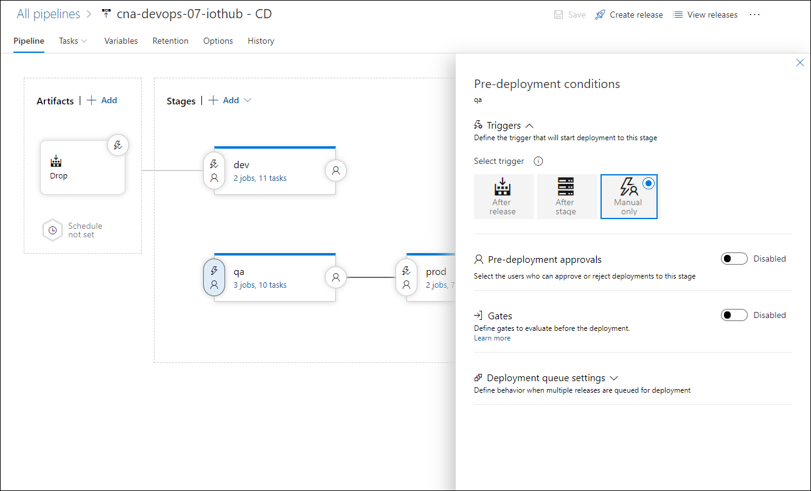

    > [!NOTE]
    > This will stop the automatic deployment following the completion of the **dev** stage. This change is applied for the sake of simplicity, in order to eliminate the need to apply changes the **qa** and **prod** stages of the pipeline, which would be equivalent to those you have to apply to the **dev** stage. In general, rather than using the **Manual only** option, you could rely on the results on the smoke test to determine whether the deployment can proceed to the subsequent stage.

1. On the **Pipeline** tab of the **All pipelines > cna-devops-07-iothub - CD ** pane, in the rectangle representing the **dev** stage, select the link indicating the number of jobs and tasks in that stage.

    

    > [!NOTE]
    > The deployment pipeline generated by Azure DevOps Starter includes a number of components that will need to be updated for it to run successfully. You will apply these updates next.

1. On the **All pipelines > cna-devops-07-iothub - CD ** pane displaying the content of the release pipeline **Pipeline**, in the rectangle representing the **dev** stage, select the link indicating the number of jobs and tasks in that stage.
1. In the list of tasks, select the **Azure Deployment: Create Azure IoT Hub** task and then select the **+** sign next to the **Create Device and Deploy** entry.
1. In the **Add tasks** pane, in the **Search** text box, type **Azure CLI**, in the list of results, select **Azure CLI**, and select **Add** to add the **Azure CLI** task directly above the **Azure Deployment: Create Azure IoT Hub** task.
1. Select the newly added **Azure CLI** task, in the task details pane to the right, configure the following settings:

    | Setting | Configuration |
    | --- | --- |
    | Azure Resource Manager connection | From the drop-down list, select the **cna-devops_07_iothub = Azure** entry representing the existing service connection to the Azure subscription you are using in this exercise. |
    | Script Type | From the drop-down list, select the **Shell** entry. |
    | Script Location | **Inline script** |
    | Inline Script | Enter the script listed below this table. |

    ```bash
    pip install azure-cli==2.20.0
    az extension add --name azure-iot
    az config set extension.use_dynamic_install=yes_without_prompt   
    ```

1. In the list of tasks, select the **Azure CLI: Create IoT Edge device** task. 
1. In the task details, in the **Inline Script** text box, replace the existing script with the following one:

    ```bash
    (az extension add --name azure-iot && TMP_OUTPUT="$(az iot hub device-identity connection-string show --device-id edgeDeviceDEV --hub-name $IOTHUB_NAME)" && RE="\"connectionString\":\s?\"(.*)\"" && if [[ $TMP_OUTPUT =~ $RE ]]; then CS_OUTPUT=${BASH_REMATCH[1]} && echo "Got device connection string"; fi && echo "##vso[task.setvariable variable=CS_OUTPUT]${CS_OUTPUT}" ) || (az iot hub device-identity create --hub-name $IOTHUB_NAME --device-id edgeDeviceDEV --edge-enabled --output none && echo "Created Edge device" && sleep 5 && az iot hub device-twin update --device-id edgeDeviceDEV  --hub-name $IOTHUB_NAME --set tags='{"environment":"dev"}' && echo "Set tag for device" && TMP_OUTPUT="$(az iot hub device-identity connection-string show --device-id edgeDeviceDEV --hub-name $IOTHUB_NAME )" && RE="\"connectionString\":\s?\"(.*)\"" && if [[ $TMP_OUTPUT =~ $RE ]]; then CS_OUTPUT=${BASH_REMATCH[1]} && echo "Got device connection string"; fi && echo "##vso[task.setvariable variable=CS_OUTPUT]${CS_OUTPUT}")
    ```

1. In the list of tasks, select the **Azure Deployment: Create VM for dev environment** task. 
1. In the task details, specify the following settings:

    | Setting | Value |
    | --- | --- |
    | Template link | **https://raw.githubusercontent.com/polichtm/iotedge-vm-deploy/master/edgeDeploy.json** |
    | Override template parameters | **-deviceConnectionString $(CS_OUTPUT) -vmName "cna-devops-07-iothub-edge-simulation-dev" -adminUsername "devops" -adminPasswordOrKey "$(VM_PASSWORD)" -vmSize "Standard_DS1_v2"** |

1. In the list of tasks, select the **Azure CLI: Get ACR credentials** task and then select the **+** sign next to the **Create Device and Deploy** job entry.
1. In the **Add tasks** pane, search for the **Use Python version** task, select it in the list of results, and select **Add**.
1. In the list of tasks of the pipeline, select the newly added **Use Python 3.x** task, set its **Display name** to **Use Python 3.6** and its **Version spec** to **3.6**.
1. Once again, select the **+** sign next to the **Create Device and Deploy** job entry.
1. In the **Add tasks** pane, search for the **PowerShell** task, select it in the list of results, and select **Add**.
1. In the list of tasks of the pipeline, select the newly added **PowerShell Script** task, set its **Type** to **Inline** and its **Script** to **pip install -U iotedgedev**.

## Validate the CI/CD functionality

Now that the GitHub workflow and the corresponding Azure resources are fully deployed, you will validate the CI/CD functionality. 

1. In the vertical menu to the left of the **All pipelines > cna-devops-07-iothub - CD** pane, select **Repos** and, in the folder hierarchy of the repository, select **edgeSmokeTest.sh**.

    > [!NOTE]
    > This will display the content of the **edgeSmokeTest.sh** file.

1. In the pane displaying the content of the **edgeSmokeTest.sh** file, select **Edit**, replace both occurrences of `azure-cli-iot-ext` with `azure-iot`, add the `# ` string in front of the line **91** `validateDevicesModulesRunning`, select **Commit**, and, on the **Commit** pane, select **Commit** again.

    > [!NOTE]
    > The validateDevicesModulesRunning function fails due to an issue with the underlying module. By commenting it out, you will be able to observe the sucessful completion of the release pipeline to the **dev** stage. In real-world scenarios, you should troubleshoot the status of the deployed module, but in this exercise, the focus on the CI/CD functionality.

    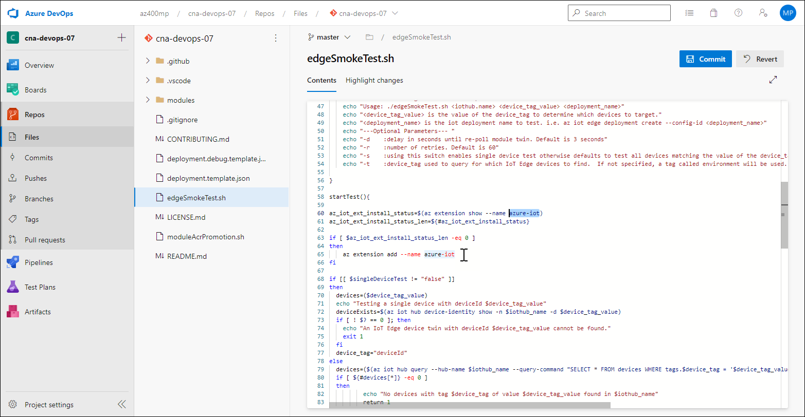

    > [!NOTE]
    > This will automatically trigger the build pipeline.

1. In the vertical menu to the left of the Azure DevOps portal, select **Pipelines**. 
1. On the **Recent** tab of the **Pipelines** pane, select the **cna-devops-07-iothub - CI** pipeline and, on the **Runs** tab, select the current run.
1. On the job run pane, select the **Agent job 1**.
1. On  the job run pane, monitor the progress of the build pipeline.

    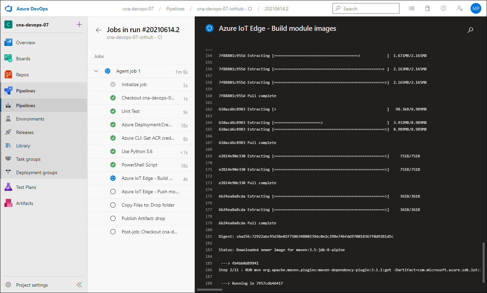

    > [!NOTE]
    > Wait for the completion of the build pipeline. This might take about 5 minutes.

    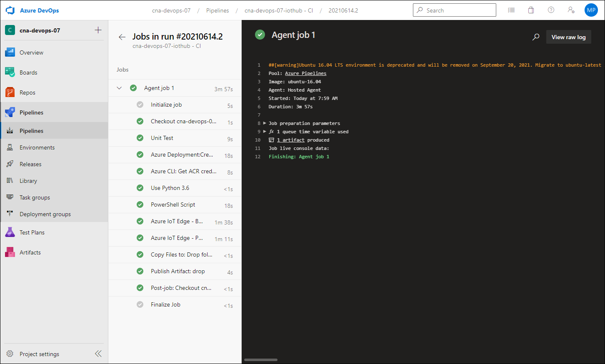

1. In the Azure DevOps portal, in the vertical menu on the left side of the page, in the **Pipelines** section, select **Releases**, ensure that the **cna-devops-07 - CD** release pipeline is selected, and, in the list of releases, select **Release-1**.
1. On the **cna-devops-07-iothub - CD > Release-1** pane, select the **Logs** button directly below the rectangle representing the **dev** stage of the release pipeline.

    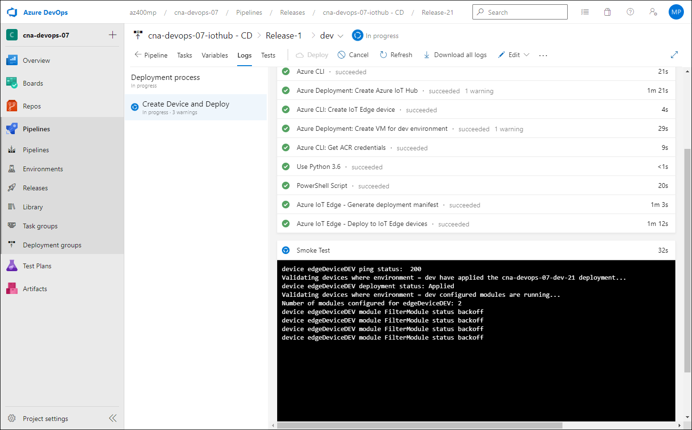

1. On the **cna-devops-07-iothub - CD > Release-1 > dev** pane, monitor the logs, monitor the detailed progress of the release pipeline.

    

    > [!NOTE]
    > Wait for the deployment to complete. This might take about 5 minutes.

    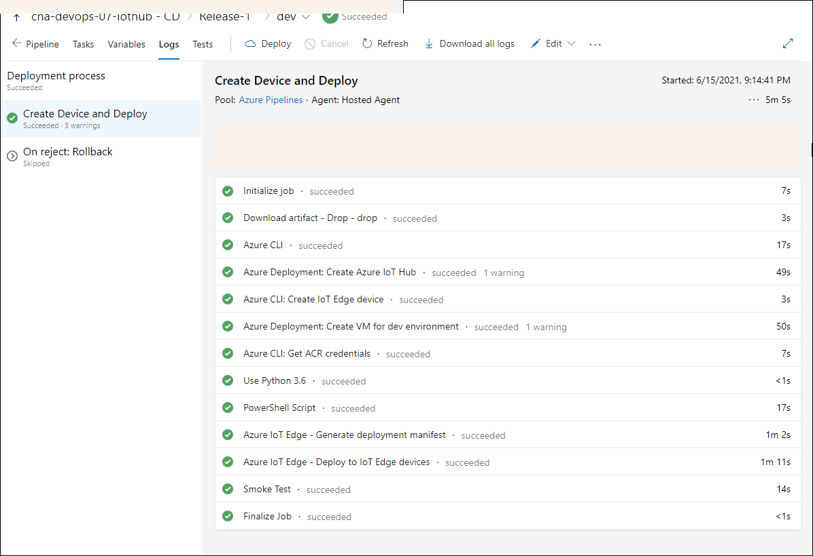

## Delete deployed resources

Your testing of CI/CD by using GitHub workflows is completed. To avoid unnecessary costs associated with the use of Azure resources, you'll now delete the resources you provisioned in this exercise.

1. In the web browser displaying the Azure portal, on the **cna-devops-07-rg** resource group blade, select the **Delete resource group** entry in the toolbar. 
1. In the **TYPE THE RESOURCE GROUP NAME** text box, enter the name of the resource group, and select **Delete**.

Congratulations! You completed the third and final exercise of this module. In its exercise, you stepped through the process of implementing a multi-stage CI/CD pipeline which builds and deploys an IoT application to Azure IoT Edge. As in the previous exercise, you leveraged for this purpose Azure DevOps Starter, but this time you used Azure DevOps to provide the code repository and implement the corresponding CI/CD pipelines. Once you completed your testing, you deleted the Azure resources deployed in this exercise in order to avoid extra charges.