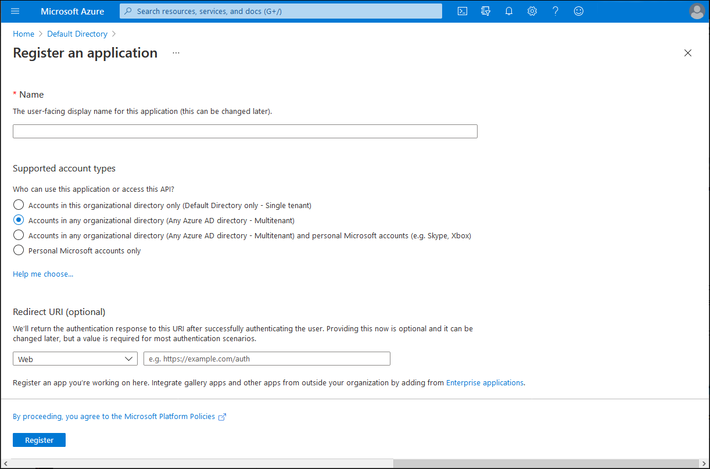

Now that you've implemented your first Azure AD-integrated application, you plan to explore more in-depth aspects of its functionality, focusing on management and maintenance tasks. You want to also ensure that you identify any additional caveats regarding multi-tenant applications.

## What are common management and maintenance tasks related to Azure AD-integrated apps?

Implementing Azure AD-integrated apps warrants special considerations, some of which might require additional management and maintenance tasks:

- Keep track of all redirect URIs associated with your applications, including the corresponding DNS records.
- Avoid using wildcards (*) in redirect URIs.
- Protect web apps by ensuring that redirect URIs correspond to encrypted endpoints. 
- Transition away from password-based authentication. 
- Maintain credentials for web apps, web APIs and daemon apps. 
- Whenever feasible, use certificate credentials, rather than client secrets. 
- When using secrets, consider automating their management, including their rotation. 
- Ensure that credentials are not stored in your code. 
- Whenever possible, use managed identities for authenticating access to Azure resources. 
- Consider storing secrets, keys, and certificates in Azure Key Vault. 
- Apply the principle of least privilege when configuring the permission scope of your applications. Applications should request additional permissions only when required. 
- Whenever possible, use delegated permissions rather than application permissions.
- During development, leverage the Microsoft Authentication Library (MSAL) rather than programming directly against protocols such as OAuth 2.0 and Open ID. 

> [!NOTE]
> MSAL libraries offer an easy-to-use approach for implementing a wide range of authentication scenarios, including Conditional Access, device-wide single sign-on (SSO), and token caching. 

- Minimize the number of times a user needs to enter credentials by leveraging silent token acquisition.
- Implement a single sign-out experience to protect user credentials. 

## What are additional considerations related to multi-tenant Azure AD-integrated apps?

When implementing Azure AD multi-tenant scenarios, you need to configure your application to accept sign-ins from any Azure AD tenant. Users in those tenants will be able to access the app after they grant relevant consent requested by your app.

There are four primary elements required as part of implementing a multi-tenant app:

- Registering the app to be multi-tenant
- Configuring the app to send requests to the **/common** endpoint
- Adding code to handle multiple issuer values
- Including provisions to respond to user and admin consent

### Registering the app to be multi-tenant

You can registration your app as multi-tenant by setting the **Supported account types** option on the **Register an application** blade in the Azure portal to **Accounts in any organizational directory (Any Azure AD directory - Multitenant)**.

Azure AD requires the App ID URI of the app to be globally unique. For a single-tenant app, the App ID URI must be unique within that tenant. For a multi-tenant app, it must be globally unique. To satisfy this requirement, the host name of App ID URI needs to match a verified domain of the Azure AD tenant.

### Configuring the app to send requests to the **/common** endpoint

In a single-tenant app, sign-in requests are sent to the tenant's sign-in endpoint. For example, for **contoso.com**, the corresponding endpoint is **https://login.microsoftonline.com/contoso.com**. Effectively, requests targeting that endpoint allow sign-in of users or guests to the corresponding Azure AD tenant. With a multi-tenant app, you cannot determine ahead of time which tenant will be used, so you need to use the **https://login.microsoftonline.com/common** endpoint, which serves all Azure AD tenants.

### Adding code to handle multiple issuer values

Web applications and web APIs need to be able to validate tokens from the Microsoft identity platform. This requires implementing logic which decides which issuer values are valid and which are not based on the tenant ID portion of the issuer value. For details, refer to the documentation referenced in the summary unit of this course.

### Including provisions to respond to user and admin consent

For a multi-tenant application, the initial registration of an app takes place in the Azure AD tenant used by the app developer. When individual users from different Azure AD tenants sign in to the app for the first time, each of them would be prompted to consent to the permissions requested by the application. This, in turn, would result in creation of a service principal in their respective tenants. For details regarding provisions required to address this requirement, refer to the documentation referenced in the summary unit of this course.
