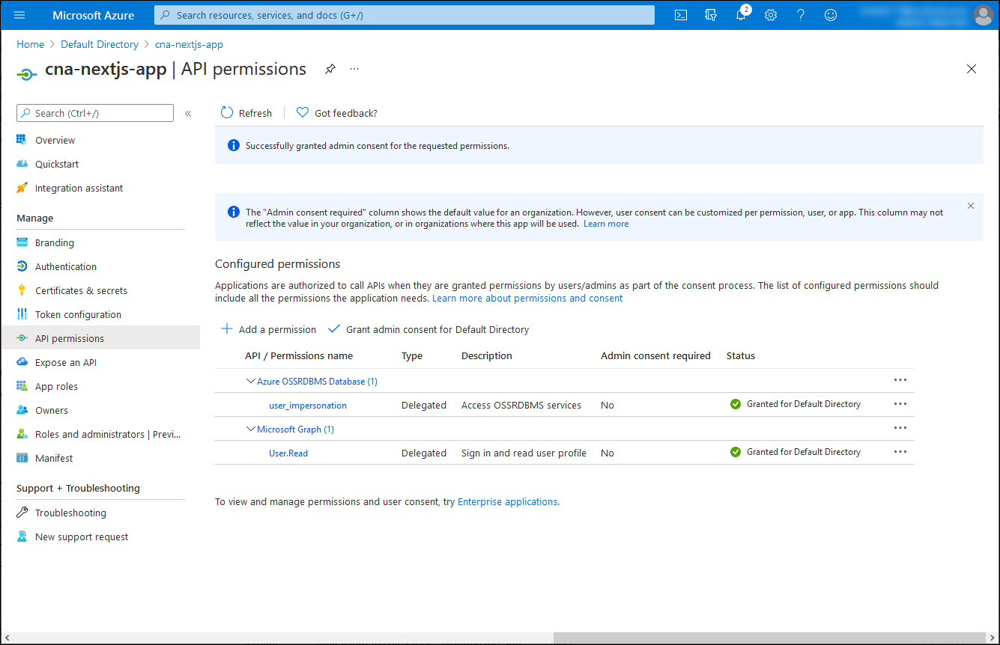

This exercise takes you through the process of configuring a simple Next.js-based application that uses Azure AD authentication to access an inventory database hosted by Azure Database for PostgreSQL in the single server deployment model.

In this exercise, you will:

* Register an Azure AD application
* Implement a simple, Azure AD-integrated Next.js-based application 
* Validate the functionality of the Next.js-based application

## Prerequisites

* An Azure subscription
* A Microsoft account or an Azure AD account with the Global Administrator role in the Azure AD tenant associated with the Azure subscription and with the Owner or Contributor role in the Azure subscription
* The completed first and second exercises of this module
* A computer on which you either have installed or can install Node.js and Git

> [!NOTE]
> For information regarding installing Node.js, refer to [Node.js Downloads web site](https://nodejs.org/en/download/). For information regarding Git, refer to the [Git downloads page](https://git-scm.com/downloads). Install both before you start this exercise.


## Register an Azure AD application

In order to implement a sample Next.js-based application that leverages Azure AD authentication to access an Azure Database for PostgreSQL database, you first have to create an Azure AD application object and the corresponding security principal. This will allow the Next.js-based application to impersonate Azure AD users when accessing database objects. 

1. If needed, start a web browser, navigate to the [Azure portal](https://portal.azure.com/) and sign in to access the Azure subscription you will be using in this module.
1. Use the **Search resources, services, and docs** text box at the top of the Azure portal page to search for **Azure Active Directory** and, in the list of results, select **Azure Active Directory**.
1. On the Azure Active Directory blade, in the vertical menu, in the **Manage** section, select **App registrations**.
1. On the **App registrations** blade, select **+ New registration**.
1. On the **Register an application** blade, in the **Name** text box, type **cna-nextjs-app**, in the **Supported account types** section, ensure that the option **Accounts in this organizational directory only (Default Directory only - Single tenant)** is selected, in the **Redirect URI (optional)** section, set the **Single-page application (SPA)** entry to **http://localhost:3000/** and click **Register**.

    

    > [!NOTE]
    > You have the option of configuring multi-tenant support for your Azure AD registered applications at this point, however, as mentioned, detailed coverage of this approach is outside of the scope of this module.

    > [!NOTE]
    > You will need to modify the **Redirect URI (optional)** value once you deploy your application to reflect its actual URL.

1. On the **cna-nextjs-app** blade, review the resulting settings and record the values of the **Application (client) ID** and the **Directory (tenant) ID** properties.

    

1. On the **cna-nextjs-app** blade, in the vertical menu, in the **Manage** section, select **API permissions**.

    

1. On the **cna-nextjs-app \| API permissions** blade, select **+ Add a permission**, on the **Request API permission** blade, select the **API my organization uses** tab, in the search text box, type **Azure OSSRDBMS Database** and, in the list of results, select **Azure OSSRDBMS Database**.

    

1. On the **Request API permission** blade, select **Delegated permissions**, select the **user_impersonation** checkbox, and then select **Add permission**.

    

1. Back on the **cna-nextjs-app \| API permissions** blade, select **Grant admin consent for Default Directory** and, when prompted for confirmation, select **Yes**.

    

1. On the **cna-nextjs-app \| API permissions** blade, verify that the permissions have been granted.

    

## Implement a simple, Azure AD-integrated Next.js-based application 

With the application registered in the Azure AD tenant, you can now proceed with its implementation. To simplify your task, you will clone a GitHub repo containing a sample Next.js code and customize it to integrate it with your Azure AD tenant.

1. On your computer, start the Node.js command prompt.
1. From the Node.js command prompt, run the following command to clone the GitHub repo containing the sample Next.js application code you will use in this exercise:

    ```azurecli-interactive
    git clone https://github.com/polichtm/wp2104-m06u07.git
    ```

1. Run the following command to switch to the directory that hosts the clone of the GitHub repo:

    ```azurecli-interactive
    cd wp2104-m06u07
    ```

1. Use your preferred text editor to review the content of the **./src/App.js** file, which retrieves an access token from Azure Active Directory for a single-page application:

    > [!NOTE]
    > The sample code is based on [Tutorial: Sign in users and call the Microsoft Graph API from a React single-page app (SPA) using auth code flow](https://docs.microsoft.com/azure/active-directory/develop/tutorial-v2-react)

    > [!NOTE]
    > The **./src/App.js** file has the following content:

    ```json
    import React, { useState } from "react";
    import { AuthenticatedTemplate, UnauthenticatedTemplate, useMsal } from "@azure/msal-react";
    import { loginRequest } from "./authConfig";
    import { PageLayout } from "./components/PageLayout";
    import { ProfileData } from "./components/ProfileData";
    import { callMsGraph } from "./graph";
    import Button from "react-bootstrap/Button";
    import "./styles/App.css";

    var accessToken = '';

    /**
     * Renders information about the signed-in user or a button to retrieve data about the user
     */
    const ProfileContent = () => {
        const { instance, accounts } = useMsal();
        const [graphData, setGraphData] = useState(null);

        function RequestProfileData() {
            // Silently acquires an access token which is then attached to a request for MS Graph data
            instance.acquireTokenSilent({
                ...loginRequest,
                account: accounts[0]
            }).then((response) => {
                accessToken = response.accessToken;
                callMsGraph(response.accessToken).then(response => setGraphData(response));
            });
        }

        return (
            <>
                <h5 className="card-title">Welcome {accounts[0].name}</h5>
                {graphData ? 
                    <ProfileData graphData={graphData} />
                    :
                    <Button variant="secondary" onClick={RequestProfileData}>Request Profile Information</Button>
                }
                <p>{accessToken}</p>
            </>
        );
    };

    /**
     * If a user is authenticated the ProfileContent component above is rendered. Otherwise, a message indicating a user is not authenticated is rendered.
     */
    const MainContent = () => {    
        return (
            <div className="App">
                <AuthenticatedTemplate>
                    <ProfileContent />
                </AuthenticatedTemplate>

                <UnauthenticatedTemplate>
                    <h5 className="card-title">Please sign-in to see your profile information.</h5>
                    </UnauthenticatedTemplate>
            </div>
        );
    };

    export default function App() {
        return (
            <PageLayout>
                <MainContent />
            </PageLayout>
        );
    }
    ```

1. Use your preferred text editor to review the content of the **./src/authConfig.js** file, which purpose is to store the information required to identify the target Azure AD application which you registered in the previous task of this exercise.

    > [!NOTE]
    > The **./src/authConfig.js** file has the following content:

    ```javascript
    /*
     * Copyright (c) Microsoft Corporation. All rights reserved.
     * Licensed under the MIT License.
     */

    import { LogLevel } from "@azure/msal-browser";

    /**
     * Configuration object to be passed to MSAL instance on creation. 
     * For a full list of MSAL.js configuration parameters, visit:
     * https://github.com/AzureAD/microsoft-authentication-library-for-js/blob/dev/lib/msal-browser/docs/configuration.md 
     */
    export const msalConfig = {
        auth: {
            clientId: "<client_ID>",
            authority: "https://login.microsoftonline.com/<tenant_ID>",
            redirectUri: "http://localhost:3000"
        },
        cache: {
            cacheLocation: "sessionStorage", // This configures where your cache will be stored
            storeAuthStateInCookie: false, // Set this to "true" if you are having issues on IE11 or Edge
        },
        system: {	
            loggerOptions: {	
                loggerCallback: (level, message, containsPii) => {	
                    if (containsPii) {		
                        return;		
                    }	
                    switch (level) {		
                        case LogLevel.Error:		
                            console.error(message);		
                            return;		
                        case LogLevel.Info:		
                            console.info(message);		
                            return;		
                        case LogLevel.Verbose:		
                            console.debug(message);		
                            return;		
                        case LogLevel.Warning:		
                            console.warn(message);		
                            return;		
                    }	
                }	
            }	
        }
    };

    /**
     * Scopes you add here will be prompted for user consent during sign-in.
     * By default, MSAL.js will add OIDC scopes (openid, profile, email) to any login request.
     * For more information about OIDC scopes, visit: 
     * https://docs.microsoft.com/azure/active-directory/develop/v2-permissions-and-consent#openid-connect-scopes
     */
    export const loginRequest = {
        scopes: ["User.Read"]
    };

    /**
     * Add here the scopes to request when obtaining an access token for MS Graph API. For more information, see:
     * https://github.com/AzureAD/microsoft-authentication-library-for-js/blob/dev/lib/msal-browser/docs/resources-and-scopes.md
     */
    export const graphConfig = {
        graphMeEndpoint: "https://graph.microsoft.com/v1.0/me"
    };
    ```

1. Within the text editor displaying the content of the **./src/authConfig.js** file, replace the `<client_ID>` and `<tenant_ID>` placeholders with their respective values which you identified in the previous task of this exercise.
1. Within the text editor displaying the content of the **./src/authConfig.js** file, replace the entry `scopes: ["User.Read"]` with `scopes: ["User.Read","https://ossrdbms-aad.database.windows.net/user_impersonation"]`. 
1. Save the changes and close the file.


## Validate the functionality of the Next.js-based application

You are ready to test the functionality of the app. While you could containerize it at this point, for the sake of simplicity, you will run it locally on your computer first, within the Node.js development environment. This will provide a quick way to validate its functionality and ensure that containerizing it is a viable option.

1. From the Node.js command prompt, run the following command to install the dependency packages of the sample Next.js application:

    ```cmd
    npm install
    ```

    > [!NOTE]
    > Wait for the installation process to complete.

1. From the Node.js command prompt, run the following command to build the Next.js application:

    ```cmd
    npm run-script build
    ```

    > [!NOTE]
    > Wait for the build process to complete.

1. From the Node.js command prompt, run the following command to start the Next.js application:

    ```cmd
    npm run-script start
    ```

    > [!NOTE]
    > This will automatically open a browser window displaying the **Welcome to the Microsoft Authentication Library For Javascript - React Quickstart** page.

1. Close the web browser window displaying **Welcome to the Microsoft Authentication Library For Javascript - React Quickstart** page, start another web browser window in the Incognito/InPrivate mode, and navigate to the **http://localhost:3000** URL.
1. On the **Welcome to the Microsoft Authentication Library For Javascript - React Quickstart** page, select **Sign In** button and, in the expanding menu, select **Sign in using Popup**.

    

1. When prompted to sign in, authenticate by using the **adatumuser1** userPrincipalName and its password **Pa55w.rd1234**. 

    > [!NOTE]
    > You created this user account in the first exercise of this module.

1. On the **Welcome to the Microsoft Authentication Library For Javascript - React Quickstart** page, select **Request Profile Information**.

    

    > [!NOTE]
    > Verify that the output includes the Email, Id, and the access token of the adatumuser1 Azure AD user account.

    

1. Open another browser tab in the same web browser window and navigate to the web application you deployed in the previous exercises.

    > [!NOTE]
    > The URL should have the following format `https://<webapp_name>.azurewebsites.net/auth`

    > [!NOTE]
    > Verify that the resulting web page displays the inventory data.

    

Congratulations! You completed the third exercise of this module. In its exercise, you implemented a simple Next.js-based application that queries the database by relying on Azure AD authentication.

> [!NOTE]
> To avoid unnecessary charges due to usage of Azure resources, you should delete the **postgresql-db-RG** and **cna-aadexpress-RG** resource groups you created in the previous exercise of this module. To do so, in the Azure portal, navigate to the blade of each of these resource groups, select the **Delete resource group** entry in the toolbar, in the **TYPE THE RESOURCE GROUP NAME** textbox, type the name of the resource group, and select **Delete**.