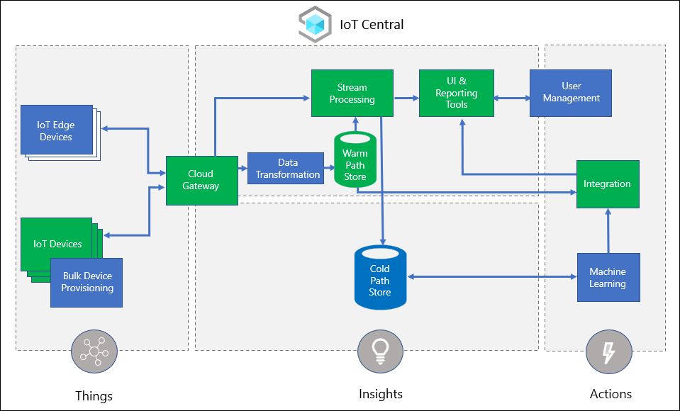

Adatum's management team is looking for opportunities to accommodate additional needs of its customers, requesting support for automated monitoring, alerting, and self-servicing of smart appliances. Your development team wants to address these needs by gradually extending the capabilities of recently developed cloud-native applications. To accomplish this objective, you decided to explore the functionality fo Azure IoT Central. You will start by creating an Azure IoT Central application, onboarding simulated IoT devices, and reviewing the built-in analytics functionality to review the collected telemetry.

## What is Azure IoT Central?

Azure IoT Central is a fully managed cloud service that simplifies implementing a wide range of IoT capabilities, including telemetry collection, processing, and analytics as well as secure device management. Azure IoT Central helps you minimize custom development efforts and administrative overhead, lets you leverage cloud agility and scalability, and supports built-in integration with a number of other Azure services. 

Azure IoT Central helps you bridge the gap between IoT devices and cloud-native applications, considerably accelerating their integration. It promotes reusability through the use of templates and by combining several Platform-as-a-Service (PaaS) Azure IoT services, such as IoT Hub or Azure Time Series Insights into an easy-to-use SaaS offering.

## What are the components of Azure IoT Central?

Azure IoT Central spans the three main areas of the Azure IoT reference architecture referred to as Things, Insights, and Actions. Things represent IoT devices generating telemetry that, through Insights-based analysis, is turned into Actions, which deliver some business value. 

Azure IoT Central architecture includes:

- Core components:

   - IoT devices supporting secure registration and bidirectional communication.
   - A bidirectional cloud gateway securely ingesting telemetry data and relaying administrative commands back to IoT devices. 
   - A stream processors consuming device telemetry, transforming it according to configurable algorithms, and placing it into a data store.
   - A web based portal providing an inventory of managed devices, featuring intuitive management interface, and displaying pre-defined and custom-built graphs and dashboards. 
   - Data stores hosting device templates, their identities and metadata, user and user role definitions, as well as collected telemetry.
   - Integration components providing the ability to define rule-based actions and implement continuous and interval-based data export. Azure IoT Central also offers the REST API interface, providing programmatic access to Azure IoT Central features, including device management and data analytics. In addition, you can use a command line interface for automation and management at scale.

- Optional components:
   - IoT Edge devices serving as brokers for management and data flow for devices, whenever direct communication with Azure IoT Central is restricted or not possible. They might, for example, play a role in device provisioning, data filtering, aggregation, and buffering, protocol translation, or event rules processing.
   - The device provisioning service automating the task of onboarding IoT devices.
   - Data transformation services performing such ingress tasks as protocol translation, data conversion, and data aggregation.
   - User management subsystem implementing role based access control, allowing for delegation of device management tasks. 
   - Machine Learning analyzing telemetry data to detect trends and correlations, providing such functionality as predictive analytics.

Azure IoT Central also supports a unidirectional device bridge allowing you to forward device telemetry from third party IoT clouds.

## What are the main capabilities of Azure IoT Central?

The core capabilities of Azure IoT Central include:

- Ingesting device telemetry at scale and managing their processing and storage
- Analyzing real-time and historical device telemetry and visualizing it through dashboards in order to extract meaningful information
- Command-based remote device management
- Individual and bulk device provisioning, with built-in authentication and access control provisions
- Monitoring of device activities and state
- Remote management of device firmware
- Continuous or interval based export of telemetry data to Azure and external services for additional processing or long term storage
- Customizable rules engine processing device and telemetry data, allowing you to trigger alerts and remediation tasks in response to an abnormal condition
- Authentication and authorization based on built-in support for identity management and Role-Based Access Control (RBAC)

One of the core concepts of Azure IoT Central is an application. This term represents a collection of components that allow you to control operational aspects of configuration, management, maintenance, and analytics of an IoT solution. Microsoft offers a number of predefined application templates, illustrating the most common IoT use cases in four main categories: retail, energy, government, and healthcare. The purpose of application templates is to assist with development of IoT solutions. Each of them constitutes a ready-to-use product, with sample dashboards, device templates, simulated devices producing real-time data, pre-configured rules and jobs. For each, you have access to detailed documentation, which you can rely on if you decide to further customize the corresponding application to meet your specific needs. 

Device templates constitute blueprints for IoT devices. They define the device model, consisting of physical characteristics of the device, and their virtual representation in an Azure IoT Central application. In particular, the device model includes device capabilities that designate telemetry, properties, and commands that are available for a particular device type. Cloud properties allow you to assign additional metadata to the virtual representation of individual devices in the cloud, regardless of the supported physical capabilities. 

## What is the role of Azure IoT Central in designing and implementing cloud-native applications?

As a developer, you can incorporate IoT Central into a custom IoT solution, which consists of:

- A cloud-native application that receives, processes, and reacts to telemetry and, optionally, providees device management functionality.
- Devices running custom code that generate the required telemetry. With IoT Plug and Play devices, it is possible to onboard them without any manual configuration and without writing any embedded device code. 

Azure IoT Central not only simplifies development and implementation of custom IoT solutions, but also supports ad-hoc testing with built-in mock devices. In addition, the integration with Time Series Insights and the ability to define rules for generating alerts might help you eliminate the need for a dedicated stream processing services, such as Stream Analytics. 
