This exercise provides an overview of setting up collection and initial processing of IoT telemetry by using Azure IoT Central applications. For more in-depth knowledge and tutorials regarding these topics, refer to:

* [IoT Central device development guide](https://docs.microsoft.com/azure/iot-central/core/overview-iot-central-developer)
* [IoT Central solution builder guide](https://docs.microsoft.com/azure/iot-central/core/overview-iot-central-solution-builder)
* [Tutorial: Create and connect a client application to your Azure IoT Central application](https://docs.microsoft.com/azure/iot-central/core/tutorial-connect-device)

In this exercise, you will:

* Create an Azure IoT Central application
* Create an IoT device template
* Integrate a simulated IoT device with an Azure IoT Central application

## Prerequisites

* An Azure subscription
* A Microsoft account or an Azure AD account with the Global Administrator role in the Azure AD tenant associated with the Azure subscription and with the Owner or Contributor role in the Azure subscription

## Create an Azure IoT Central application

1. Start a web browser, navigate to the [Welcome to IoT Central page](https://apps.azureiotcentral.com/). 
1. On the **Welcome to IoT Central** page, in the upper right corner, select the avatar icon.
1. When prompted, sign in to access the Azure subscription you will be using in this module.
1. On the left side of the **Welcome to IoT Central** page, expand the vertical menu and select the **My apps** menu entry. 
1. On the **My apps** page, select **+ New application**. 
1. On the **Build your IoT application** page, review the available application templates and then, on the **Custom app** tile, select **Create app**.
1. On the **New application** page, configure the following settings and select **Create**.

   | Setting | Configuration |
   | --- | --- |
   | Application Name | Type **adatum-iot-custom-application**. |
   | Application URL | Type a unique name consisting of lower-case letters, digits and/or dashes, starting with a letter. |
   | Application template | Select **Custom application**. |
   | Pricing plan | Select **Free**. |

   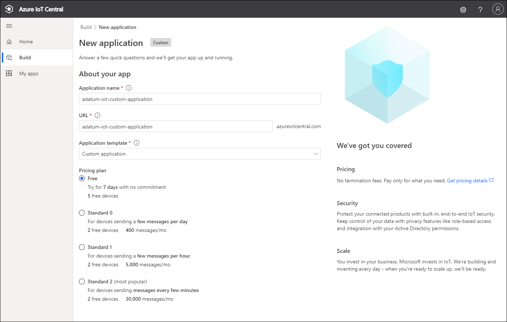

   * This will display the **Dashboard** page

   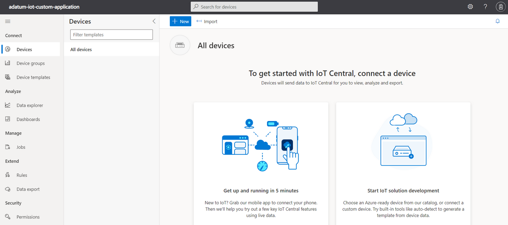

## Create an IoT device template

1. On the **Dashboard** page of the IoT Central Application portal, in the vertical menu on the left side, in the **App settings** section, select **Device templates**.
1. On the **Device templates** page, select **+ New**.
1. On the **Select type** page, review the available device templates, select **IoT Device**, and then select **Next: Customize**.

   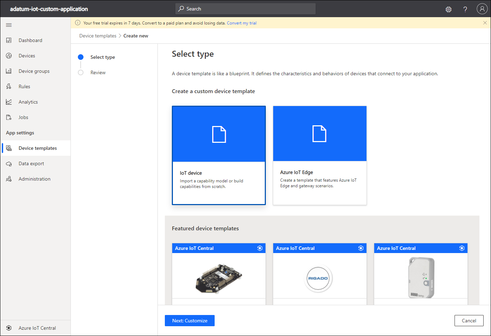

1. On the **Customize** page, in the **Device template name** text box, type **Raspberry Pi** and select **Next: Review**.
1. On the **Review** page, select **Create**.
1. On the **Raspberry Pi** page, select **Custom model**.
1. On the **Raspberry Pi** page, select **+ Add capability**.
1. In the newly displayed **Capabilities** section, specify the following settings:

   | Setting | Value |
   | --- | --- |
   | Display Name | **humidity** |
   | Name | **humidity** |
   | Capability type | **Telemetry** |
   | Semantic type | **Humidity** |

   * Ensure that you use lower case characters when typing the capability name (**humidity**).

1. To the right of the newly displayed **Capabilities** section, select the downward facing caret.
1. In the newly displayed **Capabilities** sub-section, specify the following settings (leave others with their default values):

   | Setting | Value |
   | --- | --- |
   | Schema | **Double** |
   | Unit | **Percent** |
   | Display unit | **%** |

   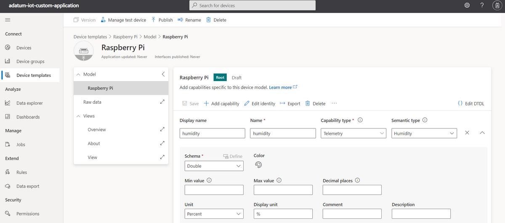

1. On the **Raspberry Pi** page, select **+ Add capability**. 
1. In the newly displayed **Capabilities** section, specify the following settings:

   | Setting | Value |
   | --- | --- |
   | Display Name | **temperature** |
   | Name | **temperature** |
   | Capability type | **Telemetry** |
   | Semantic type | **Temperature** |

   * Ensure that you type the capability name **temperature** in lower case characters.

1. To the right of the newly displayed **Capabilities** section, select the downward facing caret.
1. In the newly displayed **Capabilities** sub-section, specify the following settings (leave others with their default values):

   | Setting | Value |
   | --- | --- |
   | Schema | **Double** |
   | Unit | **Degree Celsius** |
   | Display unit | **C** |

   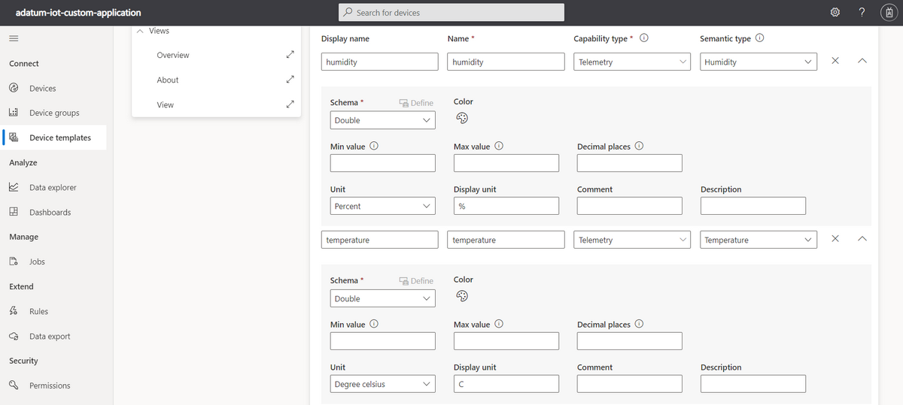

1. On the **Raspberry Pi** page, select **Save** to save the device template in the draft mode.

   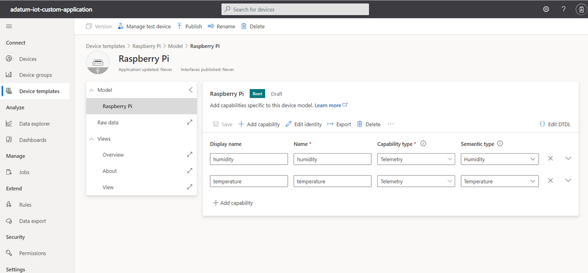

1. On the **Raspberry Pi** page, select **Views** and, on the **Select to add a new view** pane, select **Generate default views**.
1. On the **Select the applicable views to be generated, ensure that the following options are selected and select **Generate default dashboard view(s)**.

   - Overview - provides a view with device telemetry, displaying charts and metrics.
   - About - provides a view with device information, displaying its properties.

1. On the **Raspberry Pi** page, in the **Views** section, select **About**.
1. On the **Raspberry Pi** page, in the **Edit view** section, in the **Telemetry** subsection, in the **Select a telemetry** drop-down list, select **humidity** and click **Add title**.
1. On the **Raspberry Pi** page, in the **Edit view** section, in the **Telemetry** subsection, in the **Select a telemetry** drop-down list, select **temperature** and click **Add title**.
1. On the **Raspberry Pi** page, select **Save** to save the changes to the device template **About** view.
1. On the **Raspberry Pi** page, select **Publish** to make the device template available for IoT device integration and, when presented with the **Publish this device template to the application** window, select **Publish** again.

   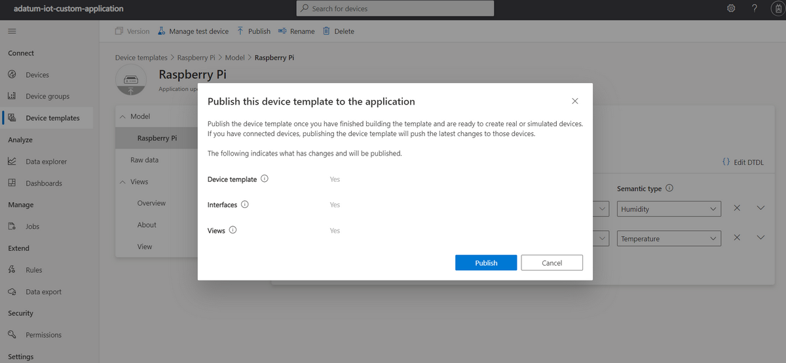

## Integrate a simulated IoT device with an Azure IoT Central application

1. On the **Raspberry Pi** page of the IoT Central Application portal, in the vertical menu on the left side, in the **App settings** section, select **Devices**.
1. On the **Devices** page, select **+ New**.
1. In the **Create a new device** window, specify the following settings and select **Create**:

   | Setting | Value |
   | --- | --- |
   | Device Name | **raspberrypi-1** |
   | Device ID | **raspberrypi-1** |
   | Device template | **Raspberry Pi** |
   | Simulate this device | **No** |

   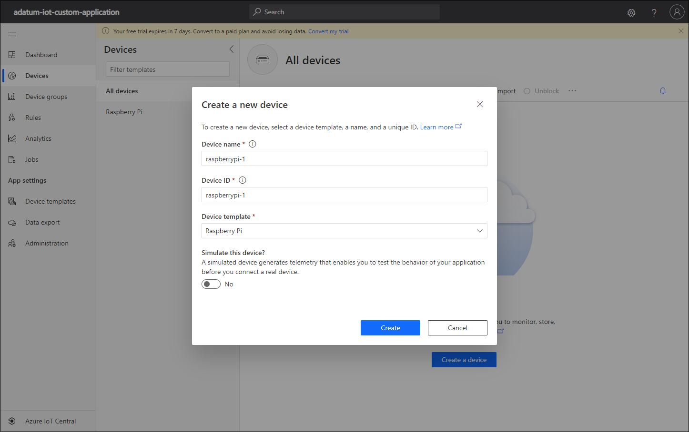

1. Back on the **Devices** page, click the **raspberrypi-1** entry.
1. On the **raspberrypi-1** page, click **Connect**.
1. In the **Device connection** window, identify the values of **ID scope**, **Device ID**, and **Primary key** properties, record them in Notepad, and select **Close**.

   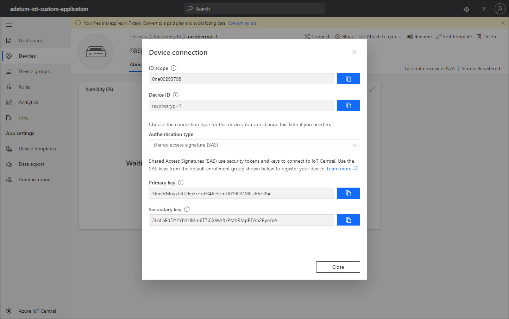

1. Start another web browser window and navigate to the [Azure IoT Central Connection String Generator page](https://dpsgen.z8.web.core.windows.net/)
1. On the **Azure IoT Central Connection String Generator** page, paste the values of **Scope**, **Device Id**, and **Device Key** into their respective textboxes and select **Get Connection String** (use the values of **ID scope**, **Device ID**, and **Primary key** properties you identified).

   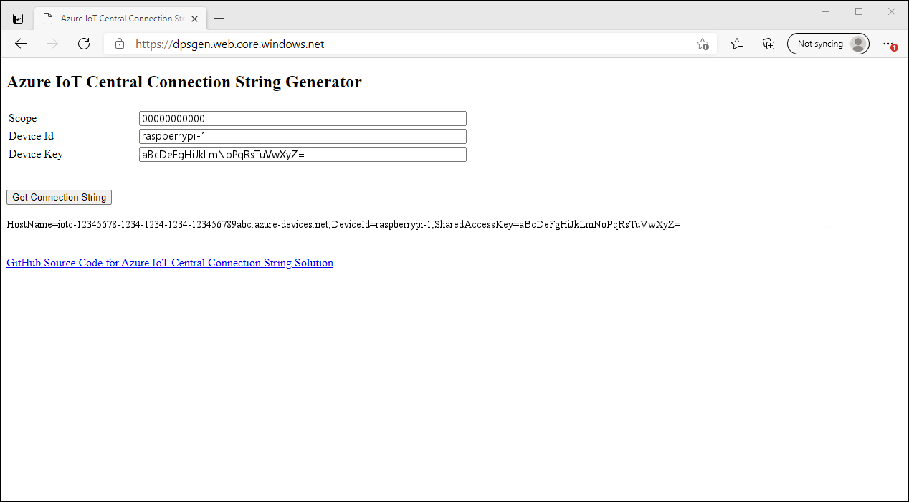

1. On the **Azure IoT Central Connection String Generator** page, copy the value of the newly generated connection string and record it in Notepad.
1. Start another web browser window and navigate to the [Raspberry Pi Azure IoT Online Simulator page](https://azure-samples.github.io/raspberry-pi-web-simulator/#Getstarted)
1. On the **Raspberry Pi Azure IoT Online Simulator** page, if presented with **Step 1** of the **Overview of Raspberry Pi Simulator**, review its displayed content, click **Next**, review **Step 2** content, click **Next** again, and, when presented with **Step 3**, click **Got it**.
1. In the code pane of the **Raspberry Pi Azure IoT Online Simulator** page, replace the entry `[Your IoT hub device connection string]` with the value of the connection string you generated by using the **Azure IoT Central Connection String Generator**.

   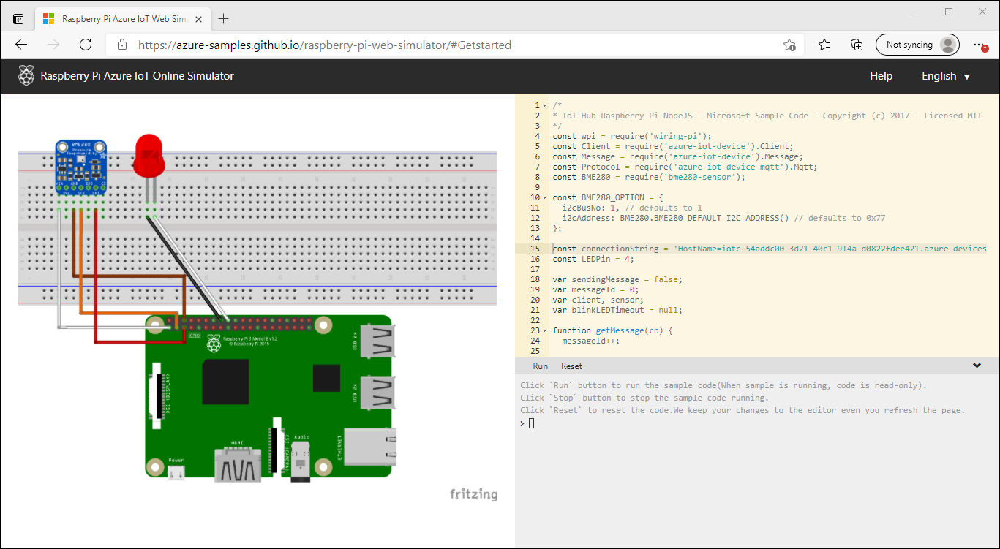

1. On the **Raspberry Pi Azure IoT Online Simulator** page, directly below the code pane, select **Run** and verify that the messages containing temperature and humidity telemetry are generated and sent to the target designated by the connection string:

   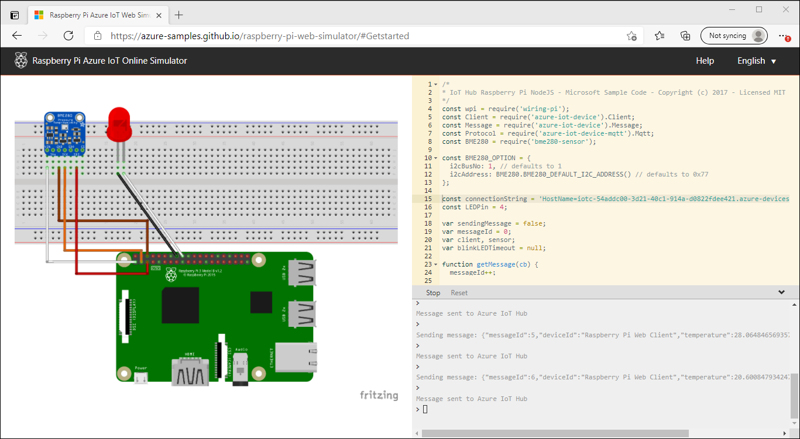

1. Switch back to the web browser window displaying the **About** view of the **raspberrypi-1** page and monitor the charts displaying humidity and temperature telemetry.

   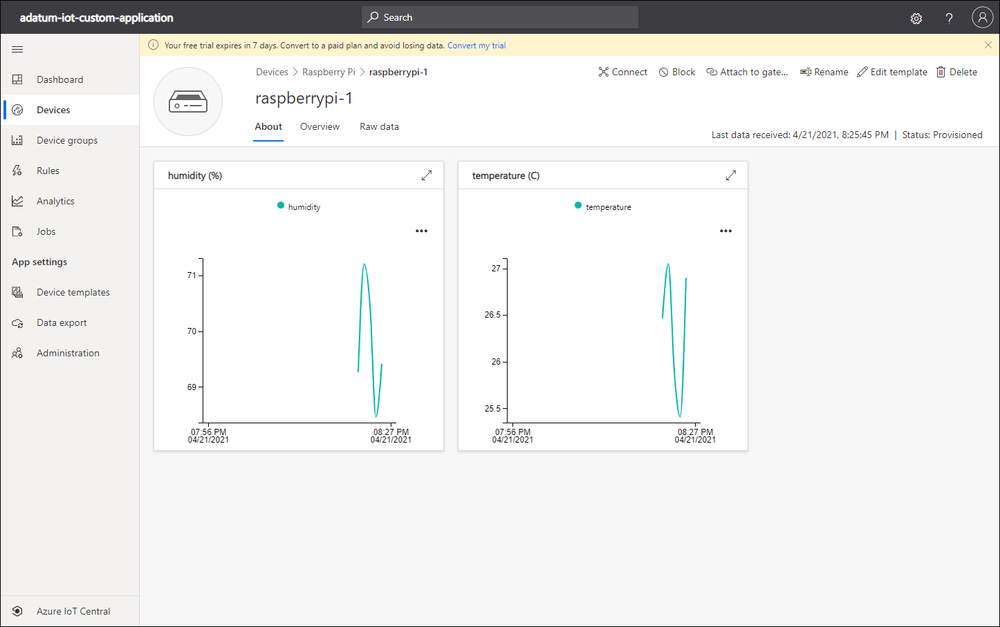

1. On the **raspberrypi-1** page, switch to the **Overview** view tab, review the chart displaying both humidity and temperature telemetry, and identify the average humidity and temperature.

   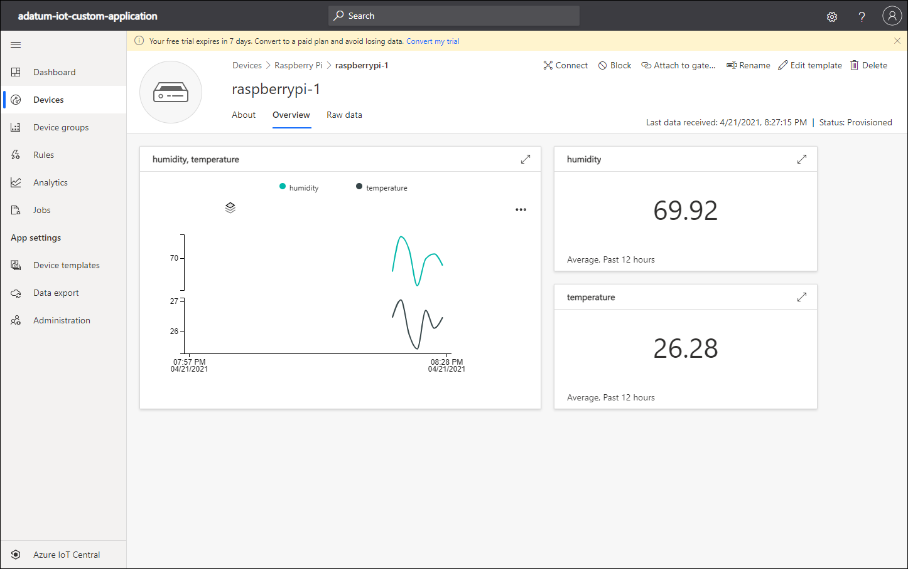

1. On the **raspberrypi-1** page, select the **Raw data** view tab, select first timestamp entry, expand its content, and verify that it contains the humidity and temperature telemetry. Note that the same values appear in the **humidity** and **temperature** columns.

   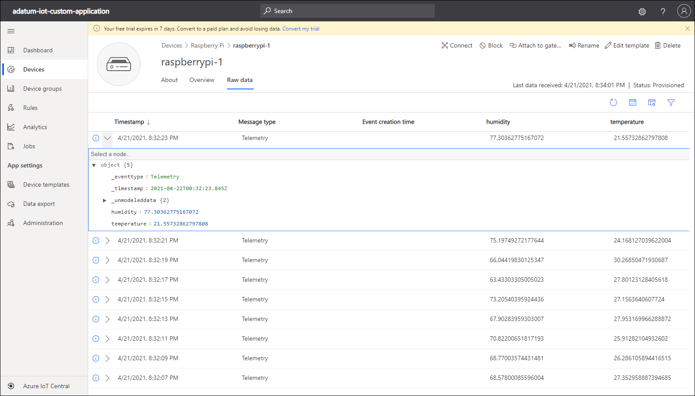

1. In the IoT Central Application portal, in the vertical menu on the left side, select **Analytics**.
1. On the **Analytics** page, in the **Device group** drop-down list, select the **Raspberry Pi - All devices** entry, in the **Telemetry** drop-down list, select **Temperature**, in the **Group by** drop-down list, select **Device ID**, and select **Analyze**. 
1. On the **Analytics** page, next to the **Timeframe** label, select the calendar icon, adjust the **Start** and **End** timestamp to align with the telemetry collection window, and select **Save**.

   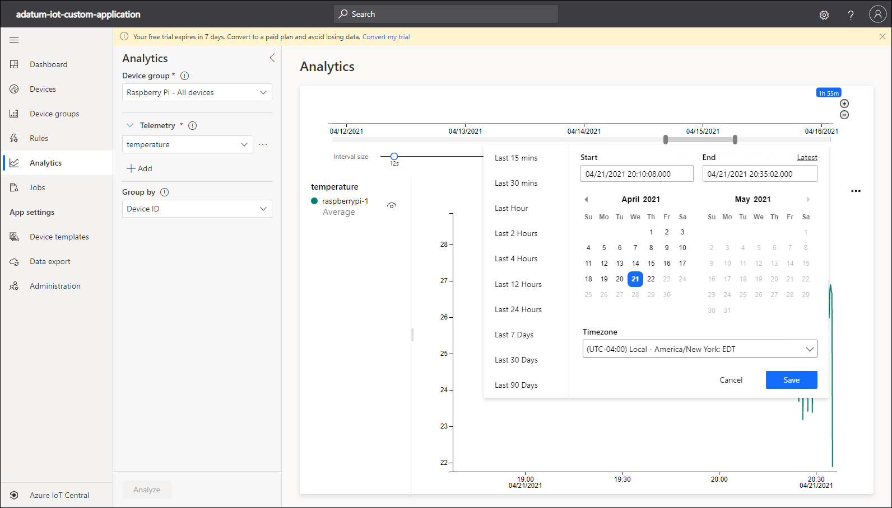

1. On the **Analytics** page, review the resulting graph.

   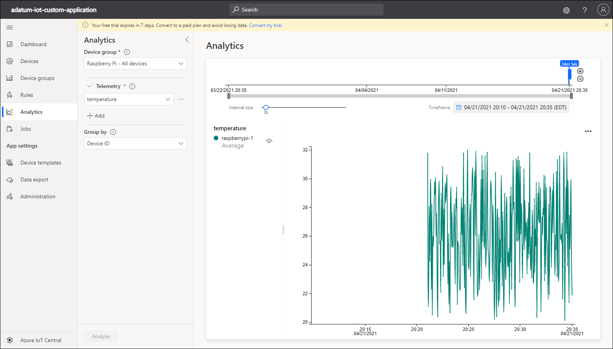

1. Switch to the browser window displaying the **Raspberry Pi Azure IoT Online Simulator** page, on the **Raspberry Pi Azure IoT Online Simulator** page, directly below the code pane, select **Stop**, and verify that the simulated device no longer sends messages to the Azure IoT Central application.
1. Keep all the web browser windows open. You will use them in the next exercise of this module.

Congratulations! You completed the first exercise of this module. In its exercise, you created an Azure IoT Central application, created an IoT device template, and integrated a Raspberry Pi simulated IoT device with the Azure IoT Central application.