This exercise provides an overview of configuring rules and data export of IoT telemetry by using Azure IoT Central applications. For more information regarding these topics, refer to:

* [Configure rules](https://docs.microsoft.com/azure/iot-central/core/howto-configure-rules)
* [Create webhook actions on rules in Azure IoT Central](https://docs.microsoft.com/azure/iot-central/core/howto-create-webhooks)
* [Export IoT data to cloud destinations using data export](https://docs.microsoft.com/azure/iot-central/core/howto-export-data)

In this exercise, you will:

* Create an Azure function that logs an HTTP request payload
* Configure and validate IoT telemetry rules of an Azure IoT Central application
* Create an Azure Storage account that will store IoT telemetry
* Configure and validate data export of an Azure IoT Central application

## Prerequisites

* An Azure subscription
* A Microsoft account or an Azure AD account with the Global Administrator role in the Azure AD tenant associated with the Azure subscription and with the Owner or Contributor role in the Azure subscription
* Completed the exercise unit #3 Set up Azure IoT Central

## Create an Azure function that logs an HTTP request payload

* Before you configure Azure IoT Central application rules, you will create an Azure Function app that will help validate rule processing. When implementing your cloud-native application, you can easily replace the Azure Function app with any other component that supports the HTTP webhook functionality.

1. Start a web browser, navigate to the [Azure portal](https://portal.azure.com/) and sign in to access the Azure subscription you will be using in this module.
1. Use the **Search resources, services, and docs** text box at the top of the Azure portal page to search for **Function App**. 
1. On the **Function App** blade, select **+ Add**
1. On the **Basics** tab of the **Create Function App** blade, configure the following settings and select **Next: Hosting >**:

   | Setting | Configuration |
   | --- | --- |
   | Subscription | Select the name of the Azure subscription you will be using in this module. |
   | Resource Group | Create a new resource group named **iot-central-apps-RG**. |
   | Function App name | Type a unique name consisting of lower case letters, digits and/or dashes, starting with a letter. |
   | Publish | Select **Code**. |
   | Runtime stack | Select **.NET**. |
   | Version | Select **3.1** |
   | Region | Select the Azure region closest to the location of your lab environment, preferably matching the location you chose for the Azure IoT Central deployment. |

   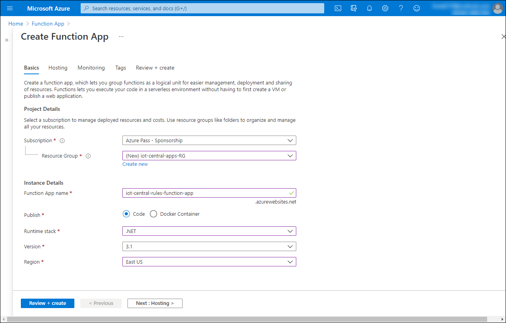

1. On the **Hosting** tab of the **Create Function App** blade, accept the default settings and select **Next: Monitoring >**.
1. On the **Monitoring** tab of the **Create Function App** blade, accept the default settings and select **Review + create**.
1. On the **Review + create** tab of the **Create Function App** blade, select **Create**

   * Wait for the Azure Function app provisioning to complete. This might take about 2 minutes.

1. Within the browser window displaying the Azure portal with the Azure Function app provisioning status blade, select **Go to resource**.
1. On the Azure Function app blade, select **Functions** and then select **+ Add**.
1. On the **Add function** blade, select the **HTTP trigger** template entry and select **Add**.

   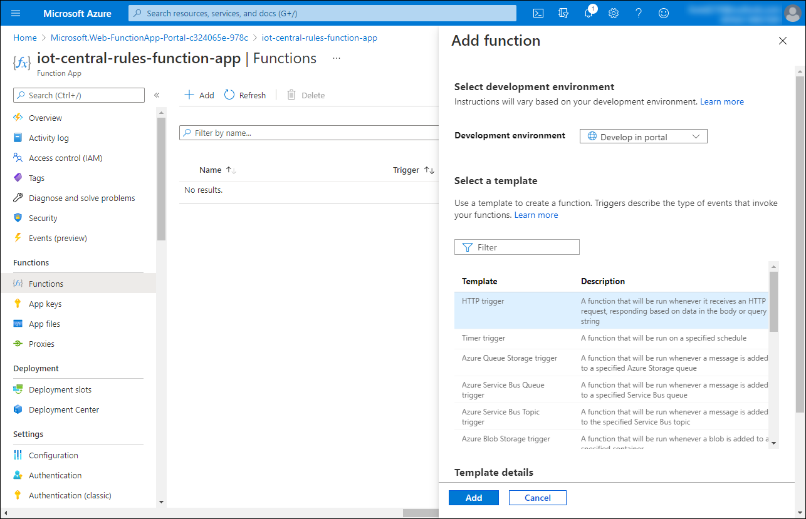

1. On the **HttpTrigger1** blade, in the vertical menu bar on the left side, in the **Developer** section, select **Code + Test**.

   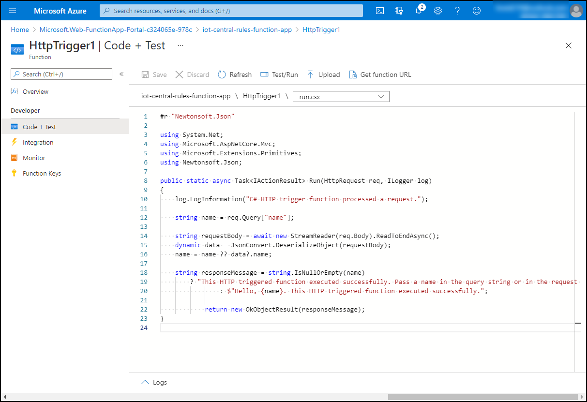

1. On the **HttpTrigger1 \| Code + Test** blade, replace the existing code with the following content and select **Save** to save your changes:

   ```csharp
   #r "Newtonsoft.Json"

   using System.Net;
   using Microsoft.AspNetCore.Mvc;
   using Microsoft.Extensions.Primitives;
   using Newtonsoft.Json;

   public static async Task<IActionResult> Run(HttpRequest req, ILogger log)
   {
       log.LogInformation("C# HTTP trigger function processed a request.");

       string requestBody = await new StreamReader(req.Body).ReadToEndAsync();
       dynamic data = JsonConvert.DeserializeObject(requestBody);

       string responseMessage = $"Payload: {data}. \nThis HTTP triggered function executed successfully."; 
       log.LogInformation(responseMessage);

       return new OkObjectResult(responseMessage);
   }
   ```

   * The function simply logs the payload of the HTTP request, which, in this case, should represent the telemetry data forwarded to the function app's endpoint by the Azure IoT Central application you created in the previous exercise unit in this module.

1. On the **HttpTrigger1 \| Code + Test** blade, select **Get function URL** and record its value.

   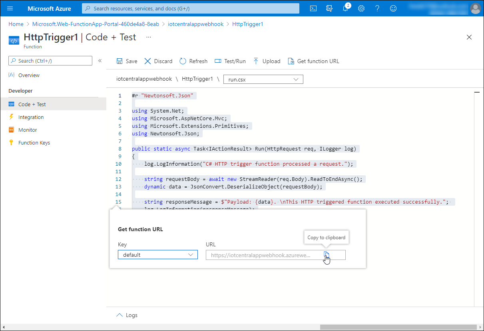

1. To test the newly created function, on the **HttpTrigger1 \| Code + Test** blade, select **Test/Run** and, with the **Input** tab selected, click **Run**.

   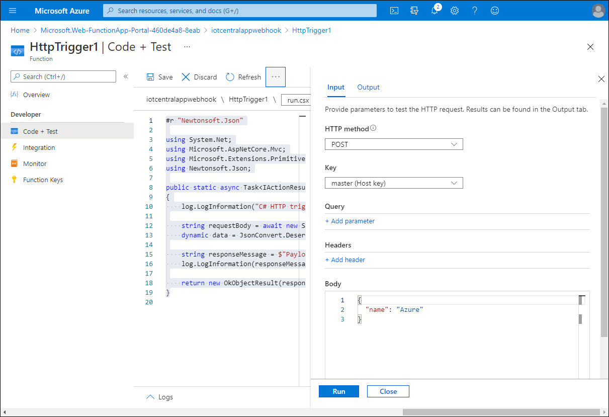

1. To verify the results, on the **HttpTrigger1 \| Code + Test** blade, review the log pane and verify that the payload data matches the one displayed on the **Output** tab.

   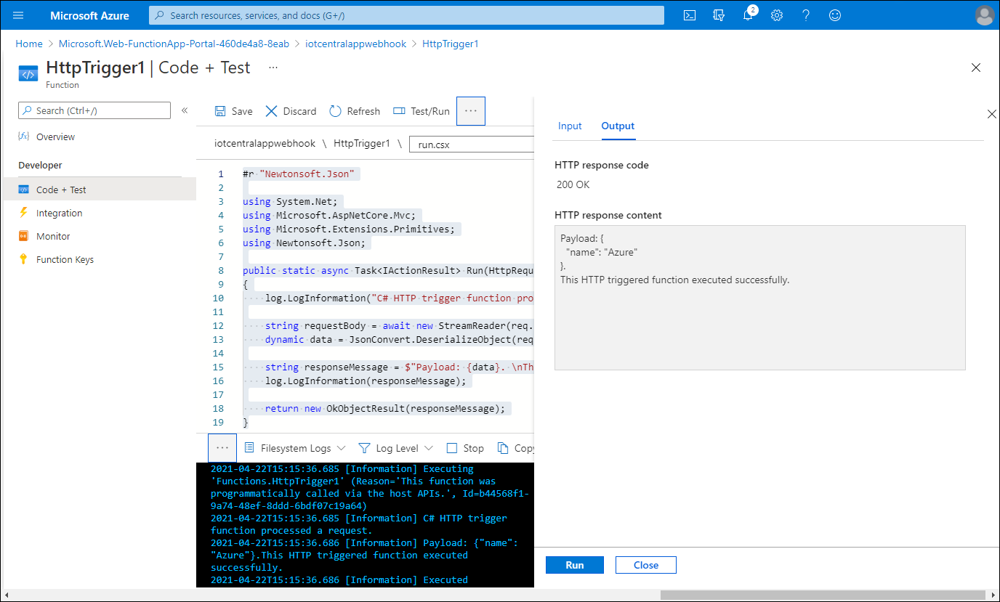

   * You might have to select **Run** the second time to generate the results in the log pane.

## Configure and validate IoT telemetry rules of an Azure IoT Central application

1. Start another web browser window and navigate to the [Welcome to IoT Central page](https://apps.azureiotcentral.com/). 
1. If prompted, sign in to access the Azure subscription you used in the exercise unit #3 Set up Azure IoT Central.
1. On the left side of the **Welcome to IoT Central** page, expand the vertical menu and select the **My apps** menu entry. 
1. On the **My apps** page, select the **adatum-iot-custom-application** entry.
1. On the **Dashboard** page of the IoT Central Application portal, in the vertical menu on the left side, select **Rules**.
1. On the **Rules** page, select **+ New** and configure the following settings: 

   | Setting | Configuration |
   | --- | --- |
   | Rule name | Type **Adatum IoT custom app testing rule**. |
   | Device template | Select **Raspberry Pi**. |
   | Time aggregation | Turn it **On** with the value of time interval set to **5 minutes**. |
   | Telemetry | Select **humidity**. |
   | Aggregation | Select **Average**. |
   | Operator | Select **is greater than** |
   | Enter a value | Type **30**. |
   | Action | Select **+ Webhook** |
   | Display name | Type **Azure function webhook** |
   | Callback URL | Paste the value of the Azure function URL you recorded in the previous task of this exercise |

   

   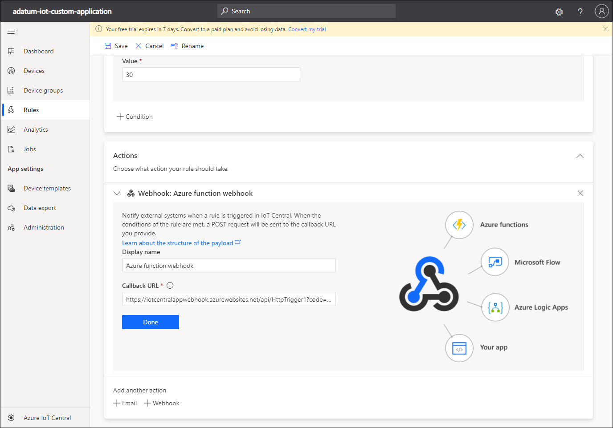

   * The value of the humidity telemetry is intentionally artificially low in order to invoke the webhook functionality and trigger the function. In real-life scenarios, you would adjust it in order to correspond to the condition which warrants raising an alert or taking a remediation action.

1. On the **Rules** page, select **Done** and then select **Save**.
1. Switch to the browser window displaying the **Raspberry Pi Azure IoT Online Simulator** page you used in the previous exercise of this module, on the **Raspberry Pi Azure IoT Online Simulator** page, directly below the code pane, select **Run**, and verify that the simulated device is sending messages to the Azure IoT Central application.

   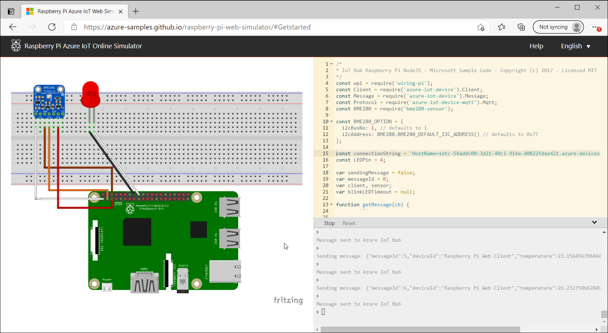

1. Switch back to the web browser window displaying the **HttpTrigger1 \| Code + Test** blade in the Azure portal, in the vertical menu on the left side, in the **Developer** section, select the **Monitor** entry, and on the **HttpTrigger1 \| Code + Test** blade, select the **Logs** tab.
1. Verify that the logs pane displays the messages generated in response to the HTTP trigger originating from the Azure IoT Central application webhook you configured earlier in this task.

   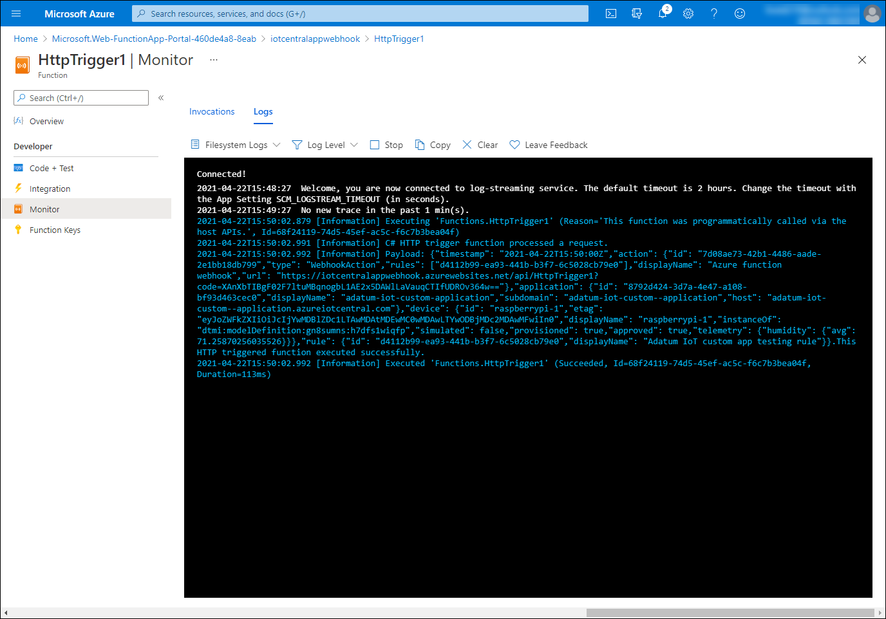

## Create an Azure Storage account that will store IoT telemetry
 	
1. Switch to the web browser window displaying the Azure portal. 
1. In the Azure portal, use the **Search resources, services, and docs** text box at the top of the Azure portal page to search for **Storage accounts**.
1. On the **Storage accounts** blade, select **+ Add**.
1. On the **Basics** tab of the **Create storage account** blade, configure the following settings (leave others with their default values):

   | Setting | Configuration |
   | --- | --- |
   | Subscription | Select the name of the Azure subscription you will be using in this module. |
   | Resource Group | Select **iot-central-apps-RG**. |
   | Storage account name | Type a unique name consisting of between 3 and 24 lower case letters and digits starting with a letter. |
   | Performance | Select **Standard**. |
   | Account kind | **StorageV2 (general purpose v2)** |
   | Replication | **Locally-redundant storage (LRS)** |

   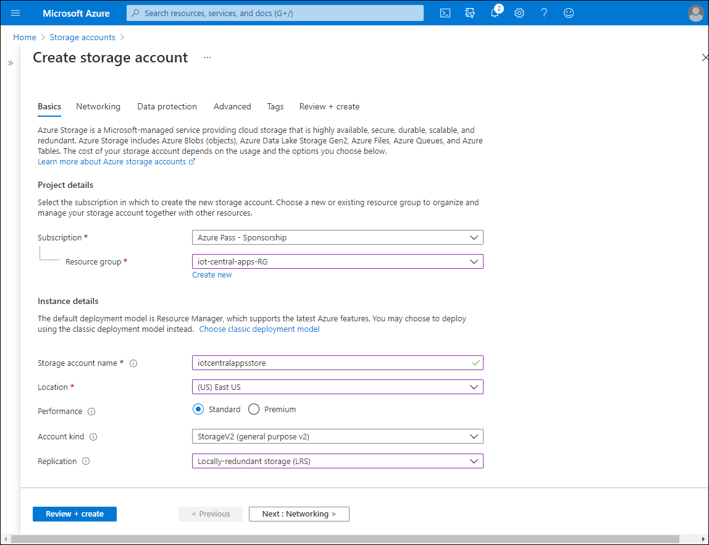

1. On the **Basics** tab of the **Create storage account** blade, select **Review + create** and then select **Create**.

   * Wait for the Azure storage account provisioning to complete. This might take about 2 minutes.

1. Within the browser window displaying the Azure portal with the Azure storage account provisioning status blade, select **Go to resource**.
1. On the Azure storage account blade, in the vertical menu on the left side, in the **Blob service** section, select **Containers**, select **+ Container**, on the **New container** blade, in the **Name** text box, type **iotcontainer**, leave the **Public access level** set to **Private (no anonymous access)** and select **Create**.

   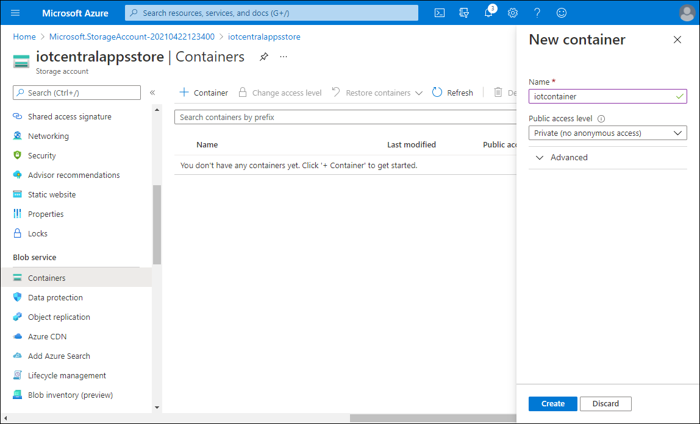

1. On the Azure storage account blade, in the vertical menu on the left side, in the **Settings** section, select **Access keys**, select **Show keys** and record the value of the connection string corresponding to **key1**.

   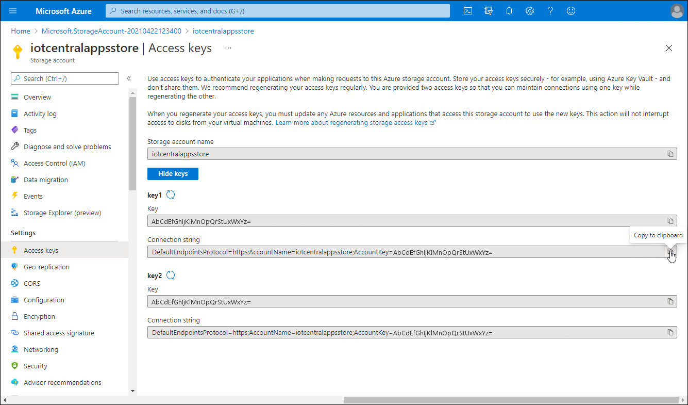

## Configure and validate data export of an Azure IoT Central application

1. Switch to the web browser window displaying the **adatum-iot-custom-application** page in the IoT Central Application portal.
1. In the IoT Central Application portal, on the the **adatum-iot-custom-application** page, in the vertical menu on the left side, in the **App settings** section, select **Data export** and then select **+ New export**.

   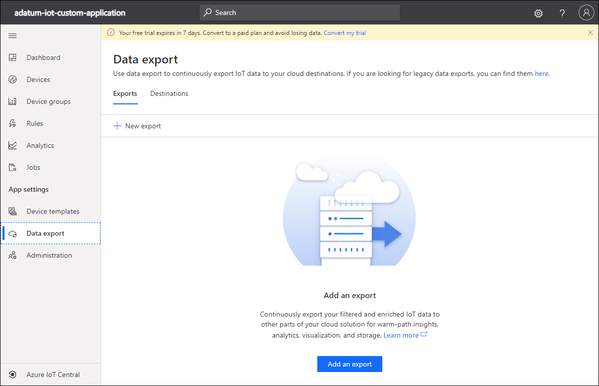

1. On the **Create new export** page, configure the following settings: 

   | Setting | Configuration |
   | --- | --- |
   | Export name | Type **Adatum IoT custom app export**. |
   | Type of data to export | Select **Telemetry**. |
   | Destinations | Select **create a new one**. |
   | New destination name | Type **Adatum Blob Storage**. |
   | Destination type | Select **Azure Blob Storage**. |
   | Connection string | Paste the value of the connection string you copied in the previous task of this exercise. |
   | Container | Type **iotcontainer**. |

   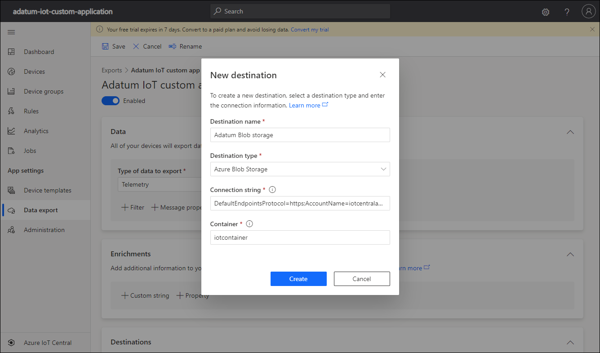

1. On the **Create new export** page select **Create** and then select **Save**.
1. Switch to the browser window displaying the **Raspberry Pi Azure IoT Online Simulator** page you used earlier in this exercise, on the **Raspberry Pi Azure IoT Online Simulator** page, directly below the code pane, select **Run**, and verify that the simulated device is sending messages to the Azure IoT Central application.
1. Switch to the browser window displaying the Azure storage account blade in the Azure portal.
1. On the Azure storage account blade, in the vertical menu on the left side, in the **Blob service** section, select **Containers** and, in the list of containers, select the **iotcontainer** entry.
1. On the **iotcontainer** blade, verify presence of a new folder with a GUID-based name.

   * If the folder is not present, wait for about 1 minute and select **Refresh**. 

1. On the **iotcontainer** blade, click the newly generated folder and navigate through its subfolders until you reach a blob in any of its subfolders.
1. On the **iotcontainer** blade, click the blob you identified in the previous step and, within the blob blade, select the **Edit** tab to display its content.

   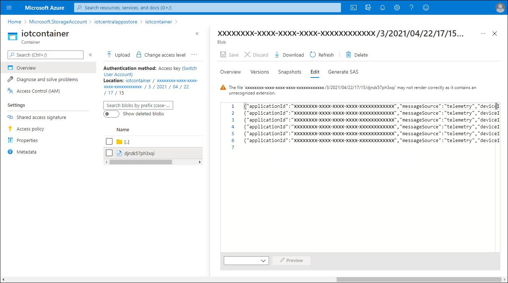

1. Switch to the browser window displaying the **Raspberry Pi Azure IoT Online Simulator** page, on the **Raspberry Pi Azure IoT Online Simulator** page, directly below the code pane, select **Stop**, and verify that the simulated device no longer sends messages to the Azure IoT Central application.

Congratulations! You completed the second exercise of this module. In its exercise, you create an Azure function that logs an HTTP request payload, configured and validated IoT telemetry rules of an Azure IoT Central application, created an Azure Storage account that will store IoT telemetry, and configured and validated data export of an Azure IoT Central application. 

* To avoid unnecessary charges due to usage of Azure resources, you should delete the **iot-central-apps-RG** resource group you created at the beginning of this exercise. To do so, in the Azure portal, navigate to the **iot-central-apps-RG** blade, select the **Delete resource group** entry in the toolbar, in the **TYPE THE RESOURCE GROUP NAME** textbox, type **iot-central-apps-RG**, and select **Delete**.
