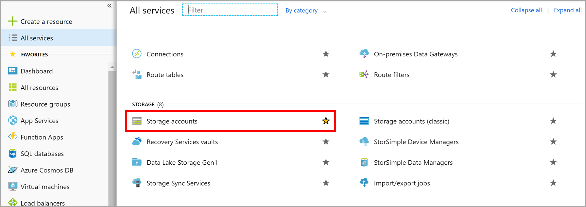
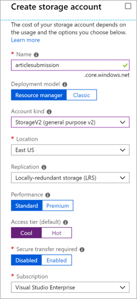

Direct communication between the components of a distributed application can be problematic because it might be disrupted when network bandwidth is low or when demand is high.

We've seen this in our system: the web portal calls a web service, which works great if the service responds in a timely manner. High traffic causes problems and so the plan is to use a queue to eliminate the direct link between the front-end apps and your middle-tier web service.

## What is Azure Queue storage?

Azure [Queue storage](https://azure.microsoft.com/services/storage/queues/) is an Azure service that implements cloud-based queues. Each queue maintains a list of messages. Application components access a queue using a REST API or an Azure-supplied client library. Typically, you'll have one or more _sender_ components and one or more _receiver_ components. Sender components add messages to the queue. Receiver components retrieve messages from the front of the queue for processing. The following illustration shows multiple sender applications adding messages to the Azure Queue and one receiver application retrieving the messages.


Pricing is based on queue size and number of operations. Larger message queues cost more than smaller queues. Charges are also incurred for each operation, such as adding a message and deleting a message. For pricing details, see [Azure Queue storage pricing](https://azure.microsoft.com/pricing/details/storage/queues/).

## Why use queues?

A queue increases resiliency by temporarily storing waiting messages. At times of low or normal demand, the size of the queue remains small because the destination component removes messages from the queue faster than they're added. At times of high demand, the queue may increase in size, but messages aren't lost. The destination component can catch up and empty the queue as demand returns to normal.

A single queue can be up to **500 TB** in size, so it can potentially store _millions_ of messages. The target throughput for a single queue is 2000 messages per second, allowing it to handle high-volume scenarios.

Queues let your application scale automatically and immediately when demand changes. This feature makes them useful for critical business data that would be damaging to lose. Azure offers many other services that scale automatically. For example, the **Autoscale** feature is available on Azure Virtual Machine Scale Sets, cloud services, Azure App Service plans, and App Service environments. This lets you define rules that Azure uses to identify periods of high demand and automatically add capacity without involving an administrator. Autoscaling responds to demand quickly, but not instantaneously. By contrast, Azure Queue storage instantaneously handles high demand by storing messages until processing resources are available.

## What is a message?

A message in a queue is a byte array of up to 64 KB. Message contents aren't interpreted at all by any Azure component.

If you want to create a structured message, you could format the message content using XML or JSON. Your code is responsible for generating and interpreting your custom format. You could make a custom JSON message that looks like the following example:

```json
{
    "Message": {
        "To": "news@contoso.com",
        "From": "writer@contoso.com",
        "Subject": "Support request",
        "Body": "Send me a photographer!"
    }
}
```

## Creating a storage account

A queue must be part of a [storage account](https://azure.microsoft.com/services/storage/). You can create a storage account using the Azure CLI (or PowerShell), or Azure portal. The portal is easiest because it's all guided and prompts you for each piece of information.

The following screenshot shows the location of the Storage accounts category.



There are several options you can supply when you create the account, most of which you can use the default selection. We covered these options in a previous module, but you can hover over the `(i)` tip associated with each option to get a reminder of what it does. Here's an example of filling out the portal pane.

The following screenshot displays the Create storage account pane and the information required to create a storage account.



### Settings for queues
When you create a storage account that will contain queues, you should consider the following settings:

- Queues are only available as part of Azure general-purpose storage accounts (v1 or v2). You can't add them to Blob storage accounts.
- The **Access tier** setting, which is shown for StorageV2 accounts applies only to Blob storage and doesn't affect queues.
- You should choose a location that is close to either the source components or destination components or (preferably) both.
- Data is always replicated to multiple servers to guard against disk failures and other hardware problems. You have a choice of replication strategies: **Locally Redundant Storage (LRS)** is low-cost but vulnerable to disasters that affect an entire data center while **Geo-Redundant Storage (GRS)** replicates data to other Azure data centers. Choose the replication strategy that meets your redundancy needs.
- The performance tier determines how your messages are stored: **Standard** uses magnetic drives while **Premium** uses solid-state drives. Choose Standard if you expect peaks in demand to be short. Consider Premium if queue length sometimes becomes long and you need to minimize the time to access messages.
- Require secure transfer if sensitive information may pass through the queue. This setting ensures that all connections to the queue are encrypted using Secure Sockets Layer (SSL).
