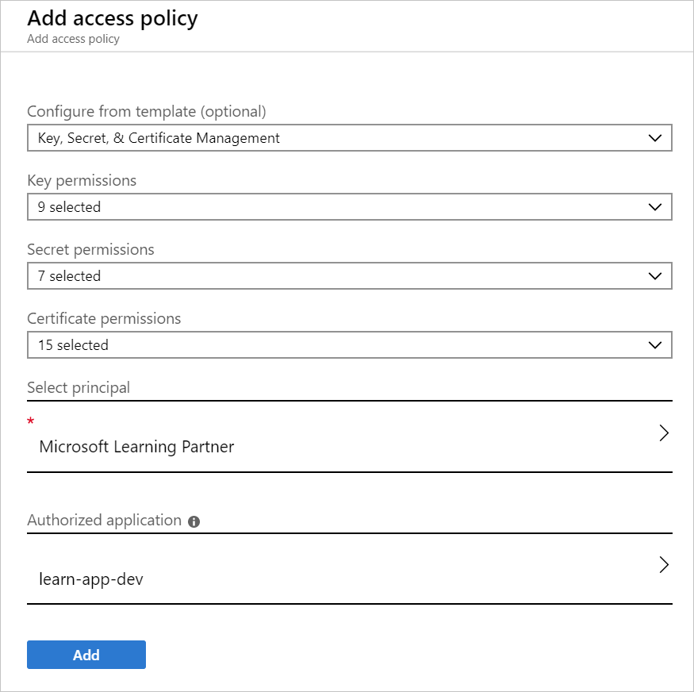
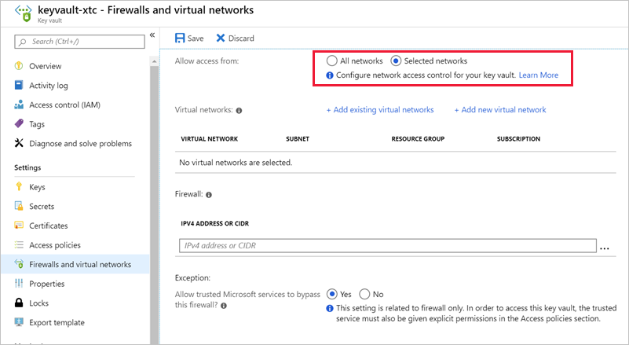

Key Vault access has two facets: the management of the Key Vault itself, and accessing the data contained in the Key Vault. Documentation refers to these facets as  the _management plane_ and the _data plane_.

These two areas are separated because the creation of the Key Vault (a management operation) is a different role than storing and retrieving a secret stored in the Key Vault. To access a key vault, all users or apps must have proper _authentication_ to identify the caller, and _authorization_ to determine the operations the caller can perform.

## Authentication

Azure Key Vault uses Azure Active Directory (Azure AD) to authenticate users and apps that try to access a vault. Authentication is always performed by associating the Azure AD tenant of the subscription that the Key Vault is part of, and every user or app making a request having to be known to Azure AD. There is no support for anonymous access to a Key Vault.

## Authorization

Management operations (creating a new Azure Key Vault) use role-based access control (RBAC). There is a built-in role **Key Vault Contributor** that provides access to management features of key vaults, but doesn't allow access to the key vault data. This is the recommended role to use. There's also a **Contributor** role that includes full administration rights - including the ability to grant access to the data plane.

Reading and writing data in the Key Vault uses a separate Key Vault _access policy_. A Key Vault access policy is a permission set assigned to a user or managed identity to read, write, and/or delete secrets and keys. You can create an access policy using the CLI, REST API, or Azure portal as shown below.

The system has a list of predefined management options that define the permissions allowed for this policy - here we have **Key, Secret, & Certificate Management** selected which is appropriate to manage secrets in the Key Vault. You can then customize the permissions as desired by changing the **Key permissions** entries. For example, we could adjust the permissions to only allow _read_ operations:

Developers will only need `Get` and `List` permissions to a development-environment vault. A lead or senior developer will need full permissions to the vault to change and add secrets when necessary. Full permissions to production-environment vaults are typically reserved for senior operations staff. For apps, often only `Get` permissions are required as they will just need to retrieve secrets.

## Restricting network access

Another point to consider with Azure Key Vault is what services in your network can access the vault. In most cases, the network endpoints don't need to be open to the Internet. You should determine the minimum network access required - for example you can restrict Key Vault endpoints to specific Azure Virtual Network subnets, specific IP addresses, or trusted Microsoft services including Azure SQL, Azure App Service, and various data and storage services that use encryption keys.

