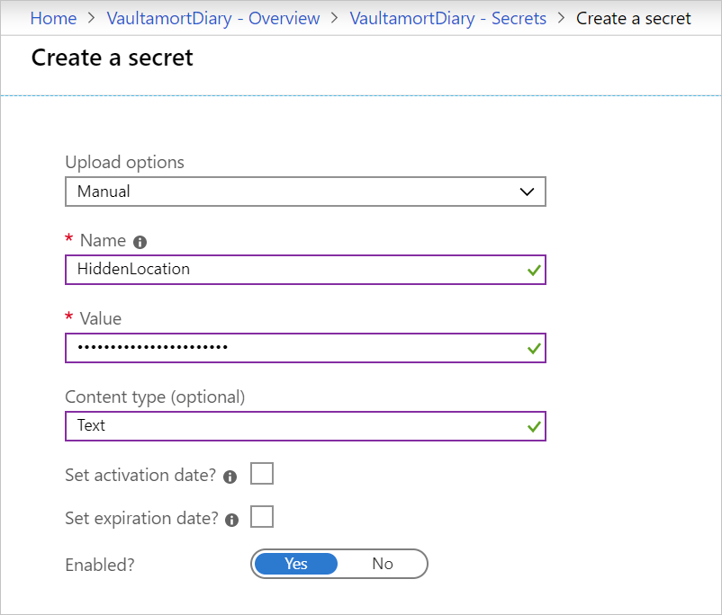
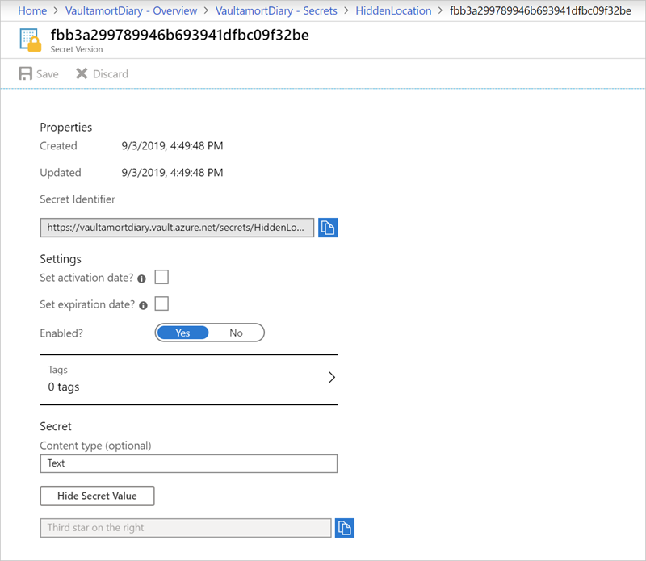

To get some quick experience with Azure Key Vault, let's create a new Key Vault and do the most basic operation available: store a secret. Creating a vault in the Azure portal requires no initial configuration. Your signed-in user identity is automatically granted the full set of secret management permissions and you can start adding secrets immediately. Once you have a vault, adding and managing secrets can be done from any Azure administrative interface, including the Azure portal, the Azure CLI, and Azure PowerShell.

## Create a new Azure Key Vault

Let's start by creating a new Key Vault in the Azure portal

1. Sign into the [Azure portal](https://portal.azure.com?azure-portal=true) using the same credentials you used to activate the Azure Sandbox.
1. Select **+ Create a resource** from the left-hand sidebar.
1. Type **Key Vault** into the search box to find the Azure Key Vault service and select **Create** on the description screen.

1. On the **Basics** tab:
    - Make sure the _Concierge Subscription_ is selected in the **Subscription** drop-down.
    - Select <rgn>[The Sandbox resource group]</rgn> from the **Resource group** drop-down.
    - Enter a globally unique name for the new vault. Vault names must be 3-24 characters long and contain only alphanumeric characters and dashes.
    - Leave the default selected values for **Location** and **Pricing tier**.

1. Select **Review + create** to go to the validation screen.
1. Select **Create** to create the Azure Key Vault.

Once the deployment is complete, navigate to the resource.

## Add a secret

Next, add a new secret to the vault.

1. In the Azure portal, select **Secrets** under the **Settings** section of your Azure Key Vault.
1. Fill out the **Create a secret** screen with a name, value, and (optional) content type. An example is shown below.

    

1. Select **Create** to add the secret.

## Show the secret

Finally, verify that the secret value has been set.

1. Select your secret from the list and then select the current version of the secret.
1. Select **Show Secret Value** to see the value assigned to the secret.

    

## Other ways to consume the secret

You can create and retrieve secrets from the Azure Key Vault as long as you are authenticated with Azure AD using the REST API, native SDKs, Azure CLI, or Azure PowerShell. For example, here's the same process using Azure PowerShell:

```powershell
Get-AzureRmKeyVault
```

This will return the created vault with the name **VaultamortDiary**.

```output
Vault Name          : VaultamortDiary
Resource Group Name : Learn-4f01665a-1272-46a8-9c16-83bbf146494e
Location            : northcentralus
Resource ID         : /subscriptions/xyz/providers/Microsoft.KeyVault/vaults/VaultamortDiary
```

With the name of the vault and the key, you can retrieve the secret value:

```powershell
(Get-AzKeyVaultSecret -vaultName "VaultamortDiary" -name "HiddenLocation").SecretValueText
```

This returns our set value:

```output
Third star on the right
```

> [!NOTE]
> The module [Manage secrets in your server apps with Azure Key Vault](https://docs.microsoft.com/learn/modules/manage-secrets-with-azure-key-vault/) shows how to use the Azure CLI and various programming languages to create Key Vaults, set, and retrieve secrets.
