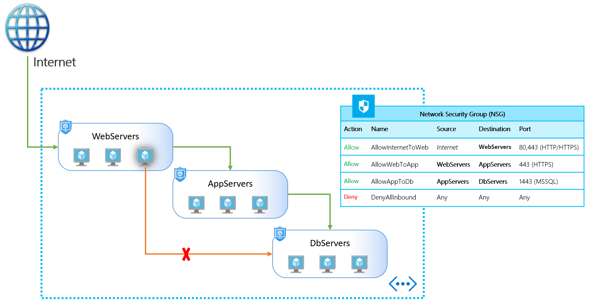
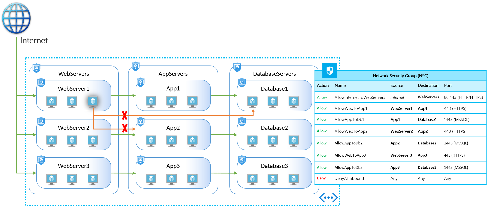
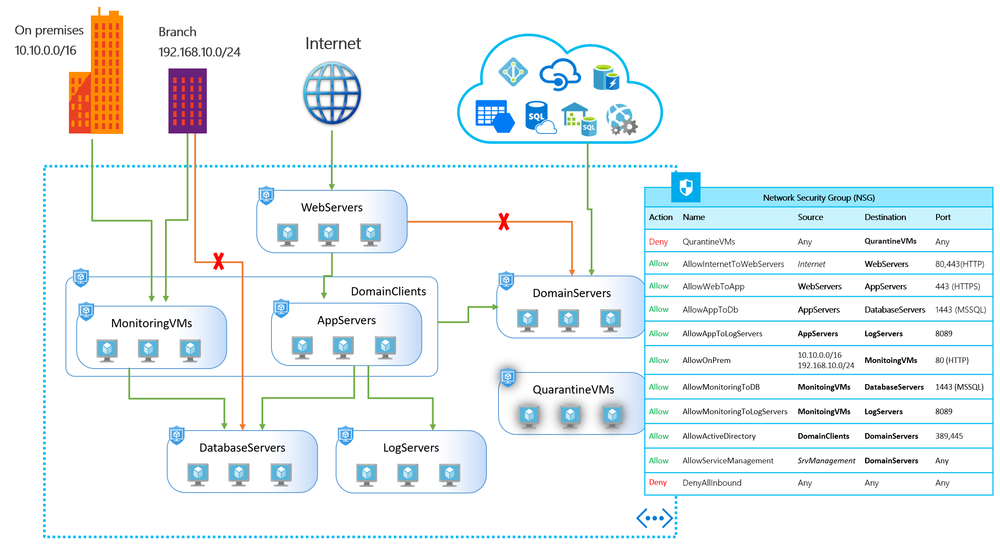

This feature provides security micro-segmentation for your virtual networks in Azure.

## Network security micro segmentation

ASGs enable you to define fine-grained network security policies based on workloads, centralized on applications, instead of explicit IP addresses. Provides the capability to group VMs with monikers and secure applications by filtering traffic from trusted segments of your network.

Implementing granular security traffic controls improves isolation of workloads and protects them individually. If a breach occurs, this technique limits the potential impact of lateral exploration of your networks from hackers.

## Security definition simplified

With ASGs, filtering traffic based on applications patterns is simplified, using the following steps:

- Define your application groups, provide a moniker descriptive name that fits your architecture. You can use it for applications, workload types, systems, tiers, environments or any role.
- Define a single collection of rules using ASGs and Network Security Groups (NSG), you can apply a single NSG to your entire virtual network on all subnets. A single NSG gives you full visibility on your traffic policies, and a single place for management.
- Scale at your own pace. When you deploy VMs, make them members of the appropriate ASGs. If your VM is running multiple workloads, just assign multiple ASGs. Access is granted based on your workloads. No need to worry about security definition again. More importantly, you can implement a zero-trust model, limiting access to the application flows that are explicitly permitted.

## Single network security policy

ASGs introduce the ability to deploy multiple applications within the same subnet, and isolate traffic based on ASGs. With ASGs you can reduce the number of NSGs in your subscription. In some cases, you can use a single NSG for multiple subnets of your virtual network. ASGs enable you to centralize your configuration, providing the following benefits in dynamic environments:

- **Centralized NSG view**: All traffic policies in a single place. It’s easy to operate and manage changes. If you need to allow a new port to or from a group of VMs, you can make a change to a single rule.
- **Centralized logging**: In combination with NSG flow logs, a single configuration for logs has multiple advantages for traffic analysis.
- **Enforce policies**: If you need to deny specific traffic, you can add a security rule with high priority and enforce administrative rules.

## Filtering east-west traffic

With ASGs, you can isolate multiple workloads and provide additional levels of protection for your virtual network.

In the following illustration, multiple applications are deployed into the same virtual network. Based on the security rules described, workloads are isolated from each other. If a VM from one of the applications is compromised, lateral exploration is limited, minimizing the potential impact of an attacker.

In this example, let’s assume one of the web server VMs from `application1` is compromised, the rest of the application will continue to be protected, even access to critical workloads like database servers will still be unreachable. This implementation provides multiple extra layers of security to your network, making this intrusion less harmful and easy to react on such events.

## Filtering north-south traffic

In combination with additional features on NSG, you can also isolate your workloads from on premises and azure services in different scenarios.

In the following illustration, a relatively complex environment is configured for multiple workload types within a virtual network. By describing their security rules, applications have the correct set of policies applied on each VM. Similar to the previous example, if one of your branches is compromised, exploration within the virtual network is limited therefore minimizing the potential impact of an intruder.

In this example, let’s assume someone on one of your branches connected using VPN, compromise a workstation and has access to your network. Normally only a subset of your network is required for this branch, by isolating the rest of your network; all other applications will continue to be protected and unreachable. ASGs another layers of security to your entire network.

Another interesting scenario, assuming you have detected a breach on one of your web servers, a good idea would be to isolate the VM for investigation. With ASGs, you can easily assign a special group predefined for quarantine VMs on your first security policy. These VMs lose access providing an additional benefit to help you react and mitigate this treats.

