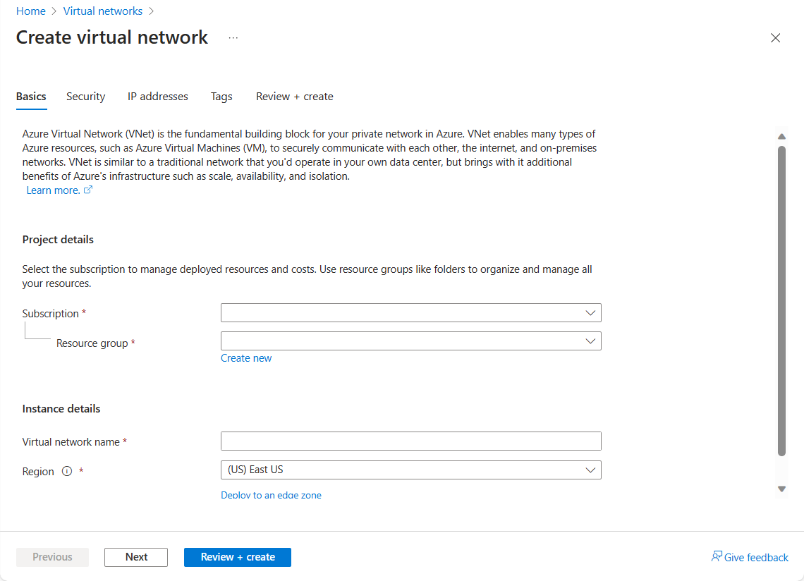
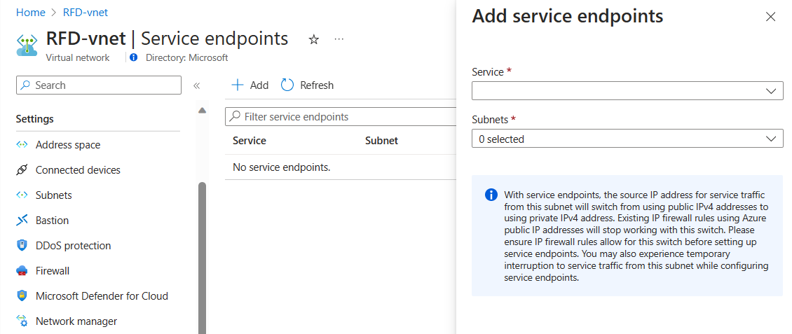
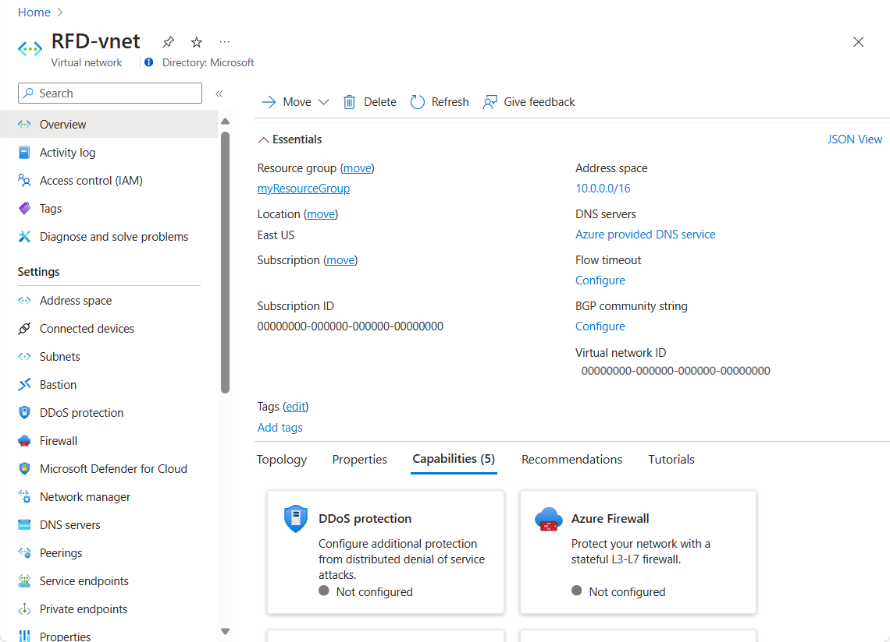

You have an on-premises datacenter that you plan to keep, but you want to use Azure to offload peak traffic using virtual machines (VMs) hosted in Azure. You want to keep your existing IP addressing scheme and network appliances, while ensuring that any data transfer is secure.

## What is Azure virtual networking?

**Azure virtual networks** enable Azure resources, such as virtual machines, web apps, and databases, to communicate with: each other, users on the internet, and on-premises client computers. You can think of an Azure network as a set of resources that links other Azure resources.

Azure virtual networks provide key networking capabilities:

- Isolation and segmentation
- Internet communications
- Communicate between Azure resources
- Communicate with on-premises resources
- Route network traffic
- Filter network traffic
- Connect virtual networks
 
#### Network configurations for virtual machines

> [!VIDEO https://www.microsoft.com/videoplayer/embed/RE2yEve]

### Isolation and segmentation

Azure enables you to create multiple isolated virtual networks. When you set up a virtual network, you define a private Internet Protocol (IP) address space, using either public or private IP address ranges. You can then segment that IP address space into subnets, and allocate part of the defined address space to each named subnet.

For name resolution, you can use the name resolution service that's built in to Azure, or you can configure the virtual network to use either an internal or an external Domain Name System (DNS) server.

### Internet communications

A VM in Azure can connect out to the internet by default. You can enable incoming connections from the internet by defining a public IP address or a public load balancer. For VM management, you can connect via the Azure CLI, Remote Desktop Protocol (RDP), or Secure Shell (SSH).

### Communicate between Azure resources

You'll want to enable Azure resources to communicate securely with each other. You can do that in one of two ways:

- **Virtual networks**

    Virtual networks can connect not only VMs, but other Azure resources, such as the App Service Environment, Azure Kubernetes Service, and Azure virtual machine scale sets.

- **Service endpoints**

     You can use service endpoints to connect to other Azure resource types, such as Azure SQL databases and storage accounts. This approach enables you to link multiple Azure resources to virtual networks, thereby improving security and providing optimal routing between resources.

### Communicate with on-premises resources

Azure virtual networks enable you to link resources together in your on-premises environment and within your Azure subscription, in effect creating a network that spans both your local and cloud environments. There are three mechanisms for you to achieve this connectivity:

- **Point-to-site Virtual Private Networks**

   This approach is like a Virtual Private Network (VPN) connection that a computer outside your organization makes back into your corporate network, except that it's working in the opposite direction. In this case, the client computer initiates an encrypted VPN connection to Azure, connecting that computer to the Azure virtual network.

- **Site-to-site Virtual Private Networks**
    A site-to-site VPN links your on-premises VPN device or gateway to the Azure VPN gateway in a virtual network. In effect, the devices in Azure can appear as being on the local network. The connection is encrypted and works over the internet.

- **Azure ExpressRoute**

    For environments where you need greater bandwidth and even higher levels of security, Azure ExpressRoute is the best approach. Azure ExpressRoute provides dedicated private connectivity to Azure that does not travel over the internet.

### Route network traffic

By default, Azure will route traffic between subnets on any connected virtual networks, on-premises networks, and the internet. However, you can control routing and override those settings as follows:

- **Route tables**

    A route table enables you to define rules as to how traffic should be directed. You can create custom route tables that control how packets are routed between subnets.

- **Border Gateway Protocol**

    Border Gateway Protocol (BGP) works with Azure VPN gateways or ExpressRoute to propagate on-premises BGP routes to Azure virtual networks.

### Filter network traffic

Azure virtual networks enable you to filter traffic between subnets by using the following approaches:

- **Network security groups**

    A network security group (NSG) is an Azure resource that can contain multiple inbound and outbound security rules. You can define these rules to allow or block traffic, based on factors such as source and destination IP address, port, and protocol.

- **Network virtual appliances**

    A network virtual appliance is a specialized VM that can be compared to a hardened network appliance. A network virtual appliance carries out a particular network function, such as running a firewall or performing WAN optimization.

## Connect virtual networks

You can link virtual networks together using virtual network _peering_. Peering enables resources in each virtual network to communicate with each other. These virtual networks can be in separate regions, allowing you to create a global interconnected network through Azure.

## Azure virtual network settings

You can create and configure Azure virtual networks from the Azure portal, Azure PowerShell on your local computer, or Azure Cloud Shell.

### Create a virtual network

When you create an Azure virtual network, you configure a number of basic settings. You'll have the option to configure advanced settings, such as multiple subnets, distributed denial of service (DDoS) protection, and service endpoints.

You'll configure the following settings for a basic virtual network:

- **Network name**

    The network name must be unique in your subscription, but does not need to be globally unique. Make the name a descriptive one that is easy to remember and identified from other virtual networks.

- **Address space**

    When you set up a virtual network, you define the internal address space in Classless Inter-Domain Routing (CIDR) format. This address space needs to be unique within your subscription and any other networks that you connect to.

    Let's assume you choose an address space of 10.0.0.0/24 for your first virtual network. The addresses defined in this address space ranges from 10.0.0.1 - 10.0.0.254. You then create a second virtual network, and choose an address space of 10.0.0.0/8. The address in this address space ranges from 10.0.0.1 - 10.255.255.254. Some of the address overlap and can't be used for the two virtual networks.

    However, you can use 10.0.0.0/16, with addresses ranging from 10.0.0.1 - 10.0.255.254, and 10.1.0.0/16, with addresses ranging from 10.1.0.1 - 10.1.255.254. You can assign these address spaces to your virtual networks because there's no address overlap.

    > [!NOTE]
    > You can add address spaces after creating the virtual network.

- **Subscription**

    Only applies if you have multiple subscriptions to choose from.

- **Resource group**

    Like any other Azure resource, a virtual network needs to exist in a resource group. You can either select an existing resource group, or create a new one.

- **Location**

    Select the location where you want the virtual network to exist.

- **Subnet**

    Within each virtual network address range, you can create one or more subnets that partition the virtual network's address space. Routing between subnets will then depend on the default traffic routes, or you can define custom routes. Alternatively, you can define one subnet that encompasses all the virtual networks' address ranges.

    > [!NOTE]
    > Subnet names must begin with a letter or number, end with a letter, number or underscore, and may contain only letters, numbers, underscores, periods, or hyphens.

- **Distributed Denial of Service (DDoS) protection**

    You can select either Basic or Standard DDoS protection. Standard DDoS Protection is a premium service. The [Azure DDoS Protection Standard](https://docs.microsoft.com/azure/virtual-network/ddos-protection-overview) provides more information about Standard DDoS protection.

- **Service Endpoints**

    Here, you enable service endpoints, and then select from the list which Azure service endpoints you want to enable. Options include Azure Cosmos DB, Azure Service Bus, Azure Key Vault, and so on.

When you have configured these settings, select **Create**.

### Define additional settings

After creating a virtual network, you can then define further settings. These include:

- **Network security group**

    Network security groups have security rules that enable you to filter the type of network traffic that can flow in and out of virtual network subnets and network interfaces. You create the network security group separately, and then associate it with the virtual network.

- **Route table**

    Azure automatically creates a route table for each subnet within an Azure virtual network, and adds system default routes to the table. However, you can add custom route tables to modify traffic between virtual networks.

You can also amend the service endpoints.

### Configure virtual networks

When you have created a virtual network, you can change any further settings from the **Virtual Networks** pane in the Azure portal. Alternatively, you can use PowerShell commands or commands in Cloud Shell to make changes.

You can then review and change settings in further sub-panes. These settings include:

- Address spaces: You can add further address spaces to the initial definition.

- Connected devices: Use the virtual network to connect machines.

- Subnets: Add further subnets.

- Peerings: Link virtual networks in peering arrangements.

You can also monitor and troubleshoot virtual networks, or create an automation script to generate the current virtual network.

Virtual networks are powerful and highly configurable mechanisms for connecting entities in Azure. You can connect Azure resources to one another, or to resources you have on-premises. You can isolate, filter, and route your network traffic, and Azure enables you to increase security where you feel you need it.
