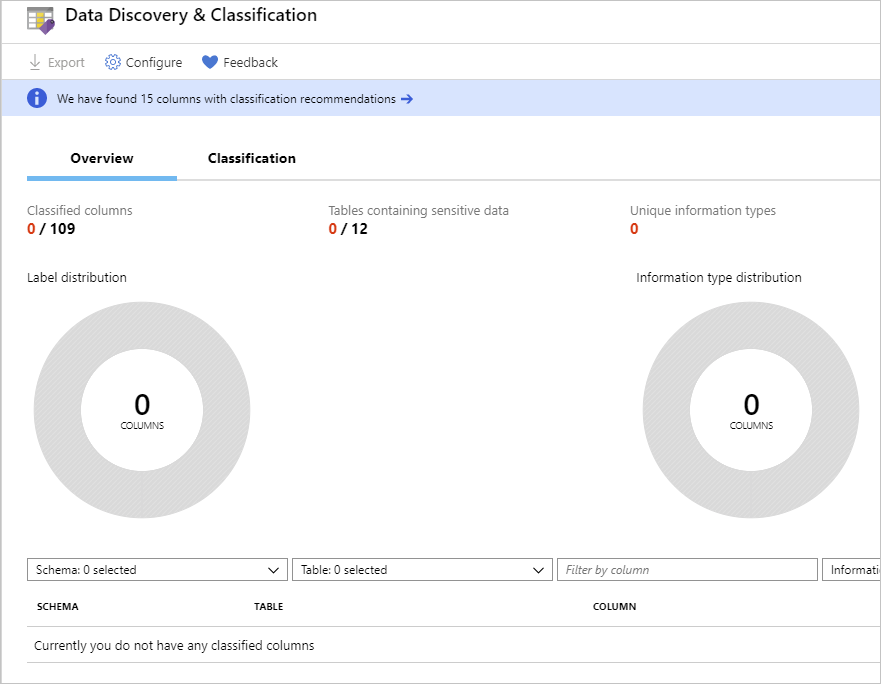
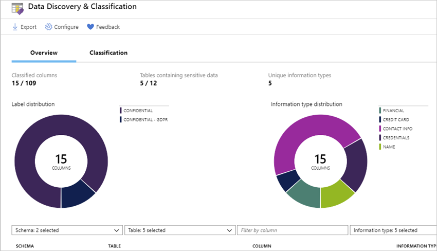
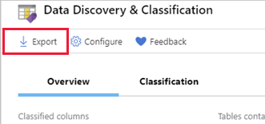
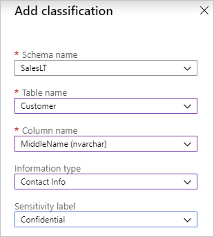

In this step, you will create your resource group and an Azure SQL Database single database containing the AdventureWorksLT sample data

1. Sign-in to the [Azure portal](https://portal.azure.com?azure-portal=true) using the same account you used to activate the Azure Sandbox. Make sure you are in the Microsoft Learn Sandbox directory.
1. Select **+ Create a resource** in the left sidebar of the Azure portal.
1. Select **Databases** and then select **SQL Database** to open the **Create SQL Database** page.

    

1. Use these values to fill out the form.

    | Setting      | Value |
    | ------------ | ----- |
    | **Database name** | **LearnDataPolicy** |
    | **Subscription** | Concierge Subscription |
    | **Resource group** |  Use the existing group <rgn>[sandbox resource group name]</rgn> |
    | **Want to use SQL elastic pool?** | **No** |

1. Under **Server**, click **Create new**, fill out the form, then click **OK**. Here's more information on how to fill out the form:

    | Setting      | Value |
    | ------------ | ----- |
    | **Server name** | A globally unique [server name](https://docs.microsoft.com/azure/architecture/best-practices/naming-conventions). |
    | **Server admin login** | A [database identifier](https://docs.microsoft.com/sql/relational-databases/databases/database-identifiers) that serves as your primary administrator login name. |
    | **Password** | Any valid password that has at least eight characters and contains characters from three of these categories: uppercase characters, lowercase characters, numbers, and non-alphanumeric characters. |
    | **Location** | Any valid location from the available list below. |

    [!include]

1. Select the **Additional settings** tab.
1. In the **Data source** section, under **Use existing data**, select **Sample**.

    :::image type="content" source="../media/M04-L01-01-create-sql-database-additional-settings.png" alt-text="Screenshot of additional configuration page.":::

1. Under **Enable Advanced Data Security**, verify **Start free trial** is selected.
1. Leave the rest of the values as default and select **Review + Create** at the bottom of the form.
1. Review the final settings and select **Create**.

It will take a few minutes to deploy the server with sample data. Once it's complete, select **Go to resource** to navigate to the Overview view of your new SQL database.

## SQL Information Protection (SQL IP)

SQL IP brings a set of advanced services and SQL capabilities, forming a new information protection paradigm in SQL aimed
at protecting the data, not just the database:

* **Azure SQL Auditing** – Azure SQL Auditing tracks database events and writes them to an audit log in your Azure storage account, Log Analytics workspace or Event Hub.
* **Data Discovery & Classifications** – Is built into Azure SQL Database, Azure SQL Managed Instance, and Azure Synapse Analytics. It provides advanced capabilities for discovering, classifying, labeling, and reporting the sensitive data in your databases.
* **Dynamic data masking** – Azure SQL Database, Azure SQL Managed Instance, and Azure Synapse Analytics support dynamic data masking. Dynamic data masking limits sensitive data exposure by masking it to non-privileged users.
* **Security Center** – Scans your database and makes recommendations to improve security. Also allows you to set up and monitor **Security Alerts**.
* **Transparent data encryption** – Transparent data encryption encrypts your databases, backups, and logs at rest without any changes to your application. To enable encryption, go to each database.

### Classify your SQL DB

Let's classify the data in this sample Azure SQL database.

1. Under the **Security** heading in the Azure SQL Database pane, navigate to **Security Center**.
1. If Advanced Data Security isn't enabled, select the **Settings** at the top, and then **Enable** button to enable it. As noted in the instructions above, you can turn this on as part of the DB creation. This will take a minute to activate.

1. Select the **Security Center** on the left.

    :::image type="content" source="../media/M4_01_02_01.png" alt-text="Screenshot of the Advanced Threat Protection pane, with the Data Discovery and Classification preview card called out.":::

1. Select **Data Discovery & Classification** initial state will have recommended - 15 in this case. Select Security check to review the recommendations.  If you have not yet run the check do so now.

    ‎

1. Select all the columns and then **Accept selected recommendations**.

1. Select **Save** to save the recommendations, and then switch back to the **Data Discovery & Classification**.

1. Review the **Data Discovery & Classification**. Notice that it includes a summary of the current classification state of the database, including a detailed list of all classified columns. You can also filter this view to only see specific schema parts, information types, and labels.

    ‎

1. To download a report in Excel format, in the top menu of the window select Export.

    

### Customizing the classification

The **Classification** tab lists the columns and how the data is classified.

:::image type="content" source="../media/M4_01_02_04.png" alt-text="Screenshot of the Classification tab.":::

As you saw earlier, the classification engine scans your database for columns containing potentially sensitive data and provides a list of recommended column classifications.

You can either take the suggested classifications as we did earlier, or manually classify columns as an alternative to or in addition to the recommendation-based classification.

1. In the top menu of the window, select **Add classification**.

    

1. In the Add classification pane, configure the five fields that display, and then select **+ Add classification**:
   * Schema name
   * Table name
   * Column name
   * Information type
   * Sensitivity label.

    

1. To complete your classification and persistently label (tag) the database columns with the new classification metadata, in the top menu of the window, select **+ Add classification** at the bottom of the form and **Save** on the **Data Discovery & Classification** overview page.

1. You should now see **Overview  & Classification** tabs at the top.

1. Select the Classification Tab, and changing some of the classifications for identified columns - for example, setting the PasswordHash to **Highly Confidential** in the **Sensitivity** label columns.

1. You can also filter the data being viewed through the filter boxes right below the graphs on the **Overview** tab.

## Monitor access to sensitive data

An important aspect of the IP paradigm is the ability to monitor access to sensitive data. [Azure SQL Database Auditing](https://docs.microsoft.com/azure/sql-database/sql-database-auditing) has been enhanced to include a new field in the audit log. The data_sensitivity_information field logs the sensitivity classifications (labels) of the actual data that was returned by the query.

Consider configuring Azure SQL Database Auditing for monitoring and auditing access to your classified sensitive data.
