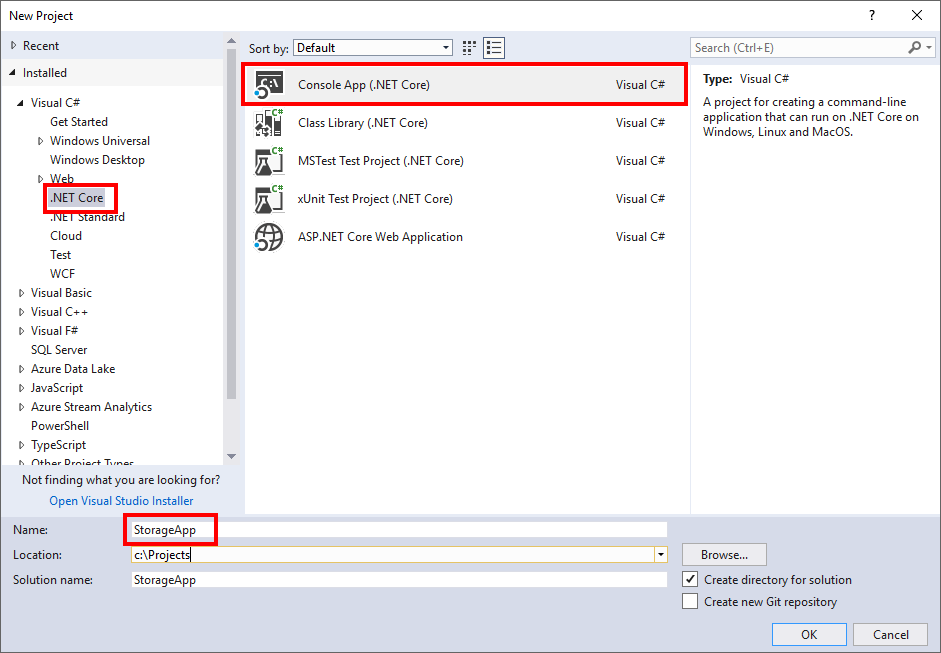
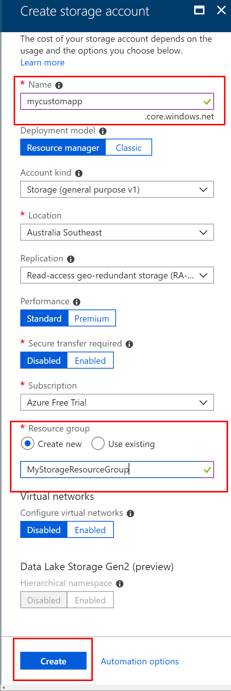

## Exercise: Create an app and Azure Storage account

To begin developing our application and prepare to connect to Azure Storage, we must first create our application and the storage account to connect to.

## Create an app

We will be using Visual Studio 2017 to create our app.

1. In Visual Studio 2017, select the **File** > **New** > **Project** menu option.
1. Within the **Visual C# - .NET Core** category, select **Console App (.NET Core)**, enter a name for your app and select **OK**.
  

### Create the Azure Storage account

In order to connect to an Azure Storage account, we must first create a storage account to connect to.

1. In the top left of the Azure Portal, select 'Create a resource'.
1. In the selection pane that appears, select 'Storage'.
1. On the right side of that pane, select 'Storage account - blob, file, table, queue'.
  
1. The details of the storage account need to be entered. Enter a name for the storage account.
1. A resource group is a logical container for resources. For the resource group selection, select **Create New** and enter a name for your resource group.
1. Leave all other options at their default values and click **Create**.
  .

Your resource group is now being provisioned. After which, your storage account is then created within the resource group.
Additionally, you have created your application and are ready to configure and connect it to your storage account.

## Summary

Azure Storage is a flexible and powerful storage mechanism that exposes its functionality via a series of HTTP API endpoints. It is important consider the impact of network connectivity issues as well as availability of client libraries on the design and implementation effort for your application to ensure that Azure Storage is the right choice for your application.
