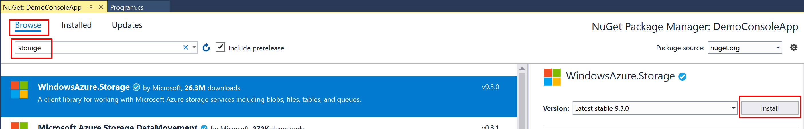
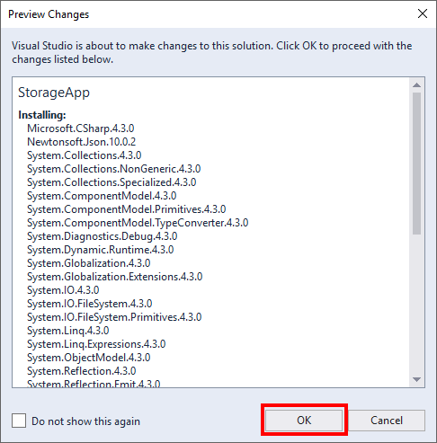
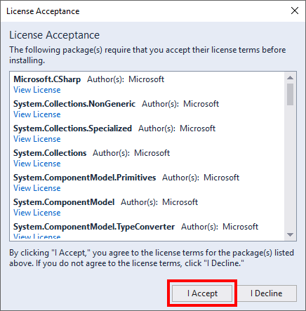
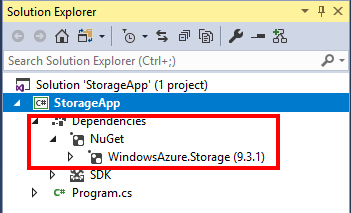

## Exercise: Add the Azure Storage NuGet package

To demonstrate how to integrate the Azure Storage client library into an application, we are going to create a new ASP.NET application and add a reference to the Azure Storage client library.

1. Right click on the project and select **Manage NuGet Packages …**
  ![Manage NuGet packages]/'
(../images/1-manage-nuget-packages.png)

1. A page is displayed showing currently installed NuGet packages. Click on the **Browse** option and type in **Storage** in the search field. **WindowsAzure.Storage** package is displayed in the search results.

1. Select the **WindowsAzure.Storage** package. A pane on the right is displayed showing the latest version by default (at the time of this writing, the latest version was 9.3.0). Click the **Install** button to add a reference to the package to your project.
  

1. Visual Studio will open the **Output** pane as packages are being restored. This will take a few seconds depending on your network speeds. A **Preview Changes** dialog is presented showing what packages are going to be added to your project. Click **OK**.
  

1. Another dialog is shown asking you to accept the licence. Click **I Accept**.
  

After a few seconds, some further activity is shown in the output pane in Visual Studio, and the package has been added to your project.
You can verify that the package has been successfully added by expanding the **Dependencies** option in your project, then expanding the **NuGet** option. A reference to **WindowsAzure.Storage** will be listed.

## Summary

You have successfully added a reference to a client library for working with Azure Storage to your project.
Adding the client library reference is the first step in using Azure Storage services from your application.
