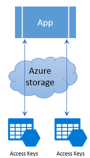
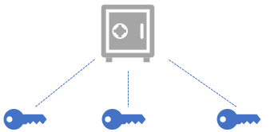

## Motivation

You have added the required client libraries to your application and are ready to connect to your Azure Storage account. However, how does your app know what account to connect to and what region that storage account exists in? This configuration information is an important part of connecting to any service, Azure Storage or otherwise. Without appropriate configuration, your app will not know how to connect to your Azure Storage account. In this unit,you will be shown how to locate the storage account connection information in the Azure portal and place it into your application configuration so that your app is ready to connect to your Azure Storage account.

## Access Keys

Each storage account has a set of access keys that allow access to the storage account. If your app needs to connect to multiple storage accounts, then your app will require access keys for each storage account.



Since Azure is a cloud provider, in addition to access keys for authentication to storage accounts, your app will need to know the storage service endpoints that provide access over the internet to your storage account. The simplest way to handle this information is to use the storage account connection string, which contains all needed connectivity information in a single string.

Azure Storage Connection strings look similar to the example below but with the access key and account name of your specific storage account:

```csharp
DefaultEndpointsProtocol=https;AccountName={your-storage};AccountKey={your-access-key};EndpointSuffix=core.windows.net
```

## Security

Access keys are critical to providing access to your storage account and as a result, should not be given to any system or person that you do not wish to have access to your storage account. Access keys are the equivalent of a username and password to access your computer. They are confidential and should not be shared.



Typically, storage account connectivity information is stored within an environment variable, database or configuration file.

It is important to note that storing this information in a configuration file can also be dangerous if you include that file in source control and store it in a public repository. This is a common mistake and means that anyone can browse your source code in the public repository and see your storage account connection information.

Storage Accounts offer a separate authentication mechanism called Shared Access Signatures that support expiration and limited permissions for scenarios where you need to grant limited access. This topic will not be covered here and is not required knowledge for this module, however more information can be found [here](https://docs.microsoft.com/en-us/azure/storage/common/storage-dotnet-shared-access-signature-part-1).

Each storage account has two access keys. The reason for this is to allow keys to be rotated (regenerated) periodically as part of security best practice in keeping your storage account secure. This process can be done from the Azure portal or the CLI.

Rotating a key will invalidate the original key value immediately, and will revoke access to anyone who obtained the key inappropriately. With support for two keys, you can rotate keys without causing downtime in your applications that use them. Your app can switch to using the alternate access key, while the other key is regenerated. If you have multiple apps using this storage account, they should all use the same key to support this technique. See [here](https://docs.microsoft.com/en-us/azure/storage/common/storage-create-storage-account#manage-your-storage-access-keys) for more information.

## Advanced security options

Azure offers a high grade security store called Azure Key Vault designed to securely store any form of secrets like access keys, passwords or certificates. Using this feature, you can safely store your access keys, have the keys auto-rotated, with your app accessing the access keys via Azure Key Vault. This prevents access keys from being stored in plain text.

This feature is outside the scope of this module but more information can be found [here](https://docs.microsoft.com/en-us/azure/key-vault/key-vault-ovw-storage-keys)
